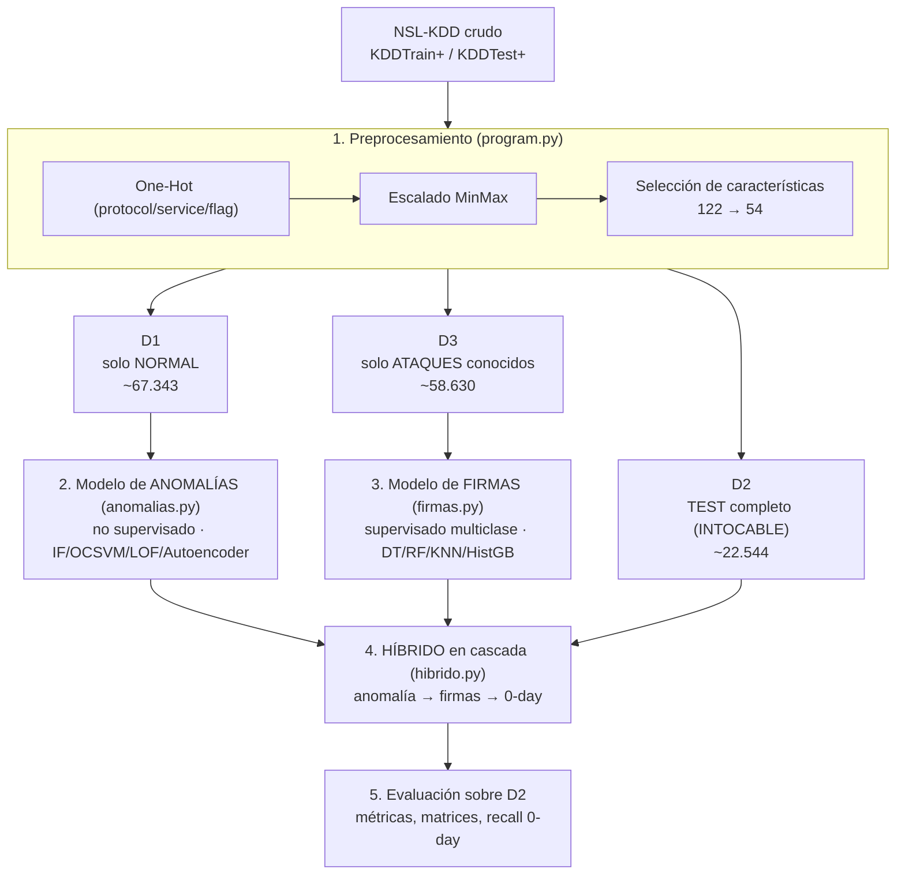

# Guía de aprendizaje — Entrenamiento ML del H-NIDS

> Material **interno de estudio**, no la memoria formal. Objetivo: entender *qué*
> hace cada paso del pipeline de ML de este TFG y *por qué* se ha elegido así, de
> forma que los dos hablemos el mismo idioma cuando ejecutemos los experimentos.
>
> Ancla el marco teórico ya redactado (notas `2.1.x` del vault) a las decisiones
> reales que están tomadas en el código (`resumen-de-decisiones.md`) y en las
> especificaciones por script de `next-steps.md §6` (congelado; su §6.5 está
> superada por el grill H-1…H-7 de `resumen-de-decisiones.md`).

---

## Cómo leer esta guía

Se lee **en orden**: cada fichero se apoya en el anterior. Cada concepto tiene dos partes:

- **Qué es** → la teoría, con la terminología de tus notas `2.1.x`.
- **Cómo se aplica aquí** → la decisión concreta de este TFG, con referencia al código.

Los bloques `> [!note]` / `> [!warning]` son avisos y trampas que ya hemos pisado.

| # | Fichero | De qué trata |
|---|---|---|
| 00 | `README.md` (este) | Mapa del flujo, mini-glosario, números de referencia |
| 01 | `01_fundamentos_y_datos.md` | Qué es ML, supervisado vs no supervisado, y los splits D1/D2/D3 |
| 02 | `02_preparacion_datos.md` | Preprocesamiento, desbalance + SMOTE, selección de características |
| 03 | `03_validacion_y_metricas.md` | Cross-validation, GridSearch, overfitting, matriz de confusión, ROC/PR |
| 04 | `04_los_tres_modelos.md` | Anomalías, firmas, híbrido en cascada y el argumento 0-day |

---

## El flujo completo de un vistazo

Todo el TFG es esta tubería. Nada de lo que hacemos existe aislado: cada paso
prepara el terreno para el siguiente.

**La idea en una frase:** dos modelos que ven mundos distintos —uno solo conoce
el tráfico normal, el otro solo los ataques— se combinan en cascada para detectar
tanto ataques conocidos como ataques nunca vistos (*0-day*), y se evalúan sobre un
conjunto de test que ninguno de los dos ha tocado durante el entrenamiento.

---

## Números de referencia del dataset

Tenlos a mano; salen de la ejecución real de `program.py`/`validacion.py`.

| Split | Contenido | Tamaño aprox. | Alimenta a |
|---|---|---|---|
| **D1** | solo tráfico normal | ~67.343 filas | modelo de anomalías (entrenamiento) |
| **D3** | solo ataques conocidos | ~58.630 filas | modelo de firmas (entrenamiento) |
| **D2** | test completo (normal + ataque) | ~22.544 filas (~43% normal / ~57% ataque) | evaluación de todo |

- **Features:** 122 tras el one-hot (38 numéricas + 84 dummies) → **54** tras la
  selección de características (umbral 99,9% de importancia acumulada).
- **Desbalance de D3 (por categoría):** `dos` ~45,9k · `probe` ~11,7k · `r2l` ~1,0k · **`u2r` 52**.
  Los recuentos exactos salen de `Resultados/specialized_nsl_kdd_composicion_d3.csv`.
- **0-day:** D2 contiene **17 tipos de ataque que NO están en el train** — son el
  argumento central del TFG (ver fichero 04). El 17 está **contado** sobre la columna
  `tipo` de `Resultados/metricas_hibrido_0day.csv` (3.750 filas de D2), no citado: el
  14 de Tavallaee et al. se refiere a KDD'99, no a NSL-KDD.
- **Categorías de ataque:** `dos`, `probe`, `r2l`, `u2r` (más `normal` en el problema completo).

---

## Mini-glosario de referencia rápida

Definiciones de una línea. El desarrollo está en el fichero indicado.

| Término | Definición corta | Fichero |
|---|---|---|
| **Feature (característica)** | Cada columna de entrada `x` que describe una muestra | 01 |
| **Etiqueta / target `y`** | La respuesta que se quiere predecir (categoría del ataque) | 01 |
| **Supervisado** | Aprende de pares (x, y) etiquetados | 01 |
| **No supervisado** | Solo ve `x`, busca patrones sin etiquetas | 01 |
| **Clasificación** | Predecir una categoría (vs regresión = un número) | 01 |
| **Train / Test** | Datos para aprender / datos reservados para medir | 01 |
| **One-Hot Encoding** | Convertir una categoría en columnas 0/1 | 02 |
| **Escalado** | Llevar las features numéricas a un rango común (MinMax → [0,1]) | 02 |
| **Desbalance** | Unas clases con muchísimas más muestras que otras (u2r) | 02 |
| **SMOTE** | Crea muestras sintéticas de la clase minoritaria interpolando vecinos | 02 |
| **class_weight** | Penalizar más los errores en clases raras (alternativa a SMOTE) | 02 |
| **Selección de características** | Quedarse con las columnas que aportan, tirar el resto | 02 |
| **Leakage (fuga)** | Que información del test/validación contamine el entrenamiento | 02, 03 |
| **Overfitting** | El modelo memoriza el train y falla en datos nuevos | 03 |
| **Cross-validation (CV)** | Rotar train/validación en K trozos para estimar bien el error | 03 |
| **Fold** | Cada uno de los K trozos de la CV | 03 |
| **StratifiedKFold** | CV que mantiene la proporción de clases en cada fold | 03 |
| **Hiperparámetro** | Ajuste que fijas tú antes de entrenar (no lo aprende el modelo) | 03 |
| **GridSearchCV** | Probar combinaciones de hiperparámetros con CV y quedarse con la mejor | 03 |
| **Matriz de confusión** | Tabla de aciertos/errores clase real vs predicha | 03 |
| **Precision** | De lo que marco como ataque, cuánto es ataque de verdad | 03 |
| **Recall (TPR)** | De los ataques reales, cuántos detecto | 03 |
| **F1** | Media armónica de precision y recall | 03 |
| **macro vs weighted** | Media por clase (todas cuentan igual) vs ponderada por tamaño | 03 |
| **FPR** | Tasa de falsas alarmas sobre tráfico normal | 03 |
| **ROC / PR / AUC** | Curvas de rendimiento a todos los umbrales; AUC = área bajo la curva | 03 |
| **Umbral (threshold)** | Punto de corte que convierte un score continuo en decisión sí/no | 03 |
| **Anomaly score** | Puntuación de "cómo de raro" es un dato (mayor = más anómalo) | 04 |
| **Ensemble** | Combinar varios modelos (Random Forest = muchos árboles votando) | 04 |
| **0-day** | Ataque de un tipo que el modelo nunca vio en el entrenamiento | 04 |
| **Cascada** | Encadenar modelos: la salida de uno decide qué entra al siguiente | 04 |
| **random_state=42** | Semilla fija para que todo sea reproducible | 03 |
