# Pipeline de Implementación — H-NIDS NSL-KDD

> Los diagramas Mermaid viven como ficheros sueltos en [`diagramas/`](diagramas/) (fuente `.mmd` + PNG/SVG renderizados).
> Ver [`diagramas/README.md`](diagramas/README.md) para cómo editarlos/exportarlos.

## Diagrama completo del pipeline



> Fuente editable: [`diagramas/01_pipeline_completo.mmd`](diagramas/01_pipeline_completo.mmd)

---

## Mapeo de ataques (39 tipos de ataque → 5 categorías)



> Fuente editable: [`diagramas/02_mapeo_ataques.mmd`](diagramas/02_mapeo_ataques.mmd)

---

## Estructura de archivos generados

```
Resultados/
└── specialized_nsl_kdd_
    ├── original_D1_normal_for_anomaly.csv
    ├── original_D2_complete_test.csv
    ├── original_D3_known_attacks_for_signatures.csv
    │
    ├── processed_X_D1_normal_for_anomaly.csv          ← features D1 (escaladas)
    ├── processed_y_attack_D1_normal_for_anomaly.csv
    ├── processed_y_category_D1_normal_for_anomaly.csv
    │
    ├── processed_X_D2_complete_test.csv               ← features D2 (escaladas)
    ├── processed_y_attack_D2_complete_test.csv
    ├── processed_y_category_D2_complete_test.csv
    │
    ├── processed_X_D3_known_attacks_for_signatures.csv ← features D3 (escaladas)
    ├── processed_y_attack_D3_known_attacks_for_signatures.csv
    ├── processed_y_category_D3_known_attacks_for_signatures.csv
    │
    ├── mappings_and_info.txt                           ← mapeos LabelEncoder + scaler
    ├── usage_guide.txt                                 ← guía de uso con ejemplos
    └── validation_report.txt                           ← generado por validacion.py
```

> Todo lo de arriba existe **dos veces**, una por variante: con el prefijo
> `specialized_nsl_kdd_` (54 características) y con `specialized_nsl_kdd_sin_seleccion_`
> (122). Los informes de validación, por tanto, son **dos**:
> `specialized_nsl_kdd_validation_report.txt` y
> `specialized_nsl_kdd_sin_seleccion_validation_report.txt`, y **no comparten ninguna de las
> cifras que dependen del set de características** (54 vs 122 características, drift (A) 37 vs 44,
> drift (B) 25 vs 31, media de outliers entre características 4,78 % vs 2,44 % —el criterio IQR da
> un porcentaje por característica y la cifra publicada es su media, no su mediana). Lo que no
> depende del set sí es
> idéntico en los dos: los tamaños D1 67.343 / D2 22.544 / D3 58.630, los 9.711 normales de D2 y
> las 4 características fuera de [0,1]. Cualquier número tomado de un informe tiene que decir de
> cuál sale.

---

## Runbook de reconstrucción de las tablas de métricas (esquema T1)

El esquema de las tablas de métricas cambió con la tarea **T1** (columnas `alcance`,
`alcance_tiempo_s`, `semilla`, `commit`, `bin_accuracy`, tiempos separados de
entrenamiento/inferencia). Un CSV
con el esquema anterior **no se mezcla**: `evaluacion.limpiar_variante_csv()` lo aparta como
`<nombre>.esquema-anterior.bak` y lo regenera. Para volver a tener las tablas completas hacen
falta **estas ocho invocaciones**, desde `Implementacion/app/` y con el venv `Imp` activado.

`hibrido.py` va **al final de cada variante**: consume los `.joblib` que dejan `anomalias.py` y
`firmas.py`, y aborta si no encuentra los de su variante.

```powershell
# --- Variante de 54 características (selección 4.3.5 aplicada, por defecto) ---
python anomalias.py
python firmas.py
python baseline.py
python hibrido.py

# --- Variante de 122 características (sin selección) ---
python anomalias.py --sin-seleccion
python firmas.py    --sin-seleccion
python baseline.py  --sin-seleccion
python hibrido.py   --sin-seleccion
```

**Más dos invocaciones que no pertenecen al runbook de T1** y que se listan aquí porque también
depositan en `Resultados/`: la medición de la **cascada invertida** (**T3**), que escribe su
propia tabla y no toca ninguna de las ocho. Va **después** de `firmas.py` y de `hibrido.py` de su
variante: necesita `firma_<algo>_<set>.joblib` (el modelo) y `hibrido_<set>.joblib` (de donde lee
`umbral_conf_elegido`; si falta, **aborta** en lugar de inventarse un umbral). No entrena nada
—solo `predict_proba` sobre modelos persistidos—, tarda ≈10 s por variante y **D2 solo se
reporta** (P-4).

```powershell
python cascada_invertida.py                 # 54 características
python cascada_invertida.py --sin-seleccion # 122 características
```

Salidas: `Resultados/metricas_cascada_invertida.csv` (**5 filas por variante**, 10 en total) y
`Resultados/figuras/cascada_invertida_54.png` / `..._122_sin_seleccion.png`.

> [!note] `validacion.py` estrena dos figuras con **T2**
> El KS de D1 contra **solo las filas normales de D2** —medición (B)— añade
> `validacion_drift_ks_d2_normales.png` y `validacion_drift_ks_comparativa.png` (más sus gemelas
> `_sin_seleccion`), y dos líneas al `..._validation_report.txt`. No sustituye a la medición (A):
> `validacion.py` sigue siendo la puerta de calidad de `program.py` y **no** forma parte del
> runbook de las tablas de métricas.

**Ninguna métrica de calidad cambia** respecto a lo publicado: la semilla es 42 en todo, los
modelos, los grids y la calibración OOF están intactos, y T1 solo añade columnas de
declaración. **Las columnas de tiempo sí cambian**, y era el objetivo: `tiempo_s`,
`tiempo_entrenamiento_s`, `tiempo_inferencia_s`, `latencia_ms_por_flujo` y
`flujos_por_segundo` se miden ahora con `perf_counter` (otra resolución) y arrastran además la
varianza de máquina descrita más abajo. Cambia también el valor de `alcance` en las 16 filas de
`metricas_balanceo.csv`. Y `metricas_anomalias.csv` estrena **cuatro** columnas —las dos medidas
`tiempo_score_seleccion_s` y `tiempo_score_umbral_s`, más `n_iter_ganador` y
`n_iter_total_grid` (épocas del ajuste; **solo las rellena el autoencoder**, celdas vacías en los
otros tres detectores)—, así que el CSV
anterior tiene otro
esquema: al re-ejecutar, `limpiar_variante_csv()` lo apartará como
`metricas_anomalias.csv.esquema-anterior.bak` y hay que correr **las dos variantes** (54 y 122)
para regenerarlo completo.

Con **T18** cambia además el **contenido** de la columna `alcance_tiempo_s` de las cuatro tablas
principales: sale de ella toda la interpretación (porcentajes, factores, cifras de corridas
anteriores) y se queda solo lo estable. Los números viven ahora en la sección
[Las columnas de tiempo](#las-columnas-de-tiempo-qué-miden-y-hasta-dónde-valen) de este mismo
documento, anclados al commit de su corrida. **Ninguna métrica de calidad se ve afectada.**

> [!warning] Hueco de trazabilidad de la corrida publicada
> El runbook son **8 invocaciones**: **`program.py` NO se re-corrió**. Todo lo que deposita
> —los CSV originales y procesados de las dos variantes, `_mappings_and_info.txt`,
> `_usage_guide.txt`, `selected_features.txt`, `_transformers.joblib` y su única figura,
> `eda_distribuciones_divisiones.png`— sigue anclado a la corrida del **05/07/2026** y no a
> `1163c90`. Los splits que consumen las 8 invocaciones son esos CSV, idénticos (semilla 42);
> lo que no está anclado al commit publicado es esa figura del EDA.
>
> **`validacion.py` sí se re-corrió**, en las dos variantes, el **2026-08-10** (corrida
> `274923d-sucio`, tarea **T2**). Sus salidas ya **no** son las cuatro figuras de 2026-07-05: son
> **12 figuras** `validacion_*.png` —las **6 por variante** de la tabla de abajo— y **2**
> informes `..._validation_report.txt` (54 y `_sin_seleccion`), todos con marca de tiempo de esa
> re-corrida. Ninguna cifra de calidad cambia por ello: `validacion.py` no entrena nada y solo
> lee los CSV de `program.py`.
>
> **Esa marca de tiempo es del sistema de ficheros (mtime), y git no la versiona.** Tras un
> `clone`, los artefactos llevan la fecha de la copia, no la de la corrida. Los informes
> `..._validation_report.txt` **no imprimen fecha ni commit en su cabecera** —a diferencia de los
> `metricas_*.csv`, que sí traen columna `commit`—, así que **un tercero no puede verificar desde
> git que salieron de `274923d`**: hay que creerse este recuadro. Misma clase de limitación que la
> del recuadro de `ac496cb` más abajo, aunque más leve: aquí los artefactos sí están commiteados y
> son reproducibles re-ejecutando `validacion.py` sobre los CSV de `program.py`; lo no verificable
> es solo **de qué corrida** proceden los que hay en disco.
>
> | Figura (× 2 variantes: sin sufijo = 54, `_sin_seleccion` = 122) | Origen |
> |---|---|
> | `validacion_distribucion_clases.png` | de siempre |
> | `validacion_discriminantes_d1_vs_d3.png` | de siempre |
> | `validacion_drift_ks.png` | de siempre |
> | `validacion_outliers_iqr.png` | de siempre |
> | `validacion_drift_ks_d2_normales.png` | **T2** |
> | `validacion_drift_ks_comparativa.png` | **T2** |
>
> Lo que la re-corrida **no** arregla: al no tocar `program.py`, el hueco de
> `eda_distribuciones_divisiones.png` sigue abierto. Y como la variante de 122 se validó por
> primera vez, sus cifras **son nuevas** y no coinciden con las de 54 (ver el recuadro del árbol
> de `Resultados/`, más arriba).

> [!note] El texto de `alcance_tiempo_s` publicado **sí** es el de `config.py` de hoy
> En la corrida `ac496cb` no lo era: los arreglos de redacción de
> `config.ALCANCE_TIEMPO_S_BLOQUE_ANOMALIAS` y `..._BLOQUE_FIRMAS` que exigió la auditoría de T18
> eran posteriores a aquella corrida. La re-corrida `1163c90` los incorpora: las cuatro celdas
> `alcance_tiempo_s` publicadas coinciden **carácter a carácter** con las cuatro constantes
> `config.ALCANCE_TIEMPO_S_*` del código de hoy (2.367 · 1.536 · 1.196 · 1.676 caracteres).
>
> La única divergencia viva entre `config.py` y lo publicado es el texto de
> `config.ALCANCE_N_ITER_TOTAL`, reformulado **después** de `1163c90` (recuadro de las dos
> columnas de épocas del autoencoder, más abajo). **No obliga a re-correr y no toca el
> dato**: ese texto **no viaja a ninguna columna** de ningún CSV —`ALCANCE_COLUMNAS` solo lo
> consulta `config.alcance_de_columna()`, y a esa función solo llega `validar_esquema_minimo()`
> para columnas que casan con `PREFIJOS_SIN_DECLARAR`, filtro con el que `n_iter_total_grid` no
> casa—. Es documentación en el código, no celda.

### Recuento esperado (comprobado por código, no a ojo)

| Tabla | Filas por variante | Total con las dos variantes |
|---|---|---|
| `metricas_anomalias.csv` | 4 (un detector por fila) | **8** |
| `metricas_firmas.csv` | 4 (un clasificador por fila) | **8** |
| `metricas_baseline.csv` | 1 (RF monolítico) | **2** |
| `metricas_hibrido.csv` | 1 (la cascada) | **2** |

Lo verifica `evaluacion.comprobar_recuento()` al final de cada corrida (contra
`evaluacion.FILAS_ESPERADAS_POR_VARIANTE`): si la variante que se acaba de correr no tiene
exactamente esas filas, **aborta**. Junto a ella, `evaluacion.comprobar_unicidad()` verifica la
clave `set_features × algoritmo × alcance`.

Las **cinco** tablas auxiliares (`evaluacion.TABLAS_AUXILIARES`) tienen otra granularidad de fila
—algoritmo × balanceo, tipo de ataque, umbral candidato, categoría asignada— y por eso no llevan
`algoritmo` ni la clave de unicidad, pero sí `alcance` y procedencia
(`evaluacion.COLUMNAS_MINIMAS_AUXILIARES`), y las cinco publicadas ya la traen:

| Tabla auxiliar | Filas | Granularidad de fila | Recuento comprobado por |
|---|---|---|---|
| `metricas_balanceo.csv` | 16 | algoritmo × esquema de balanceo × variante | — |
| `metricas_baseline_0day.csv` | 36 | tipo de ataque 0-day × variante | — |
| `metricas_hibrido_0day.csv` | 144 | tipo × detector × variante | — |
| `metricas_hibrido_calibracion.csv` | 6 | `UMBRAL_CONF` candidato × variante | — |
| `metricas_cascada_invertida.csv` | 10 | categoría asignada × variante (**5 por variante**) | `cascada_invertida.NSLKDDInvertedCascadeMeasurer._comprobar_tabla()` |

La última es la única con recuento fijo, y lo comprueba **el propio script**, no
`comprobar_recuento()`: esa función solo conoce las cuatro tablas principales y meter una
auxiliar en `FILAS_ESPERADAS_POR_VARIANTE` tocaría un contrato que no se toca. La comprobación
propia verifica **cuatro** cosas al releer el CSV escrito —las 5 filas de la variante; que las
categorías estén una y solo una vez; que los `n_argmax` de las cuatro sumen `n_normales_d2`, que
es lo que hace de los buckets del argmax una **partición** de las normales de D2; y que los
`n_condenadas` de las cuatro sumen el de `__global__`— y **aborta** si alguna falla. Las dos
últimas son distintas y las dos hacen falta: una partición rota que afectase solo a filas por
debajo del umbral dejaría los `n_condenadas` cuadrando. Se comprueba sobre enteros y no sobre
`tasa_condena`, que solo cuadra hasta el redondeo (ver más abajo).

> Al terminar las ocho, si quedan ficheros `*.esquema-anterior.bak` en `Resultados/`, es que
> había tablas del esquema viejo: comprobar que la nueva trae todas las filas y borrarlos a mano.
> Un `.bak` no se versiona ni se cita. Las dos invocaciones de `cascada_invertida.py` van aparte y
> tienen su propio `.bak` si alguna vez cambia su esquema.

### Las columnas de tiempo: qué miden y hasta dónde valen

> [!important] Dónde vive cada cosa (regla de **T18**)
> El **dato publicado** —los cuatro textos `config.ALCANCE_TIEMPO_S_*` que viajan en la columna
> `alcance_tiempo_s`— lleva **solo lo estable**: qué tramos entran en `tiempo_s`, cuáles quedan
> fuera, qué columna mide cada uno y el aviso de **P9** sobre la latencia. **Ningún porcentaje,
> ninguna banda, ningún factor de dispersión, ninguna cifra de ninguna corrida y ninguna
> afirmación empírica**, ni siquiera cualitativa («no escala con el modelo», «las desviaciones
> caben dentro de X»): eso también es un dato de corrida y también se falsa.
>
> **Todos los números interpretativos están en esta sección**, y cada uno anclado al **commit**
> de la corrida de la que sale. Motivo: publicar interpretación dentro del dato crea un bucle —el
> dato no se puede editar sin re-correr y cada corrida nueva falsa la cifra que dejó la anterior—.
> Le pasó tres veces seguidas a la redacción de `config.ALCANCE_TIEMPO_S_*`: las cotas «27-49 %» y
> «varía hasta 4×» nacieron falsables y se falsaron, y la celda llegó a ≈3,2 kB **por fila** en un
> CSV de 9 líneas. Aquí, en cambio, se corrigen sin tocar una tabla.

#### Cómo se nombra una corrida (y por qué no se cita ningún `.bak`)

Una **corrida** se identifica por el **commit del código** que la produjo, que es lo que su
columna `commit` declara. El commit del árbol donde sus CSV quedaron **versionados** es otro, y
casi siempre posterior. Las corridas que existen en git:

| Corrida (columna `commit`) | CSV versionados en | Notas |
|---|---|---|
| *(sin columna `commit`)* | `8b07319` | Anterior a T1: solo tiene `tiempo_s`, sin tiempos separados ni latencia. |
| `c7cf319` | `077119e` (y `38fdd4b`, idénticos) | Primera con `tiempo_entrenamiento_s` / `tiempo_inferencia_s`. Aún con `time.time()`. |
| `38fdd4b` | `34bee30` (y `5516b60`, idénticos) | Primera con `perf_counter`. |
| `5516b60` | `5f98d88` | Añade `tiempo_score_seleccion_s` y `tiempo_score_umbral_s`. |
| `ac496cb` | *(nunca versionados: los sustituyó la re-corrida `1163c90` antes del commit de cierre de T18)* | Primera con `n_iter_ganador` y `n_iter_total_grid`. **Corrida histórica**: sus cifras solo sobreviven citadas en este documento, no hay CSV suyo en git. |
| `1163c90` | *(aún en el árbol de trabajo, pendiente del commit de cierre de T18)* | **La publicada hoy.** Mismo esquema que `ac496cb`. 8 invocaciones, **222 filas** —subtotal de las ocho tablas del runbook, **no** el total de `Resultados/`—, todas con `semilla = 42` y `commit = 1163c90` limpio. |
| `274923d-sucio` | *(aún en el árbol de trabajo)* | **Solo la cascada invertida (T3)**: 2 invocaciones, **10 filas** en `metricas_cascada_invertida.csv`, `semilla = 42`. No toca ninguna de las ocho tablas del runbook. El `-sucio` es correcto y previsto: la corrida es anterior al commit que versiona su propio código (`config._RUTA_SUCIEDAD` mira `Implementacion/`). |

Sumando las dos, `Resultados/` tiene hoy **232 filas repartidas en 9 ficheros** `metricas_*.csv`
(222 + 10): las **ocho** tablas de la corrida `1163c90` —las cuatro principales más las cuatro
auxiliares, como detalla la fila de `1163c90`— con `commit = 1163c90`, y la novena, la de la
cascada invertida, con `274923d-sucio`. Son **dos corridas distintas**, no una, y ninguna cifra de una debe presentarse
junto a las de la otra sin decirlo.

Cualquier cita a una corrida anterior apunta a **su commit**, nunca a un fichero
`*.esquema-anterior.bak`: los `.bak` son prescindibles —lo que contienen está en git— y no se
versionan.

#### Por qué `perf_counter` y no `time.time()`

En Windows `time.time()` tiene una resolución de unos **15,6 ms**. La prueba de que eso rompía el
dato es el `predict` del **DecisionTree** en `metricas_firmas.csv`: en la corrida `c7cf319` daba
`tiempo_inferencia_s = 0,0` en las **dos** variantes, y de ahí una fila que se contradecía sola
—`latencia_ms_por_flujo = 0,0` (cero milisegundos por flujo, un imposible) junto a un
`flujos_por_segundo` vacío—. Con `perf_counter`, en `38fdd4b`, ese mismo `predict` mide **0,002 s**
(54) y **0,004 s** (122): estaba un orden de magnitud **por debajo del tick**.

`perf_counter` es monótono y de alta resolución, pero **no tiene época**: solo sirve para
diferencias. La columna `fecha` la sigue dando `datetime.now()`.

> [!caution] Lo que **no** era una prueba (retirado)
> Se afirmó que los **758.824,7 flujos/s** del autoencoder de 122 (corrida `c7cf319`) eran
> artefacto del reloj. **No lo eran:** despejando, `t_inf = 22.544 / 758.824,7 = 0,029709 s`, que
> no es múltiplo de 15,6 ms. Y la corrida `38fdd4b`, ya con `perf_counter`, da `0,053 s` para ese
> mismo par. Era **varianza de máquina**, no resolución. La afirmación queda retirada; la del
> `0,0 s` del DecisionTree sí es demostrable.

`latencia_ms_por_flujo` y `flujos_por_segundo` se derivan del mismo par (tiempo de inferencia,
nº de flujos) y comparten **una sola guarda**: o se publican las dos, o ninguna (celda vacía).
Un tiempo no medible nunca se publica como `0.0`. Misma regla fuera de los tiempos: el `fpr`
de `evaluacion.evaluar_binario()` es `NaN` —celda vacía— si la partición no tiene ningún flujo
normal, porque sin negativos la tasa de falsas alarmas no está definida y un `0.0` publicaría
«cero falsas alarmas». Afecta a `fpr`, `bin_fpr`, `fpr_cascada` y `fpr_detector`; con D2 real
no se dispara.

> [!note] `fpr_cascada` **es** `bin_fpr` en `metricas_hibrido.csv`
> Mismo número y misma fila (0,101740 en la variante de 54 de la corrida `1163c90`), y es
> **correcto por construcción**: la etapa 2 solo reclasifica los flujos que la etapa 1 marcó como
> sospechosos y **nunca devuelve uno a `normal`**, así que la cascada no puede tener otro FPR que
> el de su etapa 1. Se conservan las dos columnas porque responden a dos requisitos distintos
> —`bin_fpr` cierra el bloque binario que pide **H-5** y `fpr_cascada` es el FPR que **P-2** exige
> junto al titular de 0-day—, pero T1 no admite dos nombres para una magnitud sin declararlo: la
> coincidencia va escrita en el dato, dentro de `config.ALCANCE_HIBRIDO`.

#### Lo que `perf_counter` NO arregla: la dispersión entre corridas

Es *wall-clock* en una **máquina no dedicada**. Con la misma semilla, el mismo código y una
**calidad idéntica al bit**, los tiempos se mueven mucho. Lo que sigue **no es una cota** —la
corrida siguiente puede superarla—: es lo **medido** entre las cinco corridas que llevan columna
`commit`, `c7cf319` · `38fdd4b` · `5516b60` · `ac496cb` · `1163c90`, celda a celda.

> [!warning] `ac496cb` **no es reproducible desde git**
> Todas las cifras de la columna `ac496cb` que aparecen en este documento —aquí y en el resto de
> secciones— proceden de una corrida cuyos **CSV nunca se commitearon** y que además **fueron
> sobrescritos por la re-corrida `1163c90`**. No se pueden recuperar ni por hash ni por fichero:
> sobreviven **solo citadas aquí**. Cualquier frase de la memoria que se apoye en ellas tiene que
> arrastrar esta salvedad; no valen como evidencia verificable por un tercero. Las cifras de las
> otras cuatro corridas (`c7cf319`, `38fdd4b`, `5516b60`, `1163c90`) sí están en git.

| Tabla | Columna | Peor caso observado entre las cinco corridas | Valores (`c7cf319` / `38fdd4b` / `5516b60` / **`ac496cb` ⚠ no verificable** / `1163c90`) |
|---|---|---|---|
| `metricas_anomalias.csv` | `tiempo_s` | **Autoencoder 54: 4,82×** | 52,43 / 37,71 / 181,91 / 38,20 / 49,20 s |
| `metricas_anomalias.csv` | `tiempo_inferencia_s` | **Autoencoder 54: 5,07×** | 0,048 / 0,031 / 0,147 / 0,029 / 0,041 s |
| `metricas_firmas.csv` | `tiempo_s` | **DecisionTree 54: 4,30×** | 2,35 / 2,01 / 7,35 / 1,71 / 2,07 s |
| `metricas_firmas.csv` | `tiempo_inferencia_s` | **DecisionTree 54: 3,5×** (entre las cuatro medidas con `perf_counter`) | *(0,0 = artefacto)* / 0,002 / 0,007 / 0,002 / 0,002 s |
| `metricas_baseline.csv` | `tiempo_s` | RF monolítico 54: **2,43×** | 34,13 / 28,31 / 39,17 / 59,44 / 24,48 s |
| `metricas_hibrido.csv` | `tiempo_s` | La cascada 54: 1,90× | 24,80 / 22,17 / 27,71 / 42,02 / 25,40 s |

Dos lecturas que hay que arrastrar a cualquier frase de la memoria que compare tiempos:

1. **La dispersión no es cosa solo de los tiempos largos.** El autoencoder de 54 mueve su
   `tiempo_s` (decenas de segundos a minutos) y su `tiempo_inferencia_s` (decenas de
   milisegundos) prácticamente en el mismo factor, 4,8× y 5,1×.
2. **Ni la celda más estable baja de ≈1,2×.** El mínimo observado en las 8 filas de anomalías
   sigue siendo `OneClassSVM` 54, con 1,23× (26,17 / 23,28 / 28,10 / **22,89 ⚠ no verificable** /
   25,58 s). **Una diferencia menor que eso entre dos filas no significa nada**, y ninguna cifra de
   tiempo puede presentarse como propiedad del algoritmo sin declarar esta dispersión. El suelo
   depende de `ac496cb`, que aporta el mínimo de la serie y no es reproducible desde git; **sin esa
   columna el suelo sería 28,10/23,28 = 1,21×**, prácticamente el mismo, así que el argumento se
   sostiene solo con las cuatro corridas versionadas.
3. **Añadir una corrida solo ha empeorado la dispersión, nunca la ha estrechado.** De las seis
   celdas de la tabla, `ac496cb` empeoró el factor en cuatro (`tiempo_inferencia_s` del
   autoencoder, `tiempo_s` del DecisionTree, del baseline y del híbrido) y `1163c90` lo empeora en
   una más —el baseline de 54 pasa de 2,10× a **2,43×**, porque esta corrida da el mínimo de la
   serie, 24,48 s—. **Ninguna de las dos ha mejorado ninguna celda**, que es exactamente lo que
   cabe esperar de un máximo sobre un mínimo al añadir muestras: la banda solo puede ensancharse.
   Es la razón de que se declare **medida y no cota**. **Salvedad:** la aportación de `ac496cb` a
   esas cuatro celdas **no es verificable desde git** (sus CSV nunca se commitearon y los
   sobrescribió `1163c90`); el argumento de que la banda solo se ensancha se sostiene igual con
   las cuatro corridas que sí están versionadas, pero los factores concretos que cita esta tabla
   dependen de una columna no recuperable.

**Ninguna columna de tiempo es reproducible.** Valen como comparación relativa de coste **dentro
de la misma corrida** y como orden de magnitud. El resto de la tabla sí es reproducible
(semilla 42).

> [!caution] Ni siquiera la **dirección** de una comparación de tiempos aguanta sola
> Comparar dos algoritmos por su tiempo **dentro de la misma corrida** parece más seguro que
> comparar dos corridas, pero tampoco basta. Es lo que mide **T20** sobre el par
> `RandomForest` / `HistGradientBoosting` de `metricas_firmas.csv`, con grids de igual
> cardinalidad:
>
> | Corrida | 54 (`tiempo_entrenamiento_s` RF → HistGB) | 122 |
> |---|---|---|
> | `c7cf319` | 65,876 → 128,204 (**1,95×**) | 60,887 → 268,642 (**4,41×**) |
> | `38fdd4b` | 47,429 → 62,404 (**1,32×**) | 95,487 → 237,743 (**2,49×**) |
> | `5516b60` | 108,152 → 83,315 (**0,77×**) | 68,698 → 194,108 (**2,83×**) |
> | `ac496cb` ⚠ **no verificable** | 48,943 → 64,997 (**1,33×**) | 52,609 → 181,346 (**3,45×**) |
> | `1163c90` **(publicada)** | 61,444 → 60,745 (**0,99×**) | 51,097 → 122,820 (**2,40×**) |
>
> ⚠ La fila `ac496cb` **no es reproducible desde git**: sus CSV nunca se commitearon y los
> sobrescribió `1163c90`. Los pares que aporta al recuento no son verificables por un tercero; el
> resto de filas de esta tabla sí lo son.
>
> **Lo citable, y ni una palabra más:** *`HistGradientBoosting` es más caro de entrenar que
> `RandomForest` en **8 de los 10** pares intra-corrida registrados —recuento tomado sobre cinco
> corridas, **una de ellas, `ac496cb`, no reproducible desde git**—, con grids de igual
> cardinalidad; el par de 54 **se invierte en 2 de las 5 corridas**, así que la afirmación solo es
> sólida en la variante de 122 —5 de 5, todas por encima de 2,4×—, y en ningún caso HistGB gana en
> calidad: `f1_macro` **0,804 vs 0,822** en la variante de 54 de `1163c90`.*
>
> **La horquilla «1,31×-4,40×» queda retirada**: se quedó sin suelo en cuanto la corrida publicada
> añadió un segundo contraejemplo. Una banda cuyo extremo inferior cae por debajo de 1,0 en dos de
> diez pares no es una banda, es un rango con la dirección dentro.
>
> Y la inversión **no es solo del entrenamiento**: en inferencia el par de 54 va en sentido
> contrario y con holgura, `latencia_ms_por_flujo` **0,0032 ms/flujo** en HistGB frente a
> **0,0072** en RF. Entrenar y predecir son dos costes distintos y no se citan juntos.
>
> Regla que queda: una dirección solo es citable si se repite en **todas** las corridas
> disponibles; si no, se cita con el recuento de pares (**8 de 10**) y con la variante en la que
> sí aguanta, nunca con un par de segundos ni con una horquilla.

> [!danger] Qué mide la latencia — y qué no (declaración exigida por P9)
> `latencia_ms_por_flujo` y `flujos_por_segundo` miden **solo el `predict`/`score` sobre
> características ya calculadas y ya cargadas en memoria**. **No** incluyen la captura del
> tráfico, el ensamblado del flujo ni la extracción de las 41 características del registro
> NSL-KDD, que es donde vive el coste real de un despliegue. Citar ese caudal como capacidad
> operativa sería exactamente la *Lab-Only Evaluation* que denuncia el pitfall **P9**. La
> frase viaja en cada fila dentro de `alcance_tiempo_s` (`config._AVISO_LATENCIA_SOLO_PREDICT`);
> el número, solo aquí.
>
> **Y el número, como orden de magnitud y nunca con siete dígitos.** El caudal máximo de
> `1163c90` es el del `predict` del `DecisionTree`, y así es como se cita:
>
> > **≈4·10⁶ flujos/s a 54 características y ≈2,6·10⁶ a 122** (n = 9.083), medidos sobre **2,2 ms**
> > y **3,6 ms** de *wall-clock* en un **pase único**: un orden de magnitud, no una cifra. Y solo
> > del `predict` sobre características ya en memoria (salvedad **P9** / **T21** de arriba).
>
> Los 2,2 y 3,6 ms salen de `latencia_ms_por_flujo × 9.083` (0,000238 y 0,000391 ms/flujo), que es
> el único sitio donde el tiempo de inferencia del DecisionTree conserva cifras.
>
> **La fila es además incoherente consigo misma, y hay que declararlo:** `flujos_por_segundo` se
> calcula del tiempo **sin redondear**, pero `tiempo_inferencia_s` se publica a **3 decimales**.
> Quien intente reconstruir el caudal desde las columnas visibles hace `9.083 / 0,002` y obtiene
> **4.541.500** frente a los `4196350.2` publicados, y `9.083 / 0,004` = **2.270.750** frente a
> `2556719.0`: un desvío del **8,2 %** (54) y del **12,6 %** (122), tomando en cada caso el menor
> de los dos valores como base. **La fila invita a una reconstrucción que no cierra**, y por eso el
> caudal se cita con una cifra significativa y con el aviso al lado.
>
> La regla de la base —**el menor de los dos valores**— es uniforme, está declarada y reproduce
> las dos cifras, pero conviene decir que **el menor no es el mismo tipo de valor en las dos
> variantes**: en 54 el menor es el caudal **publicado** y en 122 el **reconstruido**. Es la
> elección que **maximiza** el desvío en ambos casos, o sea **conservadora y a favor del aviso**:
> con la otra base los porcentajes saldrían menores, nunca mayores.
>
> El propio par lo remata: es **el mismo DecisionTree**, cuyo coste por muestra en `predict` es
> el recorrido de un árbol de `max_depth=10` —idéntico en las dos variantes, porque la profundidad
> ganadora es la misma— y aun así la horquilla entre ellas es de **1,6×** (2,2 → 3,6 ms). **Esa
> horquilla es *jitter*, no características.**

#### `tiempo_s`: tres significados, uno por tabla

`tiempo_s` era el último caso vivo del defecto que T1 cierra —mismo nombre de columna, tres
magnitudes—. Ni se homogeneiza el cálculo ni se renombra la columna: **cada fila declara qué
mide** en la columna hermana `alcance_tiempo_s`, obligatoria en las cuatro tablas principales
(`evaluacion.COLUMNAS_MINIMAS`).

Por qué declarar y no unificar: la nota de trazabilidad de `4.4` cita la columna por su nombre
(`tiempo_s`), así que renombrarla rompería la referencia; y el texto de `4.4` describe su
cálculo actual —«el proceso completo por algoritmo […] no solo el ajuste»—, de modo que
unificar los tres convertiría medidas ya descritas en una cuarta que no describe ningún
capítulo.

> [!note] La tabla de `4.4` del vault está desactualizada por su cuenta
> Se alegó que unificar «movería los 5,0/28,3/16,4/40,6 s que cita `4.4`». Esos cuatro valores son
> de la corrida **pre-T1 versionada en `8b07319`** y **ninguna corrida posterior los reproduce**:
>
> | Corrida | `tiempo_s` de IF / OCSVM / LOF / AE (54) |
> |---|---|
> | *(pre-T1, en `8b07319`)* | 5,04 / 28,34 / 16,42 / 40,56 |
> | `c7cf319` | 5,51 / 26,17 / 20,85 / 52,43 |
> | `38fdd4b` | 4,01 / 23,28 / 13,28 / 37,71 |
> | `5516b60` | 5,14 / 28,10 / 22,77 / 181,91 |
> | `ac496cb` ⚠ **no verificable** | 3,92 / 22,89 / 12,75 / 38,20 |
> | `1163c90` **(publicada)** | 5,27 / 25,58 / 20,16 / 49,20 |
>
> ⚠ La fila `ac496cb` **no es reproducible desde git**: sus CSV nunca se commitearon y los
> sobrescribió `1163c90`. El argumento —que ninguna corrida reproduce los valores del vault— se
> sostiene igual con las filas verificables.
>
> Ninguna coincide con otra, que es lo único que hacía falta demostrar: la cita del vault hay que
> refrescarla al redactar (**T19**), así que no protegía nada.

| Tabla | Qué mide su `tiempo_s` | Constante |
|---|---|---|
| `metricas_anomalias.csv` | El **bloque completo del algoritmo**, en orden de ejecución (cinco tramos **principales**: dentro de la misma ventana caen además el submuestreo a 20.000 filas de `OneClassSVM`, la construcción del estimador en cada iteración y un `roc_auc_score` por configuración): (1) los `fit` del grid (= `tiempo_entrenamiento_s`) · (2) **puntuar el set de validación etiquetado —D1_val + 5.000 de D3 = 18.469 filas— una vez por cada configuración del grid** (6/9/4/2 configs) = `tiempo_score_seleccion_s` · (3) puntuar D1_val (13.469 filas) para el umbral p95 = `tiempo_score_umbral_s` · (4) la inferencia sobre D2 (22.544 filas) = `tiempo_inferencia_s` · (5) `evaluar_binario` + **una** figura, que es lo que queda al restar las cuatro columnas anteriores. | `config.ALCANCE_TIEMPO_S_BLOQUE_ANOMALIAS` |
| `metricas_firmas.csv` | El **bloque completo del algoritmo**, con otra composición: (1) `GridSearchCV` + refit sobre D3 (= `tiempo_entrenamiento_s`) · (2) el `predict` sobre los 9.083 flujos conocidos de D2 (= `tiempo_inferencia_s`) · (3) `evaluar_multiclase` + **una** figura: coste casi fijo, que sale por resta. **No** incluye el mini-experimento de balanceo de 4.3.4. | `config.ALCANCE_TIEMPO_S_BLOQUE_FIRMAS` |
| `metricas_baseline.csv` | **Solo el entrenamiento** (GridSearchCV + refit). Coincide con `tiempo_entrenamiento_s` de la misma fila: residual **cero** salvo redondeo. | `config.ALCANCE_TIEMPO_S_SOLO_ENTRENAMIENTO` |
| `metricas_hibrido.csv` | El tramo que va de la **carga de los splits** al **cierre de la fila**: D1/D2/D3 + carga de los `.joblib` + calibración OOF (= `tiempo_entrenamiento_s`) + cascada sobre D2 (= `tiempo_inferencia_s`) + tabla de sensibilidad de los 3 umbrales. **No** incluye la figura 5×6, la tabla 0-day de los cuatro detectores ni la escritura de los CSV. No es tiempo de ajuste: el híbrido no re-entrena. | `config.ALCANCE_TIEMPO_S_CARGA_A_CIERRE_FILA` |

Los tres `tiempo_s` **no son comparables entre sí** (tres cálculos, cuatro declaraciones: anomalías
y firmas comparten cálculo y no composición).

#### El residual: `tiempo_s` ≠ `tiempo_entrenamiento_s` + `tiempo_inferencia_s`

Ese residual es la razón de ser de `alcance_tiempo_s`. **Todos los porcentajes de abajo son de la
corrida `1163c90`** (la publicada) y **de ninguna otra**: no predicen la fila que tengas delante
—el reparto que vale es el que sale de las columnas de tiempo de la propia fila— y se
recalculan aquí, sin tocar el CSV, cada vez que se corre el runbook.

> [!note] Por qué **un** decimal y no dos
> `tiempo_s` se publica redondeado a **dos decimales** mientras que las columnas que se le restan
> llevan tres, así que el residual arrastra hasta ±0,005 s de puro redondeo. Sobre denominadores
> de pocos segundos eso es **±0,09 pp** en `IsolationForest` 54 (0,005 / 5,27) y **±0,24 pp** en
> `DecisionTree` 54 (0,005 / 2,07): el segundo decimal del porcentaje es ruido y no se escribe.
> Las dos únicas cifras que van con dos decimales son las del híbrido, cuyo denominador es de
> decenas de segundos.

**Anomalías** (`1163c90`). Ya no se estima nada: `anomalias.py` cronometra los dos tramos grandes
y los publica, así que la cola sale exacta por resta. Residual =
`tiempo_s` − `tiempo_entrenamiento_s` − `tiempo_inferencia_s`. **Van las ocho filas**: publicar
solo cuatro sería escoger.

| Detector | Variante | Residual (= no ajuste ni inferencia) | del cual `tiempo_score_seleccion_s` | `tiempo_score_umbral_s` | cola (métricas + figura) |
|---|---|---|---|---|---|
| `IsolationForest` | 54 | **30,6 %** — (5,27 − 3,509 − 0,151) / 5,27 | 21,1 % | 2,6 % | 6,9 % |
| `OneClassSVM` | 54 | **48,4 %** — (25,58 − 10,688 − 2,501) / 25,58 | 41,4 % | 6,1 % | 0,9 % |
| `LocalOutlierFactor` | 54 | **27,7 %** — (20,16 − 13,288 − 1,288) / 20,16 | 21,4 % | 5,3 % | 1,1 % |
| `Autoencoder` | 54 | 0,5 % — (49,20 − 48,933 − 0,041) / 49,20 | 0,1 % | 0,1 % | 0,3 % |
| `IsolationForest` | 122 | **26,5 %** — (5,24 − 3,699 − 0,151) / 5,24 | 21,2 % | 1,4 % | 3,9 % |
| `OneClassSVM` | 122 | **41,0 %** — (94,01 − 50,652 − 4,764) / 94,01 | 37,5 % | 3,1 % | 0,5 % |
| `LocalOutlierFactor` | 122 | **28,5 %** — (45,33 − 29,341 − 3,048) / 45,33 | 23,0 % | 4,5 % | 1,1 % |
| `Autoencoder` | 122 | 0,5 % — (113,18 − 112,535 − 0,083) / 113,18 | 0,1 % | 0,0 % | 0,3 % |

Lo domina el **scoring de la selección**: el script pasa por el scorer bastantes más filas
eligiendo configuración (18.469 × 6/9/4/2) que evaluando (22.544 una vez). En `OneClassSVM` ese
tramo se acerca al propio ajuste. No entraba en `tiempo_entrenamiento_s` porque no es `fit`.

> [!tip] **Lo reproducible de este bloque no son los segundos: es el reparto**
> Es el hallazgo más sólido que ha dado la serie de corridas y **es la afirmación sobre la que
> debe apoyarse el capítulo**, en lugar de sobre segundos que no se repiten.
>
> Entre `ac496cb` y `1163c90` los tiempos absolutos se mueven sin control —el `tiempo_s` del
> `OneClassSVM` de 122 va de 34,39 s a 94,01 s, **2,73×**—. Y sin embargo el residual **como
> fracción del bloque** se mueve, en las ocho filas, **como mucho 4,5 pp**:
>
> | Detector · variante | Residual en `ac496cb` ⚠ **no verificable** | en `1163c90` | Δ |
> |---|---|---|---|
> | `OneClassSVM` 54 | 49,5 % | 48,4 % | −1,1 pp |
> | `OneClassSVM` 122 | 38,5 % | 41,0 % | +2,5 pp |
> | `IsolationForest` 54 | 33,3 % | 30,6 % | −2,7 pp |
> | `IsolationForest` 122 | 31,0 % | 26,5 % | **−4,5 pp** |
> | `LocalOutlierFactor` 122 | 27,7 % | 28,5 % | +0,8 pp |
> | `LocalOutlierFactor` 54 | 27,6 % | 27,7 % | +0,1 pp |
> | `Autoencoder` 122 | 0,7 % | 0,5 % | −0,2 pp |
> | `Autoencoder` 54 | 0,5 % | 0,5 % | 0,0 pp |
>
> ⚠ **Las dos columnas no son simétricas en verificabilidad.** La de `1163c90` sale de CSV que
> están en el árbol; la de `ac496cb` **no es reproducible desde git** —sus CSV nunca se
> commitearon y los sobrescribió `1163c90`—, así que sobrevive **solo citada aquí**. Los Δ de esta
> tabla, y con ellos el hallazgo entero, dependen de una columna que un tercero no puede
> recalcular.
>
> **Y el orden de las ocho filas se conserva casi entero.** Ordenadas de mayor a menor residual,
> la única que cambia de sitio es `IsolationForest` 122, que baja del 4.º al 6.º puesto
> adelantada por las dos de `LocalOutlierFactor`; las otras siete conservan su posición relativa,
> y los dos escalones grandes —OCSVM por encima del 38 %, autoencoder por debajo del 1 %— se
> repiten idénticos.
>
> Formulación citable: *los segundos absolutos de estas tablas no son reproducibles, pero **el
> reparto interno del bloque sí lo es a unos pocos puntos porcentuales**.* Es coherente con la
> causa: la carga de máquina reescala el bloque **entero** y por eso se cancela al dividir, mientras
> que el peso de cada tramo lo fija el diseño del script (cuántas filas puntúa y cuántas veces),
> que la semilla 42 hace determinista. **Ojo con el alcance: son dos corridas, una de ellas no
> reproducible desde git, y no una serie.** Que el reparto sea estable no lo convierte en
> constante del algoritmo, solo en la magnitud **menos frágil** de las que aquí se publican. Y la
> estabilidad se afirma **contra `ac496cb`**, cuyos CSV nunca se commitearon y fueron sobrescritos
> por `1163c90`: la comparación no la puede rehacer nadie a partir del repositorio.

> [!caution] Repartos retirados por falsados
> Este documento publicó antes «el tramo (2) es el 75-86 % y el (3) el 5-15 %» y un scoring de
> selección de ≈9,5 s: procedían de un **modelo de coste no declarado** —con escalado plano por
> filas, ese tramo de `OneClassSVM` 54 salía por encima del residual **medido** de la propia fila,
> un imposible. En `1163c90` esa fila mide 10,688 s de ajuste y **12,391 s** de residual, del que
> el tramo (2) son 10,597 s: sale del dato, no de un modelo—. Y publicó «**27-49 %**» sin anclar a
> corrida ni decir de qué filas: en
> `1163c90` las dos filas del `Autoencoder` dan **0,5 %** y **0,5 %**, más de un orden de magnitud
> por debajo de esa banda, porque su ajuste se lo come todo. Los dos quedan retirados; la tabla de
> arriba los sustituye, con corrida declarada y con la resta escrita al lado.

**Firmas** (`1163c90`). El `GridSearchCV` se lleva del **87,68 %** (mínimo: `DecisionTree` 54,
1,815 / 2,07) al **99,66 %** (máximo: `HistGradientBoosting` 122, 122,820 / 123,24) del bloque, y
el residual es un único tramo —la cola de métricas + figura—. **No** lleva columna propia: al ser
un único componente sale exacto restando las otras dos columnas, y una columna más solo repetiría
una resta.

| Clasificador | 54 | 122 |
|---|---|---|
| `DecisionTree` | **87,68 %** | **89,19 %** |
| `RandomForest` | 99,42 % | 99,43 % |
| `KNN` | 95,73 % | 95,98 % |
| `HistGradientBoosting` | 99,48 % | **99,66 %** |

Ese residual, en segundos y por orden de tabla —`DecisionTree` · `RandomForest` · `KNN` ·
`HistGradientBoosting`—, es **0,253 · 0,290 · 0,337 · 0,286 s** a 54 características y
**0,275 · 0,262 · 0,345 · 0,322 s** a 122. Las ocho filas caben ahora en **0,25-0,35 s**, un
factor **1,36×** entre extremos: la cola **no es un coste fijo**, pero tampoco se desmadra. (La
corrida anterior, `ac496cb`, daba un factor **2**, con `HistGradientBoosting` 122 en 0,513 s; que
el factor se mueva así entre dos corridas es más motivo para citarla como «poco variable» que
para ponerle una cota. Ese factor **2** **no es verificable desde git**: los CSV de `ac496cb`
nunca se commitearon y los sobrescribió `1163c90`.)

Como es pequeño en términos absolutos, solo pesa donde el bloque entero dura pocos segundos:
**≈12 %** en `DecisionTree` 54 —(2,07 − 1,815 − 0,002) / 2,07 = 12,2 %— y **≈11 %** en
`DecisionTree` 122 —(2,58 − 2,301 − 0,004) / 2,58 = 10,7 %—, frente al **0,3-0,8 %** de los otros
seis. Los dos se escriben redondeados a la unidad **a propósito**: el redondeo de `tiempo_s` a dos
decimales propaga **±0,24 pp** y **±0,19 pp** respectivamente, así que el decimal no es suyo.
Ojo también con el otro redondeo: el `tiempo_entrenamiento_s` va a sus tres decimales, y truncarlo
a 1,82 o 2,30 haría que la fórmula dejase de reproducir su propio resultado.

**Híbrido** (`1163c90`). Calibración OOF **92,18 %** (54) y **86,20 %** (122). El resto —**7,82 %**
y **13,80 %**— **incluye la inferencia**: la cascada sobre D2 son **0,74 %** y **0,63 %**, y lo
demás (7,08 % y 13,17 %) es la carga de los splits, la de los dos `.joblib` y las tres pasadas de
métricas de la tabla de sensibilidad, sin desglosar, porque ninguna columna los mide por separado.
La precisión importa: escribir «el resto» dejando la inferencia fuera daría tres sumandos que no
llegan al 100 %. Es decir: **más del 85 % de lo que cuesta el híbrido es calibrar un umbral, no
detectar** —y la detección propiamente dicha no llega al 1 %—.

> [!note] El híbrido de 122 tarda **menos** que el de 54, y no es una paradoja
> `tiempo_s` da **25,40 s** (54) frente a **15,83 s** (122). Escribirlo como «más características,
> menos tiempo» sería falso: la causa es **mecánica y está en el dato**. El grueso del bloque es la
> calibración OOF, que reajusta el clasificador de firmas una vez por fold —y **la configuración
> ganadora de firmas no es la misma en las dos variantes**:
>
> | Variante | `config_ganadora` de `RandomForest` en `metricas_firmas.csv` |
> |---|---|
> | 54 | `{'clf__max_depth': 10, 'clf__n_estimators': 300}` |
> | 122 | `{'clf__max_depth': None, 'clf__n_estimators': 100}` |
>
> **300 árboles contra 100**: el híbrido de 54 hace más trabajo en la calibración aunque tenga
> menos columnas. Lo medido en `1163c90` es `tiempo_entrenamiento_s` = **23,414 s** (54) frente a
> **13,646 s** (122), **1,72×**. Que no llegue al 3× que sugiere el recuento de árboles tiene
> explicación a mano —el modelo de 122 crece con `max_depth=None`, así que cada uno de sus 100
> árboles es más caro— pero **no se cuantifica aquí**: el factor cae dentro de la dispersión de
> máquina de la sección anterior y no hay medida que lo separe. Lo citable es solo la conclusión
> cualitativa: la comparación de tiempos entre las dos variantes del híbrido **no compara dos
> anchos de entrada: compara dos bosques distintos.**
>
> Y tampoco es cierto que la calidad sea la misma en las dos: `conocida_f1_macro` vale
> **0,748051** (54) y **0,655441** (122). Son dos sistemas distintos, no el mismo con más
> columnas. Material para **T19** y **T21**.

> [!warning] Los tres tiempos de *scoring* de anomalías: cómo se citan
> `tiempo_score_seleccion_s`, `tiempo_score_umbral_s` y `tiempo_inferencia_s` miden **la misma
> operación** (puntuar filas con el modelo ya ajustado) sobre conjuntos de tamaño distinto, así
> que el cociente crudo entre dos de ellos **no es un cociente de coste por flujo**: hay que
> ponerlo siempre **contra la referencia de tamaños**. Para el par umbral/inferencia esa
> referencia es |D1_val| / |D2| = **13.469 / 22.544 = 0,5975**.
>
> En `1163c90`, `tiempo_score_umbral_s / tiempo_inferencia_s` va de **0,483**
> (`IsolationForest` 122) a **0,894** (`IsolationForest` 54). Publicar ese rango a secas invita
> justo a la lectura que el dato prohíbe, así que se publica **normalizado por filas** (cociente
> dividido por 0,5975 = coste por fila del tramo de umbral respecto al de inferencia):
>
> | Detector | 54 (crudo → normalizado) | 122 (crudo → normalizado) |
> |---|---|---|
> | `IsolationForest` | 0,894 → **1,50×** | 0,483 → **0,81×** |
> | `OneClassSVM` | 0,628 → 1,05× | 0,605 → 1,01× |
> | `LocalOutlierFactor` | 0,824 → **1,38×** | 0,670 → 1,12× |
> | `Autoencoder` | 0,634 → 1,06× | 0,590 → 0,99× |
>
> Leído así: **cuatro de los ocho detectores puntúan D1_val a 0,99-1,10× el coste por fila de D2**
> —a coste por fila prácticamente igual, que es lo que la teoría predice— y los otros cuatro se
> salen: `IsolationForest` 54 (1,50×) y `LocalOutlierFactor` 54 (1,38×) por arriba,
> `IsolationForest` 122 (0,81×) por abajo, y `LocalOutlierFactor` 122 rozando el borde (1,12×).
>
> **La banda «0,99-1,10×» es *post hoc*:** no viene de ningún criterio fijado de antemano, se
> traza sobre los valores ya medidos de modo que caben justo esos cuatro. Vale como descripción
> —el recuento y los que se salen van nombrados uno a uno—, no como umbral de tolerancia.
>
> **Ninguna de esas desviaciones se explica, y ahora hay dos razones para no intentarlo.**
>
> **Una: el atípico cambia de algoritmo en cada corrida.** El máximo del cociente crudo fue
> `Autoencoder` 54 en `5516b60` (0,884), `LocalOutlierFactor` 54 en `ac496cb` (0,814) e
> `IsolationForest` 54 en `1163c90` (0,894). Tres corridas, tres detectores distintos, y siempre
> rondando 0,81-0,89 en crudo. **Que se mueva la identidad del atípico y no su magnitud es la
> firma de un sorteo aleatorio**, no de una propiedad del algoritmo: si la causa fuese estructural,
> el que se sale sería siempre el mismo. **Salvedad de verificabilidad:** uno de los tres puntos
> —el de `ac496cb`— **no es reproducible desde git**, porque sus CSV nunca se commitearon y los
> sobrescribió `1163c90`; los de `5516b60` y `1163c90` sí lo son.
>
> **Dos, y es el argumento fuerte: a esta escala la magnitud no es medible con este banco.** Los
> ocho cocientes se construyen con medidas **sub-segundo** de un **pase único** en una máquina no
> dedicada —el par del `Autoencoder` 54 son **26 ms sobre 41 ms**—. El redondeo a milisegundos por
> sí solo mueve esos cocientes varios puntos, y la carga de máquina, más. No hay nada que atribuir
> porque no hay señal por encima del ruido.
>
> *(Tres afirmaciones retiradas de este mismo recuadro. **Una:** que el desvío venía del
> `algorithm='brute'` que `sklearn` asigna a `LocalOutlierFactor` por encima de 15 features — era
> una atribución causal sobre una medida única. **Dos:** el argumento «LOF no es el único que lo
> enseña, el `Autoencoder` de 54 da 0,884», que servía para relativizar el primero. **Tres:** el
> «seis de los ocho a 0,99-1,10×, LOF el que se sale» de la corrida anterior, que `1163c90` deja
> en cuatro de ocho y con LOF ya sin la exclusiva. **Una magnitud que se mueve así entre corridas
> no sostiene ninguna atribución causal**, ni a favor ni en contra.)*

> [!note] Las dos columnas de épocas del autoencoder: `n_iter_ganador` y `n_iter_total_grid`
> El autoencoder es un `MLPRegressor` con `early_stopping=True` y `max_iter=300`, así que su
> tiempo de ajuste depende de **dos** cosas que el CSV no separaba: cuántas épocas necesitó y cómo
> de cargada estaba la máquina. Sin ese dato no se podía decidir si los **180,965 s** (54) frente a
> **47,826 s** (122) de `5516b60` —relación **invertida** respecto a `38fdd4b`, que dio 37,492 s y
> 121,059 s— eran épocas o carga. Es lo que pedía **T22**.
>
> **Ese dato ya existe y sí decide**, pero en un eje distinto del que se pedía: decide **entre
> corridas** y deja **indecidible** la comparación 54 vs 122. La respuesta va más abajo y es la
> contraria de la que este documento publicó con `ac496cb`.
>
> Se publican **dos** columnas porque **no son intercambiables**, y confundirlas fue el defecto 2
> del dictamen de `0595a15`:
>
> | Columna | Qué cuenta | Para qué sirve |
> |---|---|---|
> | `n_iter_ganador` | Épocas del ajuste **de la configuración ganadora** | Saber si el modelo que se publica se cortó por `max_iter=300` o convergió |
> | `n_iter_total_grid` | **Suma** de las épocas de **todas** las configuraciones del grid | Leer `tiempo_entrenamiento_s` en **segundos por época** con un denominador coherente: cubre exactamente los mismos `fit` que ese tiempo cronometra |
>
> **Coherente, y nada más que coherente.** Dos límites, los dos importantes:
>
> 1. **No es el «único válido».** El grid del autoencoder tiene **dos arquitecturas**,
>    `(64, 32, 64)` y `(32, 16, 32)`, cuyo coste por época no es el mismo, así que el cociente
>    `tiempo_entrenamiento_s / n_iter_total_grid` es una **media ponderada** entre dos costes por
>    época distintos —ponderada por cuántas épocas consumió cada arquitectura, que es justo lo que
>    la columna no desglosa—. No es una constante física del modelo.
> 2. **No separa causas: no decide si una diferencia de tiempo es de épocas o de carga de
>    máquina.** Este documento y `config.ALCANCE_N_ITER_TOTAL` lo afirmaron y era falso. **Como el
>    recuento de épocas resultó ser determinista** (mismos 162 y 128 en las dos corridas que lo
>    registran, ver más abajo), el denominador es constante y el cociente **es el numerador
>    reescalado**: absorbe íntegramente la carga de máquina y no la distingue de nada. Sirve para
>    leer el tiempo en s/época **dentro de una corrida**, no para atribuirle causa a una diferencia
>    entre dos.
>
> **Respuesta medida a T22.** El dato que lo zanja es que las dos corridas que registran épocas
> dan **exactamente los mismos recuentos**:
>
> | Variante | `n_iter_total_grid` | `n_iter_ganador` | `tiempo_entrenamiento_s` en `ac496cb` ⚠ **no verificable** | s/época | en `1163c90` | s/época |
> |---|---|---|---|---|---|---|
> | 54 | **162** | **117** | 37,977 s | 0,234 | 48,933 s | **0,3021** |
> | 122 | **128** | **66** | 31,003 s | 0,242 | 112,535 s | **0,8792** |
>
> ⚠ Las dos columnas de `ac496cb` —tiempo y s/época— **no son reproducibles desde git**: sus CSV
> nunca se commitearon y los sobrescribió `1163c90`. Tampoco lo son los recuentos de épocas
> atribuidos a esa corrida, de modo que la afirmación «idénticos en las dos corridas que los
> registran» —y los factores **1,29×** y **3,63×** que salen de ella— descansa sobre una corrida
> verificable (`1163c90`) y otra que no lo es.
>
> **El recuento de épocas del autoencoder sale determinista en lo medido**: 162 (54) y 128 (122)
> para el grid completo, 117 y 66 para el ajuste ganador, **idénticos en las dos corridas que los
> registran, una de ellas (`ac496cb`) no reproducible desde git**;
> ninguno tocó `max_iter=300`, así que todos cortaron por `early_stopping`. Es lo esperable con
> semilla 42 y datos idénticos, pero hasta ahora no estaba medido. Con ese recuento congelado,
> `tiempo_entrenamiento_s` varía entre corridas **1,29×** (54) y **3,63×** (122).
>
> > **La variación de tiempo del autoencoder entre corridas es carga de máquina y no épocas: está
> > medido con el número de épocas fijo en las dos corridas que lo registran, una de ellas
> > (`ac496cb`) no reproducible desde git.**
>
> **Y la comparación 54 vs 122 no es decidible con este diseño.** Cada variante es una invocación
> distinta del script —dos sesiones, no dos medidas de la misma—; la dirección del par **se
> invierte dos veces** en las cuatro corridas registradas (122 más lento en `38fdd4b`, 54 más lento
> en `5516b60` y en `ac496cb`, 122 otra vez en `1163c90`); y el cociente s/época —**0,234 / 0,242**
> en `ac496cb` frente a **0,3021 / 0,8792** en `1163c90`, sobre **denominadores idénticos**— hereda
> esa carga por completo, porque con el denominador constante el cociente es el numerador
> reescalado y nada más. Decidirlo exigiría un **diseño de medidas repetidas** —N repeticiones por
> variante dentro de la misma sesión, y publicar mediana y dispersión en vez de un valor—, **que no
> se ha hecho**.
>
> **Queda retirada** la conclusión que este documento publicó con `ac496cb` —«la diferencia de
> tiempo del autoencoder entre las dos variantes es de épocas, no de carga de máquina», apoyada en
> un 3,3 % de diferencia de coste por época—: `1163c90` la falsa con los mismos denominadores y
> tiempos que se mueven 1,29× y 3,63×. Aquel 3,3 % era una coincidencia de dos sesiones con carga
> parecida, no una medida del modelo.
>
> `tiempo_entrenamiento_s / n_iter_ganador` **no son** segundos por época: el numerador cubre las
> dos configuraciones del grid del autoencoder y el denominador solo una. `n_iter_total_grid` se
> acumula dentro del mismo bucle que suma los `fit` (`anomalias._seleccionar_config`), así que
> ambos cubren el mismo conjunto por construcción.
>
> Las dos van **vacías** en `IsolationForest`, `OneClassSVM` y `LocalOutlierFactor` —no ajustan
> por iteraciones comparables; nunca un `0`, que se leería como medida—. El `.joblib` guarda lo
> mismo más `best_validation_score` cuando el estimador lo expone. Alcance declarado en
> `config.ALCANCE_N_ITER` y `config.ALCANCE_N_ITER_TOTAL` (ambas en `config.ALCANCE_COLUMNAS`: no
> son métricas sobre D2).

> [!warning] El log del híbrido imprime otra cifra
> `hibrido.py` congela `tiempo_s` al construir la fila resumen, pero su línea final
> («HÍBRIDO COMPLETADO … de pared») se lee al terminar del todo, con las figuras, la tabla
> 0-day de los cuatro detectores (que vuelve a puntuar D2 con IF+OCSVM+LOF+AE) y los CSV ya
> escritos. Son **dos medidas distintas**, no una discrepancia: el propio log lo dice e imprime
> las dos.

### La cascada invertida (T3): qué mide, qué NO mide y cómo se cita

Aquí viven **la lectura y los números** de `metricas_cascada_invertida.csv`, por la misma regla de
**T18** que rige los `alcance_tiempo_s`: la celda `alcance` del CSV se repite en las 10 filas y no
se puede corregir sin re-correr, así que lleva **solo lo estable** —el contrafactual, la
población, el denominador, la procedencia del umbral y la marca P-4— y todo lo interpretativo se
escribe en esta sección, anclado al commit de su corrida.

**Qué mide.** `cascada_invertida.py` carga el clasificador de firmas ya entrenado
(`firma_RandomForest_<set>.joblib`) y le pasa **solo las 9.711 filas normales de D2** —las que en
el sistema real nunca llegan a la etapa 2, porque la etapa 1 no las marca—. Cuenta cuántas
saldrían con etiqueta de ataque y confianza `>= UMBRAL_CONF`. Es la afirmación de **3.2.2** («si
las firmas fueran primero, condenarían tráfico legítimo en masa») convertida en número. La etapa 2
se entrena solo con D3, que son solo ataques: **no tiene clase `normal`**, así que su argmax es
siempre una de las cuatro categorías de ataque y lo único que puede frenar una condena es el
umbral de confianza.

> [!important] La fila `__global__` es una **cota inferior** del FPR, no el FPR
> Es el error que traía la primera versión de esta medición, enunciado como igualdad tanto en
> `config.ALCANCE_CASCADA_INVERTIDA` como en el comentario de `cascada_invertida.py`, y que por
> tanto **viajaba dentro de las 10 filas del CSV**.
>
> En el sistema publicado `unknown` **no es** `normal`: es **alarma** (decisión **P-5**; en
> `hibrido.py::_ensamblar_prediccion` el flujo degradado a `unknown` sigue dentro de
> `es_sospechoso`, y la binaria del híbrido **es** `es_sospechoso`). Así que los flujos normales
> que aquí caen por debajo del umbral —**3.153** a 54 características y **6.382** a 122— **no
> quedan exonerados**: en una cascada con las firmas delante pasarían a la etapa siguiente y
> podrían acabar en alarma igualmente. Presentar `tasa_condena` como «el FPR de un sistema de
> firmas-primero» o contradice la convención `unknown` = alarma, o postula en silencio otro
> sistema — y ese otro sistema es justo el que el descarte **«Cascada invertida completa»**
> declara inexistente y cerrado («no se puede invertir esta cascada, solo construir otro
> sistema»).
>
> **Lo que la tabla mide sin ambigüedad** son los falsos positivos **irrecuperables**
> (`n_condenadas`): los que salen ya con etiqueta de ataque y confianza suficiente, y que ninguna
> etapa posterior puede deshacer. Ese es el número citable.
>
> **Este bloque es el único sitio donde vive el DESARROLLO del argumento**, no el único sitio
> donde se menciona. Hay otras tres apariciones, y las tres son **resúmenes derivados** de este
> bloque, sin razonamiento propio:
>
> | Dónde | Qué contiene | Estatus |
> |---|---|---|
> | `Implementacion\PIPELINE.md` (este bloque) | El argumento completo: P-5, `unknown` = alarma, por qué la igualdad era falsa | **fuente** |
> | `Implementacion\app\cascada_invertida.py:22-43` (docstring) | El mismo aviso en prosa, para quien lea el código sin la guía | derivado |
> | `Resultados\GUIA_RESULTADOS.md` §6.1 | Tres viñetas de cómo citar la tabla | derivado |
> | `config.ALCANCE_CASCADA_INVERTIDA` (celda `alcance` del CSV) | Una frase: «cota inferior; lo citable es `n_condenadas`» + puntero aquí | derivado |
>
> Que la celda sea solo una frase es deliberado: el porqué depende de la decisión **P-5**, no del
> código, y una celda se repite en las 10 filas de un CSV que no se corrige sin re-correr.
>
> **Si P-5 se revisara algún día**, se reescribe aquí **y se propagan los tres derivados** —el
> docstring y la guía a mano; la celda `alcance` exige además **re-correr las dos variantes** de
> `cascada_invertida.py` (≈10 s, no entrena), porque el texto viaja dentro del dato. Corregir solo
> este bloque deja copias contradictorias en disco.

**Las cifras** (corrida `274923d-sucio`, `semilla = 42`, `UMBRAL_CONF = 0,5` leído de
`hibrido_<set>.joblib::umbral_conf_elegido` en las dos variantes):

| Variante | Condenadas / 9.711 normales | `tasa_condena` `__global__` | Bajo umbral (→ `unknown`) | Mediana de confianza |
|---|---|---|---|---|
| **54** | **6.558** | 0,675317 | 3.153 | 0,5355 |
| **122** | **3.329** | 0,342807 | 6.382 | 0,46 |

Desglose por categoría asignada por el argmax (`n_argmax` → `n_condenadas`):

| Categoría | 54 | 122 |
|---|---|---|
| `dos` | 6.394 → **4.706** | 5.573 → 881 |
| `probe` | 1.592 → 1.002 | 2.216 → **1.792** |
| `r2l` | 1.698 → 833 | 1.903 → 643 |
| `u2r` | 27 → 17 | 19 → 13 |
| `__global__` | 9.711 → **6.558** | 9.711 → **3.329** |

`n_argmax` de `__global__` es el total de normales **por construcción**, no por casualidad: sin
clase `normal`, toda fila recibe una categoría de ataque. Los `n_argmax` de las cuatro categorías
particionan ese total y los `n_condenadas` suman el de `__global__` — lo comprueba el script y
**aborta** si no cuadra.

> [!note] Las `tasa_condena` de las cuatro categorías **no** suman exactamente el `__global__`
> Los **recuentos** sí. Las tasas publicadas, no: se redondean a 6 decimales, y en la variante de
> 122 suman **0,342808** frente al **0,342807** de la fila `__global__`. Es 1 unidad en el sexto
> decimal, pero la afirmación «suman exactamente» era falsa tal y como estaba escrita —y estaba
> escrita dentro del dato—. Cualquier comprobación de coherencia se hace sobre `n_condenadas`.

**Las dos variantes no son comparables como «más o menos características».** El gap —67,5 % contra
34,3 %— se mide sobre **dos bosques distintos**: la configuración ganadora de `RandomForest` en
`metricas_firmas.csv` es `{max_depth: 10, n_estimators: 300}` a 54 y `{max_depth: None,
n_estimators: 100}` a 122 (misma tabla que ya obliga a la salvedad del `tiempo_s` del híbrido más
arriba). Con `max_depth=None` las hojas son puras, así que cada árbol vota one-hot y el
`predict_proba` de un bosque de 100 solo puede dar múltiplos de 0,01: es exactamente lo que
enseñan las medianas publicadas de la variante de 122 —**0,44 · 0,55 · 0,46 · 0,73**, frente a
valores como 0,545132 o 0,533087 en la de 54—, y la mediana global, **0,46**, cae **por debajo**
del `UMBRAL_CONF = 0,5`. **No se cuantifica aquí** cuánto de la diferencia entre las dos variantes
aporta cada causa: no hay medida que las separe y sería justo la atribución que este documento
evita en todas partes.

> [!caution] Si la memoria contrasta este número con el FPR del híbrido, tiene que declararlo
> El denominador **es el mismo** (las 9.711 normales de D2), así que la resta es aritméticamente
> posible: `fpr_cascada` = **0,101740** en la variante de 54 (corrida `1163c90`) frente al
> 0,675317 de aquí. Pero **no son dos medidas del mismo tipo**: una es el FPR **medido** del
> sistema publicado y la otra una **cota inferior** de un sistema hipotético, salidas además de
> **dos corridas distintas** (`1163c90` y `274923d-sucio`). El contraste sostiene el argumento de
> 3.2.2 —el orden de las etapas no es indiferente— siempre que las dos salvedades vayan escritas
> al lado. Sin ellas es una comparación de peras con manzanas presentada como titular.

### La columna `commit`: tres valores posibles

| Valor | Significado |
|---|---|
| `<hash>` | El código (`Implementacion/`) no tenía cambios sin commitear al correr. |
| `<hash>-sucio` | Había cambios sin commitear **en `Implementacion/`**. La fila no es reproducible desde ese hash tal cual. |
| `<hash>-suciedad_desconocida` | El hash es válido, pero el `git status` falló o agotó su timeout: no se pudo determinar si el código estaba limpio. |

El `-sucio` mira **solo `Implementacion/`**, no todo el árbol (`config._RUTA_SUCIEDAD`): los
propios scripts escriben figuras y CSV en `Resultados/`, que está versionado, así que un
`git status` completo daría `-sucio` siempre y la columna no discriminaría nada. Si git no está
disponible o el directorio no es un repositorio, el valor es `desconocido` (sin hash).

### Límite declarado: las cuatro tablas principales son de pase único (semilla 42)

Las cuatro tablas principales contienen **un solo pase, con la semilla 42**. La dispersión entre
semillas (tarea **T4**, 10 semillas) **no entra en ellas**: va a **tabla propia**, con clave de
unicidad que incluya `semilla`. Queda escrito aquí porque hoy T4 chocaría contra tres muros a la
vez y se descubriría en ejecución, no antes:

1. `evaluacion.limpiar_variante_csv()` borra por **variante**, no por clave: 10 semillas de la
   misma variante colapsarían a la última escrita.
2. `evaluacion.CLAVE_UNICIDAD` (`set_features × algoritmo × alcance`) **no incluye `semilla`**:
   dos semillas de la misma variante son un duplicado y `comprobar_unicidad()` **aborta**.
3. `evaluacion.FILAS_ESPERADAS_POR_VARIANTE` es fijo 4/4/1/1: 40 filas hacen **abortar** a
   `comprobar_recuento()`.

Los tres aborts **se conservan**: ninguna invocación legítima de la CLI actual los dispara y son
lo que hace comprobable el recuento del runbook. La dispersión de T4 entra como tabla nueva
en el anexo `A.3`.

---

## Decisión de diseño clave: ajuste del scaler

| Enfoque | Scaler ajustado en | Ventaja | Desventaja |
|---|---|---|---|
| ~~Anterior~~ | Solo D1 (normal) | Anomalías se "desbordan" del rango → más detectables | D3 mal escalado → firmas sesgadas |
| **Actual** | D1 + D3 (todo el train) | Escalado correcto para ambos modelos | Ninguna significativa |

El scaler se ajusta en `concat(D1, D3)` y se aplica igual a D2 (test), garantizando que ninguna división tenga ventaja artificial en el rango de valores.
