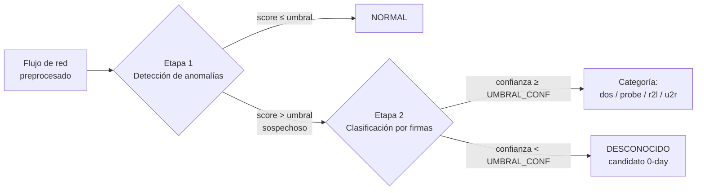

# Arquitectura del sistema

La arquitectura del H-NIDS es una **cascada de dos etapas**: un detector de anomalías que decide si un flujo es sospechoso, seguido de un clasificador de firmas que, solo para los flujos sospechosos, asigna una categoría de ataque o los marca como desconocidos. Esta decisión de diseño (fijada el 2026-07-02) es la que da su carácter *híbrido* al sistema y constituye la tesis del trabajo.

## 3.2.1 Las dos etapas

Antes de llegar a la etapa 1, el flujo entrante no se evalúa en crudo: se transforma con **los codificadores y el escalador persistidos** durante el entrenamiento —el mismo *one-hot* de las variables categóricas, el mismo escalador y, en la variante reducida, la misma selección de características—, de modo que el vector que recibe el detector está expresado exactamente en el espacio en el que se aprendió el modelo. Esa es la condición para que el umbral de la etapa 1 signifique lo mismo en despliegue que en validación. El criterio con el que se ajustan esos transformadores —y por qué no se reajustan sobre el conjunto de test— se fija en [[3.3 Metodología de funcionamiento del sistema|3.3]] (§3.3.1); aquí solo se describe el paso dentro del recorrido.

- **Etapa 1 — detector de anomalías.** Entrenado **solo con tráfico normal**, aprende un modelo de lo que es comportamiento legítimo y marca como *sospechoso* todo lo que se desvía de él por encima de un umbral. Actúa como un filtro binario normal/sospechoso. Su diseño se detalla en [[3.4 Modelo de detección de anomalías]].
- **Etapa 2 — clasificador de firmas.** Entrenado **solo con ataques conocidos**, recibe únicamente los flujos que la etapa 1 marcó como sospechosos y les asigna una de las cuatro categorías de ataque. Si su confianza en la predicción no alcanza un umbral (`UMBRAL_CONF`), en lugar de forzar una etiqueta, marca el flujo como **desconocido** (candidato a 0-day). Su diseño se detalla en [[3.5 Modelo de detección basado en firmas]].

## 3.2.2 Por qué una cascada, y en este orden

El orden de las etapas no es arbitrario. El argumento **general** —válido para cualquier híbrido en cascada que combine ambos paradigmas— está desarrollado en [[2.2.4 Detección por firmas frente a detección por anomalías|2.2.4]] § 2.2.4.5 *De la complementariedad a la arquitectura híbrida*, y **aquí solo se instancia**: este apartado no vuelve a demostrar por qué las anomalías van delante, sino que traduce ese principio a las razones concretas que lo sostienen en **este** sistema, con sus splits y sus modelos. La consecuencia de diseño es la que fija el flujo del apartado anterior: la etapa 1 decide **si** un flujo es sospechoso y solo lo sospechoso pasa a la etapa 2, que decide **qué** es.

Sobre esa consecuencia se apoyan tres razones concretas para poner las anomalías delante en **este** sistema:

| Razón | En qué consiste aquí |
|---|---|
| **Diseño** | La etapa 2 se entrena únicamente con D3, que contiene solo ataques: **carece de clase `normal`**, de modo que su predicción de máxima probabilidad es siempre una de las cuatro categorías de ataque. No es que acierte poco con tráfico legítimo: es que no dispone de la etiqueta con la que acertaría |
| **Cobertura** | Solo la etapa 1 puede reaccionar ante lo no catalogado, que es justo lo que un sistema de firmas deja fuera por construcción. Anteponerla es lo que hace que la cobertura del sistema no quede limitada al catálogo de ataques conocidos, argumento con el que ya se justificaba la combinación en serie anomalías→firmas en la literatura clásica [33] |
| ***Semantic gap*** | La etapa 2 **no está ahí para detectar, sino para traducir**: convierte el veredicto poco accionable de la etapa 1 —«esto se desvía de lo normal»— en un enunciado con significado operativo —«esto es un `dos`»—. Es la respuesta de este diseño al ***semantic gap*** tal como queda definido en [[2.1.6 Metodologías y buenas prácticas]] [21] |

**El antagonista directo.** La alternativa contraria a este orden no es hipotética: existe un trabajo sobre **el mismo dataset** que coloca las firmas primero y las anomalías después. Su descripción arquitectónica, su cita y la salvedad de verificación que la acompaña están en [[2.2.4 Detección por firmas frente a detección por anomalías|2.2.4]] § 2.2.4.5, y no se reproducen aquí. Lo que importa **para este diseño** es la consecuencia: al compartir problema y datos y diferir precisamente en la variable que este apartado justifica —el orden de la cascada—, es el contraste más útil disponible, y el que motiva la medición contrafactual que sigue.

**Qué costaría el orden inverso, medido.** El argumento anterior es conceptual, pero admite una medición contrafactual: pasar por el clasificador de firmas ya entrenado las **9.711 filas normales de D2**, que en el sistema real nunca llegan a la etapa 2, y contar cuántas saldrían con etiqueta de ataque y confianza suficiente. El resultado es **6.558 (67,53 %)** en la variante de 54 características y **3.329 (34,28 %)** en la de 122.

> [!important] Cómo se lee esa cifra: cota inferior, no FPR
> Esos recuentos son **una cota inferior de los falsos positivos irrecuperables** de un sistema con las firmas delante, **nunca «el FPR de un sistema de firmas-primero»**. La razón es la decisión **P-5** de este trabajo: en el sistema publicado la salida `unknown` **es alarma**, no absolución. Por tanto, los flujos normales que aquí caen por debajo del umbral de confianza **no quedan exonerados**: en una cascada invertida pasarían a la etapa siguiente y podrían acabar en alarma igualmente. Lo que la medición fija sin ambigüedad es el número de condenas que **ninguna etapa posterior puede deshacer**.
>
> Artefacto: `Resultados\metricas_cascada_invertida.csv` (fila `__global__` de cada variante). La lectura completa del argumento está en `Implementacion\PIPELINE.md`, § «La cascada invertida (T3)».

**El precio del orden elegido, declarado.** La cascada no sale gratis: anteponer un detector de anomalías con un umbral fijado por diseño introduce falsas alarmas que un clasificador supervisado no comete. Sobre D2 completo, y comparando **variante contra variante**, el híbrido registra un **FPR de 10,2 % en 54 características frente al 2,7 % del baseline** RandomForest monolítico en esa misma variante, y de **8,5 % en 122 frente al 2,6 % del baseline** en 122 (`Resultados\metricas_hibrido.csv`, columna `bin_fpr`, y `Resultados\metricas_baseline.csv`, columna `fpr`). El diseño se defiende por lo que compra con ese margen —la detección de tipos ausentes del entrenamiento—, contraste que se cuantifica en [[5.3 Resultados del sistema híbrido]]; enunciar la ventaja sin este coste sería incompleto.

> [!note] Divergencia con ADAM
> El precedente clásico de la combinación en serie utiliza la segunda etapa para lo contrario que aquí: en ADAM, el clasificador posterior puede etiquetar un flujo como **falsa alarma** y **filtrarlo**, reduciendo así el FPR del detector de anomalías [32]. En este sistema eso está **prohibido por diseño** (decisiones **H-5** y **P-5**): la etapa 2 no puede exonerar nada, porque lo que no reconoce lo degrada a `unknown`, que sigue siendo alarma.
>
> **Matiz necesario:** esa propiedad no la tiene *toda* cascada anomalías→firmas. Se deriva de que la etapa 2 **carezca de clase `normal`**, lo cual es una **elección** de este trabajo —entrenar la etapa 2 solo con D3— y no una consecuencia inevitable de la topología. Una etapa 2 entrenada también con tráfico normal podría filtrar, al precio de perder la interpretación de la salida `unknown` como candidato a 0-day.

## 3.2.3 De dónde sale la capacidad de detectar lo desconocido

La virtud central del diseño se apoya en la etapa 1: un ataque *0-day* es, para el detector de anomalías, simplemente tráfico que se desvía de lo normal, sin necesidad de conocer el ataque concreto. La etapa 2 completa el cuadro dando a ese hallazgo una etiqueta accionable mediante su salida «desconocido». Esta es la razón por la que la cascada puede detectar lo que un clasificador monolítico no puede, contraste que se cuantifica en [[5.3 Resultados del sistema híbrido]].

> [!info] Trazabilidad
> Arquitectura decidida el 2026-07-02 (decisión 7 de `resumen-de-decisiones.md`) e implementada en `Implementacion/app/hibrido.py`. Los diagramas de bloques del pipeline completo están en `Implementacion/PIPELINE.md` (`diagramas/`).
