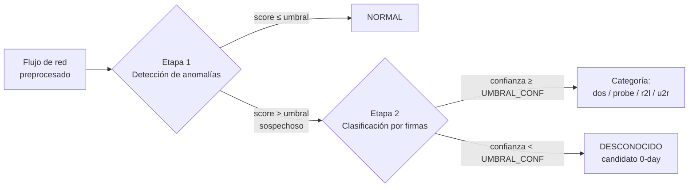

# Arquitectura del sistema

La arquitectura del H-NIDS es una **cascada de dos etapas**: un detector de anomalías que decide si un flujo es sospechoso, seguido de un clasificador de firmas que, solo para los flujos sospechosos, asigna una categoría de ataque o los marca como desconocidos. Esta decisión de diseño (fijada el 2026-07-02) es la que da su carácter *híbrido* al sistema y constituye la tesis del trabajo.

## 3.2.1 Las dos etapas

- **Etapa 1 — detector de anomalías.** Entrenado **solo con tráfico normal**, aprende un modelo de lo que es comportamiento legítimo y marca como *sospechoso* todo lo que se desvía de él por encima de un umbral. Actúa como un filtro binario normal/sospechoso. Su diseño se detalla en [[3.4 Modelo de detección de anomalías]].
- **Etapa 2 — clasificador de firmas.** Entrenado **solo con ataques conocidos**, recibe únicamente los flujos que la etapa 1 marcó como sospechosos y les asigna una de las cuatro categorías de ataque. Si su confianza en la predicción no alcanza un umbral (`UMBRAL_CONF`), en lugar de forzar una etiqueta, marca el flujo como **desconocido** (candidato a 0-day). Su diseño se detalla en [[3.5 Modelo de detección basado en firmas]].

## 3.2.2 Por qué una cascada, y en este orden

El orden de las etapas no es arbitrario. La clave está en que **el clasificador de firmas no conoce la clase "normal"**: se entrena exclusivamente con ataques, porque su cometido es distinguir *entre tipos de ataque*, no separar ataque de tráfico legítimo. Si se le presentara tráfico normal, lo asignaría por fuerza a alguna categoría de ataque, generando falsas alarmas masivas.

Anteponer el detector de anomalías resuelve este problema: la etapa 1 se encarga de la decisión normal/ataque —para la que sí está entrenada, con tráfico normal— y solo deja pasar a la etapa 2 lo que ya considera sospechoso. La cascada evita así que el clasificador de firmas condene tráfico legítimo, y reparte el problema en dos preguntas que cada etapa sabe responder: *"¿esto es anómalo?"* (etapa 1) y, en caso afirmativo, *"¿a qué ataque conocido se parece, o es algo nuevo?"* (etapa 2).

## 3.2.3 De dónde sale la capacidad de detectar lo desconocido

La virtud central del diseño se apoya en la etapa 1. Un ataque *0-day* —de un tipo ausente del entrenamiento— es, por definición, invisible para cualquier clasificador supervisado, que solo reconoce patrones que ha visto. Pero para el detector de anomalías un 0-day es, sencillamente, tráfico que se desvía de lo normal: no necesita conocer el ataque concreto para marcarlo como sospechoso. La etapa 2, mediante su salida "desconocido", da a ese hallazgo una etiqueta accionable. Esta es la razón por la que la cascada puede detectar lo que un clasificador monolítico no puede, contraste que se cuantifica en [[5.3 Resultados del sistema híbrido]].

> [!info] Trazabilidad
> Arquitectura decidida el 2026-07-02 (decisión 7 de `resumen-de-decisiones.md`) e implementada en `Implementacion/app/hibrido.py`. Los diagramas de bloques del pipeline completo están en `Implementacion/PIPELINE.md` (`diagramas/`).
