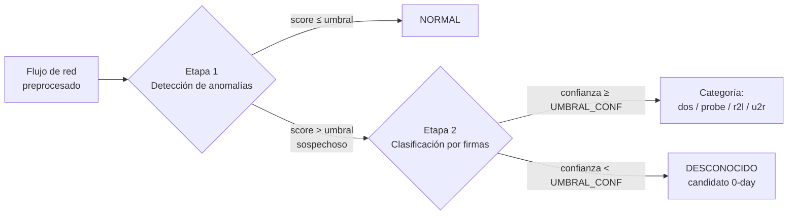

::: {custom-style="Apéndice"}
Abstract
:::

Versión inglesa del título y del resumen; el texto español se recoge en Resumen.

**Title**

**Machine-learning-based hybrid network intrusion detection system: cascaded anomaly and signature detection on NSL-KDD**

**Abstract**

Network intrusion detection systems (NIDS) rely largely on signatures of known attacks, an approach that is accurate on catalogued threats but structurally blind to novel (*0-day*) attacks. This Bachelor's Thesis designs, implements and evaluates a **hybrid network intrusion detection system (H-NIDS)** that cascades an anomaly detection stage —trained solely on legitimate traffic— with a second, signature-based multiclass classification stage learned from known attacks. The aim is to retain the ability to name a known attack without giving up the detection of unknown ones, which are labelled as an actionable `unknown` category instead of being forced into an existing class.

The work is carried out on the **NSL-KDD** dataset, from which three specialised partitions are derived: D1 (normal traffic only, for the anomaly stage), D3 (known attack types only, for the signature stage) and D2 (the complete official test set, reserved for evaluation). Four anomaly detectors (Isolation Forest, One-Class SVM, Local Outlier Factor and an autoencoder) and four supervised classifiers (decision tree, random forest, k-nearest neighbours and histogram-based gradient boosting) are compared, each group under the protocol proper to its stage: a threshold at the 95th percentile of the anomaly scores on a validation partition of D1 for the first stage, and a grid search with cross-validation on `f1_macro` with within-fold class balancing for the second. As a control, a **monolithic five-class random forest** is trained, representative of the dominant pattern in the literature on this dataset. The stability of the results is assessed through a ten-seed sweep with paired comparisons.

The selected configuration, autoencoder followed by random forest, achieves on D2 a **global 0-day attack recall of 0.771 against 0.150 for the monolithic baseline**, and a five-class f1_macro of 0.641 against 0.472, with a binary accuracy of 0.860. This advantage comes at a declared cost: a false positive rate of 10.2 % and a loss of performance on known attacks with respect to the signature stage in isolation. A protocol limitation must be added: three of the system's decisions —the choice of detector, the choice of classifier and the choice of the 54-feature set over the 122-feature one— were made while observing D2, so the reported metrics are optimistic with respect to those a truly blind test set would yield. It is concluded that the hybrid architecture provides a capability for detecting the unknown that the closed classifier lacks, and that reducing the false positive rate is the priority for improvement, given its projection to low attack prevalence levels, under the illustrative scenario declared in Chapter 5.

**Keywords:** network intrusion detection; machine learning; anomaly detection; 0-day attacks; NSL-KDD; cascaded hybrid system.


::: {custom-style="Apéndice"}
Resumen
:::

**Título del Trabajo Fin de Grado**

**Sistema híbrido de detección de intrusiones en red basado en aprendizaje automático: detección de anomalías y firmas en cascada sobre NSL-KDD**

La versión inglesa del título y del resumen se recoge en Abstract.

**Resumen**

Los sistemas de detección de intrusiones en red (NIDS) se apoyan mayoritariamente en firmas de ataques conocidos, un enfoque preciso sobre lo catalogado pero estructuralmente ciego ante los ataques de tipo nuevo (*0-day*). Este Trabajo Fin de Grado diseña, implementa y evalúa un **sistema híbrido de detección de intrusiones (H-NIDS)** que combina, en cascada, una etapa de detección de anomalías —entrenada únicamente con tráfico legítimo— y una segunda etapa de clasificación multiclase basada en firmas aprendidas de ataques conocidos. El objetivo es conservar la capacidad de nombrar el ataque conocido sin renunciar a detectar el desconocido, que queda etiquetado como categoría accionable `unknown` en lugar de ser forzado a una clase existente.

El trabajo se realiza sobre el conjunto de datos **NSL-KDD**, del que se derivan tres particiones especializadas: D1 (solo tráfico normal, para la etapa de anomalías), D3 (solo ataques de tipo conocido, para la etapa de firmas) y D2 (el conjunto oficial de test completo, reservado para la evaluación). Se comparan cuatro detectores de anomalías (Isolation Forest, One-Class SVM, Local Outlier Factor y un autoencoder) y cuatro clasificadores supervisados (árbol de decisión, *random forest*, k-vecinos y *gradient boosting* por histogramas), cada grupo con el protocolo propio de su etapa: umbral en el percentil 95 de las puntuaciones de anomalía sobre una partición de validación de D1 en la primera etapa, y búsqueda en rejilla con validación cruzada por `f1_macro` y balanceo intra-*fold* en la segunda. Como control se entrena un ***random forest* monolítico** de cinco clases, representativo del patrón dominante en la literatura sobre este dataset. La estabilidad de los resultados se contrasta mediante un barrido de diez semillas con comparaciones pareadas.

La configuración seleccionada, autoencoder seguido de *random forest*, alcanza sobre D2 un **recall global de ataques 0-day de 0,771 frente a 0,150 del baseline monolítico**, y un f1_macro a cinco clases de 0,641 frente a 0,472, con una exactitud binaria de 0,860. La ventaja se obtiene a un coste declarado: una tasa de falsos positivos del 10,2 % y una pérdida de rendimiento sobre los ataques conocidos respecto a la etapa de firmas aislada. A ello se añade una limitación de protocolo: tres decisiones del sistema —la elección del detector, la del clasificador y la del conjunto de 54 características frente al de 122— se tomaron observando D2, de modo que las métricas publicadas son optimistas respecto a las que daría un conjunto de test verdaderamente ciego. Se concluye que la arquitectura híbrida aporta una capacidad de detección de lo desconocido que el clasificador cerrado no posee, y que la reducción de la tasa de falsos positivos es la prioridad de mejora, dada su proyección a prevalencias bajas de ataque, en el escenario ilustrativo declarado en el capítulo 5.

**Palabras clave:** detección de intrusiones en red; aprendizaje automático; detección de anomalías; ataques 0-day; NSL-KDD; sistema híbrido en cascada.


# Introducción


## Sinopsis

Este primer capítulo sitúa el proyecto en su contexto y delimita qué se pretende conseguir con él. La motivación parte de dos fenómenos que hoy avanzan en paralelo: la exposición creciente de datos e infraestructuras a incidentes de ciberseguridad —que no afecta solo a las grandes corporaciones— y la extensión del aprendizaje automático y la inteligencia artificial a prácticamente todos los ámbitos técnicos. La confluencia de ambos explica el interés por aplicar modelos de aprendizaje automático a los Sistemas de Detección de Intrusiones en Red (NIDS), tanto para reconocer ataques ya catalogados como para aproximarse a los ataques desconocidos o *0-day*.

A continuación, los preliminares recorren el origen y la evolución de la detección de intrusiones: los trabajos fundacionales de los años ochenta, la aparición de los primeros prototipos basados en la observación del comportamiento normal del usuario y del sistema, la consolidación posterior de la detección basada en firmas y los desafíos que estos sistemas arrastran hasta hoy, entre ellos el volumen de datos y la tasa de falsos positivos y negativos. Ese recorrido no es un adorno histórico: justifica por qué la propuesta de este trabajo es **híbrida**, es decir, por qué combina las dos familias de detección en lugar de elegir una.

Sobre esa base, el objetivo fija la meta general del trabajo —**diseñar, implementar y evaluar** un Sistema Híbrido de Detección de Intrusiones en Red (H-NIDS) basado en aprendizaje automático— y la descompone en nueve objetivos específicos, cada uno con su criterio de cumplimiento. Agrupados por bloques temáticos, esos objetivos cubren:

- **Fundamentación y datos:** estudiar las dos familias de detección sobre las que se apoya el sistema y analizar y preprocesar el conjunto de datos NSL-KDD.
- **Preparación y validación de los splits:** derivar los subconjuntos especializados que cada etapa necesita —tráfico normal, ataques conocidos y conjunto de evaluación— y **validar su integridad antes de entrenar**, incluido el análisis de la desviación (*drift*) entre entrenamiento y evaluación.
- **Construcción de las dos etapas:** entrenar y seleccionar el detector de anomalías y el clasificador multiclase de ataques conocidos, este último con tratamiento del desbalanceo y **extracción de reglas legibles** que hagan interpretable la decisión de la etapa de firmas.
- **Integración y contraste:** integrar ambas etapas en la cascada y evaluarla de extremo a extremo contemplando la clase `unknown`, y contrastar su rendimiento con un **baseline monolítico de control**, de modo que pueda afirmarse o descartarse que la arquitectura aporta una mejora y no solo que funciona.
- **Ataques desconocidos y lectura crítica:** medir la capacidad frente a ataques no vistos mediante el ***recall* 0-day desagregado por tipo de ataque**, en lugar de una métrica global que oculte las categorías minoritarias, y analizar críticamente los resultados y las limitaciones para derivar de ellas las líneas de trabajo futuro.

El capítulo se cierra con la estructura de la memoria, que anuncia el contenido de cada capítulo y el papel que cumple en la construcción del sistema: los fundamentos teóricos, el diseño, la implementación, la evaluación de los resultados y, por último, las conclusiones y líneas futuras, a las que siguen los apéndices y la bibliografía.


## Motivación

La ciberseguridad y la inteligencia artificial (IA) dominan los titulares a diario. Los ciberataques, los nuevos modelos de IA y la capacidad de esta para transformar el mercado laboral son asuntos a los que cada vez estamos más acostumbrados. En este contexto, la vulnerabilidad de los datos y de las infraestructuras se ha convertido en una de las mayores preocupaciones de las grandes empresas.

La posibilidad de sufrir estos problemas no se limita a las grandes corporaciones, sino que cualquier institución puede verse afectada. La magnitud del fenómeno en España queda reflejada en los datos oficiales: durante 2024, el Instituto Nacional de Ciberseguridad (INCIBE) gestionó 97.348 incidentes de ciberseguridad, un 16,6 % más que el año anterior [1].

Todos estos motivos son los que han puesto la ciberseguridad, y, por consiguiente, la protección de datos, en el centro de las prioridades de los profesionales informáticos.

Por otro lado, la IA ha tenido un crecimiento exponencial en los últimos años y su uso se extiende a todos los ámbitos de la sociedad. De hecho, todas las grandes multinacionales están invirtiendo en esta tecnología y cada vez son más los puestos de trabajo que se están transformando debido a estas innovaciones.

En cuanto al objetivo de este proyecto, los Sistemas de Detección de Intrusiones en Red (NIDS) en general también se han visto beneficiados por esta nueva corriente. Se han creado algoritmos basados tanto en Machine Learning (ML) como en IA, que mejoran la capacidad de detección de ataques y facilitan su identificación en el momento en que se producen. Además, estos sistemas permiten relacionar un ataque actual con incidentes previos, haciendo posible el uso del método de resolución usado anteriormente.

De igual modo, estos algoritmos han sido fundamentales para la detección de ataques desconocidos, denominados ataques 0-day. Aunque estos algoritmos no son totalmente fiables, sus resultados son altamente prometedores.


## Preliminares

La historia de los IDS comienza con la creciente complejidad de las redes informáticas y la necesidad de proteger la información.

En la década de los 80 dos investigadores dieron los primeros fundamentos sobre la detección de intrusiones:

Fue primero James P. Anderson, en el 1980, quien publicó un informe titulado "Computer Security Threat Monitoring and Surveillance". En dicho documento se describía cómo los patrones de uso del usuario y del sistema podían ser monitorizados y registrados con el objetivo de detectar actividades maliciosas [2].

Posteriormente, Dorothy Denning, una investigadora americana, desarrolló el modelo IDES (Intrusion Detection Expert System) en el instituto SRI Internacional (Stanford Research Institute). IDES fue uno de los primeros prototipos de IDS, el cual se basaba en la monitorización del uso normal del usuario y del sistema, con el objetivo de detectar anomalías, clasificando dichas actividades anómalas como intrusiones [3].

En 1998, Martin Roesch creó Snort, un detector de intrusiones ligero y de código abierto, el cual podía realizar análisis de protocolos, búsqueda de contenido y coincidencia de patrones. Él fue quien popularizó la detección basada en firma, donde el NIDS busca patrones específicos (firmas) en el tráfico de red que se sabe que corresponden a ataques conocidos [26].

**Sobre la fecha**

La fecha de este párrafo, 1998, es la de la primera publicación de la herramienta; `[26]` es el artículo con que Roesch presentó Snort en **LISA'99** (USENIX, nov. 1999). Las dos son correctas y no se contradicen: una es la del programa y la otra la de su publicación académica.

A esas dos familias —la detección por anomalías heredada de IDES y la detección por firmas popularizada por Snort— se sumó posteriormente una tercera, la **detección basada en el estado**. Las tres son la base sobre la que se construyen los sistemas actuales, y se desarrollan en §2.2.2.

En el siglo XXI estos sistemas se han convertido en un elemento esencial de la seguridad informática, pero su evolución ha ido acompañada de una serie de desafíos que siguen abiertos:

- **Evasión del IDS/NIDS.** El atacante conoce el mecanismo de detección y lo esquiva: fragmenta los paquetes, cifra el canal, ofusca la carga útil o distribuye la actividad en el tiempo para que ningún patrón individual resulte sospechoso. La detección por firmas es especialmente sensible a este problema, porque basta con alterar ligeramente el ataque para que deje de coincidir con la firma registrada.
- **Volumen de datos.** El tráfico de una red moderna se cuenta en miles de flujos por segundo, de modo que el detector debe decidir en tiempo real y con recursos acotados. Esto convierte el coste computacional en un requisito de diseño y no en un detalle de implementación, y es la razón por la que en este trabajo se mide la latencia por flujo y el número de flujos procesados por segundo, además del acierto.
- **Falsos positivos y falsos negativos.** Un umbral de decisión demasiado permisivo deja pasar ataques; uno demasiado estricto inunda al analista de alarmas infundadas y termina provocando que las alertas se ignoren. Ajustar ese equilibrio es el problema central de la evaluación de un IDS, y explica el uso de métricas como la precisión, la exhaustividad y el F1 en lugar de la exactitud global.
- **Integración con SIEM.** Un IDS aislado solo aporta una alarma sin contexto. Los sistemas de gestión de información y eventos de seguridad (*Security Information and Event Management*) correlacionan esas alarmas con registros de cortafuegos, servidores y estaciones de trabajo, de forma que la salida del detector deja de ser un fin en sí misma y pasa a ser una entrada de un proceso de respuesta más amplio.
- **IDS híbridos y nuevas tecnologías.** Ninguno de los enfoques anteriores resuelve el problema por separado: las firmas son precisas con lo conocido pero ciegas ante lo nuevo, y las anomalías detectan lo desconocido a costa de falsas alarmas. De ahí la tendencia a combinarlos en arquitecturas híbridas y a apoyarlos en técnicas de aprendizaje automático, capaces de aprender el comportamiento del tráfico en lugar de enumerarlo.

Este último punto es precisamente el que motiva el presente trabajo: el sistema que se propone combina una etapa de detección por anomalías con una etapa de detección por firmas basada en aprendizaje automático, con el objetivo de aprovechar las virtudes de ambas. El planteamiento concreto del problema y los objetivos que se persiguen se detallan en 1.3 Objetivo, y la organización del documento en 1.4 Estructura.


## Objetivo

### Objetivo general

El objetivo general de este trabajo es **diseñar, implementar y evaluar un Sistema Híbrido de
Detección de Intrusiones en Red (H-NIDS) basado en técnicas de aprendizaje automático**, aplicado
al conjunto de datos NSL-KDD.

Por *híbrido* se entiende aquí una arquitectura concreta, y no la simple coexistencia de dos
detectores independientes: una **cascada de dos etapas** en la que cada etapa se especializa en el
problema que la otra resuelve peor.

| Etapa | Paradigma | Datos de entrenamiento | Función en la cascada |
|---|---|---|---|
| 1 | Detección de **anomalías** | Solo tráfico normal (split D1) | Decidir si un flujo se desvía del comportamiento legítimo aprendido, sin haber visto ningún ataque |
| 2 | Detección por **firmas** (clasificación multiclase) | Solo ataques conocidos (split D3) | Atribuir a los flujos marcados como sospechosos una categoría de ataque conocida, o declararlos `unknown` |

El razonamiento que sostiene este diseño es el que se anticipa en 1.2 Preliminares, al enumerar
los desafíos abiertos de la detección de intrusiones —en concreto, el punto dedicado a los IDS
híbridos—: la detección
por firmas es precisa sobre lo que ya conoce, pero por construcción no puede reconocer un ataque
0-day, porque no existe firma previa de él; la detección de anomalías sí puede señalarlo, pero no
sabe decir *qué* es y tiende a generar falsas alarmas. Situando el detector de anomalías **primero**
—como filtro de sospecha entrenado únicamente con tráfico normal— y el clasificador de firmas
**después** —como órgano de atribución—, la cascada aspira a conservar la capacidad de señalar lo
desconocido sin renunciar a etiquetar lo conocido.

Lo que el trabajo se propone **demostrar**, por tanto, no es que un H-NIDS sea implementable, sino
si esa composición en cascada aporta algo medible frente a las alternativas obvias: cada etapa
por separado y un clasificador monolítico único entrenado sobre todo el tráfico. Esa comparación,
y no la cifra aislada de un modelo, es el resultado que se persigue.

**Alcance**

El sistema se construye y se mide **de forma offline sobre NSL-KDD**. No se propone un despliegue
en red real ni captura de tráfico en vivo; las consideraciones al respecto se recogen en
6.2 Líneas futuras.

### Objetivos específicos

El objetivo general se desagrega en los siguientes objetivos específicos. Cada uno se enuncia con
un verbo en infinitivo y un **criterio de cumplimiento** verificable:

1. **Estudiar** los fundamentos de la detección de intrusiones y de las dos familias de detección
   sobre las que se apoya el sistema —firmas para ataques conocidos y anomalías para ataques
   0-day—, así como las técnicas de aprendizaje automático aplicables a cada una.
   *Criterio:* marco teórico redactado con las fuentes citadas (capítulo 2).
2. **Analizar y preprocesar** el conjunto de datos NSL-KDD: describir su origen y sus
   características, codificar las variables categóricas, escalar las numéricas y agrupar los tipos
   de ataque en categorías.
   *Criterio:* pipeline de preprocesado ejecutable y documentado, con el mapeo de etiquetas
   registrado (capítulo 4, secciones 4.2 y 4.3; el diseño previo del pipeline, en el capítulo 3).
3. **Derivar** del dataset los subconjuntos especializados que cada etapa necesita —D1 con solo
   tráfico normal, D3 con solo ataques conocidos y D2 como conjunto de evaluación— y **validar**
   su integridad antes de entrenar: distribuciones, presencia de valores atípicos y desviación
   (*drift*) entre el tráfico de entrenamiento y el de evaluación.
   *Criterio:* informe de validación de los splits generado y comentado (capítulo 4).
4. **Entrenar y seleccionar** el modelo de la etapa 1 comparando varios detectores de anomalías
   entrenados exclusivamente con tráfico normal, con un umbral de decisión fijado sobre datos de
   validación y no sobre el conjunto de test.
   *Criterio:* métricas comparadas de los candidatos y modelo elegido con justificación (5.1). El
   criterio distingue dos decisiones que no tienen la misma garantía metodológica: el **umbral** se
   fija sobre la partición de validación de D1, sin ver el conjunto de evaluación; la **elección del
   detector** entre los candidatos sí se resolvió atendiendo a su comportamiento sobre el conjunto
   de evaluación, y esa limitación se declara expresamente en 6.1.3.
5. **Entrenar y seleccionar** el modelo de la etapa 2, un clasificador multiclase de ataques
   conocidos, incluyendo el tratamiento del desbalanceo entre categorías y la **extracción de
   reglas legibles** que hagan interpretable la decisión de la etapa de firmas.
   *Criterio:* métricas por categoría y conjunto de reglas exportado (5.2).
6. **Integrar** ambas etapas en la cascada y **evaluar** el sistema completo de extremo a extremo
   sobre el conjunto de evaluación, contemplando de forma explícita la clase `unknown` como salida
   legítima del sistema.
   *Criterio:* métricas del sistema híbrido y matriz de confusión sobre D2 (5.3).
7. **Contrastar** el rendimiento del híbrido con un **baseline monolítico de control** —un único
   clasificador multiclase entrenado sobre todo el tráfico disponible— para poder afirmar o
   descartar que la arquitectura en cascada aporta una mejora, y no solo que funciona.
   *Criterio:* comparación en igualdad de condiciones de evaluación entre híbrido y baseline (5.3).
8. **Medir la capacidad de detección de ataques desconocidos** mediante el *recall* por tipo de
   ataque no visto en entrenamiento (recall 0-day desagregado), en lugar de conformarse con una
   métrica global que oculte el comportamiento frente a las categorías minoritarias.
   *Criterio:* tabla de recall 0-day por tipo de ataque, para el híbrido y para el baseline (5.3).
9. **Analizar críticamente** los resultados obtenidos, identificando las limitaciones del sistema
   y del propio dataset, y derivar de ellas las líneas de trabajo futuro.
   *Criterio:* conclusiones y líneas futuras redactadas (capítulo 6).

Los objetivos 3 a 8 se corresponden uno a uno con un artefacto de código y de resultados concreto,
de modo que su cumplimiento puede verificarse sin recurrir a la valoración del autor: la
trazabilidad entre cada objetivo y el artefacto que lo evidencia se detalla en el capítulo 5 y en
los apéndices.


## Estructura

Esta memoria describe paso a paso el proceso seguido: la preparación de los fundamentos teóricos, el estudio de las técnicas empleadas, el diseño y la implementación de los modelos, y la evaluación final del sistema. Cada capítulo es un escalón hacia el objetivo del trabajo, y por eso se presenta a continuación no solo lo que contiene, sino qué aporta a ese objetivo.

El **Capítulo 1, Introducción**, sitúa el trabajo. Repasa la motivación, recorre los antecedentes históricos de los sistemas de detección de intrusiones para entender de dónde viene el problema, y fija el objetivo del proyecto junto con la estructura de la memoria. Su aportación es delimitar la pregunta que el resto del trabajo debe responder.

El **Capítulo 2, Marco Teórico**, construye el vocabulario técnico necesario para seguir el trabajo. Se organiza en tres bloques —Machine Learning, Ciberseguridad e Inteligencia Artificial— y cubre desde los tipos de aprendizaje y las métricas de evaluación hasta la taxonomía de los IDS, la oposición entre detección por firmas y por anomalías, y los límites y consideraciones éticas del uso de la IA en seguridad. Su aportación es justificar por qué la combinación de ambos paradigmas de detección es una vía razonable.

El **Capítulo 3, Diseño del sistema**, traduce ese marco en una propuesta concreta. Recoge los requisitos, la arquitectura en cascada, la metodología de funcionamiento y el diseño de las dos etapas del sistema: el modelo de detección de anomalías y el modelo de detección basado en firmas. Su aportación es dejar cerradas las decisiones de diseño antes de escribir una sola línea de código, de modo que la implementación posterior sea comprobable frente a ellas.

El **Capítulo 4, Implementación del sistema**, detalla cómo se materializa el diseño. Describe las tecnologías utilizadas, el dataset NSL-KDD y su análisis previo, el preprocesamiento que genera las particiones de trabajo y el entrenamiento de los dos modelos. Su aportación es la trazabilidad: documenta cada paso con el detalle suficiente para que el sistema pueda reproducirse.

El **Capítulo 5, Evaluación**, presenta y analiza los resultados experimentales. Fija primero el protocolo de evaluación —particiones, métricas e invariantes de comparación— y expone después los resultados del modelo de anomalías, los del modelo de firmas y los del sistema híbrido completo. En este último apartado se concentra el resultado central de la memoria: el contraste del híbrido con un **baseline monolítico de control** —un único clasificador multiclase entrenado sobre todo el tráfico disponible—, que es lo que permite afirmar o descartar que la arquitectura en cascada aporta una mejora y no solo que funciona; y el **análisis del *recall* de ataques desconocidos desagregado por tipo de ataque**, en lugar de una métrica global que oculte el comportamiento frente a las categorías minoritarias. Su aportación es la evidencia: mide el comportamiento del sistema en lugar de suponerlo, y lo mide frente a una alternativa y con el detalle suficiente para no ocultar sus puntos débiles.

El **Capítulo 6, Conclusiones**, cierra el trabajo. Contrasta los resultados obtenidos con los objetivos planteados en el Capítulo 1, declara las limitaciones observadas y propone las líneas futuras de mejora. Su aportación es el juicio final sobre en qué medida el sistema propuesto responde a la pregunta inicial.

Por último, los **Apéndices** reúnen el material de consulta que apoya a los capítulos anteriores sin interrumpir su lectura: la descripción de las columnas del dataset NSL-KDD, las fórmulas de las métricas de desempeño y la ficha del sistema. Su papel no es residual, y conviene declararlo aquí para que el lector sepa dónde buscar: el cuerpo de la memoria explica **qué se decidió y por qué**, mientras que los valores concretos —rejillas de búsqueda, configuraciones ganadoras de cada algoritmo, umbrales y el volcado del barrido de semillas— viven en la ficha del sistema. Esa separación es deliberada: mantiene la argumentación legible sin sacrificar la reproducibilidad, que queda íntegra en el apéndice. Cierra la memoria la **Bibliografía**.


# Marco Teórico


## Machine Learning


### Introducción al ML

Desde los inicios de la era de la computación, los investigadores han perseguido enseñar a las máquinas a razonar y tomar decisiones «inteligentes» de forma parecida a como lo hacen las personas: elaborando generalizaciones y extrayendo conceptos a partir de conjuntos de información complejos, sin necesidad de instrucciones explícitas para cada caso.

El **aprendizaje automático** (*Machine Learning*, ML) es la disciplina que persigue ese objetivo por una vía concreta: la de los algoritmos y procesos que «aprenden», en el sentido de que son capaces de generalizar a partir de datos y experiencias pasadas para predecir resultados sobre casos futuros. En esencia, el ML es un conjunto de técnicas matemáticas —implementadas en sistemas informáticos— que permiten extraer información, descubrir patrones y obtener inferencias a partir de datos [5, cap. 1].

#### 2.1.1.1 Relación con la Inteligencia Artificial

El ML se enmarca dentro de la Inteligencia Artificial (IA) y guarda una relación estrecha con el aprendizaje profundo (*Deep Learning*, DL), tal y como se ilustra en la Figura 2.1: el ML es uno de los caminos, aunque no el único, para construir sistemas de IA, y el DL es a su vez un subconjunto estricto del ML [4].


::: {custom-style="Figura_Tabla_Ecuación"}
Figura 2.1. Relación entre Inteligencia Artificial, Machine Learning y Deep Learning.
:::

**La jerarquía completa —qué es la IA, en qué se diferencia del ML y en qué punto exacto se sitúa el sistema desarrollado— se desarrolla en 2.3.1, que fija el vocabulario para el resto del documento, y no aquí.**

#### 2.1.1.2 Programación tradicional frente a aprendizaje automático

La diferencia entre ambos enfoques se aprecia comparando sus ciclos de trabajo. En la **programación tradicional**, el desarrollador escribe explícitamente las reglas de decisión y, si no bastan, analiza los errores para corregirlas a mano (Figura 2.2): el conocimiento reside íntegramente en el código que alguien ha escrito. En el **aprendizaje automático**, el punto de partida son datos de evaluaciones previas; se entrena un algoritmo sobre ellos y, si el desempeño no es satisfactorio, el análisis de errores no corrige reglas escritas a mano sino el propio **entrenamiento** del algoritmo (Figura 2.3) [5, cap. 1].


::: {custom-style="Figura_Tabla_Ecuación"}
Figura 2.2. Metodología en programación tradicional.
:::


::: {custom-style="Figura_Tabla_Ecuación"}
Figura 2.3. Metodología en ML.
:::

Un refinamiento adicional es el **aprendizaje continuo**: una vez desplegado, el sistema sigue aprendiendo de los datos que él mismo genera, retroalimentando el entrenamiento con la experiencia acumulada en producción (Figura 2.4) [5, cap. 1]. Se trata de una definición conceptual: si el sistema de este trabajo podría incorporarlo, y bajo qué condiciones previas de datos, se examina en 6.2.


::: {custom-style="Figura_Tabla_Ecuación"}
Figura 2.4. Metodología en ML con aprendizaje continuo.
:::

Esta distinción —reglas escritas a mano frente a reglas inducidas de los datos— se retoma, aplicada a la detección de intrusiones, en 2.3.1 (§2.3.1.2).

#### 2.1.1.3 Algoritmo y modelo: una distinción necesaria

Dos términos que se emplean en toda la memoria y que el uso coloquial confunde. El **algoritmo** es el conjunto de instrucciones y reglas matemáticas que definen *cómo* aprender de los datos —el particionado recursivo de un árbol, la regla de actualización de pesos de una red—. El **modelo** es el producto concreto de aplicar ese algoritmo a un conjunto de entrenamiento determinado: es lo que se guarda, se evalúa y se despliega. Un mismo algoritmo produce modelos distintos según los datos y los hiperparámetros, y esa es precisamente la distinción que sustenta comparar varios algoritmos candidatos sobre un mismo problema, como se hace en las dos etapas de este sistema (véanse 3.4 y 4.5).

#### 2.1.1.4 El papel de los datos

Los datos son la base sobre la que se sostiene todo el ML: sin datos representativos y en cantidad suficiente, ningún algoritmo generaliza de forma fiable, y tanto su **calidad** como su **cantidad** condicionan el desempeño del modelo resultante [5, cap. 2]. Por eso los conjuntos rara vez se usan tal cual se recogen, sino tras un **preprocesamiento** de limpieza, transformación y partición. **Esas fases no se enumeran aquí:** la limpieza y la transformación son etapas del ciclo de trabajo (2.1.3, §2.1.3.2 y §2.1.3.3), el papel no intercambiable de los subconjuntos se fija en 2.1.6 (§2.1.6.2), y su instanciación sobre NSL-KDD corresponde a 4.3.


### Tipos de ML

2.1.1 Introducción al ML ha situado el aprendizaje automático como el subconjunto de la Inteligencia Artificial en el que el comportamiento del sistema se induce a partir de datos en lugar de programarse a mano. Esa definición deja abierta una pregunta de diseño que esta sección responde: **qué tipo de datos recibe el algoritmo durante el entrenamiento**, y en particular, **cuánta supervisión humana hay detrás de ellos**. Esa dimensión —el régimen de supervisión— es la que clasifica a los algoritmos de ML en paradigmas, y es también la dimensión que fija, para cada etapa de este trabajo, qué tipo de algoritmo puede emplearse en ella.

Se distinguen habitualmente cinco paradigmas: **supervisado**, **no supervisado**, **por refuerzo**, **semisupervisado** y **auto-supervisado**. Los tres primeros son la división clásica del campo; los dos últimos son variantes intermedias que han ganado relevancia práctica en la última década. El desarrollo técnico de los algoritmos concretos que se mencionan como ejemplo en cada paradigma —su formulación matemática, sus hiperparámetros y su papel en este proyecto— no se repite aquí: es el contenido de 2.1.4 Algoritmos de ML, a la que esta sección remite en cada caso.

---

#### 2.1.2.1 Aprendizaje supervisado

En el aprendizaje supervisado, el objetivo es aprender una correspondencia entre las entradas $x$ y las salidas $y$ a partir de un **conjunto etiquetado** de pares entrada-salida, denominado conjunto de entrenamiento. Las entradas $x$ —llamadas indistintamente características, atributos o covariables— pueden ser tan simples como la altura y el peso de una persona o tan complejas como una imagen o un grafo. La forma de la salida $y$ determina el tipo de tarea:

- Cuando $y$ es una variable **categórica** (por ejemplo, «ataque» o «normal»), la tarea es de **clasificación**.
- Cuando $y$ es un valor **real** (por ejemplo, un nivel de ingresos), la tarea es de **regresión**.

Entre los algoritmos supervisados más representativos se cuentan k-vecinos más próximos (*k*-NN), la regresión lineal y logística, las máquinas de vectores soporte (SVM), los árboles de decisión y los bosques aleatorios, y las redes neuronales [5, cap. 1]. Varios de ellos son, precisamente, los que compiten dentro de las dos etapas de este sistema: la clasificación multiclase de la etapa de firmas se plantea como un problema de aprendizaje supervisado clásico, entrenado sobre el split D3 de ataques etiquetados por categoría (véase 4.5 Entrenamiento del modelo de detección basado en firmas). El detalle de cada algoritmo candidato se desarrolla en 2.1.4 Algoritmos de ML.

---

#### 2.1.2.2 Aprendizaje no supervisado

En el aprendizaje no supervisado solo se dispone de entradas, sin etiqueta de salida, y el objetivo es encontrar **patrones interesantes** en los datos —lo que a veces se denomina descubrimiento de conocimiento. Es un problema peor definido que el supervisado: no se especifica de antemano qué tipo de patrón buscar, y no existe una métrica de error obvia con la que comparar una predicción frente a un valor observado, a diferencia de lo que ocurre en clasificación o regresión.

Bajo este paradigma se agrupan tareas de naturaleza bastante distinta:

| Tarea | Qué busca | Ejemplos de algoritmo |
|---|---|---|
| **Agrupamiento (*clustering*)** | Particionar los datos en grupos internamente homogéneos | K-Means, DBSCAN, agrupamiento jerárquico (HCA) |
| **Reducción de dimensionalidad y visualización** | Proyectar los datos a un espacio de menor dimensión conservando su estructura | PCA, Kernel PCA, LLE, t-SNE |
| **Reglas de asociación** | Encontrar co-ocurrencias frecuentes entre variables | Apriori, Eclat |
| **Detección de anomalías y de novedades** | Identificar observaciones que se apartan del resto | One-Class SVM, Isolation Forest |

[5, cap. 1]

La última fila de la tabla merece una advertencia, porque es exactamente el punto donde este trabajo se aparta de la clasificación de manual. Su tratamiento se desarrolla en 2.1.2.6, tras completar antes el resto de paradigmas.

---

#### 2.1.2.3 Aprendizaje por refuerzo

Un agente aprende por interacción con un entorno, guiado por recompensas y penalizaciones. **Este trabajo no lo emplea** —no hay agente ni entorno con el que interactuar: la detección se resuelve sobre un conjunto de flujos ya capturados— y por eso no se desarrolla aquí.

#### 2.1.2.4 Aprendizaje semisupervisado

El aprendizaje semisupervisado ocupa el terreno intermedio entre el paradigma supervisado y el no supervisado: combina un conjunto de datos etiquetados, normalmente pequeño, con un conjunto de datos sin etiquetar, normalmente mucho mayor, con el fin de obtener un resultado mejor que el que se lograría usando solo los pocos datos etiquetados disponibles [7]. Es un paradigma pensado para el escenario, muy frecuente en la práctica, en el que etiquetar es costoso y los datos sin etiquetar son abundantes.

Dentro de esta etiqueta general conviene distinguir un caso particular que la literatura trata a veces como si fuera aprendizaje no supervisado, y que es precisamente el que emplea la etapa 1 de este sistema: el **aprendizaje semisupervisado de una sola clase** (*one-class*), donde el conjunto de entrenamiento no mezcla ejemplos etiquetados y sin etiquetar, sino que contiene **exclusivamente ejemplos de una única clase**, la que se considera normal. Este caso se desarrolla en detalle en 2.1.2.6, porque es el punto de coherencia terminológica más importante de esta nota.

---

#### 2.1.2.5 Aprendizaje auto-supervisado

Variante en la que el propio modelo genera sus etiquetas a partir de la estructura de los datos, sin anotación humana. Interesa aquí por un motivo concreto, no por el paradigma en sí:

**Relación con el autoencoder de este trabajo**

El autoencoder que compite como uno de los cuatro detectores de la etapa de anomalías (3.4 Modelo de detección de anomalías) comparte el mecanismo de entrenamiento propio del aprendizaje auto-supervisado —la señal de entrenamiento es la propia entrada, reconstruida por el modelo, y no requiere etiqueta externa alguna—. No obstante, este trabajo lo clasifica y lo evalúa como parte de un régimen **semisupervisado (one-class)**, porque lo que importa a efectos de detección de anomalías no es cómo se genera la señal de entrenamiento internamente, sino **qué población de datos ve el modelo**: únicamente tráfico normal. Ambas lecturas no son contradictorias —el mecanismo de aprendizaje es auto-supervisado y el régimen de supervisión efectivo es one-class—, y esta memoria usa consistentemente la segunda etiqueta por ser la relevante para el problema de detección. El detalle de la arquitectura MLP empleada está en 2.3.1 IA, ML y Deep Learning, en el bloque «El único componente neuronal, y por qué no es "profundo"».

---

#### 2.1.2.6 El caso frontera: detección de anomalías entrenada solo con la clase normal

Este apartado fija un criterio terminológico que rige el resto de la memoria, porque parte de la literatura de ML general y parte de la literatura de detección de intrusiones lo resuelven de forma distinta.

**El problema.** En 2.1.2.2 se listó la detección de anomalías (One-Class SVM, Isolation Forest) como una tarea del aprendizaje no supervisado, siguiendo la clasificación habitual de los manuales de ML de propósito general [5, cap. 1]. Esa clasificación es razonable cuando el detector se entrena sobre un conjunto de datos **mixto y sin etiquetar**, del que se espera que la inmensa mayoría de los ejemplos sean normales y una minoría, desconocida a priori, sean anómalos: en ese escenario no hay ninguna etiqueta disponible durante el entrenamiento, y «no supervisado» es la descripción correcta.

**Por qué este trabajo no está en ese escenario.** El detector de anomalías de la etapa 1 de este sistema **no** se entrena así. Se entrena exclusivamente sobre el split D1, que contiene **únicamente tráfico etiquetado como normal** —la etiqueta de clase existe en el dataset origen y se usa explícitamente para construir ese split (véase 4.3 Preprocesamiento de los datasets y 3.4 Modelo de detección de anomalías)—. El modelo nunca ve, durante el entrenamiento, ni un solo ejemplo de ataque, ni tampoco un conjunto mixto sin etiquetar: ve una única clase, deliberadamente aislada mediante la etiqueta disponible.

**La consecuencia terminológica.** Ese régimen —entrenamiento sobre una única clase, seleccionada usando la etiqueta que sí existe en los datos— no es «no supervisado» en sentido estricto: hay supervisión, solo que restringida a una clase. Es el régimen que la literatura especializada en detección de novedades denomina **aprendizaje semisupervisado de una sola clase (*one-class*)**, y es el término que **este TFG adopta como canónico** para IsolationForest, OneClassSVM, LocalOutlierFactor y el autoencoder de la etapa 1, según quedó fijado como decisión de diseño del proyecto. Llamarlo «no supervisado» sin matiz —como haría una lectura superficial de la tabla de 2.1.2.2— sería impreciso para este caso concreto y generaría una inconsistencia con el resto de la memoria, en particular con la caracterización de la etapa de anomalías que se hace en 2.2.4 Detección por firmas frente a detección por anomalías, donde ya se describen estos mismos detectores como «semisupervisados (one-class)».

**Regla terminológica de este trabajo**

A partir de aquí, y en toda la memoria, los detectores de la etapa de anomalías se denominan **semisupervisados (one-class)**, nunca «no supervisados» a secas. La tabla de 2.1.2.2 se mantiene como resumen general de la literatura de ML —de ahí que liste la detección de anomalías bajo ese epígrafe—, pero queda matizada por este apartado para el caso particular en que el entrenamiento usa solo la clase normal. El mismo criterio se aplica, desde el lado de la ciberseguridad, en 2.2.4 Detección por firmas frente a detección por anomalías (§2.2.4.2).

---

#### 2.1.2.7 Situación de este trabajo y transición

Recogiendo lo anterior, las dos etapas del sistema se sitúan en paradigmas distintos y complementarios:

| Etapa del sistema | Paradigma | Datos que ve en entrenamiento |
|---|---|---|
| Etapa 1 — detección de anomalías | Semisupervisado (one-class) | Solo tráfico normal (split D1) |
| Etapa 2 — detección por firmas | Supervisado (clasificación multiclase) | Ataques etiquetados por categoría (split D3) |

No se emplea aprendizaje por refuerzo ni aprendizaje no supervisado en sentido estricto en ningún componente del sistema: la arquitectura final no incorpora agrupamiento como componente de detección, y técnicas como la reducción de dimensionalidad quedan, en su caso, en el terreno del análisis exploratorio de los datos, nunca en el de los detectores.

Fijado ya el **régimen de supervisión** que corresponde a cada componente, queda por describir el proceso completo mediante el que un problema de ML —cualquiera que sea su paradigma— se convierte en un sistema entrenado y evaluado: las fases sucesivas que van de la definición del problema a la puesta en producción. Es el contenido de 2.1.3 Ciclo de vida de un proyecto ML.


### Ciclo de vida de un proyecto de ML

Un proyecto de aprendizaje automático no consiste en entrenar un modelo: consiste en atravesar una secuencia de etapas, desde la comprensión del problema hasta la evaluación de una solución, en la que el modelado propiamente dicho ocupa una fracción del esfuerzo. Esta sección describe esa secuencia en su forma genérica [5, cap. 2]. Se adopta como **guía de ordenación del trabajo**, no como secuencia lineal: es habitual retroceder de una fase a la anterior cuando una decisión posterior revela un problema en los datos. Lo que se expone a continuación es el **esqueleto de fases**; el **rigor metodológico** que debe sostenerlas —separación train/validación/test, validación cruzada, fuga de información, métricas ante desbalance y reproducibilidad— se trata en 2.1.6, al que se remite cada vez que una fase exige una de esas garantías.

#### 2.1.3.1 Comprensión y recolección de datos

La primera fase delimita el problema, reúne los datos y —antes de transformarlos— los **comprende**: naturaleza y distribución de cada atributo, proporción de valores faltantes, correlaciones entre variables y patrones o anomalías visibles [5, cap. 2]. Es lo que se conoce como **análisis exploratorio de datos** (*Exploratory Data Analysis*, EDA). Su materialización sobre NSL-KDD está en 4.2 y 4.3; **aquí no se anticipa ningún dato ni cifra**.

#### 2.1.3.2 Limpieza y preparación de datos

Sobre una copia del conjunto original se corrigen o eliminan los valores atípicos, se tratan los faltantes y se **escalan** las características, de modo que su rango numérico no distorsione el aprendizaje de los algoritmos sensibles a la escala. Por qué esta fase es indispensable y no una formalidad —el riesgo de que una preparación mal delimitada introduzca **fuga de información** desde el conjunto de evaluación— se desarrolla en 2.1.6.5. Su aplicación concreta, en 4.3.

#### 2.1.3.3 Ingeniería y selección de características

Dos operaciones opcionales completan la preparación: **seleccionar** características —eliminar los atributos que no aportan información útil, reduciendo la dimensionalidad sin perder capacidad predictiva— y **construirlas**, discretizando variables continuas, descomponiendo las compuestas o agregando varias en una más informativa. No son un trámite: la forma en que se representan los datos condiciona, a menudo más que el algoritmo elegido, el techo de rendimiento alcanzable. Su aplicación a NSL-KDD, incluida la decisión sobre qué atributos conservar, está en 4.3.

#### 2.1.3.4 Selección del tipo de modelo

Con los datos preparados, la fase siguiente no elige un algoritmo de entrada: **explora varios candidatos** con configuración estándar para acotar el espacio de soluciones razonables, los compara por validación cruzada y examina qué tipo de error comete cada uno.

Esa comparación combina un procedimiento, una forma concreta de aplicarlo y un estadístico que resume su salida —tres cosas distintas que conviene no confundir—. **La distinción se desarrolla en 2.1.6 (§2.1.6.3) y no aquí.**

La decisión no se toma con un único número: se contrastan la **media** de la métrica elegida entre particiones, su **desviación típica** —un candidato algo peor pero mucho más estable puede ser preferible— y el **tipo de error** cometido, que aporta la matriz de confusión (2.1.5.1). Qué métrica se elige, y por qué la exactitud es mala consejera bajo desbalance, se fija en 2.1.6 (§2.1.6.6). Las familias de algoritmos candidatas se detallan en 2.1.4; la comparación efectivamente realizada en este trabajo, en 4.4 y 4.5.

#### 2.1.3.5 Entrenamiento y ajuste de hiperparámetros

Seleccionados los candidatos, el entrenamiento ajusta sus **hiperparámetros** —los valores que el algoritmo no aprende de los datos— mediante validación cruzada. La distinción parámetro/hiperparámetro y los mecanismos de búsqueda se desarrollan en 2.1.6.4. La configuración empleada en este trabajo no se anticipa aquí: se presenta en los capítulos de implementación de cada etapa.

#### 2.1.3.6 Evaluación del rendimiento

La última fase mide el rendimiento sobre un conjunto que **no ha intervenido en ninguna decisión previa**, para estimar el error de generalización [5]. Es la fase que da sentido a todo lo anterior: un modelo que rinde bien sobre los datos con los que se decidió su configuración no ha demostrado nada todavía sobre datos nuevos. Por qué la distinción es tan estricta, y las consecuencias de no respetarla, en 2.1.6.2; qué métrica resume ese rendimiento, en 2.1.6.6.

El ciclo de la literatura de referencia incluye dos fases posteriores —presentar la solución y desplegarla, monitorizarla y mantenerla en producción [5, cap. 2]— que quedan **fuera del alcance de este trabajo**, según se declara en 2.1.6.1.

---

Con el ciclo de vida ya descrito en su forma genérica, la sección siguiente, 2.1.4 Algoritmos de ML, detalla las familias de algoritmos que pueden ocupar la fase de selección y entrenamiento del modelo descrita en 2.1.3.4 y 2.1.3.5.


### Algoritmos de ML

Esta sección describe, a nivel de familia algorítmica, los métodos de aprendizaje automático que aparecen en el resto de la memoria. El objetivo es exponer **cómo funciona cada algoritmo**, no cómo se ha configurado en este sistema: los hiperparámetros, el ajuste por validación cruzada y las cifras de rendimiento concretas se presentan en los capítulos 3 y 4. La sección se ordena siguiendo el eje de regímenes de supervisión introducido en 2.1.2 Tipos de ML, cuya enumeración canónica no se reproduce aquí para no duplicarla, y recorre cuatro bloques: los algoritmos supervisados (2.1.4.1), los semisupervisados de una clase (2.1.4.2), las redes neuronales artificiales (2.1.4.3) —cuya relación con el aprendizaje profundo se remite a 2.3.1 IA, ML y Deep Learning— y una mención de contraste a los algoritmos no supervisados de agrupamiento (2.1.4.4). El criterio de inclusión es **lo que el sistema usa**: los algoritmos que no intervienen en la implementación se resumen en una frase y su desarrollo se traslada al apéndice. Cierra con una transición hacia las métricas de evaluación (2.1.4.5).

---

#### 2.1.4.1 Algoritmos supervisados

Los algoritmos supervisados aprenden una función que relaciona un vector de características de entrada con una etiqueta conocida, a partir de un conjunto de ejemplos ya etiquetados. En este trabajo constituyen la base de la etapa de detección por firmas (4.5 Entrenamiento del modelo de detección basado en firmas).

Como referencia de partida, la **regresión logística** modela el logaritmo de la razón de probabilidades como una combinación lineal de las características y sirve de línea base explicable en clasificación, pero **no forma parte de este sistema**: su desarrollo está en el apéndice A.3 § A.3.10.1 [5, cap. 4].

##### Árboles de decisión

Un árbol de decisión es una estructura jerárquica de nodos de decisión que particiona el espacio de características mediante preguntas sucesivas sobre una variable, hasta llegar a una hoja que asigna una clase (árbol de clasificación) o un valor numérico (árbol de regresión). Su atractivo principal es la **interpretabilidad**: el camino desde la raíz hasta una hoja es, literalmente, la explicación de la predicción, lo que permite volcarlo en reglas legibles mediante herramientas como `export_text` [12, cap. 9]. Además, aceptan de forma nativa variables numéricas y categóricas mixtas, sin necesitar normalización previa.

Esta propiedad de legibilidad es la que convierte al árbol de decisión en la pieza natural de la etapa de firmas de este sistema, retomada en el bloque de reglas escritas frente a reglas aprendidas de 2.3.1 IA, ML y Deep Learning.

##### Bosques de decisión: Random Forest y Gradient Boosting

Un **conjunto** (*ensemble*) combina varios clasificadores individuales en un modelo agregado que, en general, generaliza mejor que cualquiera de sus componentes por separado. Aplicado a árboles de decisión, el resultado se conoce como bosque de decisión (*decision forest*); las dos familias principales usadas en la práctica son los bosques aleatorios y los árboles potenciados por gradiente [12, cap. 15].

- **Random Forest.** Combina un número elevado de árboles de decisión —típicamente entre decenas y miles—, cada uno entrenado sobre una muestra aleatoria de los datos y de las características (*bagging* con selección aleatoria de variables). La predicción final se obtiene por voto mayoritario entre los árboles en clasificación, o por promedio en regresión. El muestreo aleatorio decorrelaciona los árboles individuales y reduce la varianza del conjunto respecto a un único árbol [12, cap. 15].
- **Gradient Boosting.** A diferencia del bagging, construye los árboles de forma **secuencial**: cada árbol nuevo se entrena para corregir los errores residuales del conjunto acumulado hasta ese punto, siguiendo la dirección de descenso del gradiente de una función de pérdida. El resultado suele ser más preciso que un bosque aleatorio a igualdad de número de árboles, a costa de un entrenamiento secuencial —no paralelizable entre árboles— y de mayor sensibilidad al sobreajuste si no se regulariza [12, cap. 10].
  - **HistGradientBoosting**, una de las variantes de esta familia empleadas en la etapa de firmas de este sistema (4.5 Entrenamiento del modelo de detección basado en firmas), acelera el ajuste discretizando las características continuas en un número fijo de contenedores (*bins*) antes de construir los árboles, lo que reduce drásticamente el coste de encontrar el punto de corte óptimo en cada nodo frente al *gradient boosting* clásico. La descripción de sus hiperparámetros y el motivo de su elección en este trabajo se desarrollan en 4.5 Entrenamiento del modelo de detección basado en firmas.

##### k vecinos más cercanos (k-NN)

El algoritmo de los k vecinos más cercanos (*k-Nearest Neighbors*, k-NN) es el ejemplo más conocido de **aprendizaje perezoso** (*lazy learning*): en lugar de estimar una función general durante el entrenamiento, se limita a almacenar todos los ejemplos de entrenamiento y pospone todo el cálculo al momento de clasificar [5].

- **Entrenamiento.** Consiste únicamente en guardar los vectores de características y sus etiquetas correspondientes; no se induce ningún modelo.
- **Clasificación.** Ante un ejemplo nuevo, se calcula su distancia a todos los ejemplos almacenados, se seleccionan los $k$ más cercanos y se le asigna la etiqueta mayoritaria entre ellos.

La noción de «cercanía» depende de una métrica de distancia elegida según el tipo de dato: la distancia euclidiana para variables continuas y la distancia de Hamming para variables discretas son las más habituales [5].

---

#### 2.1.4.2 Algoritmos semisupervisados de una clase (*one-class*)

Un segundo grupo de algoritmos se entrena **exclusivamente con ejemplos de una única clase** —en este trabajo, tráfico normal— y aprende una caracterización de esa clase para poder señalar como anómalo cualquier ejemplo que no encaje en ella. Siguiendo la convención terminológica fijada en este proyecto (véase 2.1.2 Tipos de ML), estos algoritmos se denominan **semisupervisados (one-class)**: reciben una supervisión parcial —la etiqueta «normal» está disponible y se usa para decidir con qué datos entrenar— pero no observan ejemplos de la clase contraria durante el ajuste. No son, por tanto, algoritmos no supervisados en sentido estricto, aunque compartan con ellos el mecanismo interno de no usar etiquetas de clase en el criterio de optimización. Los tres algoritmos siguientes constituyen tres nociones distintas de anomalía —partición, frontera y densidad— comparadas en la etapa de detección de anomalías de este sistema (3.4 Modelo de detección de anomalías).

##### Isolation Forest

Isolation Forest parte de una idea distinta a la de los métodos de distancia o densidad: en lugar de modelar qué es «normal», **aísla** cada punto mediante particiones aleatorias sucesivas del espacio de características, construyendo un conjunto de árboles de aislamiento (*isolation trees*). En cada árbol, se elige aleatoriamente una característica y un valor de corte dentro de su rango, hasta que el punto queda aislado en su propia hoja [73].

La intuición es que los puntos **anómalos**, al ser escasos y diferentes del resto, quedan aislados con **pocas particiones** —su camino desde la raíz hasta la hoja es corto—, mientras que los puntos normales, más densos y numerosos, requieren muchas más particiones para separarse del resto. La longitud media del camino de aislamiento a través del conjunto de árboles se convierte así en una puntuación de anomalía: cuanto más corto el camino, más anómalo el punto [73].

##### One-Class SVM

One-Class SVM adapta el principio de las máquinas de vectores de soporte (*Support Vector Machines*) al aprendizaje con una sola clase. En lugar de buscar un hiperplano que separe dos clases, busca la **frontera** —en el espacio transformado por un núcleo (*kernel*), típicamente el radial (RBF)— que envuelve la región donde se concentra la clase normal, dejando fuera de ella la menor fracción posible de puntos de entrenamiento compatible con un margen de tolerancia fijado de antemano [5, cap. 5]. Cualquier ejemplo nuevo que caiga fuera de esa frontera se marca como anómalo.

A diferencia de Isolation Forest, que no requiere una noción explícita de distancia, One-Class SVM sí depende de un núcleo y es, en consecuencia, más sensible a la escala de las características y al coste computacional cuando el número de ejemplos de entrenamiento crece.

##### Local Outlier Factor (LOF)

Local Outlier Factor caracteriza la anomalía en términos de **densidad local**: compara la densidad de puntos alrededor de un ejemplo con la densidad alrededor de sus vecinos más cercanos. Un punto cuya densidad local es sensiblemente menor que la de su vecindario —es decir, que está más aislado que sus propios vecinos— recibe una puntuación LOF elevada y se considera anómalo [75].

La ventaja de este enfoque frente a un criterio de densidad global es que detecta anomalías **locales**: un punto puede tener una densidad absoluta razonable y aun así resultar anómalo si su entorno inmediato es mucho más denso que él, algo que un umbral de densidad único no capturaría.

**Tres nociones de anomalía, un mismo régimen de supervisión**

Isolation Forest (partición), One-Class SVM (frontera) y Local Outlier Factor (densidad) formalizan la anomalía de tres maneras distintas, pero comparten el mismo régimen de entrenamiento semisupervisado (one-class) descrito arriba: se ajustan solo con tráfico normal (split D1) y evalúan cualquier desviación de ese patrón como indicio de anomalía. La comparación entre los tres, junto con el detector por reconstrucción —cuyo mecanismo, el error de reconstrucción de un autoencoder como puntuación de anomalía, se describe en 2.3.1 IA, ML y Deep Learning, en el bloque «El único componente neuronal, y por qué no es "profundo"»—, se documenta en 3.4 Modelo de detección de anomalías y 4.4 Entrenamiento del modelo de detección de anomalías.

---

#### 2.1.4.3 Redes neuronales artificiales

Una **neurona artificial** calcula una suma ponderada de sus entradas y le aplica una función de activación no lineal; organizadas en **capas** sucesivas —entrada, una o varias ocultas y salida— forman un **perceptrón multicapa** (*Multi-Layer Perceptron*, MLP). Es la no linealidad de la activación la que permite a la red aproximar relaciones que un modelo lineal no puede representar: sin ella, apilar capas equivaldría a una única transformación lineal. El entrenamiento consiste en **minimizar una función de pérdida por descenso de gradiente**, calculando los gradientes de todos los pesos mediante **retropropagación** [6, cap. 6].

Lo que este trabajo usa de esa familia es un componente concreto: un MLP empleado como **autoencoder** —se entrena para reconstruir su propia entrada, y el error de reconstrucción sirve de puntuación de anomalía—, que es el detector seleccionado para la etapa 1 (véase 4.4). **El desarrollo completo —neurona y perceptrón, funciones de activación, descenso de gradiente y retropropagación— está en el apéndice A.3 (§A.3.10.3) y no se reproduce aquí.** La frontera entre las redes neuronales y el *deep learning* la fija 2.3.1.

#### 2.1.4.4 Algoritmos no supervisados: agrupamiento

Los algoritmos de agrupamiento (*clustering*) —k-means y el agrupamiento jerárquico como exponentes principales— agrupan puntos «cercanos» entre sí **sin usar ninguna etiqueta** [12, cap. 14]; **este trabajo no los emplea**, y se mencionan solo para delimitar por contraste el régimen semisupervisado (one-class) de 2.1.4.2, que sí usa la etiqueta «normal» para decidir con qué datos entrenar. Su desarrollo —k-means y las variantes aglomerativa y divisiva del agrupamiento jerárquico— está en el apéndice A.3 § A.3.10.2, y la métrica interna con la que se evalúan, el coeficiente de silueta, en el apéndice A.2 § A.2.2.2.

---

#### 2.1.4.5 Transición

Esta sección ha descrito, familia por familia, los algoritmos de aprendizaje automático que sostienen el resto de la memoria: los supervisados de la etapa de firmas, los semisupervisados (one-class) de la etapa de anomalías, las redes neuronales artificiales —cuyo uso concreto en este sistema, un autoencoder cuya reconstrucción actúa como puntuación de anomalía, se describe en 2.3.1 IA, ML y Deep Learning, en el bloque «El único componente neuronal, y por qué no es "profundo"»— y el agrupamiento como referencia no supervisada de contraste. Queda pendiente fijar **cómo se mide** si cada uno de estos algoritmos funciona bien, cuestión que se aborda en 2.1.5 Métricas de evaluación.


### Métricas de evaluación de modelos

Elegir un algoritmo y entrenarlo no basta: hace falta una forma de decir, con precisión, si el resultado es bueno. Esa forma es la **métrica**, y su elección no es un detalle técnico menor —una métrica mal elegida puede hacer pasar por excelente un modelo inútil, como se verá en 2.1.6 Metodologías y buenas prácticas § 2.1.6.6 con la exactitud bajo clases desequilibradas—. Esta sección presenta **las métricas de clasificación que este trabajo emplea y reporta**, y **las define formalmente**: aquí se fija la fórmula de cada una y el criterio por el que se eligió. Las familias ajenas a la clasificación —las métricas de regresión y las de *clustering*— se limitan a su mención y a la constancia de que este trabajo no las reporta (2.1.5.6), y se desarrollan en el apéndice A.2 § A.2.2, porque **ninguna tabla de resultados de este trabajo las reporta**. Cómo se instancian esas métricas en el sistema construido —con las cifras que arroja el detector de anomalías— se documenta en el apéndice A.2, al que esta sección remite en lugar de anticipar ningún número.

#### 2.1.5.1 Matriz de confusión

La **matriz de confusión** es el punto de partida de toda métrica de clasificación: no resume nada, solo cuenta. Enfrenta la clase real de cada muestra con la clase que el modelo predijo, de modo que cada fila representa una clase real y cada columna la clase prevista [5, cap. 3].

En el caso **binario** —la formulación que interesa a un detector que decide entre tráfico normal y ataque— la matriz reduce el resultado a cuatro contadores:

| | Predicho: normal | Predicho: ataque |
|---|---|---|
| **Real: normal** | VN (verdadero negativo) | FP (falso positivo) |
| **Real: ataque** | FN (falso negativo) | VP (verdadero positivo) |

- **VP (verdadero positivo)**: un ataque correctamente señalado como ataque.
- **VN (verdadero negativo)**: tráfico normal correctamente dejado pasar.
- **FP (falso positivo)**: tráfico normal marcado por error como ataque —la falsa alarma que satura al analista—.
- **FN (falso negativo)**: un ataque que el sistema no detecta —el fallo de mayor coste operativo en un NIDS—.

En el caso **multiclase** —necesario porque el detector de firmas de este sistema distingue entre varias categorías de ataque, no solo entre normal y ataque— la matriz pasa a ser de $k \times k$, con $k$ el número de clases. Los conteos VP, FP y FN dejan de ser cuatro cifras únicas y se calculan **por clase**, bajo el esquema *uno-contra-el-resto*: para la clase $i$, VP$_i$ son los aciertos sobre $i$, FP$_i$ son las muestras de otras clases etiquetadas como $i$, y FN$_i$ son las muestras de $i$ etiquetadas como otra cosa. Esta descomposición por clase es la que hace posible, más adelante, promediar una métrica de varias formas distintas (2.1.5.3).

#### 2.1.5.2 Precisión, exhaustividad, FPR, exactitud y F1

A partir de los cuatro contadores de la matriz de confusión binaria se definen las métricas derivadas de uso más extendido.

**Precisión** (*precision*): de todas las veces que el sistema levantó una alarma de ataque, qué proporción era correcta.

$$\text{Precisión} = \frac{VP}{VP + FP}$$

**Exhaustividad** (*recall*, también llamada *sensibilidad* o *tasa de verdaderos positivos*, TPR): de todos los ataques reales, qué proporción detectó el sistema.

$$\text{Recall (TPR)} = \frac{VP}{VP + FN}$$

Conviene fijar aquí un punto que no es evidente a primera vista y que la sección 2.1.5.4 desarrolla: **precisión y recall no son intercambiables ni complementarias**. Se calculan sobre poblaciones distintas —la precisión, sobre las alarmas emitidas; el recall, sobre los ataques reales— y es posible mover una sin mover la otra en la misma dirección: basta un clasificador que solo emita una única predicción positiva, y sea acertada, para obtener una precisión perfecta sin haber aprendido nada útil, a costa de un recall pésimo [5, cap. 3].

**Tasa de falsos positivos** (FPR): de todo el tráfico normal, qué proporción se marcó por error como ataque. Es la contrapartida obligada del recall en un sistema de seguridad, porque cuantifica el coste de cada punto de detección ganado.

$$\text{FPR} = \frac{FP}{FP + VN}$$

**Exactitud** (*accuracy*): la proporción de predicciones correctas sobre el total.

$$\text{Exactitud} = \frac{VP + VN}{VP + VN + FP + FN}$$

**F1**: la media armónica de precisión y recall.

$$F_1 = 2 \cdot \frac{\text{Precisión} \cdot \text{Recall}}{\text{Precisión} + \text{Recall}}$$

La media armónica no es una elección arbitraria frente a la media aritmética: a diferencia de esta, penaliza con fuerza el desequilibrio entre las dos cantidades que combina. Un clasificador con precisión 1,0 y recall 0,1 obtendría una media aritmética de 0,55, una cifra que sugiere un desempeño mediocre pero razonable; su F1 es 0,18, porque la media armónica está dominada por el valor más bajo de los dos. Esa propiedad es justamente la que la hace útil como resumen de un único número: F1 solo es alto cuando **ambas** —precisión y recall— lo son [5, cap. 3].

#### 2.1.5.3 Promediado multiclase: macro y ponderado

Cuando el problema tiene más de dos clases —el caso del clasificador de firmas de este sistema, que distingue entre varias categorías de ataque—, precisión, recall y F1 se calculan primero **por clase**, con el esquema *uno-contra-el-resto* introducido en 2.1.5.1, y después se combinan en un único número mediante uno de los dos esquemas de promediado que emplea este trabajo:

- **Macro**: se calcula la métrica de cada clase por separado y se promedian **sin ponderar por tamaño**. Con $k$ clases y una métrica $M_i$ por clase $i$:

$$M_{\text{macro}} = \frac{1}{k}\sum_{i=1}^{k} M_i$$

- **Ponderado** (*weighted*): el mismo promedio, pero cada clase pesa según su número de muestras reales $n_i$, con $N = \sum_i n_i$:

$$M_{\text{weighted}} = \frac{1}{N}\sum_{i=1}^{k} n_i \, M_i$$

La elección entre ambos esquemas no es cosmética: determina qué error penaliza la métrica. Considérese un conjunto con una clase mayoritaria enorme y varias clases minoritarias pequeñas —la situación real de un dataset de intrusiones, donde el tráfico de tipo `dos` supera con holgura a categorías como `u2r`—. Un clasificador que acierte casi siempre en la clase mayoritaria y falle sistemáticamente en las minoritarias obtiene:

- un **weighted** alto, porque el peso $n_i$ de la clase mayoritaria domina la suma y disimula el fallo en las pequeñas;
- un **macro** bajo, porque cada clase —incluidas las minoritarias mal resueltas— pesa lo mismo en el promedio, con independencia de cuántas muestras tenga.

Esta es la razón por la que **`f1_macro` no deja que una clase mayoritaria tape a una minoritaria**: al no ponderar por soporte, un desempeño nulo en una clase pequeña hunde el promedio macro con el mismo peso que hundiría un desempeño nulo en la clase más grande del conjunto. Es, por ello, la métrica de elección cuando el objetivo del sistema —como ocurre en la detección de ataques de baja frecuencia pero de alta gravedad, del tipo *user-to-root*— es no ignorar a las clases raras, aunque dominen numéricamente otras.

#### 2.1.5.4 Precisión y recall no son complementarias: la necesidad del FPR

Conviene insistir en un punto ya apuntado en 2.1.5.2 porque tiene consecuencias directas en cómo se leen los resultados de un detector de intrusiones: **precisión y recall no describen la misma población y, por tanto, no son intercambiables**. La precisión responde a «de lo que el sistema señaló, cuánto era cierto»; el recall responde a «de lo que había que señalar, cuánto se señaló». Es perfectamente posible mejorar una empeorando la otra, simplemente moviendo el umbral de decisión del clasificador hacia una postura más o menos conservadora.

De ahí se sigue una consecuencia práctica que esta memoria aplica de forma sistemática: **una cifra de recall aislada, sin su FPR asociada, no describe un detector**. Un recall del 95 % suena excelente hasta que se pregunta a qué FPR se alcanzó: si ese mismo umbral marca como ataque el 40 % del tráfico normal —ambas cifras son ilustrativas e hipotéticas, no resultados de este trabajo—, el sistema es inservible en producción, por más alto que sea su recall, porque la avalancha de falsas alarmas resultante hace inviable la respuesta del analista. El recall y el FPR son, en rigor, dos coordenadas del **mismo punto de una curva** —la que describe 2.1.5.5—, no dos métricas independientes que puedan juzgarse por separado. Publicar solo una de las dos equivale a describir un punto del plano dando una única coordenada.

Lo dicho aquí es el argumento **métrico**: recall y FPR son dos coordenadas del mismo punto. Ese argumento tiene además una raíz **estadística** —el efecto de la prevalencia de la clase positiva sobre el número absoluto de falsas alarmas, esto es, la falacia de la tasa base—, que se desarrolla aplicada al tráfico de red en 2.2.4 Detección por firmas frente a detección por anomalías. Esta subsección no la reproduce: fija la definición y remite allí para la fundamentación.

#### 2.1.5.5 Curvas ROC y precisión-recall

Las métricas anteriores evalúan un clasificador en un **único umbral de decisión**. Pero casi todo clasificador —los detectores de anomalías de este sistema, en particular— no produce directamente una etiqueta, sino una puntuación continua que después se convierte en decisión binaria comparándola con un umbral. Cambiar ese umbral cambia recall y FPR simultáneamente, en sentidos opuestos: bajar el umbral captura más ataques (sube el recall) a costa de marcar más tráfico normal por error (sube el FPR).

Las **curvas de rendimiento** representan ese compromiso barriendo todos los umbrales posibles:

- **Curva ROC** (*Receiver Operating Characteristic*): enfrenta la TPR (recall) frente a la FPR en cada umbral. Su resumen numérico habitual es el **área bajo la curva** (AUC-ROC): un valor de 1 indica separación perfecta entre clases; 0,5 equivale a una decisión al azar [5, cap. 3].
- **Curva precisión-recall** (PR): enfrenta la precisión frente al recall en cada umbral, con su propia área bajo la curva (AUC-PR).

Ambas curvas son formas válidas de resumir un clasificador sin comprometerse a un umbral concreto, pero **no son igual de informativas en todos los contextos**. Cuando la clase positiva es minoritaria —la situación habitual en detección de intrusiones, donde el tráfico normal domina numéricamente sobre el de ataque, y más aún dentro de las categorías de ataque menos frecuentes— la curva ROC puede resultar engañosamente optimista: el término VN del denominador de la FPR es tan grande que un número considerable de falsos positivos apenas mueve la curva. La curva PR, al no involucrar los verdaderos negativos en ninguna de sus dos coordenadas, es sensible precisamente a lo que la ROC diluye, y por eso se considera **más informativa bajo desequilibrio fuerte de clases** [5, cap. 3].

#### 2.1.5.6 Métricas ajenas a la clasificación

Este trabajo **no reporta** métricas de regresión (MAE, RMSE) ni de agrupamiento (coeficiente de silueta), porque no resuelve ninguna de esas dos tareas. **Ambas familias están definidas en el apéndice A.2 (§A.2.2)**, para completitud del marco.

#### Cierre

Con este catálogo quedan definidas las métricas que los capítulos 4 y 5 emplean sin volver a justificar: la matriz de confusión y sus derivadas para clasificación y las curvas independientes del umbral. Su aplicación con cifras concretas está en el apéndice A.2. La sección siguiente, 2.1.6 Metodologías y buenas prácticas, se apoya en estas definiciones —en particular en el promediado macro (2.1.5.3) y en la distinción recall/FPR (2.1.5.4)— para argumentar por qué la exactitud es una métrica inadecuada bajo desbalance de clases y por qué el protocolo experimental de este trabajo puntúa con `f1_macro`.


### Metodologías y buenas prácticas

Las secciones anteriores han presentado qué es el aprendizaje automático (2.1.1 Introducción al ML), sus familias (2.1.2 Tipos de ML), el ciclo de vida (2.1.3 Ciclo de vida de un proyecto ML), los algoritmos (2.1.4 Algoritmos de ML) y las métricas (2.1.5 Métricas de evaluación). Falta el elemento que sostiene a los demás: el **protocolo experimental**. Una misma métrica puede ser una medida honesta de generalización o un artefacto del propio experimento, y lo que distingue un caso del otro es exclusivamente la metodología.

Esta sección recoge **solo las prácticas que el sistema implementado emplea** y que hacen falta para leer los capítulos 4 y 5; el desarrollo general de cada una está en el apéndice A.3 § A.3.11, con esta correspondencia:

| Apartado del cuerpo | Desarrollo ampliado en A.3.11 |
|---|---|
| 2.1.6.1 CRISP-DM | A.3.11.1 — las seis fases, su carácter iterativo y el mapeo completo al TFG |
| 2.1.6.2 Partición y línea roja del test | A.3.11.2 — fundamento de la partición y desarrollo de la línea roja; A.3.7 § *Límite de protocolo* — inventario de las tres decisiones |
| 2.1.6.3 Validación cruzada | A.3.11.3 — motivación general del *K-fold* (la justificación de la **estratificación** no está allí, sino en este apartado 2.1.6.3) |
| 2.1.6.4 Hiperparámetros | A.3.11.4 — coste de `GridSearchCV` y alternativas |
| 2.1.6.7 Reproducibilidad | A.3.11.5 — los cuatro ítems de dispersión del *checklist*, uno a uno |
| 2.1.6.8 Validación cruzada frente al test | A.3.11.6 — desarrollo del desplazamiento entre particiones (*dataset shift*) y de las clases nunca vistas |

#### 2.1.6.1 El marco metodológico: CRISP-DM

El trabajo se ordena según **CRISP-DM**, el marco por fases de referencia en proyectos de minería de datos, adoptado como guía de ordenación y no como secuencia rígida. **Sus fases, su carácter iterativo y el mapeo completo con los capítulos de esta memoria están en el apéndice A.3 (§A.3.11.1) y no se reproducen aquí.** De ese ciclo, las fases de **presentación y despliegue quedan fuera del alcance** de este trabajo: el sistema se evalúa *offline* sobre un conjunto de datos, no se pone en producción ni se monitoriza.

#### 2.1.6.2 Separación train/validación/test y la línea roja del test

Medir el error sobre los mismos datos con los que se ajustó el modelo estima memorización, no generalización: la única estimación honesta se obtiene sobre datos no vistos [12, cap. 7]. De ahí la partición en tres conjuntos, cuyos papeles no son intercambiables:

| Conjunto | Qué se hace con él | Cuántas veces se usa |
|---|---|---|
| **Entrenamiento** | Ajustar los parámetros del modelo | Tantas como haga falta |
| **Validación** | **Decidir**: hiperparámetros, umbrales, balanceo, algoritmo ganador | Tantas como haga falta |
| **Test** | **Medir**, y nada más | **Una sola vez, al final** |

La distinción crítica es la de las dos últimas filas: validación es la zona donde se decide; test, la zona donde solo se mide. En cuanto una decisión se toma mirando el test, su métrica queda sesgada de forma optimista. El sesgo no se elimina reconociéndolo después, pero reconocerlo sí cambia lo que puede afirmarse de la cifra —y por eso se declaran abajo las tres desviaciones de este trabajo—.

**El perímetro anti-fuga.** Se denomina así al conjunto de reglas que declaran la partición de test **intocable** para cualquier decisión de modelado: ninguna elección de hiperparámetros, umbral, estrategia de balanceo o algoritmo puede apoyarse en métricas medidas sobre ella. En el sistema desarrollado ese perímetro cubre las cinco decisiones de selección que admite la arquitectura, y todas se resuelven sobre particiones distintas de D2:

| Decisión | Sobre qué se resuelve, sin tocar D2 |
|---|---|
| Hiperparámetros de la etapa de firmas | Validación cruzada sobre D3 |
| Umbral del detector de anomalías | Percentil 95 de la puntuación sobre `D1_val`, partición interna de D1 |
| Configuración interna de cada algoritmo de la etapa 1 | AUC-ROC sobre un conjunto etiquetado auxiliar: `D1_val` más una muestra de D3 |
| Estrategia de balanceo de la etapa de firmas | Mini-experimento SMOTE frente a `class_weight`/nada, puntuado por `f1_macro` en CV sobre D3 |
| Umbral de confianza del híbrido | Probabilidades *out-of-fold* por CV sobre D3 |

Un perímetro así solo es creíble si no depende de la disciplina de quien programa, sino de la **estructura del sistema**: si el procedimiento de calibración no recibe siquiera la partición de test, calibrar mirándola es imposible por construcción. El detalle de qué componente implementa cada garantía pertenece al capítulo de implementación y se desarrolla en 4.4 Entrenamiento del modelo de detección de anomalías y 4.5 Entrenamiento del modelo de detección basado en firmas. Fuera de estas decisiones de modelado, el trabajo asume además las garantías de preprocesado de 2.1.6.5.

**Declaración: tres decisiones del sistema se tomaron mirando D2**

El perímetro anterior **no basta** para garantizar que el test permaneciera ciego. Tres decisiones del sistema —el detector de la etapa 1, el clasificador de la etapa 2 y el set de características— se eligieron comparando métricas medidas sobre D2. Eso es **selección de modelo sobre el test**, es decir *data snooping*, y por tanto las métricas publicadas son optimistas respecto a lo que daría un test verdaderamente ciego. La distinción importa: **una disciplina anti-fuga impecable en el preprocesado no exime de esto**, porque son dos riesgos distintos.
**El inventario de las tres, con su criterio y su registro, se desarrolla en 4.3.5 y en 6.1 (§6.1.3), y se tabula en el apéndice A.3 (§A.3.7, «Límite de protocolo»); aquí no se reproduce. El fundamento de la partición y el desarrollo de la línea roja del test se recogen en §A.3.11.2.**

#### 2.1.6.3 Validación cruzada estratificada

**Tres términos que no son sinónimos**

- **Validación cruzada de K particiones** (*K-fold*, o *N-fold*): **son el mismo procedimiento**, con distinta letra para el número de bloques. Los datos se dividen en K bloques y se entrena K veces dejando cada vez uno fuera para validar; la estimación es el promedio de las K medidas [13].
- **Desviación típica**: es **otra cosa**, un estadístico de dispersión. En este trabajo aparece en dos usos distintos que conviene no mezclar: la dispersión **entre los K folds** de una misma validación cruzada, y la dispersión **entre semillas** del barrido de reproducibilidad (2.1.6.7), que no es una validación cruzada.

La **estratificación** exige que cada partición conserve la proporción de clases del conjunto completo. Con clases equilibradas es una mejora marginal; con clases muy minoritarias es **imprescindible**, y el motivo es puramente combinatorio: si una clase reúne del orden de medio centenar de muestras repartidas entre decenas de miles, un reparto aleatorio puede dejar alguna partición **sin ninguna muestra** de la clase rara. En ese caso su métrica por clase en ese *fold* no está definida —o vale cero por convenio— y el promedio de los K *folds* deja de significar lo que se pretende. Este argumento se desarrolla aquí y no se repite en el apéndice A.3 § A.3.11.3.

**Aplicación en el sistema desarrollado.** La etapa de firmas usa `StratifiedKFold(n_splits=5, shuffle=True, random_state=config.RANDOM_STATE)` (`firmas.py`), y **el mismo objeto de validación cruzada se emplea para los cuatro algoritmos comparados**: eso es lo que hace justa la comparación, porque todos se evalúan sobre exactamente las mismas particiones.

La estratificación, en este caso, no es opcional. En D3 la categoría `u2r` cuenta con **52 muestras** frente a las **45.927** de `dos` (`Resultados/specialized_nsl_kdd_composicion_d3.csv`); con cinco particiones estratificadas quedan del orden de 41 muestras de `u2r` en el entrenamiento de cada fold, cifra que además condiciona la viabilidad del sobremuestreo SMOTE con `k=5` vecinos (`firmas.py`).

#### 2.1.6.4 Búsqueda de hiperparámetros con rejillas pequeñas y publicadas

| Concepto | Quién lo fija | Ejemplos |
|---|---|---|
| **Parámetro** | Lo **aprende** el algoritmo de los datos al entrenar | Los cortes de un árbol, los pesos de una red |
| **Hiperparámetro** | Lo **fija el experimentador antes** de entrenar; gobierna cómo se aprende | Profundidad máxima del árbol, número de árboles, número de vecinos de un KNN |

Los hiperparámetros no se aprenden: se buscan. `GridSearchCV` realiza una búsqueda exhaustiva sobre una rejilla, evaluando cada combinación por validación cruzada según una métrica declarada [14]. Aquí se adopta el criterio de **rejilla pequeña y publicada**, por dos razones: (1) el objetivo es **comparar arquitecturas, no exprimir un algoritmo**, y un presupuesto de búsqueda desigual contaminaría la comparación —el ganador podría serlo por haber recibido más ajuste—; (2) una rejilla publicada es **auditable**. Las rejillas de la **etapa de firmas** son de **dos ejes de hiperparámetros por algoritmo**; en la **etapa de anomalías** hay algoritmos con un **solo eje**, de modo que la forma de cada rejilla se documenta en su sede de implementación (4.4 y 4.5) y no se generaliza aquí. A esos ejes se añade, en firmas, la **opción de balanceo** decidida en el mini-experimento previo, que **no es la misma para los cuatro algoritmos**: SMOTE frente a `class_weight='balanced'` en el árbol de decisión y el *random forest*, y SMOTE frente a **no balancear** en KNN e *HistGradientBoosting*, porque scikit-learn no admite `class_weight` en estos dos (`firmas.py`, `BALANCEO_OPCIONES`). Los valores concretos de las rejillas **no se dan aquí**: se tabulan en la ficha del sistema, el apéndice A.3 (§A.3.3), junto a la configuración ganadora de cada uno. Lo que importa en este apartado es el criterio, no las cifras.

En la **etapa de anomalías el mecanismo no puede ser el mismo**, por una razón estructural: los detectores son **semisupervisados (one-class)**, entrenados solo con tráfico normal, luego no hay etiquetas de ataque sobre las que una validación cruzada supervisada pudiera puntuar. La configuración **dentro de cada algoritmo** se resuelve por AUC-ROC sobre el conjunto etiquetado auxiliar (`D1_val` + muestra de D3), y el umbral se fija después sobre `D1_val`. No debe confundirse con la elección **entre** los cuatro algoritmos, que **sí se tomó mirando D2** (2.1.6.2).

**Un umbral de confianza no es una regla de rechazo óptima**

La etapa de firmas emite `unknown` cuando la probabilidad máxima de `predict_proba` queda bajo `UMBRAL_CONF`. El mecanismo tiene fundamento clásico: Chow derivó la **regla de rechazo óptima** y el compromiso entre error y rechazo [16]. Pero esa optimalidad se define sobre **probabilidades a posteriori verdaderas**, y la salida de un RandomForest —una proporción de votos entre árboles— no lo es. El umbral del sistema es, por tanto, una **heurística de rechazo con fundamento teórico, no una regla óptima**; su consecuencia medida se discute en 5.3 Resultados del sistema híbrido.

#### 2.1.6.5 Fuga de información (*data leakage*)

Hay **fuga de información** cuando información no disponible en el momento de la predicción entra en el entrenamiento. Su efecto es siempre el mismo y en la misma dirección —**métricas optimistas que no se reproducen fuera del experimento**— y es traicionero porque no produce ningún error en ejecución: el código funciona y los números salen mejores [17]. En seguridad está catalogado como **P3, *Data Snooping***, junto con la selección sesgada de parámetros [18]; «fuga de información» es el término castellano de esta memoria, no la denominación de la fuente.

Las formas típicas en que la fuga se introduce sin que nadie la busque son tres, y las tres comparten un mismo patrón: **una transformación que aprende algo de los datos se ajusta sobre un conjunto que incluye el test**.

| # | Forma de fuga | Por qué contamina la medida |
|---|---|---|
| 1 | **Sobremuestreo antes de particionar** | Las muestras sintéticas se interpolan entre vecinos reales, de modo que un punto sintético puede combinar muestras situadas a ambos lados del corte: el conjunto de validación acaba conteniendo información derivada del de entrenamiento |
| 2 | **Escalador ajustado con datos de test** | Los mínimos y máximos del test entran en la normalización, es decir, el modelo se entrena sobre un espacio calibrado con datos que en producción no se conocerían |
| 3 | **Vocabulario de categorías construido con el test** | El espacio de características se define mirando categorías que solo existen en el futuro; en despliegue real, una categoría nunca vista no tiene columna propia |

La regla general que se deriva de las tres no es «cuantos menos datos se usen, mejor», sino una asimetría precisa: **todo el entrenamiento, nada del test**. Conviene subrayar el lado del que se olvida con más facilidad —descartar información legítimamente disponible en el entrenamiento **no** es prudencia anti-fuga, es mutilar el modelo sin ganancia metodológica alguna—.

**Qué es** la fuga de información, **cómo se manifiesta** y por qué cada una de las tres formas contamina la medida se explican aquí, y los apartados del capítulo 4 remiten a este apartado en lugar de reexplicarlo. Cómo la evita el sistema desarrollado es materia de implementación y se documenta en 4.3: la verificación punto por punto de dónde se ajusta cada transformación que aprende algo de los datos, en §4.3.7; el sobremuestreo **dentro de cada partición**, con el `ImbPipeline` que lo materializa, en §4.3.4; y el vocabulario *one-hot* construido como unión del entrenamiento, junto con el defecto simétrico que se corrigió, en §4.3.3. El perímetro complementario, el que cubre las **decisiones de selección de modelo** en lugar del preprocesado, es el de 2.1.6.2: son dos riesgos distintos y ninguno de los dos exime del otro.

#### 2.1.6.6 Métricas ante desbalance: por qué el *accuracy* miente

Con clases muy desequilibradas la **exactitud** deja de ser informativa por su propia definición: premia acertar en la mayoritaria y apenas penaliza ignorar las minoritarias. En D3, `dos` reúne 45.927 muestras frente a **52** de `u2r` (`Resultados\specialized_nsl_kdd_composicion_d3.csv`): responder **siempre** `dos` daría alrededor de un 78 % de exactitud sin detectar jamás la categoría de mayor gravedad operativa.

**Cómo pondera cada promedio y qué efecto tiene bajo desbalance se tabula en 2.1.5 (§2.1.5.3) y no se reproduce aquí.** Lo que importa aquí es la consecuencia: `f1_macro` es el criterio de este trabajo precisamente porque **no deja que una clase minoritaria mal resuelta pase desapercibida**.

Por eso todo el protocolo de la etapa de firmas puntúa con `scoring='f1_macro'`, en el mini-experimento de balanceo y en la búsqueda de hiperparámetros (`firmas.py`): impide que el criterio de optimización recompense abandonar `u2r` y `r2l`. Las definiciones formales de F1 y de sus esquemas de promediado están en 2.1.5 Métricas de evaluación § 2.1.5.3; el problema del aprendizaje con clases desequilibradas está sistematizado en la literatura específica [19].

**La métrica inadecuada como error metodológico catalogado**

La elección de una métrica que no refleja el problema real figura entre los errores recurrentes del aprendizaje automático aplicado a la seguridad —**medida de rendimiento inapropiada**—, junto con ignorar la **falacia de la tasa base** [18]. Ambos se abordan aquí: el primero, adoptando `f1_macro` en lugar de la exactitud; el segundo, reportando **siempre la tasa de falsos positivos junto al recall**, por el argumento de prevalencia de 2.2.4 Detección por firmas frente a detección por anomalías [24].

#### 2.1.6.7 Reproducibilidad

En aprendizaje automático la reproducibilidad no se da por supuesta: casi todo el proceso incorpora aleatoriedad y el resultado depende de las versiones de las bibliotecas [20]. Tres palancas cubren la mayor parte del problema:

| Palanca | Qué garantiza | Materialización en el proyecto |
|---|---|---|
| **Semilla fija** | Que la misma ejecución produzca los mismos números | `random_state=42` **global**, centralizado en `config.RANDOM_STATE` y propagado a particiones, SMOTE, modelos y búsqueda de hiperparámetros |
| **Entorno congelado** | Que el código se ejecute contra las mismas versiones | `Implementacion/requirements.txt` con versiones fijadas (*pinning*) |
| **Artefactos persistidos** | Que la evaluación no dependa de reentrenar | Modelos y transformadores en `joblib`; el híbrido carga las dos etapas ya entrenadas |

La tercera **desacopla la evaluación del entrenamiento**: si la evaluación de extremo a extremo reentrenase las etapas, no habría forma de saber si una diferencia entre corridas viene del sistema o del proceso de medirlo.

Ahora bien, fijar la semilla garantiza que **una** ejecución se repita; no dice cuánto variarían los resultados con otra. Por eso el trabajo publica un barrido de **10 corridas (semillas 1 a 10)**, resumido por la **media** y acompañado de la **desviación típica muestral** (`ddof=1`) y de la banda **[mínimo, máximo]**; **no se aplica ningún contraste estadístico, y la renuncia se declara con su razón**: diez puntos sobre un único conjunto de datos no sostienen un contraste de hipótesis. Los resultados se tabulan en el apéndice A.3, a partir de `Resultados/dispersion_semillas.md`. Dos salvedades acompañan a la cifra: el barrido mide la dispersión **de los modelos sobre splits y conjunto de características fijos** —el preprocesado no está parametrizado por semilla—, y la semilla 42, que titula los capítulos de resultados, **no entra en el cálculo de ninguna banda**: se compara contra ella como punto independiente.

#### 2.1.6.8 La sobreestimación de la validación cruzada frente al test

La validación cruzada estima el error de generalización **bajo el supuesto de que los datos futuros proceden de la misma distribución que los de entrenamiento**. Ese supuesto es **falso en detección de intrusiones**, por dos motivos que se suman:

1. **Desplazamiento entre particiones (*dataset shift*).** En NSL-KDD, la distribución de D2 no coincide con la de D1, y ese desajuste se constata mediante contrastes de Kolmogórov-Smirnov (`validacion.py`; informe en `Resultados/specialized_nsl_kdd_validation_report.txt`). **No se trata de un drift temporal (*concept drift*)**: el conjunto no tiene ninguna columna de fecha, de modo que el eje temporal no es verificable con los datos disponibles. El deslinde entre ambos términos, con lo que exigiría afirmar cada uno, se establece en 5.1 Resultados del modelo de detección de anomalías § 5.1.3 y no se reproduce aquí.
   Conviene además precisar que **no hay un único contraste, sino dos mediciones separadas y no intercambiables**: (A) D1 frente a D2 completo y (B) D1 frente a las **9.711 filas normales** de D2. El informe publica su diferencia `delta = (A) − (B)` **como comparación entre las dos, nunca como descomposición**, porque el estadístico de Kolmogórov-Smirnov no es aditivo sobre una mezcla; y **solo (B)** puede sostener una atribución de la tasa de falsos positivos. Las cifras de (A) y (B) se tabulan en 4.2 Base de datos utilizada, que es la única sede que las publica.
2. **Clases nunca vistas.** El test incluye **17 tipos de ataque ausentes del entrenamiento**: ninguna partición construida sobre el entrenamiento puede contener un ejemplo de ellos.

La conclusión no es que la validación cruzada falle, sino que **estima lo que dice estimar y no otra cosa**; el error está en asumir que la validación se parece a producción. El fenómeno tiene formulación clásica en detección de intrusiones [21], con crítica específica al linaje de datos empleado [22] [23].

**Definición: el *semantic gap***

Los mismos autores nombran un segundo desajuste, que esta memoria da por definido **aquí** y al que remiten después 2.3.2 La IA en ciberseguridad y 2.3.3 Límites y consideraciones éticas: el ***semantic gap*** es la **distancia entre la salida del modelo —una puntuación de anomalía, una etiqueta— y la información que el analista necesita para decidir qué hacer con el incidente** [21].

**No es un problema de exactitud sino de utilidad**: un detector puede acertar y no aportar nada accionable, porque «anómalo, puntuación 0,87» no dice qué ha ocurrido ni qué activo está afectado. Por eso no se cierra mejorando la métrica, sino cambiando **qué** entrega el sistema.

**El caso medido en este trabajo.** El baseline de control —un RandomForest monolítico de cinco clases— obtiene en validación cruzada un `f1_macro` alto y sufre una **caída sustancial** al evaluarse sobre D2. Las cifras y su desglose se presentan en 5.3 Resultados del sistema híbrido y 5.4 Conclusiones del capítulo, a partir de `Resultados/metricas_baseline.csv`; **aquí no se anticipan**. Lo que sí corresponde fijar es la **expectativa de lectura**: una caída apreciable entre validación y test no indica un experimento mal hecho, sino **un experimento honesto sobre un problema de conjunto abierto**. Lo sospechoso sería lo contrario.


## Ciberseguridad


### Introducción a la ciberseguridad

Antes de situar los sistemas de detección de intrusiones en la disciplina que les da sentido, conviene fijar el vocabulario básico de la seguridad de la información: qué se protege, frente a qué, y con qué objetivos se mide esa protección.

#### 2.2.1.1 Seguridad informática frente a ciberseguridad

Los términos «seguridad informática» y «ciberseguridad» se emplean a menudo como sinónimos, pero delimitan ámbitos distintos y es útil distinguirlos antes de avanzar.

La **seguridad informática** (*computer security*) es el concepto más antiguo y más restringido de los dos. Se define como la protección que se brinda a un sistema de información automatizado con el fin de alcanzar los objetivos aplicables de preservar la confidencialidad, la integridad y la disponibilidad de los recursos del sistema —hardware, software, firmware, información y datos, y telecomunicaciones— [8, cap. 1]. Es, en esencia, la seguridad de **un sistema**, considerado en buena medida como una unidad aislada: el equipo, el servidor, la base de datos.

La **ciberseguridad** amplía ese foco al **ciberespacio**: el conjunto interconectado de redes y sistemas que hoy conforman la infraestructura digital, y no un único activo aislado. Se define como el conjunto de actuaciones orientadas a asegurar, en la medida de lo posible, las redes y los sistemas que constituyen el ciberespacio, mediante tres líneas de actuación:

- **detectar** las intrusiones y hacerles frente,
- **detectar, reaccionar y recuperarse** de los incidentes que se produzcan, y
- **preservar** la confidencialidad, la disponibilidad y la integridad de la información [10].

La relación entre ambos términos es, por tanto, de continencia y no de sustitución: la ciberseguridad **incorpora** los objetivos de la seguridad informática clásica —la misma tríada de confidencialidad, integridad y disponibilidad reaparece en su definición— y les añade la dimensión de **interconexión**: la exposición de un sistema ya no depende solo de sus propias defensas, sino de la de todos los sistemas con los que intercambia tráfico. Esa dimensión de red es precisamente el terreno en el que opera un sistema de detección de intrusiones de red (NIDS), objeto central de este trabajo, y la razón por la que el marco conceptual de este apartado se desarrolla bajo el epígrafe de ciberseguridad y no solo bajo el de seguridad informática.

#### 2.2.1.2 La tríada CIA

El núcleo de objetivos que comparten la seguridad informática y la ciberseguridad se conoce como la **tríada CIA**, por las iniciales en inglés de *Confidentiality*, *Integrity* y *Availability* —confidencialidad, integridad y disponibilidad—. Es el marco de referencia más extendido para evaluar en qué medida un sistema está protegido, y cada uno de sus tres vértices admite un desglose propio [8, cap. 1].

##### Confidencialidad

La **confidencialidad** cubre dos conceptos relacionados pero no idénticos:

- **Confidencialidad de los datos**: garantiza que la información privada o confidencial no se ponga a disposición ni se divulgue a personas no autorizadas.
- **Privacidad**: garantiza que las personas puedan controlar o influir sobre qué información relacionada con ellas se recopila y almacena, y quién puede acceder a ella y a quién se le puede divulgar.

La distinción importa porque no son intercambiables: un sistema puede proteger la confidencialidad de un dato —impidiendo el acceso no autorizado— y no respetar la privacidad de la persona a la que se refiere, si el tratamiento autorizado excede lo que esa persona consintió.

##### Integridad

La **integridad**, a su vez, se descompone en:

- **Integridad de los datos**: garantiza que la información y los programas se modifiquen únicamente de la manera especificada y autorizada.
- **Integridad del sistema**: garantiza que un sistema realice la función para la que está previsto sin impedimentos, libre de manipulaciones deliberadas o accidentales no autorizadas.

La primera protege el contenido; la segunda, el comportamiento, y un ataque puede comprometer una sin afectar a la otra: la modificación no autorizada de un fichero de configuración vulnera la integridad de los datos aunque el sistema siga funcionando, y una denegación de servicio deja intacto cada dato y aun así impide al sistema cumplir su función.

##### Disponibilidad

La **disponibilidad** garantiza que los sistemas funcionen con la rapidez esperada y que el servicio no se deniegue a los usuarios autorizados. Es el vértice de la tríada más directamente amenazado por los ataques de denegación de servicio (DoS), una de las categorías de ataque presentes en el dataset NSL-KDD utilizado en este trabajo y que se desarrolla en 2.2.5 Taxonomía de ataques y panorama de amenazas.

Los tres objetivos no son independientes entre sí en la práctica: reforzar uno a menudo tiene coste sobre otro. Un cifrado exhaustivo mejora la confidencialidad, pero puede penalizar la disponibilidad si introduce latencia; unos controles de integridad muy estrictos pueden ralentizar operaciones legítimas. Este equilibrio —conocido de forma más general en el diseño de sistemas de detección como el compromiso entre sensibilidad y ruido— reaparece, en otra forma, en el compromiso entre tasa de detección y tasa de falsos positivos que se discute en 2.2.4 Detección por firmas frente a detección por anomalías.

#### 2.2.1.3 Objetivos adicionales: autenticidad y responsabilidad

La tríada CIA describe el núcleo del problema, pero la literatura suele añadir dos objetivos complementarios para completar el cuadro [8, cap. 1]:

- **Autenticidad**: la propiedad de poder verificar que un usuario es quien afirma ser, y que cada componente del sistema que procesa información procede de una fuente en la que se puede confiar. Es la garantía previa a cualquier control de acceso: sin autenticidad no tiene sentido hablar de «usuarios autorizados» en la definición de confidencialidad o de disponibilidad.
- **Responsabilidad** (*accountability*): la propiedad de poder atribuir de forma inequívoca cada acción sobre el sistema a la entidad que la realizó, de modo que las acciones sean trazables a su origen. Es la que hace posible investigar un incidente después de ocurrido y es también, de forma indirecta, lo que da valor operativo a un IDS: sin registro trazable de lo observado, una alerta pierde buena parte de su utilidad para el analista, cuestión que se retoma al describir el papel del IDS en 2.2.2 Sistemas de detección de intrusiones.

Estos dos objetivos no sustituyen a la tríada CIA, sino que la complementan: mientras confidencialidad, integridad y disponibilidad describen **qué** se protege, autenticidad y responsabilidad describen **quién** actúa sobre el sistema y **cómo se puede verificar** esa actuación a posteriori.

#### 2.2.1.4 Recorrido del bloque de ciberseguridad

Fijados estos objetivos, el resto del bloque 2.2 desarrolla el mecanismo con el que un sistema vigila si están siendo violados: la **detección de intrusiones**. El recorrido va de la definición formal de IDS y sus componentes (2.2.2 Sistemas de detección de intrusiones) a su clasificación por ejes, donde se fija la definición operativa de «híbrido» (2.2.3 Taxonomía de los IDS), de ahí a la comparación de los dos paradigmas de detección y la motivación del enfoque híbrido (2.2.4 Detección por firmas frente a detección por anomalías), y termina en las familias de ataque frente a las que se evalúa el sistema (2.2.5 Taxonomía de ataques y panorama de amenazas).


### Sistemas de detección de intrusiones

#### 2.2.2.1 Definición y propósito

Una **intrusión** es cualquier acción, intencionada o no, que compromete la confidencialidad, la integridad o la disponibilidad de un sistema de información o de sus datos (2.2.1 Introducción a la ciberseguridad). Caben ahí sucesos muy distintos —el acceso no autorizado a una cuenta, la modificación silenciosa de un fichero de configuración, la saturación deliberada de un servicio— con un rasgo operativo común: dejan **huella observable**, en los logs del equipo afectado o en el tráfico de la red.

Un **sistema de detección de intrusiones (IDS, *Intrusion Detection System*)** es el componente que explota esa huella. Se define como el software o dispositivo que monitoriza de forma continua los eventos que ocurren en un sistema o en una red, los analiza en busca de indicios de actividad que viole las políticas de seguridad, y **genera una alerta** dirigida al analista responsable [25]. Conviene subrayar los dos extremos de esa cadena, porque delimitan el alcance de todo el trabajo:

| Extremo | Qué implica |
|---|---|
| **Entrada** | Un flujo de eventos observados: paquetes, flujos de red, entradas de log, llamadas al sistema. |
| **Salida** | Una **alerta**, no una decisión ejecutada. La respuesta —bloquear, aislar, investigar— queda del lado humano o de otro componente. |

Un IDS, por tanto, no impide el ataque: lo **hace visible**, y su valor se mide por cuánto de lo que ocurre consigue señalar y cuánto ruido introduce al hacerlo (2.1.5 Métricas de evaluación). El sistema de este TFG encaja en esa definición: un H-NIDS que recibe **registros de conexiones de red** —cada fila de NSL-KDD es una conexión ya resumida en un vector de características (4.2 Base de datos utilizada)— y emite para cada una un veredicto que separa el tráfico normal del intrusivo y, dentro de este, la familia de ataque cuando puede reconocerla.

#### 2.2.2.2 Origen y evolución del concepto

La detección de intrusiones no nació como producto comercial, sino como una propuesta de análisis de registros de auditoría. La siguiente línea temporal recoge los hitos que explican de dónde vienen las tres familias de detección que se emplean hoy —anomalías, firmas y análisis con estado— y por qué este trabajo reúne las dos primeras.

- **1980 — Anderson.** El informe *Computer Security Threat Monitoring and Surveillance* plantea por primera vez que los registros de auditoría de un sistema, hasta entonces material puramente contable, pueden explotarse para **vigilar amenazas**: distinguir al usuario legítimo del intruso externo y del usuario interno que abusa de sus privilegios. Es el origen conceptual de la disciplina [2].
- **1987 — Denning y el modelo IDES.** El *Intrusion Detection Expert System* aporta el primer marco formal del campo: se construye un **perfil estadístico del comportamiento normal** de cada sujeto (usuario, terminal, programa) y se marca como sospechosa toda desviación significativa respecto de ese perfil. La idea de fondo —que el ataque se reconoce por ser *anómalo* y no por ser *conocido*— es el antecedente directo de la detección por anomalías y, en línea recta, del modelo de la etapa 1 de este trabajo [3].

- **Años 90 — de la teoría a los prototipos evaluables.** Aparecen los primeros IDS de investigación y comerciales y, con ellos, un problema nuevo: **cómo compararlos**. Los conjuntos de datos DARPA (1998-1999) y su derivado KDD Cup 99 se construyen precisamente para eso, para dar una base común de evaluación. NSL-KDD, el conjunto empleado aquí, es la depuración posterior de esa familia. **El linaje completo de estos corpus, con la limitación reconocida de cada uno, se recoge en 2.3.2 La IA en ciberseguridad (§2.3.2.5)**, y la procedencia concreta del conjunto empleado, en 4.2 Base de datos utilizada; aquí solo interesa el hito histórico.
- **1999 en adelante — la generación *open source* basada en reglas.** **Snort** establece el modelo: un motor ligero que compara el tráfico contra un conjunto de **reglas legibles**, publicado por Roesch en LISA'99 [26]. Tras él, **Suricata y Zeek/Bro** heredan ese esquema y lo mantienen vigente, ya con conjuntos de reglas sostenidos por la comunidad. Es la tradición de las firmas.
- **Años 2000 — el análisis con estado.** A las dos familias anteriores se suma el análisis **con estado**, que no examina paquetes aislados sino la **sesión de red completa**: mantiene el estado de la conexión y busca desviaciones en el flujo de comunicación, como secuencias de mensajes que violan el protocolo o transiciones imposibles dentro de un mismo diálogo. Es la aproximación que da sentido a trabajar con **flujos** y no con paquetes, que es la unidad de análisis de este trabajo.

**Alcance de la cita en esta línea histórica**

`[26]` es el artículo con que Roesch presentó **Snort** en LISA'99: avala esa herramienta y no las posteriores. La mención de **Suricata y Zeek/Bro** (2009 en adelante) se sostiene como histórico no controvertido, sin aval explícito.

**Las dos tradiciones que hereda este trabajo.** De las tres familias anteriores, el sistema construido encadena las dos primeras en lugar de elegir entre ellas. La **etapa de anomalías** hereda de Denning la idea de modelar lo normal y señalar la desviación; la **etapa de firmas**, que produce reglas legibles extraídas de un árbol de decisión, entronca con la tradición de Snort, con la diferencia de que aquí las reglas no las escribe un analista sino que se **aprenden de los datos**. La justificación de esa combinación se desarrolla en 2.2.4 Detección por firmas frente a detección por anomalías.

#### 2.2.2.3 IDS frente a IPS

La diferencia entre un IDS y un **IPS** (*Intrusion Prevention System*) no está en cómo detectan, sino en qué hacen con lo detectado y en dónde se colocan respecto del tráfico:

| | **IDS** | **IPS** |
|---|---|---|
| **Papel** | Pasivo: observa y avisa | Activo: observa, avisa y **actúa** |
| **Posición** | Fuera del camino del tráfico (copia por *tap* o *port mirroring*) | En línea: el tráfico lo atraviesa |
| **Respuesta** | Alerta al analista | Descarta el paquete, corta la sesión o bloquea el origen |
| **Coste de un fallo** | Un falso positivo genera ruido en la consola | Un falso positivo **corta tráfico legítimo**; un fallo del propio equipo puede interrumpir el enlace |

La última fila es la relevante: el precio de una tasa alta de falsos positivos es la fatiga del analista en un IDS y la interrupción de un servicio en producción en un IPS, lo que eleva sustancialmente la exigencia de precisión antes de habilitar el bloqueo automático [25]. De ahí la práctica habitual de desplegar el motor primero en modo detección y activar el bloqueo solo sobre las reglas cuya fiabilidad se ha comprobado en ese periodo.

**Alcance de este trabajo**

Este TFG se limita deliberadamente a la **detección**. El sistema se evalúa *offline* sobre registros ya capturados de NSL-KDD, sin ningún componente de bloqueo ni intervención sobre tráfico real, por lo que no se sostiene aquí ninguna afirmación sobre su comportamiento como IPS ni sobre su rendimiento en tiempo real. Los modos de despliegue se tratan como categoría en 2.2.3 Taxonomía de los IDS.

#### 2.2.2.4 Componentes funcionales de un NIDS

Con independencia del método de análisis que emplee, un NIDS se descompone en la misma cadena de bloques, representada en la Figura 2.5 junto con la frontera de alcance de este trabajo:

1. **Sensor o captura.** Obtiene el tráfico del segmento vigilado, normalmente mediante un *tap* o un puerto espejo del conmutador. Determina la **visibilidad** del sistema: lo que no llega al sensor no es detectable, por buena que sea la etapa siguiente.
2. **Extracción de características.** Reensambla los paquetes en conexiones o flujos y calcula, para cada uno, un conjunto de atributos: duración, protocolo, bytes intercambiados en cada sentido, banderas de la conexión y estadísticas agregadas sobre ventanas de conexiones recientes.
3. **Motor de análisis.** Recibe el vector de características y emite un veredicto, ya sea comparándolo contra un conjunto de reglas, contrastándolo con un modelo de normalidad, o ambas cosas.
4. **Generación de alertas.** Convierte el veredicto en un evento con contexto —origen, destino, momento, tipo de actividad sospechosa y nivel de confianza— apto para ser consumido por un humano o por una plataforma de correlación.
5. **Consola del analista.** Presenta, agrupa y prioriza las alertas. Es el punto donde el compromiso entre detección y falsas alarmas se paga en tiempo de trabajo.

**Correspondencia con este proyecto.** El uso de un conjunto de datos ya preparado desplaza la frontera del trabajo:

| Bloque | En este TFG |
|---|---|
| Sensor / captura | **Fuera de alcance.** Lo asume la construcción original del conjunto de datos. |
| Extracción de características | **Fuera de alcance.** NSL-KDD entrega cada conexión ya resumida en su vector de atributos (4.2 Base de datos utilizada). El preprocesado propio —codificación, escalado y selección— es adaptación de esas características, no extracción desde el paquete. |
| Motor de análisis | **Núcleo del trabajo.** Es la cascada anomalías → firmas descrita en 3.2 Arquitectura del sistema. |
| Generación de alertas | **Parcial.** El sistema emite una etiqueta por conexión, incluida la clase `unknown` para lo que detecta como anómalo pero no consigue atribuir a una familia conocida. No se construye el evento enriquecido de un despliegue real. |
| Consola | **Fuera de alcance.** |


::: {custom-style="Figura_Tabla_Ecuación"}
Figura 2.5. Cadena de bloques funcionales de un NIDS —captura, extracción de características, motor de análisis, generación de alertas y consola— con la frontera de alcance de este TFG marcada sobre ella: el trabajo implementa el motor de análisis y, de forma parcial, la generación de alertas.
:::

La delimitación importa para leer el capítulo 5: las métricas evalúan **el motor de análisis**, y trasladarlas a un despliegue completo atribuiría al sistema un rendimiento que depende de bloques no implementados aquí.

#### 2.2.2.5 El IDS dentro de la defensa en profundidad

Un IDS es la **capa de detección** de una arquitectura por capas, en la que cortafuegos, segmentación y control de acceso actúan antes que él. Lo pertinente aquí es la consecuencia: **no sustituye a las medidas preventivas, las complementa**, y por eso su métrica relevante no es evitar el ataque sino advertirlo a tiempo.

Fijados la definición, la evolución del concepto, la distinción entre IDS e IPS y los componentes funcionales, la clasificación de estos sistemas según su fuente de datos, su método de análisis y su modo de despliegue se aborda en 2.2.3 Taxonomía de los IDS.


### Taxonomía de los IDS

Definido en 2.2.2 Sistemas de detección de intrusiones qué es un IDS, esta sección clasifica la familia. La literatura no usa una taxonomía única sino **varios ejes ortogonales**: describir un IDS consiste en fijar un valor por eje, no en asignarle una etiqueta. Se recorren cuatro —fuente de datos, método de detección, modo de despliegue y momento del análisis—, se recogen después las limitaciones transversales de los IDS de red y se cierra situando el sistema de este trabajo en cada casilla. El eje central es el **método de detección**, porque contiene la casilla «híbrido» donde se sitúa el proyecto: recibe por ello un tratamiento más extenso, incluida la delimitación de un término que la literatura sobre NSL-KDD usa con al menos cuatro significados distintos.

---

#### 2.2.3.1 Por fuente de datos: HIDS y NIDS

El primer eje atiende a **qué observa** el sensor, y es el que determina qué evidencias puede llegar a ver el sistema y cuáles le son estructuralmente inaccesibles.

- **HIDS (*host-based IDS*)**: se instala en un equipo concreto y analiza la actividad interna de ese equipo — registros del sistema operativo, integridad de ficheros críticos, secuencias de llamadas al sistema, procesos y accesos de usuario.
- **NIDS (*network-based IDS*)**: se sitúa en un punto de la red y analiza el tráfico que atraviesa un segmento — cabeceras, contenido de los paquetes cuando es accesible y estadísticas agregadas por conexión o flujo.

Los dos enfoques son **complementarios y no excluyentes** —cubren puntos ciegos distintos, y una arquitectura de defensa en profundidad suele desplegar ambos—, como recoge la comparación siguiente:

| Criterio | HIDS | NIDS |
|---|---|---|
| Ámbito de visibilidad | Un único equipo, con detalle interno | Todo el segmento de red vigilado |
| Evidencia analizada | Logs, integridad de ficheros, llamadas al sistema | Paquetes, cabeceras y estadísticas de flujo |
| Coste de despliegue | Un agente por equipo protegido | Un sensor por punto de red |
| Efecto del cifrado extremo a extremo | Escaso: ve los datos ya descifrados en el host | Alto: pierde acceso al contenido del tráfico |
| Punto ciego principal | Equipos sin agente instalado | Actividad puramente local, que no genera tráfico |
| Riesgo ante el compromiso del equipo | Alto: el atacante puede manipular el agente y sus logs | Bajo: el sensor es independiente del objetivo |

**Encaje en el trabajo.** El sistema es un **NIDS**, y no por preferencia de diseño sino por los datos disponibles: NSL-KDD describe **conexiones de red** —tiempo, protocolo, servicio, banderas y contadores de tráfico— y no contiene ningún evento de host, log ni traza de llamadas al sistema (4.2 Base de datos utilizada). Un dataset de conexiones solo puede entrenar y evaluar detección de red.

---

#### 2.2.3.2 Por método de detección: firmas, anomalías e híbridos

El segundo eje clasifica los IDS según **cómo deciden** que algo es un ataque. Es la taxonomía más citada del área y la que enmarca el problema de este TFG. Se presentan aquí las tres casillas; la comparación en profundidad —qué detecta y qué no cada enfoque, con sus ventajas e inconvenientes— corresponde a 2.2.4 Detección por firmas frente a detección por anomalías y no se anticipa aquí para no duplicarla.

1. **Detección por firmas** (*signature-based* o *misuse detection*): el sistema mantiene una descripción explícita de ataques conocidos —patrones, reglas, secuencias— y alerta cuando el tráfico observado la satisface. El conocimiento reside en el **modelo de lo malicioso**.
2. **Detección por anomalías** (*anomaly-based*): el sistema construye un modelo de lo que se considera comportamiento normal y alerta ante desviaciones significativas respecto de ese perfil. El conocimiento reside en el **modelo de lo normal** [29] [30].
3. **Sistemas híbridos**: combinan ambos mecanismos dentro de un mismo sistema, buscando que las carencias de uno queden cubiertas por el otro.

##### El problema del término «híbrido»

La tercera casilla es la menos estable de la taxonomía. Mientras «firmas» y «anomalías» tienen definiciones operativas razonablemente compartidas, **«híbrido» se usa en la literatura sobre NSL-KDD con al menos cuatro sentidos incompatibles entre sí**. Conviene enunciarlos, porque de ello depende que las comparaciones con trabajos previos signifiquen algo:

| Sentido | Qué se combina | Naturaleza de la hibridación |
|---|---|---|
| **(a)** Detección de anomalías **+** detección por firmas | Dos **paradigmas de detección** distintos | Arquitectónica: es la casilla híbrida de la taxonomía |
| **(b)** Selección de características **+** clasificador | Una etapa de preprocesado y un modelo | De *pipeline*: la hibridación es metodológica, no de paradigma |
| **(c)** *Clustering* **+** clasificador | Un modelo no supervisado y uno supervisado | De aprendizaje: mezcla regímenes de supervisión |
| **(d)** Dos o más clasificadores supervisados en *ensemble* | Varios modelos del **mismo** paradigma | De agregación: es un *ensemble*, no un híbrido de paradigmas |

**Definición operativa adoptada en este trabajo**

En esta memoria, **«híbrido» significa exclusivamente el sentido (a)**: un sistema que integra un componente de detección de anomalías y un componente de detección por firmas, cada uno conservando su propio paradigma de decisión, articulados en una arquitectura común. Los sentidos (b), (c) y (d) son técnicas legítimas y están presentes en el trabajo —hay selección de características y hay modelos supervisados—, pero **no son lo que aquí se llama hibridación**, porque no combinan paradigmas de detección.

Fijar esta definición no es un formalismo. Un trabajo que reporta métricas sobre NSL-KDD como «hybrid IDS» en el sentido (d) evalúa un *ensemble* de clasificadores supervisados: entrena y prueba sobre clases conocidas y **no aborda el problema que motiva la casilla (a)**, detectar lo que no está en el catálogo. Comparar sus cifras con las de un sistema (a) sin declarar la diferencia compara objetos distintos, y por eso en 5.3 Resultados del sistema híbrido se indicará en qué sentido usa el término cada trabajo.

Esta ambigüedad no es un descuido de trabajos aislados: **la revisión más citada del área tampoco taxonomiza lo híbrido**. Khraisat et al. (2019) organizan el campo en dos familias —SIDS, por firmas, y AIDS, por anomalías— y las desarrollan con detalle, pero despachan los híbridos en **un único párrafo** y con **una sola obra de ejemplo**, Farid et al. (2010), sin tipos, sin criterio de orden entre etapas y sin diagrama; y ese ejemplo combina dos clasificadores supervisados, de modo que corresponde al sentido (d) y no al (a) [31]. Quien se apoye en esa revisión no encuentra allí una definición operativa de la casilla híbrida y ha de fijarla por su cuenta, que es lo que hace el apartado anterior.

##### Antecedentes de la combinación anomalías + firmas

La casilla (a) no es reciente: a comienzos de los años 2000 ya se plantea encadenar un componente de anomalías con uno de firmas en lugar de elegir entre ambos.

- **ADAM** (*Audit Data Analysis and Mining*, 2001) aplica minería de datos sobre tráfico de red para señalar desviaciones respecto de un perfil normal y clasificar después lo señalado, distinguiendo ataques conocidos de anomalías no catalogadas [32].
- **Tombini et al. (2004)** formalizan el encadenamiento serie de un detector de anomalías y un detector por firmas, analizando cómo se combinan sus decisiones y qué zonas de la clasificación quedan sin cubrir [33].

Ambos anteceden en más de una década a la ola de trabajos de aprendizaje automático sobre NSL-KDD, y sitúan esta arquitectura en una tradición establecida. Lo que el TFG aporta no es la combinación en sí, sino su instanciación con modelos de aprendizaje automático y su evaluación sobre un reparto de datos que preserva ataques no vistos en entrenamiento.

---

#### 2.2.3.3 Por modo de despliegue y por momento del análisis

El tercer eje describe **dónde se sitúa el sensor respecto del tráfico**, y determina si el sistema puede, además de detectar, actuar. Las dos casillas son:

- **Despliegue en línea (*inline*)**: el tráfico atraviesa el sensor, que por tanto puede bloquearlo — es la modalidad que convierte al detector en un **IPS**.
- **Despliegue pasivo o por copia**: el sensor recibe una réplica del tráfico y solo observa; su respuesta se limita a generar alertas.

Cada modalidad tiene un coste propio: el sensor en línea se convierte en un punto crítico de **latencia y disponibilidad**, porque todo el tráfico lo atraviesa y un fallo suyo puede interrumpir el enlace, mientras que el despliegue por copia —mediante *tap* o *port mirroring*, descritos en 2.2.2 Sistemas de detección de intrusiones— no añade riesgo al camino del tráfico pero renuncia a poder actuar sobre él.

Se superpone un cuarto eje, el **momento del análisis**: **tiempo real**, cuando la decisión se emite mientras el tráfico circula, y **diferido** (*offline*), cuando se analizan registros ya capturados —análisis forense y evaluación experimental de modelos—. Los dos ejes son independientes: un sensor pasivo puede analizar en tiempo real, mientras que uno en línea exige por definición hacerlo.

**Encaje en el trabajo.** El sistema opera en modo **pasivo y en diferido**: clasifica registros ya capturados, sin intervenir en el tráfico ni restricción de latencia. Declararlo delimita el alcance: **no se mide** el rendimiento en tiempo real —*throughput* sostenido, latencia por conexión, pérdida de paquetes— ni ninguna capacidad de bloqueo, así que ninguna conclusión del capítulo 5 debe leerse como promesa de operación en línea. Lo que las cifras de tiempo publicadas sí miden y lo que dejan fuera se delimita en 5.4 Conclusiones del capítulo, § «Qué NO mide la latencia publicada»: el salto a operación en línea exigiría cronometrar la captura y la extracción de características sobre tráfico crudo, trabajo que este trabajo no aborda.

---

#### 2.2.3.4 Limitaciones transversales de los NIDS

Con independencia de la casilla que ocupe en los ejes anteriores, todo IDS de red arrastra un conjunto de limitaciones estructurales. Se recogen aquí porque condicionan la interpretación de los resultados del trabajo.

- **Cifrado del tráfico.** Con TLS generalizado en las comunicaciones, la inspección del contenido de los paquetes pierde buena parte de su alcance: el sensor observa un flujo opaco. La consecuencia metodológica es directa y favorece el enfoque adoptado — los métodos basados en **metadatos y estadísticas de flujo**, que es exactamente la clase de información que codifican las características de NSL-KDD (duración, bytes por sentido, banderas, contadores de conexiones al mismo servicio), siguen siendo aplicables sobre tráfico cifrado porque no dependen del payload.

- **Volumen y velocidad.** Inspeccionar enlaces de alta capacidad impone un límite físico al análisis por paquete. Las soluciones habituales —muestreo del tráfico o trabajo sobre flujos agregados— reducen la carga a costa de resolución: un ataque de baja intensidad puede desaparecer en el agregado o caer fuera de la muestra.

- **Evasión.** Existe una literatura específica sobre técnicas diseñadas para atravesar un IDS sin activarlo: fragmentación y solapamiento de paquetes que explotan diferencias de reensamblado entre el sensor y el destino, ofuscación del contenido, y ataques de canal lento que reparten la actividad maliciosa en el tiempo hasta quedar por debajo de cualquier umbral [34].

- **Falsas alarmas.** Un IDS desplegado en una red real procesa un volumen de eventos benignos tan superior al de eventos maliciosos que incluso una tasa de falsos positivos baja produce un número absoluto de alertas inasumible para un operador. Es la limitación con mayor impacto práctico y se desarrolla en 2.2.4 Detección por firmas frente a detección por anomalías.

- **Límites del aprendizaje automático aplicado a la detección de intrusiones.** Sommer y Paxson argumentaron que el problema presenta rasgos que lo hacen especialmente hostil para el aprendizaje automático frente a otros dominios de aplicación: la enorme variabilidad del tráfico «normal», el coste asimétrico de los errores y la dificultad de obtener datos etiquetados representativos [21]. Es una advertencia metodológica que enmarca todo el trabajo y no un argumento en contra de la aproximación.

**Encaje en el trabajo.** A las cinco anteriores se añade, en el caso concreto de este sistema, una sexta de la que dependen directamente sus resultados: el **límite de representación**. Un fenómeno que no altera el vector de características es inseparable para cualquier algoritmo entrenado sobre él. Su enunciado conceptual corresponde a §2.3.3.6 y su caso concreto aquí, el tipo `snmpgetattack`, a §2.2.5.2; **ninguno se reproduce en esta sección**.

---

#### 2.2.3.5 Encaje del sistema desarrollado

Recorridos los ejes, el sistema de este TFG queda situado de la siguiente forma:

| Eje | Casilla | Motivo |
|---|---|---|
| Fuente de datos | **NIDS** | NSL-KDD describe conexiones de red, no eventos de host |
| Método de detección | **Híbrido, sentido (a)**: anomalías **+** firmas | Es la tesis arquitectónica del trabajo |
| Modo de despliegue | **Pasivo** | El sistema observa y alerta; no bloquea tráfico |
| Momento del análisis | **Diferido** (*offline*) | Se clasifican registros ya capturados; no se evalúa tiempo real |

Fijadas las casillas, queda por justificar la del método de detección: por qué combinar dos paradigmas en lugar de escoger el mejor. Es el contenido de 2.2.4 Detección por firmas frente a detección por anomalías, que parte de la definición operativa de «híbrido» fijada aquí.


### Detección por firmas frente a detección por anomalías

De los ejes de clasificación recogidos en 2.2.3 Taxonomía de los IDS, el **método de detección** merece tratamiento propio: es el que estructura por completo el diseño de este trabajo. Los dos paradigmas clásicos —**firmas** y **anomalías**— tienen fortalezas y debilidades aproximadamente inversas, y de esa comparación sale la justificación de la arquitectura híbrida en cascada que constituye la tesis del TFG.

#### 2.2.4.1 Detección por firmas

La detección por firmas —también denominada *misuse detection*— parte de un principio directo: si un ataque ya es conocido, su manifestación en el tráfico de red puede describirse mediante un patrón, y detectarlo se reduce a **buscar coincidencias de ese patrón** en el tráfico observado. El conocimiento del analista de seguridad queda así codificado en una **base de firmas**, un catálogo de reglas que el motor de detección evalúa sobre cada paquete o flujo.

El ejemplo canónico es el lenguaje de reglas de Snort, cuyo formato ilustra la idea con claridad [35]:

```
alert tcp any any -> 192.168.1.0/24 80 (content:"/etc/passwd"; msg:"Intento de acceso a /etc/passwd";)
```

La regla es, literalmente, la definición del ataque: una condición sobre el protocolo, el origen, el destino, el puerto y el contenido del paquete. Si el tráfico la satisface, se emite la alerta indicada. De este mecanismo se derivan directamente sus propiedades:

- **Alta precisión sobre lo que cubre.** Una firma bien escrita describe un ataque concreto, de modo que una coincidencia es, con alta probabilidad, ese ataque y no otra cosa.
- **Alertas explicables.** La alerta viene acompañada de la regla que la disparó, lo que permite al analista entender de inmediato *qué* se ha detectado y por qué. Esta trazabilidad es una ventaja operativa de primer orden.
- **Bajo volumen de falsas alarmas** dentro de su ámbito de cobertura, precisamente porque el criterio de alerta es una condición específica y no una noción difusa de rareza.

Frente a ello, el enfoque arrastra una **debilidad estructural, no corregible mediante mejor ingeniería de reglas**: si la detección consiste en emparejar contra un catálogo, lo que no está en el catálogo no se empareja. De ahí dos consecuencias:

1. **Ceguera ante ataques de día cero (0-day)**, y también ante variantes de ataques conocidos que se aparten lo suficiente del patrón codificado como para no casar con él.
2. **Coste de mantenimiento permanente.** La base de firmas debe actualizarse continuamente para seguir el ritmo de aparición de nuevas amenazas; un sistema por firmas desatendido se degrada de forma monótona, porque el catálogo envejece mientras el panorama de amenazas (2.2.5 Taxonomía de ataques y panorama de amenazas) sigue avanzando. Esta caracterización de fortalezas y límites es la que recoge la guía de referencia del NIST sobre IDPS [25].

**Correspondencia con el sistema construido.** La **etapa 2** del H-NIDS es la versión en aprendizaje automático de este paradigma: en lugar de reglas escritas a mano, un clasificador supervisado entrenado con ataques etiquetados (D3). La analogía se hace explícita al extraer del árbol de decisión reglas legibles, volcadas en `firmas_reglas_54.txt` y comentadas en 4.5 Entrenamiento del modelo de detección basado en firmas.

#### 2.2.4.2 Detección por anomalías

La detección por anomalías invierte el planteamiento. En lugar de describir los ataques, **modela el comportamiento normal** del sistema o de la red y alerta ante toda desviación estadísticamente significativa respecto de ese modelo. La formulación original del enfoque se debe a Denning, que propuso caracterizar el uso legítimo mediante perfiles estadísticos y tratar la desviación de dichos perfiles como indicio de intrusión [3].

La propiedad que lo hace atractivo se sigue de su definición: **no necesita conocer el ataque para detectarlo**. Un ataque nunca visto que se aparte del perfil de normalidad será señalado como anómalo exista o no una firma para él, lo que convierte a este paradigma en el único de los dos con capacidad estructural frente a los 0-day, y en el que no exige mantener un catálogo de amenazas.

El precio de esa capacidad se paga en tres frentes:

- **Mayor tasa de falsos positivos.** El detector no distingue entre «raro y malicioso» y «raro pero legítimo»: ambos se desvían del perfil. Todo tráfico infrecuente pero benigno —una copia de seguridad nocturna, un pico de uso, un servicio nuevo— es candidato a alarma.
- **Alertas menos explicables.** La salida del detector es un juicio de rareza: informa de que un flujo se aparta de lo esperado, pero no de *qué* ataque es ni de *qué* propiedad concreta lo delata. El analista recibe una señal, no un diagnóstico.
- **Sensibilidad a la deriva (*drift*) del tráfico normal.** El perfil de normalidad no es estático: cambia con la evolución legítima de la red. Un modelo entrenado sobre un perfil antiguo empieza a marcar como anómalo el comportamiento normal actual, degradando la precisión sin que haya ocurrido ningún ataque. Esta problemática, junto con el tratamiento general de la detección de anomalías como familia de técnicas, está sistematizada en la literatura de referencia sobre el tema [30].

**Correspondencia con el sistema construido.** La **etapa 1** materializa este paradigma con detectores **semisupervisados (*one-class*)** entrenados solo con tráfico normal (D1): el modelo ve únicamente la clase «normal» y aprende su frontera. El umbral se fija en el **percentil 95** de la puntuación de anomalía sobre validación, lo que equivale a **aceptar por diseño en torno a un 5 % de falsas alarmas** a cambio de sensibilidad. Diseño en 3.4 Modelo de detección de anomalías, implementación en 4.4 Entrenamiento del modelo de detección de anomalías.

#### 2.2.4.3 El falso positivo como coste operativo real

Conviene detenerse en el falso positivo, porque su impacto no se aprecia mirando únicamente la tasa. En un entorno real, **el tráfico es abrumadoramente benigno**: las intrusiones son un suceso raro dentro de un volumen enorme de conexiones legítimas. En esas condiciones, una tasa de falsos positivos aparentemente baja produce, en términos absolutos, un número de alertas erróneas muy superior al de alertas correctas.

El razonamiento es el de la **falacia de la tasa base**, aplicada a la detección de intrusiones por Axelsson [24]: al analista no le importa la probabilidad de alertar dado que hay ataque —el *recall*— sino la de que haya ataque **dado que ha sonado la alerta**, es decir, la precisión, y esta queda dominada por la baja prevalencia. Por baja que sea la tasa de falsos positivos, si los eventos benignos superan a los maliciosos en varios órdenes de magnitud la mayoría de las alertas serán falsas. Su conclusión es que el factor limitante de la detección de intrusiones es la tasa de falsos positivos, no la sensibilidad.

Las consecuencias operativas encadenan de forma previsible: cada alerta consume tiempo de triaje, el volumen absoluto satura al equipo de operaciones, la saturación produce **fatiga de alertas** —dejan de revisarse una por una—, y de ahí se pasa a ignorarlas por defecto o a silenciar reglas enteras. El desenlace es el **abandono efectivo**: el IDS sigue encendido pero ha dejado de cumplir su función.

**Consecuencia para la evaluación de este trabajo.** De aquí se sigue que **la tasa de falsos positivos se reporte siempre junto al recall**, nunca por separado, y que el umbral del detector de anomalías se documente como **decisión de diseño explícita** y no como un parámetro escondido en el código. El criterio de evaluación está en 2.1.6 Metodologías y buenas prácticas y las definiciones de las métricas en 2.1.5 Métricas de evaluación.

#### 2.2.4.4 Comparación de ambos paradigmas

La tabla siguiente resume la comparación. Su lectura relevante no es cuál de las dos columnas «gana», sino que **las casillas desfavorables de una columna se corresponden con las favorables de la otra**:

| Criterio | Detección por firmas | Detección por anomalías |
|---|---|---|
| **Principio de funcionamiento** | Coincidencia con patrones de ataques catalogados | Desviación respecto de un modelo de normalidad |
| **Ataques conocidos** | Detección muy fiable y precisa | Detección posible, pero sin garantía ni identificación del tipo |
| **Ataques 0-day** | **No los detecta** (limitación estructural) | **Sí puede detectarlos**, sin conocimiento previo |
| **Falsas alarmas** | Pocas, dentro de su cobertura | Más frecuentes: lo raro-pero-legítimo también alarma |
| **Explicabilidad de la alerta** | Alta: se indica la regla disparada | Baja: se indica rareza, no diagnóstico |
| **Mantenimiento** | Costoso y continuo: actualizar la base de firmas | Reentrenar/recalibrar el perfil ante deriva del tráfico |
| **Datos necesarios** | Ataques etiquetados por tipo | Solo tráfico normal representativo |
| **Salida que produce** | *Qué* ataque es | *Si* algo es sospechoso |

La última fila condensa el argumento: un paradigma responde a **«¿es esto sospechoso?»** y el otro a **«¿qué es esto?»**. Son preguntas distintas y complementarias, no dos respuestas rivales a la misma pregunta.

#### 2.2.4.5 De la complementariedad a la arquitectura híbrida

Si las debilidades de cada paradigma son las fortalezas del otro, la conclusión de diseño es que **combinarlos domina a elegir uno**. Sobre *cómo* combinarlos existen varias posibilidades —ejecución en paralelo con correlación posterior de alertas, fusión de puntuaciones en un único clasificador, o encadenamiento en cascada—, y este trabajo opta por la **cascada**.

**Qué se entiende aquí por «híbrido»**

En el **sentido (a)** fijado en §2.2.3.2: anomalías + firmas dentro de un mismo sistema. Toda mención posterior a «sistema híbrido» debe leerse así, y al comparar con trabajos previos se declarará en qué sentido emplea el término cada uno.

La justificación del orden de la cascada —anomalías primero, firmas después— es la siguiente:

1. **El clasificador de firmas nunca ha visto tráfico normal.** Se entrena solo con ataques, porque su cometido es distinguir entre tipos de ataque. Si se le presentara tráfico legítimo, lo asignaría por fuerza a alguna categoría de ataque, con el consiguiente aluvión de falsas alarmas. Por tanto, **no debe recibir tráfico normal directamente**.
2. **El detector de anomalías sí sabe qué es lo normal**, y es la única etapa capaz de reaccionar ante lo no catalogado. Es, pues, el filtro adecuado para la primera decisión.
3. En consecuencia, la etapa de anomalías decide **si** un flujo es sospechoso, y solo lo sospechoso pasa a la etapa de firmas, que decide **qué** es.
4. Cuando la etapa de firmas no alcanza confianza suficiente para asignar una categoría conocida, en lugar de forzar una etiqueta emite la salida **`unknown`**, que convierte el hallazgo del detector de anomalías en una alerta accionable de posible 0-day.

Este es exactamente el flujo descrito en 3.2 Arquitectura del sistema. La ganancia esperada es doble: se conserva la **explicabilidad** de las firmas para los ataques conocidos, y se conserva la **cobertura de lo desconocido** propia de la detección por anomalías, que ningún clasificador supervisado puede ofrecer por sí solo.

La cascada anomalía→firmas no es una combinación novedosa: es, dentro del sentido (a) fijado más arriba, uno de los patrones con más recorrido en la literatura de IDS híbridos, y sobre **NSL-KDD** en concreto existen trabajos que la adoptan, la invierten y la reformulan como conjunto paralelo. Situar este trabajo frente a esos tres casos permite precisar en qué se apoya y en qué se aparta.

**Mismo orden.** Ji *et al.* encadenan tres etapas sobre NSL-KDD: reglas minadas del tráfico que señalan anomalías, un modelo predictivo que categoriza después el *tipo* de ataque, y una capa de visualización. La secuencia —detectar primero lo sospechoso, cualificarlo después— es la de este TFG; difiere el mecanismo de la primera etapa, aquí un detector semisupervisado (*one-class*) entrenado solo sobre D1 [68].

**Orden inverso.** Kim, Lee y Kim invierten la cascada sobre el mismo dataset: un C4.5 de firmas descompone el tráfico normal de entrenamiento en subconjuntos y sobre cada uno construye un SVM *one-class*, con lo que la etapa de anomalías queda condicionada por el conocimiento previo de los ataques. Es el antagonista más directo, porque comparte dataset y difiere solo en el orden — y el punto 1 de esta sección es la razón de no seguirlo: un clasificador entrenado únicamente con ataques (D3) no puede ser la primera puerta sin condenar en masa el tráfico legítimo [69].

**Topología distinta.** Khraisat *et al.* combinan un C5.0 de firmas y un SVM *one-class* de anomalías sobre NSL-KDD y ADFA, pero apilados mediante un meta-clasificador (*stacking ensemble*) que aprende a ponderar ambas señales sobre todo el tráfico, en lugar de la puerta dura y secuencial de este trabajo [70].

Los tres comparten dataset y sentido de «híbrido», y difieren solo en *cómo* combinan: mismo orden, orden inverso y fusión aprendida. La cascada anomalía→firmas con puerta dura queda así situada como una opción **defendible y con precedente**, no como la única arquitectura viable sobre NSL-KDD.

De la comparación entre ambos paradigmas surge la pregunta de investigación: **¿cuánta detección de ataques desconocidos gana un híbrido en cascada frente a un clasificador supervisado monolítico?** La evaluación la responde contrastando el híbrido con un baseline monolítico sobre el mismo dataset, y sus cifras se presentan en 5.3 Resultados del sistema híbrido.


### Taxonomía de ataques y panorama de amenazas

Las secciones anteriores describen **cómo** se detecta una intrusión; esta se ocupa del otro extremo del problema: **qué** se detecta. Presenta la taxonomía de ataques con la que trabaja el TFG, la lógica que la sostiene y su relación con el panorama de amenazas actual, lo que permite justificar de forma razonada —y no por conveniencia— el uso de una taxonomía formulada a finales de los años noventa.

#### 2.2.5.1 Las cuatro categorías de la taxonomía DARPA/KDD

La taxonomía empleada procede de las campañas de evaluación de detección de intrusiones del **MIT Lincoln Laboratory para DARPA (1998)**, reutilizada en la competición **KDD Cup 99** y heredada por NSL-KDD [36]. Su criterio de agrupación no es el mecanismo técnico concreto del ataque, sino el **objetivo del atacante y la relación de privilegio que busca alterar**. Ese criterio es el que hace que la taxonomía envejezca bien: los exploits caducan, los objetivos no.

En el conjunto de datos utilizado, la agrupación se materializa en **cuatro categorías de ataque** —`dos`, `probe`, `r2l` y `u2r`— más la clase `normal`. Cada una agrupa un subconjunto de los **39 tipos de ataque específicos** presentes en el corpus; junto con `normal`, el codificador de etiquetas del pipeline maneja por tanto **40 etiquetas** que se colapsan en las **5 clases** del problema. El mapeo completo tipo → categoría es un artefacto del propio pipeline y se documenta en §4.3.1 y en el apéndice A.1.

##### DoS — Denial of Service

- **Definición.** Agotar un recurso del sistema víctima —ancho de banda, memoria, tabla de conexiones, tiempo de CPU— hasta que deja de poder atender a usuarios legítimos. El atacante no busca acceso: busca **negar disponibilidad**, uno de los tres objetivos de la tríada CIA descrita en 2.2.1 Introducción a la ciberseguridad.
- **Ejemplos en el dataset.** `neptune` (inundación de segmentos SYN que satura la cola de conexiones semiabiertas), `smurf` (amplificación mediante peticiones ICMP a direcciones de difusión), `back`, `teardrop`, `pod`, `land`, y los tipos añadidos en el conjunto de test como `apache2`, `mailbomb`, `processtable` o `udpstorm`.
- **Huella en el tráfico.** Es la más marcada de las cuatro: volúmenes y tasas de conexión muy por encima de lo habitual, gran número de conexiones semiabiertas —reflejadas en el estado `S0` de la característica `flag`— y tasas de error SYN elevadas (`serror_rate`, `srv_serror_rate`). Un ataque DoS es, casi por definición, **estadísticamente ruidoso**: para ser eficaz debe generar mucho tráfico.

##### Probe — sondeo y reconocimiento

- **Definición.** Recopilar información sobre la red objetivo —máquinas activas, puertos abiertos, servicios y versiones, topología— como **fase previa** a una intrusión. No causa daño directo, pero su presencia es un indicador temprano de alto valor.
- **Ejemplos en el dataset.** `nmap`, `portsweep`, `ipsweep`, `satan`, y `mscan` y `saint` entre los tipos que solo aparecen en test.
- **Huella en el tráfico.** Muchas conexiones **cortas y de escaso volumen** dirigidas a puertos distintos del mismo host (barrido de puertos) o al mismo puerto de hosts distintos (barrido de red), concentradas en una ventana temporal breve. Las características de ventana del dataset (`count`, `srv_count`, `diff_srv_rate`, `dst_host_diff_srv_rate`) están diseñadas precisamente para capturar este patrón, por lo que Probe también resulta relativamente visible.

##### R2L — Remote to Local

- **Definición.** Obtener acceso no autorizado como usuario local en una máquina sobre la que el atacante solo tiene conectividad de red, explotando credenciales débiles, servicios mal configurados o vulnerabilidades de aplicación.
- **Ejemplos en el dataset.** `guess_passwd` (fuerza bruta o adivinación de contraseñas), `warezclient` y `warezmaster`, `ftp_write`, `imap`, `phf`, `multihop`, `spy`, y los tipos exclusivos de test `snmpguess`, `snmpgetattack`, `named`, `sendmail`, `xlock`, `xsnoop` y `worm`.
- **Huella en el tráfico.** Aquí empieza la dificultad. Un R2L puede consistir en **una sola conexión** a un servicio legítimo, con volumen, duración y protocolo indistinguibles de los de un usuario real; lo que delata al ataque no está en la forma del flujo, sino en su **contenido**. Por eso la detección se apoya en las características de contenido del dataset (`num_failed_logins`, `hot`, `logged_in`, `is_guest_login`) más que en las estadísticas de ventana. Es una de las dos categorías estructuralmente más difíciles del problema.

##### U2R — User to Root

- **Definición.** Escalada de privilegios: un atacante que ya dispone de una cuenta de usuario sin privilegios en la máquina obtiene control de administrador, típicamente explotando un fallo de programación en un binario privilegiado.
- **Ejemplos en el dataset.** `buffer_overflow`, `rootkit`, `loadmodule`, `perl`, y los tipos exclusivos de test `httptunnel`, `ps`, `sqlattack` y `xterm`.
- **Huella en el tráfico.** Prácticamente nula. La escalada sucede **dentro del host**, mediante llamadas al sistema que un sensor de red no observa; lo único que llega al flujo son trazas indirectas (`root_shell`, `su_attempted`, `num_root`, `num_file_creations`). A esta invisibilidad se suma una **escasez extrema de muestras**: en el conjunto de ataques de entrenamiento (D3) U2R reúne exactamente **52 instancias**, frente a las decenas de miles de DoS, un desbalance de **ratio ≈ 883:1 entre DoS y U2R** —casi tres órdenes de magnitud— documentado en 4.2 Base de datos utilizada. Es, por tanto, la clase minoritaria que condiciona toda la estrategia de evaluación: es la razón de que el trabajo vigile `f1_macro` y no la exactitud global, según el criterio expuesto en 2.1.5 Métricas de evaluación y 2.1.6 Metodologías y buenas prácticas.

**Correspondencia con el espacio de salida del sistema.** Estas cuatro categorías más `normal` **son exactamente las clases del problema** que resuelve el sistema: son las etiquetas del clasificador de firmas y las que estructuran el análisis de resultados del capítulo 5. La taxonomía no es aquí un adorno teórico, sino la definición formal del espacio de salida del modelo.

#### 2.2.5.2 Gradación de visibilidad en red

Leídas en el orden anterior, las cuatro categorías describen una **gradación decreciente de detectabilidad** desde el punto de vista de un sensor de red que solo observa características agregadas por flujo:

| Categoría | Nº de conexiones implicadas | Naturaleza de la señal | Visibilidad por flujo |
|---|---|---|---|
| **DoS** | Muy alta | Estadística: volumen, tasas, estados de conexión | Alta |
| **Probe** | Alta | Estadística: dispersión de puertos y hosts en el tiempo | Alta |
| **R2L** | Baja (a veces una) | Semántica de aplicación: credenciales, comandos | Baja |
| **U2R** | Baja o nula en red | Semántica de sistema operativo: llamadas privilegiadas | Muy baja |

El razonamiento que sostiene la tabla es directo: las características por flujo resumen **cuánto, con qué frecuencia y hacia dónde** se comunica una máquina, no **qué se dice** en esa comunicación. Los ataques que para funcionar deben generar mucho tráfico (DoS) o barrer direcciones y puertos (Probe) alteran inevitablemente esas magnitudes agregadas; los que operan mediante una interacción aparentemente normal (R2L) o fuera de la red (U2R) no, y solo son detectables por trazas de contenido, indirectas y parciales en el mejor de los casos.

Esta gradación tiene dos consecuencias que se anticipan aquí y se comprueban empíricamente en el capítulo 5, concretamente en el contraste con la jerarquía de dificultad predicha de §5.2.2:

1. **La jerarquía de dificultad DoS → Probe → R2L → U2R es una predicción *a priori*, no una observación posterior.** Se deriva de la representación de los datos, de modo que si los resultados la reprodujeran se estaría confirmando una hipótesis, y si la contradijeran habría que sospechar de una fuga de información o de un artefacto del conjunto de datos.
2. **Existen ataques con punto ciego estructural.** Cuando un tipo concreto queda representado por un vector de características indistinguible del tráfico legítimo —el caso de `snmpgetattack`, cuyas conexiones son peticiones SNMP formalmente correctas—, **ningún** clasificador entrenado sobre esa representación puede separarlo: el límite no es del modelo, sino de los datos. Este punto se retoma en la discusión de resultados y en 6.1 Conclusiones.

#### 2.2.5.3 Vigencia de una taxonomía de 1998

El panorama de amenazas ha cambiado desde que se capturó el tráfico que originó KDD'99, y las familias dominantes hoy no son las que el dataset representa: un conjunto derivado de tráfico de 1998 no describe la red actual. La objeción es correcta y esa distancia se asume como **limitación declarada del trabajo**, recogida como tal en 6.1. No invalida, en cambio, la taxonomía, por dos razones que conviene separar:

**Primera: lo que caduca son los tipos, no las categorías.** Los ataques concretos han perdido relevancia práctica —`smurf` es inviable desde que los routers dejaron de reenviar tráfico dirigido a broadcast; `teardrop` y `land` son fallos de pilas TCP/IP corregidos hace décadas—, pero las **cuatro conductas** siguen describiendo las fases de una intrusión moderna: reconocer el objetivo (Probe), obtener un punto de apoyo remoto (R2L), elevar privilegios (U2R) e interrumpir el servicio (DoS). Los marcos de uso corriente hoy recorren el mismo eje: las tácticas *Reconnaissance*, *Initial Access*, *Privilege Escalation* e *Impact* de MITRE ATT&CK, o la *cyber kill chain* [38].

**Segunda: la limitación es de representatividad, no de validez conceptual.** Las críticas clásicas al corpus original —los sesgos de la simulación DARPA señalados por McHugh, y los registros duplicados que motivaron la construcción de NSL-KDD por Tavallaee et al.— apuntan a la **distribución** del tráfico y a la fiabilidad de las métricas absolutas, no a que la clasificación en cuatro conductas sea incorrecta [22] [23].

En consecuencia, la elección del conjunto de datos se sostiene sobre un equilibrio explícito, que se argumenta en detalle en 4.2 Base de datos utilizada:

| A favor | En contra (asumido) |
|---|---|
| Comparabilidad directa con un cuerpo amplio de literatura que lo usa como referencia | El tráfico no refleja los protocolos, volúmenes ni cifrado de una red actual |
| Etiquetado completo y fiable, condición necesaria para el aprendizaje supervisado | Los tipos de ataque concretos están obsoletos |
| Las categorías conservan validez conceptual como fases de intrusión | Las métricas absolutas no son extrapolables a un despliegue real |
| Separación limpia entre ataques conocidos y 0-day, que permite evaluar la etapa de anomalías | El desbalance extremo de U2R y R2L amplifica la varianza de las métricas por clase |

El alcance de esta limitación —qué se puede y qué no se puede concluir a partir de resultados obtenidos sobre este corpus— se retoma en 2.3.3 Límites y consideraciones éticas y en las conclusiones del trabajo.


## Inteligencia Artificial


### IA, ML y Deep Learning

El bloque anterior de este capítulo ha presentado el dominio de aplicación —la ciberseguridad y los sistemas de detección de intrusiones— y el bloque de aprendizaje automático ha introducido la disciplina que aporta las herramientas. Esta sección fija el **vocabulario** con el que se usarán ambas cosas en el resto de la memoria: qué se entiende por Inteligencia Artificial, qué relación guarda con el aprendizaje automático y con el aprendizaje profundo, y —lo que aquí más importa— **en qué punto exacto de esa jerarquía se sitúa el sistema desarrollado**.

La delimitación no es un preámbulo terminológico. En la literatura sobre detección de intrusiones, «IA» se emplea con frecuencia como etiqueta indistinta que cubre desde un árbol de decisión hasta un *transformer*, de modo que declarar la casilla propia es condición previa para que las comparaciones con trabajos previos signifiquen algo, igual que ocurría con el término «híbrido» en 2.2.3 Taxonomía de los IDS.

---

#### 2.3.1.1 La jerarquía IA ⊃ ML ⊃ Deep Learning

Los tres términos se usan a menudo como sinónimos, pero designan **conjuntos anidados**: cada uno es un subconjunto estricto del anterior. La relación ya se ilustró gráficamente en 2.1.1 Introducción al ML; aquí se dan las definiciones operativas que sostienen esa figura.

| Nivel | Definición operativa | Qué lo distingue del nivel superior |
|---|---|---|
| **Inteligencia Artificial (IA)** | Disciplina que estudia la construcción de sistemas capaces de resolver tareas que, realizadas por una persona, se atribuirían a su inteligencia: percibir, razonar, planificar, decidir y actuar | Es el conjunto envolvente. **No exige aprendizaje**: la búsqueda heurística, la lógica formal, la planificación automática y los sistemas expertos son IA y no aprenden de datos |
| **Aprendizaje automático (ML)** | Subconjunto de la IA en el que el comportamiento del sistema **se induce a partir de ejemplos** en lugar de programarse explícitamente | El conocimiento no lo escribe el programador: se estima a partir de un conjunto de datos |
| **Aprendizaje profundo (DL)** | Subconjunto del ML basado en redes neuronales de **muchas capas**, que aprenden simultáneamente el modelo predictivo y la **representación** de los datos sobre la que este opera | Suprime la ingeniería manual de características: las capas intermedias construyen representaciones cada vez más abstractas a partir de la entrada bruta |

El punto que interesa retener es el **criterio de separación entre ML y DL**, porque es el que se aplicará después para situar el trabajo. No lo marca el uso de redes neuronales —un perceptrón multicapa de una capa oculta es una red neuronal y no es aprendizaje profundo—, sino la **profundidad y el propósito**: se habla de DL cuando la jerarquía de capas es lo bastante honda como para que el aprendizaje de representaciones sea el mecanismo principal del modelo, y normalmente cuando esa arquitectura se entrena sobre datos no estructurados con infraestructura especializada.

**Situación del sistema desarrollado en esta jerarquía.** Se sitúa en el **anillo intermedio**: es aprendizaje automático. Contiene un único componente neuronal —un autoencoder implementado sobre `MLPRegressor` de scikit-learn— que, por su tamaño y por el papel que desempeña, **no constituye una red profunda**. La afirmación es deliberada y coherente con lo declarado en 3.1 Requisitos del sistema y en 3.4 Modelo de detección de anomalías; su justificación se desarrolla en 2.3.1.3.

---

#### 2.3.1.2 Reglas escritas a mano frente a reglas aprendidas de los datos

Los dos paradigmas se distinguen por **quién produce las reglas de decisión**:

- En un **sistema basado en reglas**, un experto humano formula explícitamente las condiciones («si el paquete contiene esta cadena y va al puerto 80, entonces alerta»). El sistema no infiere nada: ejecuta lo que se le ha escrito.
- En un **sistema de aprendizaje automático**, se le presenta al algoritmo un conjunto de ejemplos etiquetados o no, y es él quien estima las regularidades que separan unos casos de otros.

Ninguno de los dos domina al otro en abstracto; sus perfiles de coste son distintos:

| Dimensión | Reglas escritas a mano | Reglas aprendidas de datos |
|---|---|---|
| **Requisito previo** | Un experto disponible que sepa articular el criterio | Un volumen suficiente de datos representativos |
| **Transparencia** | Máxima: la regla *es* la explicación | Variable: alta en árboles, baja en modelos de caja negra |
| **Cobertura** | Solo lo previsto por el experto | Puede capturar patrones que nadie enunció |
| **Mantenimiento** | Reescritura manual ante cada caso nuevo | Reentrenamiento, con el coste de recopilar datos nuevos |
| **Modo de fallo típico** | Lagunas del catálogo de reglas | Sesgos y lagunas del conjunto de entrenamiento |

**Correspondencia con los paradigmas de detección.** Este contraste es exactamente el que separa a los dos paradigmas comparados en 2.2.4 Detección por firmas frente a detección por anomalías: un IDS por firmas clásico —Snort es el ejemplo canónico— **es** un sistema de reglas escritas a mano.

De ahí procede el interés de la etapa 2 de este trabajo: en lugar de escribir las firmas, se **aprenden** de ataques etiquetados y después se **devuelven en formato legible** mediante `export_text` sobre el árbol de decisión, volcadas en `firmas_reglas_54.txt` y comentadas en 4.5 Entrenamiento del modelo de detección basado en firmas. El sistema no elige entre los dos paradigmas: induce las reglas con ML y las entrega con la explicabilidad propia del enfoque clásico.

---

#### 2.3.1.3 Por qué este trabajo usa ML clásico y no aprendizaje profundo

La ausencia de aprendizaje profundo en el proyecto es una **decisión de diseño razonada**, no una carencia asumida. Descansa en tres argumentos independientes, cada uno suficiente por sí solo.

##### (1) La naturaleza tabular de los datos

NSL-KDD es un conjunto **tabular y estructurado**: cada registro resume una conexión de red mediante 41 características, y el conjunto de entrenamiento consta de 125.973 registros (véase 4.2 Base de datos utilizada y 4.3 Preprocesamiento de los datasets). No hay imágenes, ni audio, ni texto libre — es decir, no hay ninguna de las modalidades no estructuradas en las que el aprendizaje profundo obtiene su ventaja característica, que proviene precisamente de aprender la representación en lugar de recibirla ya construida.

Sobre datos tabulares, la evidencia empírica disponible no respalda esa ventaja. El análisis de Grinsztajn et al. sobre un banco de 45 conjuntos de datos concluye que los modelos basados en árboles siguen siendo estado del arte en tamaños medios, e identifica tres propiedades que las redes tabulares no resuelven bien —robustez frente a características no informativas, preservación de la orientación de los datos y capacidad de aprender funciones irregulares— [41].

Conviene no presentar el debate como cerrado, porque no lo está. El estudio comparativo más amplio disponible sostiene que la diferencia entre redes neuronales y árboles potenciados es despreciable en un número sorprendentemente alto de conjuntos de datos, y que un ajuste ligero de hiperparámetros sobre el modelo de árboles pesa más que la elección entre familias; el mismo trabajo caracteriza qué conjuntos favorecen a cada una, señalando que los árboles se benefician de conjuntos **grandes**, con **razón alta entre muestras y características** y con **distribuciones sesgadas e irregulares** [42]. Los tres rasgos describen bien a NSL-KDD tras el preprocesado, lo que convierte el criterio en aplicable a este caso concreto y no en una apelación genérica a la autoridad: el encaje se comprueba contra las dimensiones y la distribución reales del conjunto, descritas en 4.2 Base de datos utilizada y 4.3 Preprocesamiento de los datasets.

##### (2) El requisito de interpretabilidad

La etapa de firmas del sistema tiene entre sus requisitos **producir reglas legibles** por un analista, en el espíritu del IDS clásico. Ese requisito descarta por construcción cualquier modelo cuyo criterio de decisión no sea inspeccionable: un clasificador profundo podría alcanzar una métrica comparable, pero no permitiría extraer el equivalente a una firma. La interpretabilidad no es aquí un valor añadido opcional, sino parte de lo que el sistema debe entregar (3.1 Requisitos del sistema).

##### (3) Coste computacional y reproducibilidad

Todo el proyecto se ejecuta con `scikit-learn` y un conjunto reducido de dependencias fijadas por versión, **sin GPU y sin frameworks de aprendizaje profundo**. La consecuencia práctica es que cualquier lector puede reproducir los experimentos en un equipo corriente, lo que refuerza la trazabilidad de los resultados y evita que las conclusiones dependan de infraestructura no disponible. Este criterio se desarrolla, como buena práctica metodológica, en 2.1.6 Metodologías y buenas prácticas.

##### El único componente neuronal, y por qué no es «profundo»

La decisión anterior no significa excluir las redes neuronales del trabajo. Uno de los cuatro detectores comparados en la etapa de anomalías es un **autoencoder**, implementado como un `MLPRegressor` de scikit-learn entrenado para **reconstruir su propia entrada**. La idea que explota es la del **error de reconstrucción**: si el modelo se ajusta únicamente sobre tráfico normal, aprende a reproducir con fidelidad ese tipo de registros, y cualquier registro que no se le parezca se reconstruirá mal — el error de reconstrucción se convierte así en una puntuación de anomalía, tanto mayor cuanto más se aparta la entrada de lo aprendido.

Que ese componente **no sea una red profunda** se sostiene sobre cuatro hechos concretos:

1. **Escala de la arquitectura.** Las configuraciones candidatas son perceptrones multicapa de tres capas ocultas y anchura decreciente-creciente, del orden de decenas de neuronas por capa (entrada `"Autoencoder"` del diccionario `GRIDS` en `anomalias.py::NSLKDDAnomalyTrainer`) — muy lejos de las jerarquías profundas características del DL.
2. **Implementación.** Se usa `MLPRegressor` de scikit-learn, sin TensorFlow ni Keras y sin aceleración por GPU.
3. **Papel en el sistema.** No aprende una representación jerárquica que alimente a otros componentes: produce una única magnitud escalar, el error de reconstrucción, que se compara contra un umbral.
4. **Régimen de aprendizaje.** Se entrena de forma **semisupervisada (one-class)**, únicamente con la clase normal (el split D1), conforme al planteamiento fijado en 3.4 Modelo de detección de anomalías.

**El criterio de la herramienta mínima**

El autoencoder ilustra el criterio que gobierna las decisiones técnicas del proyecto: **la herramienta más simple que resuelve el problema planteado**. Se necesitaba un detector basado en reconstrucción para completar la diversidad de nociones de anomalía comparadas —particiones, frontera, densidad y reconstrucción—, y un perceptrón multicapa pequeño cubre ese papel sin arrastrar la infraestructura, el coste de ajuste y la opacidad de un modelo profundo.

---

#### 2.3.1.4 Situación del trabajo y transición

Recogiendo lo anterior, el sistema queda situado así:

| Pregunta | Respuesta en este trabajo |
|---|---|
| ¿Es IA? | Sí, en el sentido amplio del término |
| ¿Es aprendizaje automático? | Sí: todos sus modelos se inducen a partir de datos, ninguno se programa a mano |
| ¿Es aprendizaje profundo? | **No.** El único componente neuronal es un perceptrón multicapa pequeño sobre scikit-learn |
| ¿De qué familias son sus modelos? | Árboles y *ensembles*, vecinos más próximos, métodos de frontera y densidad, y un autoencoder ligero |
| ¿Qué régimen de supervisión emplea? | Semisupervisado (one-class) en la etapa de anomalías; supervisado multiclase en la de firmas |

Delimitado así el **qué** —aprendizaje automático clásico, con los criterios que lo justifican—, queda por examinar el **dónde**: cómo se ha venido aplicando este instrumental al dominio concreto de la ciberseguridad, qué problemas ha resuelto y qué dificultades específicas encuentra en él. Es el contenido de 2.3.2 La IA en ciberseguridad.


### La IA en ciberseguridad

Situada en 2.3.1 IA, ML y Deep Learning la jerarquía IA ⊃ ML ⊃ *Deep Learning* y justificada la posición del trabajo en el anillo intermedio, esta sección aterriza el «dónde»: **qué hace el aprendizaje automático dentro de la ciberseguridad**, qué problemas resuelve bien, cuáles no, y qué le ocurre al propio modelo cuando el dominio de aplicación tiene, por definición, un adversario inteligente al otro lado.

El recorrido va en cuatro tramos: los **casos de uso defensivos**, el **problema de lo desconocido** como motivación de la arquitectura del TFG, la **cara ofensiva** —tanto la IA al servicio del atacante como los ataques dirigidos contra los modelos— y, por último, el **panorama de datasets públicos** que condiciona lo que hoy puede evaluarse en investigación de NIDS.

El alcance queda así acotado a la **aplicación** de la IA a la ciberseguridad: la **taxonomía de los IDS** y la comparación entre **detección por firmas y por anomalías** se desarrollan en 2.2.3 Taxonomía de los IDS y 2.2.4 Detección por firmas frente a detección por anomalías, y los **límites, sesgos y consideraciones éticas** del uso de IA en este dominio, en 2.3.3 Límites y consideraciones éticas.

---

#### 2.3.2.1 Casos de uso defensivos

El aprendizaje automático ha entrado en la práctica defensiva por aquellos problemas que comparten un mismo perfil: **volumen de datos alto, variabilidad que desborda a las reglas escritas a mano y una etiqueta —«malicioso» o «benigno»— que puede aprenderse de ejemplos**. Los principales se resumen a continuación.

| Caso de uso | Qué aprende el modelo | Tipo de tarea |
|---|---|---|
| **Detección de intrusiones en red** | Patrones de conexión asociados a ataque o desviaciones del tráfico normal | Clasificación y puntuación de anomalía |
| **Análisis de malware** | Características de binarios (estático) o comportamiento en ejecución (dinámico) | Clasificación por familias |
| **Anti-phishing y anti-spam** | Rasgos léxicos y estructurales del mensaje o de la URL | Clasificación binaria |
| **UEBA** | Perfil de actividad habitual de cada usuario o equipo | Detección de anomalías sobre identidades |
| **Apoyo al SOC** | Prioridad y relación entre alertas | Ordenación, correlación y agrupamiento |

**Detección de intrusiones en red.** Es el caso de este TFG. El modelo recibe una representación del tráfico —paquetes, o más habitualmente estadísticas agregadas por conexión o flujo— y emite una decisión sobre ella. La particularidad interesante es que el aprendizaje automático encaja en **los dos paradigmas** de la taxonomía y no solo en uno: un clasificador **supervisado** entrenado con ataques etiquetados desempeña el papel de las firmas, aprendiendo de los datos los patrones que un analista habría codificado a mano en una regla; y un modelo **semisupervisado (one-class)**, entrenado únicamente con tráfico legítimo, desempeña el papel del detector de anomalías, aprendiendo la frontera de lo normal sin ver un solo ataque. Este doble encaje es la razón de que un sistema híbrido pueda construirse íntegramente con técnicas de la misma familia metodológica.

**Análisis de malware.** Se distinguen dos vías. El **análisis estático** extrae características del binario sin ejecutarlo —cadenas, secciones, entropía, funciones importadas, *n-gramas* de opcodes— y entrena sobre ellas un clasificador; es rápido, pero lo degrada la ofuscación y el empaquetado. El **análisis dinámico** ejecuta la muestra en un entorno controlado (*sandbox*) y aprende del comportamiento observado —llamadas al sistema, escrituras en el registro, conexiones de red—, lo que resiste mejor la ofuscación a cambio de un coste de ejecución mucho mayor y de la posibilidad de que el propio malware detecte el entorno y se inhiba.

**Anti-phishing y anti-spam.** Es el caso de éxito más antiguo y más consolidado del aprendizaje automático en seguridad. Los filtros bayesianos de correo, basados en la probabilidad condicionada de las palabras del mensaje dada su clase, demostraron en la práctica que un modelo estadístico entrenado con ejemplos podía superar a una lista de reglas mantenida a mano, y que además **se adaptaba** cuando el remitente cambiaba de táctica, mientras que la lista de reglas había que reescribirla [43].

**UEBA (*User and Entity Behavior Analytics*).** Consiste en construir un perfil del comportamiento habitual de cada usuario y de cada equipo —horarios, volúmenes, recursos a los que accede, ubicaciones desde las que se conecta— y alertar cuando la actividad observada se desvía de ese perfil. Conceptualmente **no es una técnica nueva sino detección de anomalías aplicada a identidades en lugar de a flujos**: es la línea que abre Denning al proponer los perfiles estadísticos de uso legítimo como base de la detección de intrusiones [3], llevada décadas después al producto comercial con el respaldo de la telemetría corporativa masiva.

---

#### 2.3.2.2 La motivación real: lo que no está en el catálogo

De todos los problemas que el aprendizaje automático aborda en este dominio, hay uno que **no es un problema de rendimiento sino de alcance**, y es el que motiva la arquitectura de este trabajo: el ataque desconocido, o **0-day**.

El razonamiento encadena en tres pasos:

1. Un detector por firmas —o su equivalente aprendido, un clasificador supervisado— **solo puede reconocer las clases que ha visto en el entrenamiento**. Es una propiedad de su formulación, no una limitación de su calidad: se le pide elegir entre un conjunto cerrado de categorías.
2. Un ataque nuevo no pertenece a ninguna de esas categorías. Presentado a un clasificador cerrado, no produce «ninguna de las anteriores»: produce **la categoría conocida más parecida**, que es una respuesta incorrecta emitida con la misma naturalidad que una correcta.
3. Un detector de anomalías, en cambio, no necesita conocer el ataque: le basta con que se aparte del perfil de normalidad. Es el único de los dos que tiene **capacidad estructural** frente a lo no catalogado, al precio de no saber decir de qué ataque se trata.

De ahí que la combinación de ambos no sea un adorno arquitectónico sino la respuesta natural a un problema que ninguno de los dos resuelve solo. Esa es exactamente la tesis del sistema desarrollado en este TFG, cuya justificación completa —y la delimitación de qué se entiende aquí por «híbrido», fijada en el delimitación terminológica de 2.2.3 Taxonomía de los IDS— está en 2.2.4 Detección por firmas frente a detección por anomalías. El diseño concreto, incluida la justificación del orden de las etapas, corresponde a 3.2 Arquitectura del sistema.

Conviene añadir aquí una advertencia metodológica que enmarca todo lo anterior. La objeción de Sommer y Paxson sobre lo **inusualmente hostil** que resulta la detección de intrusiones para el aprendizaje automático, con los rasgos que la sostienen, **queda enunciada en 2.2.3 Taxonomía de los IDS (§2.2.3.4) y el *semantic gap* se define en 2.1.6 Metodologías y buenas prácticas; ninguno de los dos se reenuncia aquí** [21]. El matiz que interesa **en este apartado** es que afecta de forma desigual a las dos etapas del sistema aquí propuesto: la etapa de anomalías es la que lo sufre por completo —emite una puntuación de desviación y nada más—, mientras que la etapa de firmas lo estrecha al añadir una **categoría de ataque** a esa señal. Es una advertencia sobre las expectativas razonables, no un argumento en contra del enfoque.

---

#### 2.3.2.3 La otra cara: IA ofensiva y doble uso

Las mismas técnicas sirven para atacar, y conviene declararlo para no presentar la IA defensiva como unilateral. **Este trabajo no lo desarrolla, por coherencia con su propio modelo de amenaza:** 3.1 (§3.1.5) declara un adversario **no adaptativo**, que no intenta evadir el detector ni envenenar su entrenamiento, de modo que un panorama de capacidades ofensivas no sostendría ninguna decisión de diseño de este sistema.

#### 2.3.2.4 *Adversarial machine learning*: atacar al modelo mismo

Hay un paso más allá del uso ofensivo de la IA: **tomar al propio modelo como objetivo del ataque**. Esta es la particularidad que distingue a la seguridad de casi cualquier otro dominio de aplicación del aprendizaje automático. En un problema de diagnóstico médico o de predicción de demanda, los datos no se comportan de forma estratégica; en seguridad, **hay alguien con incentivo explícito en que el modelo se equivoque**, y con capacidad de manipular su entrada para lograrlo. Los dos vectores clásicos se distinguen por el momento del ciclo de vida en que actúan.

| Vector | Cuándo actúa | Qué manipula el atacante | Efecto buscado |
|---|---|---|---|
| **Evasión** | En inferencia, sobre el modelo ya desplegado | La muestra que se somete a clasificación | Que una entrada maliciosa se clasifique como benigna |
| **Envenenamiento** | En entrenamiento | Los datos con los que el modelo aprende | Abrir un punto ciego permanente en el modelo resultante |

**Evasión.** Consiste en perturbar la entrada lo justo para cruzar la frontera de decisión sin perder la funcionalidad maliciosa. Es el fenómeno que la literatura de ejemplos adversariales popularizó en visión por computador —modificaciones imperceptibles que cambian por completo la salida del clasificador— y que en un NIDS se traduce en **modular las propiedades observables del tráfico de ataque** —temporización, tamaño y número de paquetes, relleno, fragmentación— hasta que sus características por flujo caigan dentro de la región que el modelo considera normal. Nótese que es la versión aprendida de las técnicas de evasión clásicas de los IDS ya recogidas en 2.2.3 Taxonomía de los IDS: el objetivo es el mismo, cambia solo la naturaleza del mecanismo que se pretende burlar [46], [47].

**Envenenamiento.** Actúa antes, contaminando el conjunto de entrenamiento para que el modelo aprenda una frontera equivocada. Es **especialmente grave en los detectores de anomalías que se reentrenan periódicamente sobre el tráfico normal observado**, y el razonamiento es directo:

1. El detector define «normal» a partir del tráfico que ve en producción.
2. Un atacante con presencia persistente puede **inyectar poco a poco tráfico de su propio ataque** en cantidades que no disparen ninguna alarma.
3. En cada reentrenamiento, ese tráfico entra en la definición de normalidad.
4. Transcurridos suficientes ciclos, el ataque **ya no es una desviación del perfil: forma parte de él**, y el detector deja de señalarlo por el mecanismo mismo que lo hacía eficaz.

Es decir, la propiedad que da al detector de anomalías su capacidad de adaptación —aprender de lo que observa— es la misma que lo hace vulnerable a que le enseñen lo que no debe. El tratamiento sistemático de ambos vectores y de sus defensas corresponde a la literatura específica de *adversarial machine learning* [48].

##### El modelo que no sabe decir «no lo sé»

Existe una fragilidad más básica que las anteriores, y que no requiere ningún adversario para manifestarse: es el paso 2 del razonamiento de 2.3.2.2, examinado ahora por sí mismo. Un clasificador supervisado entrenado sobre un conjunto **cerrado** de clases produce, para cualquier entrada que se le presente, una distribución de probabilidad sobre esas clases. Ante una muestra **fuera de su distribución de entrenamiento** —un ataque de un tipo que nunca vio— no dispone de ningún mecanismo para responder «esto no es ninguna de las que conozco»: la asigna a la clase conocida más próxima, y con frecuencia lo hace **con una confianza alta**, indistinguible de la que acompaña a sus aciertos.

Esto tiene dos consecuencias que conviene separar:

- **Para el diseño del sistema:** la confianza de un clasificador cerrado **no es, por sí sola, un indicador fiable de novedad**. Cualquier mecanismo de rechazo construido sobre ella es una heurística, útil pero limitada, y no una solución al problema.
- **Para la interpretación de los resultados:** un ataque desconocido correctamente señalado por la etapa de anomalías puede, aun así, terminar etiquetado como una categoría conocida por la etapa siguiente. El sistema lo detecta, pero lo describe mal.

Este fenómeno es el objeto de la línea de **reconocimiento de conjunto abierto** (*open-set recognition*), que sustituye el umbral heurístico sobre la salida del clasificador por una formulación explícita del rechazo, basada en la distancia al espacio de las clases conocidas [49]. En este trabajo el comportamiento descrito **se observa de forma directa** en la evaluación del sistema; su cuantificación pertenece al capítulo 5 y la vía de mejora se recoge en 6.2 Líneas futuras. Aquí se enuncia únicamente como advertencia general del campo, sin cifras.

---

#### 2.3.2.5 Datasets públicos para la investigación en NIDS

Ninguna de las técnicas anteriores puede evaluarse sin datos, y en este dominio los datos son el cuello de botella. Conviene por ello cerrar la sección con el panorama de los conjuntos públicos disponibles, que es el contexto en el que se entiende la elección de este trabajo.

**El problema de fondo es estructural.** El tráfico de red real de una organización contiene datos de las comunicaciones de personas identificables, información sobre su topología interna y evidencia de sus incidentes de seguridad. Publicarlo etiquetado es, a la vez, un problema de privacidad, un riesgo operativo y una tarea de etiquetado costosa que exige saber de antemano qué era ataque y qué no. La consecuencia lógica es la que se observa: **la investigación depende de un número reducido de datasets sintéticos o semisintéticos, generados en entornos controlados, que envejecen** mientras el panorama de amenazas (2.2.5 Taxonomía de ataques y panorama de amenazas) sigue avanzando.

La línea histórica dominante es la siguiente:

| Dataset | Origen y aportación | Limitación reconocida |
|---|---|---|
| **DARPA 1998/1999** | Primer entorno de evaluación sistemática de IDS, con tráfico sintético generado en una red de laboratorio | Tráfico artificial poco representativo del real; crítica temprana y bien documentada [22] |
| **KDD Cup 99** | Derivado del anterior, convierte el tráfico en registros de conexión con 41 características: hace el problema accesible al aprendizaje automático | Registros duplicados masivos y desequilibrio de dificultad, que inflan artificialmente las métricas |
| **NSL-KDD (2009)** | Depuración del anterior: elimina duplicados y reequilibra el conjunto para que las métricas sean interpretables | Hereda el tráfico de 1998 y su catálogo de ataques [23] |
| **UNSW-NB15 (2015)** | Generación moderna: tráfico creado con un generador comercial de tráfico y ataques, con un conjunto de características más rico | Sigue siendo tráfico sintético de laboratorio [50] |
| **CIC-IDS2017 / 2018** | Escenarios de ataque actuales sobre una infraestructura realista, con extracción de características por flujo | Tamaño elevado y necesidad de re-mapear características entre datasets [51] |

**Qué se sigue de este panorama para el trabajo.** El balance entre lo que NSL-KDD ofrece —comparabilidad con la literatura, etiquetado fiable y una partición de test que conserva tipos de ataque ausentes del entrenamiento— y lo que cuesta —tráfico de 1998, tipos obsoletos y métricas absolutas no extrapolables— **está tabulado en 2.2.5 Taxonomía de ataques y panorama de amenazas (§2.2.5.3) y no se reproduce aquí**; la justificación detallada de la elección, junto con la descripción del dataset y de sus características, corresponde a 4.2 Base de datos utilizada.

Lo que este apartado añade, por ser propio del panorama de datasets y no de la taxonomía de ataques, es la **respuesta metodológica** que la existencia de esos otros corpus habilita: la **validación cruzada entre datasets** —entrenar sobre uno y evaluar sobre otro— es la única forma de comprobar si un resultado obtenido sobre NSL-KDD generaliza más allá de él. **Excede el alcance de esta entrega y no se ensaya en ningún capítulo posterior.** Su prerrequisito —disponer de un segundo corpus sobre el que reejecutar el pipeline— sí está planteado en 6.2 Líneas futuras, § 6.2.6, peldaño 1 (migración a un dataset con marca de tiempo), pero esa migración es un cambio de corpus, no una evaluación cruzada entre dos.

---

#### 2.3.2.6 Cierre

El aprendizaje automático ocupa hoy un lugar consolidado en la práctica defensiva, pero el recorrido anterior deja tres advertencias que este trabajo asume de forma explícita: **el modelo no reconoce lo que no ha visto**, **hay un adversario con incentivo en engañarlo** y **los datos sobre los que se entrena y evalúa son sintéticos y envejecidos**. Ninguna de las tres invalida el enfoque; las tres delimitan lo que puede afirmarse a partir de sus resultados.

Estas advertencias tienen además una prolongación que no es solo técnica —qué se pierde cuando un sistema automático decide sobre tráfico de personas, qué exige poder auditar una alerta y qué obligaciones impone el marco regulatorio—, y que se aborda en 2.3.3 Límites y consideraciones éticas.


### Límites y consideraciones éticas

Las secciones anteriores han presentado qué es la inteligencia artificial y cómo se relaciona con el aprendizaje automático (2.3.1 IA, ML y Deep Learning) y qué papel desempeña en ciberseguridad (2.3.2 La IA en ciberseguridad). Esta sección cierra el bloque desde el ángulo contrario: **qué no puede hacer un detector basado en aprendizaje automático, qué no queda demostrado por una evaluación experimental y qué obligaciones —técnicas, jurídicas y éticas— acompañan a su uso**.

El tratamiento es deliberadamente de marco teórico. Aquí se enuncian los límites **como categoría conceptual**, con su razón técnica y su respaldo bibliográfico; el inventario de los límites concretos de este trabajo, con sus cifras, corresponde a la discusión de resultados y a 6.1 Conclusiones, y el modelo de amenaza específico del sistema desarrollado se fija en 3.1 (§3.1.5). Esta separación no es cosmética: un límite declarado en el marco teórico es un rasgo del **problema**; un límite declarado en las conclusiones es un rasgo de **esta solución**, y confundirlos debilita ambos.

El hilo conductor lo aporta la revisión de Arp et al., que sistematiza **diez errores metodológicos recurrentes** (*pitfalls*) en la aplicación de aprendizaje automático a seguridad informática, agrupados por fase del flujo de trabajo. Su hallazgo, sobre una revisión de treinta artículos publicados en los cuatro congresos de referencia del área durante la década anterior, es que *«each paper suffers from at least three pitfalls»* [18]. Dos de esos diez errores —**P9, *Lab-Only Evaluation***, y **P10, *Inappropriate Threat Model***— son precisamente límites de la **evaluación experimental** como método, y por eso se desarrollan aquí y no en el capítulo de resultados.

---

#### 2.3.3.1 El coste de los falsos positivos en operación

El primer límite no es del algoritmo sino de la **relación entre el algoritmo y la organización que lo opera**. En 2.2.4 Detección por firmas frente a detección por anomalías se expone la **falacia de la tasa base** aplicada a la detección de intrusiones: dado que el tráfico legítimo supera al malicioso en varios órdenes de magnitud, una tasa de falsos positivos aparentemente pequeña produce en términos absolutos muchas más alertas erróneas que correctas, de modo que la **tasa de falsos positivos**, y no la sensibilidad, es el factor limitante de la detección de intrusiones [24].

Lo que interesa añadir aquí es la **consecuencia humana** de ese resultado estadístico, que es donde el problema deja de ser técnico. La cadena que va del volumen absoluto de falsas alarmas al abandono efectivo del detector —saturación del equipo de operaciones, fatiga de alertas, pérdida de confianza— **está desarrollada paso a paso en 2.2.4 Detección por firmas frente a detección por anomalías (§2.2.4.3) y no se reproduce aquí**. Lo que este apartado añade son los dos efectos de esa cadena sobre el sistema socio-técnico que no son visibles desde la tasa:

- El triaje deja de ordenarse por riesgo y pasa a ordenarse por **heurísticas informales** del analista, porque la cola crece más rápido de lo que se vacía.
- El silenciado de reglas y la elevación de umbrales sin análisis hacen que el sistema **pierda cobertura de forma no documentada**: nadie sabe ya qué ha dejado de vigilarse, de modo que el detector conserva su coste y pierde su beneficio.

La cadena tiene una lectura incómoda y necesaria: **un detector con métricas de laboratorio excelentes puede resultar inutilizable, e incluso contraproducente, en un centro de operaciones real**. La métrica agregada —una AUC alta, una exactitud alta— no mide utilidad operativa, porque no incorpora ni la prevalencia real ni el coste del triaje. De ahí se sigue el criterio metodológico que este trabajo adopta: **ninguna cifra de recall se reporta sin su tasa de falsos positivos**, y el punto de operación se declara siempre de forma explícita. La razón por la que ambas magnitudes no son intercambiables —se calculan sobre poblaciones distintas y son dos coordenadas de un mismo punto de una curva— se formaliza en 2.1.5 Métricas de evaluación (§2.1.5.4); **aquí solo se adopta la regla que de ella se deriva**.

**El umbral como variable de diseño.** En este trabajo la tasa de falsos positivos no es un resultado accidental sino una **variable de diseño declarada**: el umbral del detector de anomalías se fija sobre el subconjunto de validación de D1 (`D1_val`), con el criterio de percentil enunciado en 2.2.4 Detección por firmas frente a detección por anomalías (§2.2.4.2) y detallado como decisión de diseño en 3.4 Modelo de detección de anomalías. Lo relevante para este apartado no es el valor concreto del umbral, sino que la tasa de falsas alarmas se **asume de antemano** en lugar de descubrirse a posteriori. El contraste entre esa tasa asumida por diseño y la efectivamente observada sobre el conjunto de evaluación es material del capítulo 5 y no se anticipa aquí.

---

#### 2.3.3.2 Evaluación de laboratorio frente a evaluación operativa (P9)

El apartado anterior describe un efecto; este describe **por qué un experimento no lo captura**. El pitfall P9 de Arp et al., *Lab-Only Evaluation*, enuncia que un sistema de seguridad evaluado exclusivamente en condiciones de laboratorio **no ha demostrado nada sobre su comportamiento en producción**, por buenos que sean sus números [18]. La distancia entre ambos escenarios no es de grado, sino de naturaleza, y se descompone en al menos cuatro factores independientes:

1. **Prevalencia irreal de las clases.** Un conjunto de evaluación construido para comparar algoritmos suele estar aproximadamente equilibrado entre tráfico normal y tráfico de ataque, porque de otro modo las clases minoritarias no tendrían muestras suficientes para medirse. El tráfico de una red real no lo está: los ataques son un suceso raro. La consecuencia es aritmética y no admite discusión —la precisión estimada sobre una prevalencia artificial **no se transfiere** a una prevalencia distinta, porque la precisión depende de la tasa base—. El recall y la tasa de falsos positivos sí se conservan, ya que se calculan dentro de cada clase; la precisión y el valor predictivo positivo, no. Un experimento honesto debe, por tanto, o bien evaluar a la prevalencia real, o bien **proyectar** explícitamente sus resultados a ella.
2. **Ausencia de coste de despliegue medido.** Una evaluación experimental mide calidad de clasificación; el despliegue impone además restricciones que el experimento no observa: caudal sostenido de tráfico, latencia por conexión, consumo de memoria del sensor, comportamiento ante pérdida de paquetes, integración con la infraestructura de alertado y esfuerzo de puesta en marcha. Un modelo que clasifica bien pero no sostiene el caudal del enlace no es un detector desplegable.
3. **Datos estáticos frente a tráfico vivo.** El experimento trabaja sobre un conjunto cerrado, capturado en un instante y con una composición fija. Una red real cambia: se añaden servicios, cambian los patrones de uso, se actualizan protocolos. El perfil de normalidad aprendido envejece aunque no ocurra ningún ataque.
4. **Ausencia de bucle humano.** El experimento no modela al analista que recibe la alerta, la investiga, la descarta o la escala. Sin ese bucle no se mide lo que el apartado anterior describe: si el sistema es **operable**.

Esta preocupación no es nueva ni exclusiva de Arp et al. La advertencia de Sommer y Paxson sobre lo inusualmente hostil que resulta la detección de intrusiones para el aprendizaje automático, con los tres rasgos que la sostienen, queda enunciada en 2.2.3 Taxonomía de los IDS (§2.2.3.4), y el ***semantic gap*** que los mismos autores nombran se define en 2.1.6 Metodologías y buenas prácticas; ninguno de los dos se reenuncia aquí [21]. El matiz pertinente **para este apartado** es que ese desajuste es justamente uno de los que una evaluación de laboratorio **no puede medir**: al no haber analista en el bucle, ninguna métrica del experimento registra si la salida era convertible en una acción. Las dos advertencias apuntan al mismo sitio: la métrica de laboratorio y la utilidad operativa son magnitudes distintas.

**Alcance de este trabajo**

El sistema desarrollado se evalúa **en diferido y sobre datos ya capturados** (2.2.3 Taxonomía de los IDS), de modo que P9 **no queda cubierto por un despliegue real**, cosa que excede el alcance de un TFG. Tampoco hay **ninguna cifra de precisión publicada como resultado** que esté proyectada a una prevalencia operativa: las que se reportan en el capítulo 5 corresponden a la composición de clases del conjunto de evaluación y **no estiman la precisión que el sistema tendría en una red real**. Lo que sí existe, y conviene no confundir con lo anterior, es una **proyección ilustrativa** de la precisión a prevalencias hipotéticas, con su fórmula y su alcance declarado, en 5.4 § *Qué significa este FPR a prevalencia realista*: es un escenario declarado para dimensionar el coste operativo del FPR, no una medición. Ambas cosas se declaran como limitación, que es lo que sí es exigible: un límite enunciado con su alcance delimita lo que puede afirmarse; un límite silenciado invita a leer las cifras como algo que no son.

---

#### 2.3.3.3 El modelo de amenaza como requisito metodológico (P10)

El segundo límite de método es el pitfall P10, *Inappropriate Threat Model*: **un sistema de seguridad solo está definido cuando está definido el adversario frente al cual pretende protegerlo** [18]. Sin esa definición, afirmar que un detector «funciona» carece de contenido verificable, porque no se ha dicho contra qué.

##### Qué es un modelo de amenaza

Un **modelo de amenaza** es la especificación explícita de las hipótesis sobre el adversario bajo las cuales se afirma que un sistema cumple su función. Se construye fijando un valor en cada una de estas dimensiones:

| Dimensión | Pregunta que responde | Valores típicos |
|---|---|---|
| **Activo protegido** | ¿Qué se defiende y qué propiedad de seguridad? | Confidencialidad, integridad o disponibilidad de un servicio o de una red |
| **Objetivo del adversario** | ¿Qué quiere conseguir? | Acceso, exfiltración, denegación de servicio, evasión de la detección |
| **Conocimiento** | ¿Qué sabe del defensor? | Caja negra · caja gris (conoce las características o la arquitectura) · caja blanca (conoce el modelo entrenado) |
| **Capacidad** | ¿Qué puede modificar, y con qué restricciones? | El tráfico que emite, los datos de entrenamiento, la infraestructura del defensor |
| **Momento de la acción** | ¿Cuándo interviene? | En **inferencia** (evasión) o en **entrenamiento** (envenenamiento) |
| **Adaptatividad** | ¿Reacciona al defensor? | Adversario **estático** (repite su comportamiento) o **adaptativo** (observa la defensa y la rodea) |

Los mecanismos concretos de ataque contra un modelo —evasión y envenenamiento— se describen en 2.3.2 La IA en ciberseguridad y no se repiten aquí; lo que interesa en este apartado es que **elegir un valor en cada fila es una decisión de diseño que debe escribirse**, no un supuesto tácito.

##### Por qué un trabajo de detección debe explicitarlo

El razonamiento tiene tres pasos encadenados:

1. **Toda evaluación asume un modelo de amenaza, se declare o no.** Medir un detector sobre un conjunto de tráfico fijo equivale a suponer un adversario que no modifica su comportamiento en respuesta a la defensa, es decir, **un adversario estático**. Ese supuesto está presente aunque nadie lo escriba.
2. **Un supuesto no escrito se lee como una garantía que no se ha dado.** Si el trabajo no acota su adversario, el lector es libre de suponer el suyo —por ejemplo, uno que conoce el modelo y adapta su tráfico— y de concluir que los resultados son falsos. La cifra no cambia; lo que cambia es la afirmación que sostiene.
3. **Explicitarlo convierte una vulnerabilidad argumental en un resultado delimitado.** «Este sistema detecta ataques» es una afirmación indefendible; «este sistema detecta, con este recall y este FPR, ataques de un adversario no adaptativo que desconoce el modelo» es una afirmación acotada, comprobable y honesta.

De ahí se sigue el **límite declarado** de todo trabajo de detección evaluado sin adversario adaptativo, este incluido: los resultados describen el comportamiento del detector frente al tráfico observado, **no su resistencia a un atacante que intente evadirlo deliberadamente**. Un adversario adaptativo puede, en principio, desplazar sus flujos hacia la región del espacio de características que el detector considera normal, y nada en una evaluación estática mide cuánto esfuerzo le costaría.

##### Un límite teórico añadido: espacio de características y espacio del problema

Existe además una dificultad conceptual que afecta a los experimentos adversarios sobre representaciones **derivadas y agregadas** del tráfico, y que conviene enunciar aquí como límite general. Cuando el vector de entrada de un modelo no son los bytes del paquete sino magnitudes calculadas sobre un flujo o una ventana de conexiones —contadores, tasas, promedios—, perturbar libremente ese vector para simular una evasión produce puntos que **pueden no corresponder a ningún tráfico generable en la realidad**: las componentes del vector no son independientes entre sí, ni todas están bajo el control del atacante, y varias están ligadas por identidades aritméticas o por el propio protocolo. El resultado es un ataque **en el espacio de características sin correspondencia en el espacio del problema**. La distinción entre ambos espacios —y la exigencia de que una perturbación adversaria sea *realizable*, es decir, que exista un objeto o un tráfico real que la produzca— procede de la línea de trabajo sobre aprendizaje automático adversario **en el espacio del problema** [52], no del catálogo de errores de Arp et al. [18]. La consecuencia metodológica es que **no todo conjunto de datos admite un experimento adversario significativo**, y forzarlo produce una medición vistosa pero sin validez externa.

El modelo de amenaza **concreto** bajo el que se evalúa el sistema de esta memoria —qué capacidades, qué conocimiento y qué momento de acción se atribuyen al adversario— se fija de forma explícita en 3.1 (§3.1.5), junto con la razón, aplicada al conjunto de datos empleado, de que no se realice un experimento adversario. Aquí se ha establecido únicamente el marco conceptual que esa sección instancia.

---

#### 2.3.3.4 Explicabilidad: por qué en seguridad no es opcional

Un detector emite un juicio; un analista toma una decisión. Entre ambos hay un paso que el modelo no cubre por sí solo: **entender por qué se ha emitido la alerta**. En seguridad, la explicabilidad no es una preferencia estética por tres razones operativas concretas:

- **Triaje.** El analista debe decidir en minutos si la alerta merece investigación. Una salida que dice «anómalo, puntuación 0,87» no orienta esa decisión; una que dice «coincide con el patrón de conexiones semiabiertas hacia un mismo puerto» sí. Es la manifestación operativa del ***semantic gap*** definido en 2.1.6 Metodologías y buenas prácticas, del que aquí se retoma el mismo ejemplo.
- **Justificación ante terceros.** Bloquear una dirección, aislar un equipo o notificar un incidente son acciones con consecuencias para personas y para el negocio, y deben poder motivarse. Una decisión automática no justificable es difícilmente sostenible ante una auditoría o ante el afectado.
- **Depuración del propio sistema.** Sin explicación no se distingue un acierto por la razón correcta de un acierto por una **correlación espuria** del conjunto de datos. Es la única vía práctica para detectar que el modelo ha aprendido un artefacto del corpus en lugar del fenómeno.

El campo distingue dos familias de soluciones, con un compromiso claro entre ellas:

| Enfoque | Cómo se obtiene la explicación | Ventaja | Inconveniente |
|---|---|---|---|
| **Interpretable por construcción** | El modelo *es* su propia explicación: árboles de decisión, listas de reglas, modelos lineales | La explicación es exacta y completa: describe lo que el modelo hace | Puede sacrificar capacidad predictiva frente a modelos más complejos |
| **Explicación *post-hoc*** | Se aproxima el comportamiento local de un modelo opaco (SHAP, LIME) | Aplicable a cualquier modelo, incluidos *ensembles* y redes profundas | La explicación es una **aproximación**, no el mecanismo real; puede ser inestable |

Se ha argumentado que, en decisiones de alto riesgo, la práctica de explicar *a posteriori* un modelo opaco es preferible sustituirla por el uso de un modelo interpretable desde el diseño, precisamente porque una explicación aproximada puede diferir de la lógica efectiva del sistema [53]; la sistematización del campo y de sus técnicas está recogida en la literatura de referencia sobre aprendizaje automático interpretable [54].

**La explicabilidad en el sistema construido.** Este trabajo la ejerce, no solo la cita: la etapa de firmas devuelve en formato legible las reglas del árbol de decisión, mecanismo ya descrito —con su paralelismo con las firmas escritas a mano— en 2.3.1 IA, ML y Deep Learning (§2.3.1.2) y comentado sobre las reglas efectivamente extraídas en 4.5 Entrenamiento del modelo de detección basado en firmas; **no se repite aquí**. Lo que interesa retener en este apartado es la propiedad que de ello se sigue, y que ninguna explicación *post-hoc* garantiza: un analista puede leer esas reglas, contrastarlas con su conocimiento del dominio y discutirlas, cosa impracticable con un *ensemble* de cientos de árboles. El sistema queda así, en su etapa de firmas, en la primera fila de la tabla anterior —interpretable por construcción— y no en la segunda.

---

#### 2.3.3.5 Privacidad del tráfico de red

Monitorizar una red implica tratar datos que describen la actividad de personas: con quién se comunican, qué servicios usan, en qué horarios y con qué intensidad. Aun sin acceder al contenido, esos metadatos permiten inferir hábitos, relaciones y, en determinados contextos, categorías especialmente protegidas. En el marco jurídico europeo, una dirección IP asociable a una persona física identificable constituye **dato personal**, de modo que un sistema de detección de intrusiones queda dentro del ámbito del Reglamento General de Protección de Datos [55].

Existe, por tanto, una **tensión estructural** entre dos objetivos legítimos —cuanta más información observe el sensor, mejor detecta; cuanta menos observe, menos intrusivo resulta— que se gestiona con los principios del propio reglamento aplicados al diseño del sensor:

- **Minimización de datos:** recoger solo los atributos necesarios para la finalidad de detección, y no el tráfico íntegro por defecto.
- **Limitación de la finalidad:** los datos recogidos para detectar intrusiones no se reutilizan para supervisar el rendimiento o la conducta de los empleados.
- **Limitación del plazo de conservación:** las capturas y los registros se retienen el tiempo estrictamente necesario para la investigación de incidentes.
- **Seudonimización y anonimización:** sustitución o truncamiento de identificadores de red en los conjuntos que se conservan o comparten.
- **Trabajo sobre metadatos en lugar de contenido:** analizar estadísticas agregadas por flujo —duración, volumen por sentido, banderas, contadores— en vez de inspeccionar la carga útil.

**Correspondencia con el sistema construido.** La última mitigación describe exactamente la representación con la que trabaja este TFG. El conjunto de datos empleado no contiene carga útil: cada registro es un **resumen estadístico de una conexión** (4.2 Base de datos utilizada). El diseño es, en ese sentido, menos invasivo por construcción. Conviene no exagerar la conclusión, sin embargo: el enfoque reduce la exposición del **contenido**, no la de los **metadatos**, que siguen siendo datos personales cuando son atribuibles a una persona. Además, esta característica converge con una restricción técnica expuesta en §2.2.3.4 —el cifrado generalizado deja el contenido inaccesible de todos modos, y allí se argumenta por qué eso favorece el análisis por metadatos de flujo—, de manera que lo que aquí es una virtud ética es también, en buena medida, una necesidad práctica.

---

#### 2.3.3.6 Obsolescencia y sesgo de los datos de entrenamiento

El principio general es que **un modelo solo puede detectar lo que su representación y sus datos le permiten distinguir**. De ahí se derivan dos límites de naturaleza distinta que conviene no confundir.

**Límite de representación.** Si dos fenómenos —un ataque y una conexión legítima— producen vectores de características indistinguibles, **ningún** algoritmo entrenado sobre esa representación puede separarlos. No es una cuestión de capacidad del modelo ni de cantidad de datos: la información necesaria no está presente en la entrada. Corregirlo exige cambiar las características, no el clasificador. Este es el techo real de cualquier resultado experimental, y la razón por la que reportar un mal recall en una familia de ataques no siempre es un diagnóstico sobre el algoritmo.

**Límite de sesgo y obsolescencia del corpus.** Los conjuntos de datos de detección de intrusiones se construyen en condiciones controladas y arrastran las decisiones de esa construcción: tráfico de fondo sintético, mezcla de ataques que no refleja frecuencias reales, artefactos de generación que un modelo puede aprender como atajo. A ello se suma el envejecimiento: protocolos, servicios y patrones de uso cambian a lo largo de los años, de modo que un corpus antiguo describe una red que ya no existe. Ambos efectos están documentados con detalle para la familia DARPA/KDD, primero en la crítica metodológica de la evaluación original [22] y después en el análisis que motivó la construcción de NSL-KDD [23].

La consecuencia ética es directa: **el sesgo del dato define qué ataques se detectan y cuáles no**, y esa selección no es neutral. Un detector entrenado sobre un corpus que sobrerrepresenta ataques ruidosos y de gran volumen será excelente en ellos y sistemáticamente ciego ante los sigilosos, que suelen ser los de mayor impacto. Presentar la métrica agregada sin ese desglose oculta el punto ciego en lugar de exponerlo — de ahí el criterio de **evaluación desagregada por clase** que sigue esta memoria: cada métrica se reporta por categoría de ataque además de en su promedio, y el promedio que se publica es el **macro**, que pondera todas las clases por igual y por tanto no deja que una clase mayoritaria bien resuelta tape a una minoritaria abandonada (2.1.6 Metodologías y buenas prácticas).

**Cómo afectan ambos límites a este trabajo.** Ambos se materializan en el sistema desarrollado y se declaran como tales. El conjunto de datos empleado deriva de capturas de finales de los años noventa, y esa antigüedad se asume como **limitación explícita**, justificada por comparabilidad con la literatura en 4.2 Base de datos utilizada. El límite de representación tiene además un caso concreto: el tipo de ataque `snmpgetattack`, cuyas conexiones son peticiones formalmente correctas al servicio SNMP y por tanto apenas perturban las características por flujo (2.2.5 Taxonomía de ataques y panorama de amenazas). Las cifras de detección de ese tipo, y el análisis de qué parte del fallo es del dato y qué parte del algoritmo, se presentan en el capítulo 5 y se retoman en 6.2 Líneas futuras; **no se anticipa aquí ningún número**.

---

#### 2.3.3.7 Marco regulatorio y supervisión humana

Los límites anteriores tienen desde hace pocos años traducción normativa en la Unión Europea. No procede aquí un análisis jurídico, sino situar tres referencias y su relevancia para un sistema de detección basado en aprendizaje automático:

| Norma | Enfoque | Relevancia para un NIDS con ML |
|---|---|---|
| **RGPD** — Reglamento (UE) 2016/679 | Protección de datos personales | El tráfico monitorizado contiene datos personales: obliga a base jurídica, minimización, limitación de finalidad y plazos de conservación [55] |
| **AI Act** — Reglamento (UE) 2024/1689 | Enfoque **basado en riesgo**: prácticas prohibidas, alto riesgo, riesgo limitado y riesgo mínimo, con obligaciones graduadas | Fija obligaciones transversales de gestión de riesgos, calidad de los datos, documentación técnica, transparencia y **supervisión humana** para los sistemas del nivel alto [56] |
| **NIS2** — Directiva (UE) 2022/2555 | Ciberseguridad de sectores esenciales e importantes | Impone medidas de gestión de riesgos y obligaciones de **detección y notificación de incidentes**: es el contexto normativo que empuja el despliegue de sistemas como el aquí estudiado [57] |

**Alcance declarado: no se determina la categoría de riesgo**

Este trabajo expone el **enfoque basado en riesgo** del AI Act y sus **obligaciones transversales** —gestión de riesgos, calidad de los datos, documentación técnica, transparencia y supervisión humana—, pero **no determina en qué categoría cae el sistema desarrollado**. Hacerlo exigiría un análisis del texto consolidado y sus anexos que queda fuera del alcance de este trabajo, y afirmar una categoría de riesgo sin ese respaldo sería el tipo de afirmación sin sustento que aquí se evita en cualquier otro terreno. La omisión no compromete la tesis del apartado: el argumento de que la supervisión humana es parte de la definición del sistema se sostiene con el enfoque basado en riesgo y las obligaciones generales, sin fijar la categoría exacta.

De las tres normas emerge el mismo principio, que es también la conclusión ética de la sección: **la supervisión humana no es un añadido al sistema automático, sino parte de su definición**. Un detector de intrusiones produce indicios probabilísticos sobre eventos raros, en un dominio donde el error tiene coste asimétrico y donde la evaluación experimental no cubre ni el despliegue (P9) ni al adversario adaptativo (P10). En esas condiciones, delegar en el modelo la **respuesta** —bloquear, aislar, denunciar— sin intervención humana traslada al sistema una responsabilidad que sus garantías no respaldan.

**Postura adoptada en este trabajo**

El sistema desarrollado se concibe explícitamente como **apoyo al analista**: opera en modo pasivo, no bloquea tráfico (2.2.3 Taxonomía de los IDS) y su salida es una alerta **priorizada y explicable** —una categoría de ataque con las reglas que la sostienen, o la etiqueta `unknown` cuando el clasificador no alcanza confianza suficiente—. El destinatario de esa salida es una persona que decide, no un actuador que ejecuta. Esta es una decisión de diseño, y como tal se justifica en 3.2 Arquitectura del sistema.

---

#### 2.3.3.8 Síntesis

Los límites expuestos pueden agruparse según **dónde reside la causa**, lo que determina qué tipo de intervención podría corregirlos:

| Límite | Dónde reside la causa | ¿Se corrige con un mejor algoritmo? |
|---|---|---|
| Falsos positivos y fatiga de alertas | En la prevalencia del fenómeno y en la organización | No: se gestiona con el punto de operación y con el proceso de triaje |
| Brecha laboratorio–operación (P9) | En el método de evaluación | No: exige despliegue real, o proyección declarada |
| Ausencia de adversario adaptativo (P10) | En el modelo de amenaza asumido | No: exige un modelo de amenaza explícito y, en su caso, evaluación adversaria |
| Opacidad del modelo | En la elección de familia de modelos | Parcialmente: eligiendo modelos interpretables o añadiendo explicación *post-hoc* |
| Privacidad del tráfico | En la naturaleza del dato observado | No: se gestiona con minimización, seudonimización y gobernanza |
| Sesgo y obsolescencia del corpus | En los datos | No: exige datos distintos o mejores características |
| Límite de representación | En el vector de características | No: exige ampliar la información de entrada |

La conclusión metodológica que este trabajo extrae de la tabla es que **ninguno de los siete se resuelve dentro del modelo**, y que por tanto la respuesta correcta no es minimizarlos sino **declararlos con su razón técnica**. Es la postura que esta memoria adopta ante los pitfalls que un trabajo concreto no puede cubrir: un límite documentado con su causa y su alcance es un resultado; un límite silenciado es una debilidad esperando a ser señalada. Con ello queda cerrado el marco teórico y se dispone de todos los conceptos necesarios para abordar el diseño del sistema en el capítulo 3.


# Diseño del sistema


## Requisitos del sistema

Antes de describir la arquitectura conviene fijar qué debe hacer el sistema y bajo qué restricciones. El objetivo del trabajo es un **sistema híbrido de detección de intrusiones en red (H-NIDS)** que combine detección por anomalías y detección por firmas, de modo que reúna la principal virtud de cada enfoque: la capacidad de las anomalías para señalar lo nunca visto y la precisión de las firmas para clasificar lo conocido. Los requisitos se organizan en funcionales, de datos, no funcionales y de alcance, y se cierran con el **modelo de amenaza** bajo el que se afirma que el sistema cumple su función.

### Requisitos funcionales

El sistema debe:

- **Distinguir tráfico legítimo de tráfico sospechoso**, incluidos ataques cuya firma no ha visto nunca (ataques *0-day*). Este es el requisito diferenciador: un detector de firmas puro no puede cumplirlo.
- **Clasificar los ataques conocidos** en las cuatro categorías canónicas del NSL-KDD: denegación de servicio (`dos`), sondeo (`probe`), acceso remoto no autorizado (`r2l`) y escalada de privilegios (`u2r`).
- **Señalar como "desconocido"** aquel tráfico que detecta como sospechoso pero que no puede atribuir con confianza a ninguna categoría conocida, en lugar de forzar una clasificación incorrecta. Esta salida es el reconocimiento explícito de un posible ataque nuevo.

### Requisitos de datos

- El entrenamiento se realiza sobre el dataset **NSL-KDD**, separando el tráfico de entrenamiento en dos subconjuntos especializados: solo tráfico normal para la etapa de anomalías y solo ataques conocidos para la etapa de firmas (el diseño de estos subconjuntos se detalla en 3.3 Metodología de funcionamiento del sistema).
- La **evaluación** debe ser realista: se realiza sobre el conjunto de test oficial completo, que contiene tanto tráfico normal como ataques, e incluye deliberadamente tipos de ataque ausentes del entrenamiento. No se re-particiona el test para inflar métricas.

### Requisitos no funcionales

- **Reproducibilidad**: todo resultado debe ser regenerable de forma determinista, con semilla global fija (`random_state = 42`) y versiones de librerías fijadas. Ningún número de la memoria procede de una ejecución manual irrepetible.
- **Interpretabilidad de las firmas**: la etapa de detección por firmas debe poder producir reglas legibles por un analista, en la línea de un IDS clásico basado en reglas.
- **Sin dependencias pesadas de *Deep Learning***: el sistema se construye íntegramente sobre `scikit-learn` (y `imbalanced-learn` para el balanceo), sin marcos como TensorFlow o Keras. Incluso el autoencoder se implementa mediante un perceptrón multicapa (`MLPRegressor`), lo que mantiene el proyecto ligero, portable y reproducible.

### Requisito de alcance

El objetivo del TFG es **investigar y experimentar**, no entregar un único modelo. De ahí un requisito de alcance adoptado como decisión de proyecto: **no basta con un algoritmo por etapa**; cada modelo se aborda comparando **varios algoritmos bajo un protocolo idéntico** (mismos datos, misma semilla, mismas métricas), de modo que la elección de cada componente esté justificada con datos y no por defecto. Esta comparación alimenta directamente las secciones de resultados 5.1 y 5.2.

### Modelo de amenaza

Un requisito que no se refiere a lo que el sistema hace, sino a **frente a quién** afirma hacerlo. El marco conceptual —qué es un modelo de amenaza, en qué seis dimensiones se especifica y por qué un trabajo de detección debe escribirlo en lugar de asumirlo— está en 2.3.3 § *El modelo de amenaza como requisito metodológico (P10)*, y **no se repite aquí**. Este apartado hace lo que aquella sección deja pendiente: **instanciar el caso**, es decir, fijar un valor concreto en cada dimensión para *este* sistema y sostener por qué.

#### 3.1.5.1 Adversario asumido

| Dimensión | Valor asumido en este trabajo |
|---|---|
| **Activo protegido** | La red monitorizada: disponibilidad de sus servicios (`dos`), confidencialidad e integridad de los equipos accesibles desde ella (`probe`, `r2l`, `u2r`) |
| **Objetivo del adversario** | Comprometer la red por alguna de esas cuatro vías. **No** figura entre sus objetivos evadir al detector |
| **Conocimiento** | **Caja negra sin observación**: el adversario desconoce el modelo entrenado, sus características de entrada, su umbral de decisión y su arquitectura en cascada. Tampoco recibe información de si una conexión suya fue detectada |
| **Capacidad** | Únicamente **emitir tráfico** hacia la red. No controla los datos de entrenamiento, no accede a la infraestructura del defensor y no altera el proceso de extracción de características |
| **Momento de la acción** | Exclusivamente en **inferencia**. Se excluye por completo el **envenenamiento** del entrenamiento |
| **Adaptatividad** | **Estático**: repite su comportamiento con independencia de lo que haga la defensa |

De ese cuadro se sigue la única afirmación que el capítulo 5 está autorizado a sostener: el sistema detecta, con el recall y la tasa de falsos positivos que allí se publican, **ataques de un adversario que no intenta evadirlo**. Cualquier lectura más amplia excede lo medido.

Dos precisiones sobre por qué el modelo es exactamente ese y no otro más generoso:

1. **El conocimiento es caja negra porque no hay canal por el que dejara de serlo.** El sistema se evalúa en diferido sobre un corpus cerrado (2.2.3 Taxonomía de los IDS): no existe consulta al modelo, ni respuesta observable, ni bloqueo del que un atacante pudiera inferir que fue detectado. Un adversario de caja gris o blanca no es que se descarte por conveniencia — es que **no tiene forma de existir** dentro del montaje experimental.
2. **El envenenamiento se excluye porque los datos de entrenamiento son un fichero fijo.** D1 y D3 se derivan de `KDDTrain+`, un archivo publicado y de contenido inmutable (4.3 Preprocesamiento de los datasets). No hay reentrenamiento en línea ni incorporación de tráfico observado al conjunto de entrenamiento, de modo que no existe superficie sobre la que inyectar muestras manipuladas.

#### 3.1.5.2 Por qué no se realiza un experimento adversario

La decisión no es una renuncia por falta de tiempo, sino una consecuencia de las propiedades del conjunto de datos. Tres razones, encadenadas y todas verificables sobre el propio NSL-KDD:

- **No hay tráfico vivo contra el que adaptarse.** El corpus es una **captura estática de finales de los años noventa** (4.2 Base de datos utilizada): un conjunto cerrado de registros ya generados. Un adversario adaptativo se define por reaccionar a la defensa, y aquí la defensa se entrena y se evalúa **después** de que todo el tráfico exista. La secuencia temporal necesaria para la adaptación sencillamente no está disponible.
- **No hay canal de realimentación en el diseño.** El sistema opera en modo pasivo y su salida es una alerta dirigida a un analista, no una acción sobre la red (3.2 Arquitectura del sistema). Sin respuesta observable por el atacante, no hay señal con la que este pudiera guiar una búsqueda de evasión, ni siquiera si se simulara.
- **La representación no admite una perturbación realizable.** Es el argumento decisivo. Las características del NSL-KDD son en buena parte **derivadas y agregadas** —contadores por ventana de conexiones, tasas de error, estadísticos por host—, de modo que modificar libremente el vector de entrada para simular una evasión produce puntos que **ningún atacante real podría generar**: sus componentes no son independientes, no todas están bajo control del emisor y varias están ligadas por identidades aritméticas o por el propio protocolo. Sería un ataque **en el espacio de características sin correspondencia en el espacio del problema**, distinción desarrollada en 2.3.3. Además, el conjunto **no conserva la carga útil ni un instante absoluto** por conexión, así que ni siquiera podría reconstruirse el flujo del que un vector perturbado tendría que proceder.

**Alcance de esta exclusión**

Lo anterior justifica **no realizar el experimento**, no que el problema no exista. El pitfall **P10** de Arp et al. [18] sigue aplicando: la ausencia de adversario adaptativo es un **límite declarado** del trabajo, se registra como tal en el límite 3 de 6.1 Conclusiones y en el apéndice A.3, y se retoma como línea de continuación en 6.2 Líneas futuras. Forzar una evaluación adversaria sobre esta representación habría producido una medición vistosa y sin validez externa; **eso es un resultado, no una excusa**.

Los requisitos enunciados en este apartado derivan directamente de los objetivos del proyecto (1.3 Objetivo) y condicionan las tres decisiones de diseño que desarrollan los apartados siguientes: la arquitectura en cascada (3.2 Arquitectura del sistema), la partición especializada en D1, D2 y D3 (3.3 Metodología de funcionamiento del sistema) y la elección de algoritmos de cada etapa (3.4 Modelo de detección de anomalías y 3.5 Modelo de detección basado en firmas). El modelo de amenaza del apartado 3.1.5 queda enunciado aquí en su forma completa, y el límite 3 de 6.1 Conclusiones se apoya en él sin reformularlo.


## Arquitectura del sistema

La arquitectura del H-NIDS es una **cascada de dos etapas**: un detector de anomalías que decide si un flujo es sospechoso, seguido de un clasificador de firmas que, solo para los flujos sospechosos, asigna una categoría de ataque o los marca como desconocidos. Esta decisión de diseño es la que da su carácter *híbrido* al sistema y constituye la tesis del trabajo.

### Las dos etapas



Antes de llegar a la etapa 1, el flujo entrante no se evalúa en crudo: se transforma con **los codificadores y el escalador persistidos** durante el entrenamiento —el mismo *one-hot* de las variables categóricas, el mismo escalador y, en la variante reducida, la misma selección de características—, de modo que el vector que recibe el detector está expresado exactamente en el espacio en el que se aprendió el modelo. Esa es la condición para que el umbral de la etapa 1 signifique lo mismo en despliegue que en validación. El criterio con el que se ajustan esos transformadores —y por qué no se reajustan sobre el conjunto de test— se fija en 3.3 (§3.3.1); aquí solo se describe el paso dentro del recorrido.

- **Etapa 1 — detector de anomalías.** Entrenado **solo con tráfico normal**, aprende un modelo de lo que es comportamiento legítimo y marca como *sospechoso* todo lo que se desvía de él por encima de un umbral. Actúa como un filtro binario normal/sospechoso. Su diseño se detalla en 3.4 Modelo de detección de anomalías.
- **Etapa 2 — clasificador de firmas.** Entrenado **solo con ataques conocidos**, recibe únicamente los flujos que la etapa 1 marcó como sospechosos y les asigna una de las cuatro categorías de ataque. Si su confianza en la predicción no alcanza un umbral (`UMBRAL_CONF`), en lugar de forzar una etiqueta, marca el flujo como **desconocido** (candidato a 0-day). Su diseño se detalla en 3.5 Modelo de detección basado en firmas.

### Por qué una cascada, y en este orden

El orden de las etapas no es arbitrario. El argumento **general** —válido para cualquier híbrido en cascada que combine ambos paradigmas— está desarrollado en 2.2.4 § 2.2.4.5 *De la complementariedad a la arquitectura híbrida*, y **aquí solo se instancia**: este apartado no vuelve a demostrar por qué las anomalías van delante, sino que traduce ese principio a las razones concretas que lo sostienen en **este** sistema, con sus splits y sus modelos. La consecuencia de diseño es la que fija el flujo del apartado anterior: la etapa 1 decide **si** un flujo es sospechoso y solo lo sospechoso pasa a la etapa 2, que decide **qué** es.

Sobre esa consecuencia se apoyan tres razones concretas para poner las anomalías delante en **este** sistema:

| Razón | En qué consiste aquí |
|---|---|
| **Diseño** | La etapa 2 se entrena únicamente con D3, que contiene solo ataques: **carece de clase `normal`**, de modo que su predicción de máxima probabilidad es siempre una de las cuatro categorías de ataque. No es que acierte poco con tráfico legítimo: es que no dispone de la etiqueta con la que acertaría |
| **Cobertura** | Solo la etapa 1 puede reaccionar ante lo no catalogado, que es justo lo que un sistema de firmas deja fuera por construcción. Anteponerla es lo que hace que la cobertura del sistema no quede limitada al catálogo de ataques conocidos, argumento con el que ya se justificaba la combinación en serie anomalías→firmas en la literatura clásica [33] |
| ***Semantic gap*** | La etapa 2 **no está ahí para detectar, sino para traducir**: convierte el veredicto poco accionable de la etapa 1 —«esto se desvía de lo normal»— en un enunciado con significado operativo —«esto es un `dos`»—. Es la respuesta de este diseño al ***semantic gap*** tal como queda definido en 2.1.6 Metodologías y buenas prácticas [21] |

**El antagonista directo.** La alternativa contraria a este orden no es hipotética: existe un trabajo sobre **el mismo dataset** que coloca las firmas primero y las anomalías después. Su descripción arquitectónica, su cita y la salvedad de verificación que la acompaña están en 2.2.4 § 2.2.4.5, y no se reproducen aquí. Lo que importa **para este diseño** es la consecuencia: al compartir problema y datos y diferir precisamente en la variable que este apartado justifica —el orden de la cascada—, es el contraste más útil disponible, y el que motiva la medición contrafactual que sigue.

**Qué costaría el orden inverso, medido.** El argumento anterior es conceptual, pero admite una medición contrafactual: pasar por el clasificador de firmas ya entrenado las **9.711 filas normales de D2**, que en el sistema real nunca llegan a la etapa 2, y contar cuántas saldrían con etiqueta de ataque y confianza suficiente. El resultado es **6.558 (67,53 %)** en la variante de 54 características y **3.329 (34,28 %)** en la de 122.

**Cómo se lee esa cifra: cota inferior, no FPR**

Esos recuentos son **una cota inferior de los falsos positivos irrecuperables** de un sistema con las firmas delante, **nunca «el FPR de un sistema de firmas-primero»**. La razón es la decisión **P-5** de este trabajo: en el sistema publicado la salida `unknown` **es alarma**, no absolución. Por tanto, los flujos normales que aquí caen por debajo del umbral de confianza **no quedan exonerados**: en una cascada invertida pasarían a la etapa siguiente y podrían acabar en alarma igualmente. Lo que la medición fija sin ambigüedad es el número de condenas que **ninguna etapa posterior puede deshacer**.

Artefacto del que proceden los recuentos: `Resultados\metricas_cascada_invertida.csv`, fila `__global__` de cada variante.

**El precio del orden elegido, declarado.** La cascada no sale gratis: anteponer un detector de anomalías con un umbral fijado por diseño introduce falsas alarmas que un clasificador supervisado no comete. Sobre D2 completo, y comparando **variante contra variante**, el híbrido registra un **FPR de 10,2 % en 54 características frente al 2,7 % del baseline** RandomForest monolítico en esa misma variante, y de **8,5 % en 122 frente al 2,6 % del baseline** en 122 (`Resultados\metricas_hibrido.csv`, columna `bin_fpr`, y `Resultados\metricas_baseline.csv`, columna `fpr`). El diseño se defiende por lo que compra con ese margen —la detección de tipos ausentes del entrenamiento—, contraste que se cuantifica en 5.3 Resultados del sistema híbrido; enunciar la ventaja sin este coste sería incompleto.

**Divergencia con ADAM**

El precedente clásico de la combinación en serie utiliza la segunda etapa para lo contrario que aquí: en ADAM, el clasificador posterior puede etiquetar un flujo como **falsa alarma** y **filtrarlo**, reduciendo así el FPR del detector de anomalías [32]. En este sistema eso está **prohibido por diseño** (decisiones **H-5** y **P-5**): la etapa 2 no puede exonerar nada, porque lo que no reconoce lo degrada a `unknown`, que sigue siendo alarma.

**Matiz necesario:** esa propiedad no la tiene *toda* cascada anomalías→firmas. Se deriva de que la etapa 2 **carezca de clase `normal`**, lo cual es una **elección** de este trabajo —entrenar la etapa 2 solo con D3— y no una consecuencia inevitable de la topología. Una etapa 2 entrenada también con tráfico normal podría filtrar, al precio de perder la interpretación de la salida `unknown` como candidato a 0-day.

### De dónde sale la capacidad de detectar lo desconocido

La virtud central del diseño se apoya en la etapa 1: un ataque *0-day* es, para el detector de anomalías, simplemente tráfico que se desvía de lo normal, sin necesidad de conocer el ataque concreto. La etapa 2 completa el cuadro dando a ese hallazgo una etiqueta accionable mediante su salida «desconocido». Esta es la razón por la que la cascada puede detectar lo que un clasificador monolítico no puede, contraste que se cuantifica en 5.3 Resultados del sistema híbrido.

La arquitectura queda así fijada en la fase de diseño —cascada anomalías→firmas, con la etapa 1 como filtro de novedad y la etapa 2 como etiquetador de lo ya conocido— y se materializa en el módulo `hibrido.py`, que integra ambas etapas ya entrenadas sin reajustarlas. El flujo completo de datos que recorre esa cascada se describe en 3.3 Metodología de funcionamiento del sistema.


## Metodología de funcionamiento del sistema

Esta sección fija dos criterios metodológicos: cómo se reparten los datos para que cada etapa aprenda lo que le corresponde y bajo qué protocolo común se evalúan todos los modelos. El recorrido de un flujo por la cascada está descrito en 3.2 (§3.2.1, con su diagrama) y no se repite aquí.

### Diseño de los subconjuntos D1 / D2 / D3 y ajuste del preprocesado

La arquitectura en cascada exige que cada etapa se entrene con datos distintos: la etapa de anomalías, solo con tráfico normal; la de firmas, solo con ataques. Para ello, el tráfico de entrenamiento del NSL-KDD se divide en dos subconjuntos especializados, y el test se reserva íntegro para evaluar:

| Subconjunto | Contenido                                                                | Propósito                                                              |
| ----------- | ------------------------------------------------------------------------ | ---------------------------------------------------------------------- |
| **D1**      | Solo tráfico *normal* del entrenamiento                                  | Entrenar la etapa de **anomalías** (aprende qué es lo legítimo)        |
| **D3**      | Solo *ataques conocidos* del entrenamiento                               | Entrenar la etapa de **firmas** (aprende a distinguir tipos de ataque) |
| **D2**      | Conjunto de **test completo** (normal + ataques, incluidos tipos nuevos) | **Evaluación** realista del sistema completo                           |

Esta separación es lo que hace posible medir la detección de 0-day: al no re-particionar el test, D2 conserva los tipos de ataque ausentes del entrenamiento, **cuyo recuento y enumeración están en 4.2 y en el apéndice A.1**. **Los tamaños de cada subconjunto y su composición exacta pertenecen a la implementación y se dan en 4.3 (§4.3.6); la función de cada partición dentro del protocolo de evaluación, en 5.0 (§5.0.1). No se anticipan aquí.**

Una decisión metodológica asociada a esta partición es que **todos los transformadores del preprocesado —codificador, escalador y selector— se ajustan únicamente sobre el tráfico de entrenamiento (D1+D3) y se aplican a D2 sin reajustarlos**, porque en un despliegue real no se conocen de antemano las categorías ni los rangos del tráfico futuro. El fundamento de ese criterio —el ajuste con datos de test como forma de fuga de información— está desarrollado en 2.1.6 (§2.1.6.5), y el punto exacto de ajuste de cada transformación, su implementación y su consecuencia medible, en 4.3 (§4.3.2, §4.3.3, §4.3.5 y §4.3.7 «Preprocesado sin fuga de datos»); **aquí solo se fija el criterio**.

### Protocolo de evaluación común

En cumplimiento del requisito de alcance ya enunciado en 3.1 (§3.1.4), los modelos candidatos de una misma etapa se entrenan y evalúan bajo un protocolo idéntico; la lista operativa de lo que queda congelado —splits, semilla, métricas y particiones de validación cruzada— está en 5.0 (§5.0.2). La regla transversal, con el mismo alcance que tiene en el código (bloque «Reglas de protocolo (invalidan el TFG si se rompen)» del encabezado de `anomalias.py`, `firmas.py` e `hibrido.py`), es que **D2 es intocable para el entrenamiento, para el ajuste de hiperparámetros y del balanceo, y para la fijación de los umbrales**.

Esa regla tiene un perímetro acotado que conviene no ampliar al enunciarlo. *Tres decisiones del sistema se tomaron mirando D2: el detector de la etapa 1, el clasificador de la etapa 2 y **el set de características (54 frente a 122)**. Las tres son selección de modelo sobre el conjunto de test, es decir* data snooping, *y por tanto las métricas publicadas son optimistas respecto a lo que daría un test verdaderamente ciego.* El encuadre metodológico de esa desviación está en 2.1.6 y su tratamiento como limitación del trabajo, en 6.1; **el detalle de cada una de las tres no se reproduce aquí**, porque se toman con resultados que este capítulo todavía no ha presentado.

**Remisión.** El alcance y las cifras de la tercera de esas decisiones —la desviación relativa al set de características, 54 frente a 122— se fijan en 4.3.5 § «Decisión experimental: 54 frente a 122 (experimento H1, medido sobre D2)»; aquí solo se enuncia, sin fijar cifras ni alcance por cuenta propia.

Dos rasgos del protocolo tienen nombre propio en la literatura y no son una construcción *ad hoc* de este trabajo. El **recall 0-day desagregado por tipo de ataque** es una evaluación por subgrupos, práctica de reporte que la literatura recomienda precisamente porque una métrica agregada oculta el desempeño en las poblaciones minoritarias [60]. Y la salida `unknown` de la etapa 2 corresponde al problema formal de **reconocimiento de conjunto abierto** (*open-set recognition*) [61], que es lo que justifica medir la tasa de enrutado a esa clase como métrica propia y con su alcance declarado (decisión H-6). El detalle de cada protocolo se desarrolla en 4.4 y 4.5.

Tanto el diseño de la partición —D1 con solo tráfico normal, D2 como conjunto de test completo y D3 con solo ataques conocidos— como la regla de ajustar los transformadores exclusivamente sobre datos de entrenamiento son decisiones de la fase de diseño, justificadas en este apartado. Su materialización en código corresponde al módulo `program.py`, cuyo pipeline de preprocesado se detalla en 4.3 Preprocesamiento de los datasets.


## Modelo de detección de anomalías

Esta sección describe el **diseño** de la primera etapa de la cascada; los detalles de entrenamiento se tratan en 4.4 Entrenamiento del modelo de detección de anomalías y los resultados en 5.1 Resultados del modelo de detección de anomalías.

### Planteamiento

El detector de anomalías se plantea como un problema de **aprendizaje de una sola clase** (*one-class*, o **semisupervisado**): se entrena exclusivamente con tráfico normal (D1) y aprende un modelo de lo que es comportamiento legítimo. En la evaluación, todo flujo que se aleje de ese modelo por encima de un umbral se marca como *sospechoso*.

Se adopta el término **semisupervisado** de forma consistente en toda la memoria: aunque el modelo no dispone de ejemplos etiquetados de ataque, sí existe una supervisión débil —se conoce que la totalidad del conjunto de entrenamiento pertenece a la clase «normal»—, lo que lo distingue tanto del aprendizaje supervisado pleno (que exige ambas clases etiquetadas) como del no supervisado puro (que agrupa datos sin etiqueta alguna). En la literatura y en la propia documentación de `scikit-learn` este mismo enfoque se describe indistintamente como detección *no supervisada* de anomalías; ambas denominaciones se refieren al mismo planteamiento.

La razón de este planteamiento es directamente el requisito diferenciador del sistema (véase 3.1 Requisitos del sistema): un detector que solo conoce lo normal no depende de haber visto un ataque concreto para señalarlo. Un ataque nunca visto (0-day) es, para él, simplemente una desviación de lo normal, y por tanto detectable. Esta es la propiedad que un clasificador supervisado no puede tener.

### Algoritmos candidatos

Conforme al requisito de alcance, se comparan cuatro detectores elegidos por representar **nociones distintas de anomalía**: aislamiento por particiones aleatorias (IsolationForest), frontera envolvente del comportamiento normal (OneClassSVM), densidad local relativa a los vecinos (LocalOutlierFactor) y error de reconstrucción (autoencoder implementado como `MLPRegressor`, que evita dependencias de *Deep Learning*). La diversidad es deliberada: permite comprobar qué noción de anomalía funciona mejor sobre este tráfico. **Las rejillas de búsqueda, las configuraciones ganadoras y las particularidades de implementación de cada uno son materia de 4.4, y su desempeño comparado, de 5.1; aquí solo se justifica la selección de candidatos.**

### Diseño del umbral de decisión

Cada detector produce una puntuación continua de anomalía; convertirla en una decisión binaria normal/sospechoso requiere un **umbral**. El diseño de este umbral es una decisión clave, porque no se dispone de ataques etiquetados para ajustarlo sin comprometer la evaluación:

- El umbral se fija en el **percentil 95 del score de anomalía sobre un subconjunto de validación reservado de D1** (solo tráfico normal). Esto equivale a aceptar por diseño una tasa de falsos positivos de aproximadamente el 5 % sobre tráfico normal similar al de entrenamiento.
- Se aplica el **mismo criterio a los cuatro algoritmos**, para que la comparación sea homogénea.
- La restricción de que el umbral no puede ajustarse observando D2 forma parte del protocolo de evaluación y **está enunciada, con su justificación estructural, en 5.0** (§5.0.4); no se reenuncia aquí.

### Papel en la cascada

En el sistema completo, este modelo actúa como **filtro binario de entrada**: decide qué flujos son sospechosos y, por construcción de la cascada (véase 3.2 Arquitectura del sistema), es quien toma en solitario la decisión normal/ataque del sistema. Los flujos que marca como sospechosos —y solo esos— pasan a la etapa de firmas.

### El coste del paradigma

La elección de §3.4.1 —entrenar exclusivamente con tráfico normal— no es una preferencia metodológica, sino la **condición necesaria** para aspirar a detectar lo que nunca se ha visto: un modelo que solo conoce lo legítimo no necesita haber observado un ataque para señalarlo. Esa misma condición tiene un precio, y conviene declararlo en el diseño y no descubrirlo en los resultados.

Sommer y Paxson lo formulan con precisión al analizar por qué el aprendizaje automático rinde peor en detección de intrusiones que en otros dominios: detectar lo novedoso obliga a modelar únicamente la normalidad, y hacerlo bien **«exige tener un modelo *perfecto* de normalidad»** [21]. El encadenamiento lógico es directo:

1. El detector solo dispone de D1, es decir, de una **muestra** del tráfico legítimo, no de su totalidad.
2. Toda región del espacio de características que sea legítima pero esté poco representada en D1 recibe una puntuación de anomalía alta.
3. Esas regiones se traducen, en evaluación, en **falsos positivos** — sin que medie ningún error de implementación.

La consecuencia se observa en el sistema completo: la cascada presenta un FPR de **10,2 %** en la variante de 54 características y de **8,5 %** en la de 122 (columna `bin_fpr` de `Resultados/metricas_hibrido.csv`). No es un defecto del autoencoder ni un fallo de ajuste, sino el coste estructural del paradigma *one-class*, agravado por el hecho de que el umbral se fija sobre D1 y el tráfico normal de D2 no es idéntico al de D1. El análisis de esas cifras y de sus implicaciones operativas corresponde a 5.3 y a 6.1; aquí solo se deja anticipado su origen conceptual.

Tanto la selección de los cuatro algoritmos como el criterio de umbral —percentil 95 de la puntuación sobre el subconjunto de validación de D1— son decisiones de la fase de diseño, justificadas en este apartado. Su implementación corresponde al módulo `anomalias.py`, descrito en 4.4 Entrenamiento del modelo de detección de anomalías.


## Modelo de detección basado en firmas

Esta sección describe el **diseño** de la segunda etapa de la cascada; los detalles de entrenamiento se tratan en 4.5 Entrenamiento del modelo de detección basado en firmas y los resultados en 5.2 Resultados del modelo de detección basado en firmas.

### Planteamiento

La etapa de firmas se plantea como un problema de **clasificación supervisada multiclase** sobre los ataques conocidos (D3): dado un flujo ya marcado como sospechoso por la etapa 1, decide a cuál de las cuatro categorías de ataque (`dos`, `probe`, `r2l`, `u2r`) pertenece. No incluye la clase `normal`, porque distinguir normal de ataque es responsabilidad de la etapa anterior; este clasificador solo **sub-clasifica** lo que ya se considera sospechoso.

Conceptualmente, esta etapa es el equivalente aprendido de las **firmas de un IDS clásico**: en lugar de reglas escritas a mano por un analista, aprende de los ejemplos de D3 los patrones que caracterizan cada familia de ataque.

### Algoritmos candidatos

Se comparan cuatro clasificadores supervisados que cubren enfoques distintos: reglas jerárquicas (DecisionTree, el más interpretable y base de la extracción de firmas de §3.5.3), conjuntos por *bagging* (RandomForest) y por *boosting* (HistGradientBoosting), y clasificación por distancia (KNN). **Sus espacios de búsqueda y configuraciones ganadoras están en 4.5, y la comparación completa de los cuatro algoritmos en 5.2; aquí no se adelantan ni las rejillas ni la configuración elegida.** La única excepción es un contraste puntual entre dos de los candidatos, que se emplea más abajo como apoyo del argumento sobre arquitecturas tabulares profundas y que se enuncia con la salvedad de dispersión que le corresponde.

#### Por qué familias clásicas y no una arquitectura tabular profunda

Los cuatro candidatos pertenecen a familias «clásicas» de aprendizaje automático. Esa elección no es una concesión a la simplicidad, sino una decisión sostenida por la evidencia publicada y por las propiedades medidas de D3.

La literatura empírica sitúa a los modelos basados en árboles por delante del aprendizaje profundo en datos tabulares de tamaño medio [41], y el análisis más amplio disponible —19 algoritmos sobre 176 conjuntos de datos [42]— identifica **cinco condiciones** bajo las cuales los árboles y los conjuntos por *boosting* son la opción preferible. Las cinco se cumplen en este problema:

| Criterio de McElfresh et al. [42] | Valor en D3 | A quién favorece |
| --- | --- | --- |
| Número de muestras | **58.630** filas | Árboles / *boosting* |
| Razón muestras por característica | **≈ 1.086** (58.630 / 54) | Árboles / *boosting* |
| Regularidad de las distribuciones | Colas larguísimas en `src_bytes`, `dst_bytes`, `duration`, `count` | Árboles / *boosting* |
| Presencia de características no informativas | **60 de las 122** se descartan por importancia (§4.3.5) | Árboles / *boosting* |
| Número de clases | 4 | Indiferente |

La conclusión defendible no es que el aprendizaje profundo tabular «no sirva», sino que **este problema cae justo en el cuadrante donde la evidencia publicada indica que no compensa**. En la misma dirección apunta el trabajo que compara arquitecturas profundas con *boosting* de gradiente sobre los propios conjuntos con los que aquellas se presentaron, y concluye que el segundo las supera exigiendo mucho menos ajuste [71].

A esa evidencia externa se suma una comprobación interna con los datos del propio trabajo, enunciada en la forma en la que sí se sostiene: en **calidad de clasificación medida por `f1_macro`**, **RandomForest supera a HistGradientBoosting en 8 de las 10 semillas, en las dos variantes de características**. Es una observación **pareada** —semilla a semilla—, y es esa forma pareada, no la diferencia de medias, la que aporta el apoyo. Este conteo se refiere **exclusivamente a `f1_macro`**; no dice nada sobre coste computacional.

Conviene declarar por qué se enuncia así. En la corrida de referencia (semilla 42, variante de 54 características) el `f1_macro` de HistGradientBoosting es **0,804** frente a **0,822** de RandomForest (`Resultados/metricas_firmas.csv`), pero el estudio de dispersión sobre 10 semillas del propio trabajo muestra **bandas solapadas** entre ambos algoritmos, con el máximo de HistGradientBoosting por encima de la media de RandomForest, y sitúa el valor de la semilla 42 de RandomForest **fuera** de su propia banda. Por tanto **ese par de cifras no establece un orden entre los dos algoritmos**, y no se usa como tal: las bandas completas y su lectura están en el apéndice A.3.

Lo que la observación pareada sí permite afirmar es lo relevante para este argumento: el *boosting* de gradiente moderno de la propia `scikit-learn` **no despega** en este problema, ni siquiera por delante de un conjunto por *bagging* mucho más simple. Sobre esa base, la expectativa de que sí lo haga una arquitectura de atención con un espacio de hiperparámetros mucho mayor es baja.

El coste computacional apunta en la misma dirección, con una salvedad que conviene declarar por su naturaleza:

- **Entrenamiento.** En **tiempo de entrenamiento** —magnitud distinta de la calidad tratada más arriba en este apartado—, HistGradientBoosting resulta más caro que RandomForest en **8 de los 10 pares intra-corrida medidos**, con rejillas de igual cardinalidad. Los **dos contraejemplos se dan ambos en la variante de 54 características**, de modo que la afirmación **solo es sólida en la variante de 122**.
- **Inferencia.** A 54 características **el orden se invierte**: HistGradientBoosting emplea **0,0032 ms/flujo** frente a **0,0072 ms/flujo** de RandomForest. Cualquier comparación de coste debe declarar de cuál de los dos habla.

**Dos «8 de 10» distintos**

El «8 de las 10 semillas» enunciado más arriba en este mismo apartado (calidad, `f1_macro`) y el «8 de los 10 pares intra-corrida» de este apartado (tiempo de entrenamiento) son **dos conteos independientes, sobre magnitudes distintas y con distinta solidez**: el primero se sostiene en las dos variantes de características; el segundo solo en la de 122. **Coinciden en el valor 8/10 por casualidad y no deben leerse como el mismo resultado ni citarse el uno como apoyo del otro.**

La familia de arquitecturas tabulares profundas —TabNet, FT-Transformer y los modelos fundacionales tipo TabPFN— es una línea de investigación activa y prometedora, y su exploración queda anotada como línea futura (véase 6.2 Líneas futuras). Para el caso concreto de TabPFN existe además un límite objetivo: la versión v2 publicada en *Nature* está especificada para conjuntos de hasta **10.000 muestras**, y D3 tiene **58.630** [72].

### Firmas interpretables

Un requisito no funcional del sistema es la **interpretabilidad** de las firmas (véase 3.1 Requisitos del sistema): que el modelo exponga la lógica con la que decide en términos que una persona pueda leer, verificar y auditar, en lugar de emitir una puntuación opaca. Para cumplirlo, del árbol de decisión se extraen **reglas legibles** (mediante `export_text`), del tipo *"si `flag_S0` = 1 y `serror_rate` alta → `dos`"*. Estas reglas son la analogía directa con las firmas de un IDS tradicional y permiten que un analista entienda y audite por qué el sistema atribuye un ataque a una categoría. Aunque el clasificador finalmente seleccionado por rendimiento no sea el árbol, sus reglas se conservan como aportación interpretable del trabajo.

### Tratamiento del desbalance como decisión de diseño

D3 está fuertemente desbalanceado: la categoría `u2r` reúne unas decenas de muestras frente a decenas de miles de `dos`. Entrenar sin más sobre ese reparto produciría un clasificador que ignora las clases minoritarias, de modo que el tratamiento del desbalance **no se fija por defecto sino como decisión guiada por datos**: se compara empíricamente, para cada algoritmo, la estrategia de balanceo disponible y se adopta la ganadora en validación cruzada. **El mini-experimento que resuelve esa comparación —protocolo, resultados y limitaciones— está en 4.3 (§4.3.4); este apartado solo declara que la decisión se toma así y no por convención.**

### Papel en la cascada y salida "desconocido"

En el sistema completo, esta etapa recibe únicamente los flujos que la etapa 1 marcó como sospechosos. Además de asignar categoría, incorpora el mecanismo que da al sistema su capacidad de señalar lo nuevo: si la **confianza** de la predicción (probabilidad máxima entre las categorías) no alcanza un umbral `UMBRAL_CONF`, el flujo se etiqueta como **desconocido** (candidato a 0-day) en vez de forzar una categoría.

El **criterio para definir `UMBRAL_CONF`** es en sí una decisión de diseño. La regla general de que ningún umbral del sistema se ajusta mirando D2 pertenece al protocolo de evaluación y está desarrollada en 5.0 (§5.0.4); lo que sí es propio de este umbral es la razón por la que en su caso la prohibición resulta especialmente estricta: **los 0-day, que son justamente el objetivo del mecanismo, no están en el entrenamiento, de modo que su detección solo puede *medirse*, nunca *optimizarse***. Calibrar `UMBRAL_CONF` contra D2 convertiría la capacidad que se pretende demostrar en un parámetro ajustado a la propia respuesta. Por eso el umbral se fija con información obtenida exclusivamente de D3, y **su calibración concreta —procedimiento, rango explorado, tolerancia y valor elegido— se desarrolla, con su tabla de sensibilidad, en 5.3 Resultados del sistema híbrido; aquí no se anticipa.**

La selección de los cuatro algoritmos, la extracción de reglas legibles y el tratamiento del desbalance de clases son decisiones de la fase de diseño, justificadas en este apartado; el contraste empírico entre las estrategias de balanceo se recoge en 4.3 Preprocesamiento de los datasets. Su implementación corresponde al módulo `firmas.py`, descrito en 4.5 Entrenamiento del modelo de detección basado en firmas.


## Conclusiones del capítulo

Este capítulo ha definido, a nivel conceptual, qué sistema se construye y por qué antes de entrar en su implementación. Las decisiones de diseño que lo vertebran son las siguientes.

- **Una arquitectura híbrida en cascada** (anomalías → firmas), y no un clasificador único, como respuesta al requisito diferenciador del sistema: detectar también ataques nunca vistos. El orden de las etapas queda fijado en 3.2.2 sobre el fundamento expuesto en 2.2.4.5, y de él emerge la capacidad de señalar lo desconocido: lo que la etapa 2 no sabe nombrar se etiqueta como `unknown` y se reporta, nunca se descarta.
- **Una divergencia declarada con el antecedente más próximo.** En ADAM la segunda etapa dispone de una etiqueta de *falsa alarma* con la que filtra lo señalado por la primera [32]; aquí esa exoneración se **prohíbe por diseño** (decisiones H-5 y P-5), de modo que la etapa 2 cualifica la alarma pero nunca la retira. Conviene precisar que no se trata de una propiedad de toda cascada anomalías → firmas, sino de la consecuencia de una elección concreta —que la etapa 2 carezca de clase `normal`—, y se declara como divergencia de criterio, no como superioridad.
- **Un diseño de datos en tres subconjuntos especializados** (D1 solo normal, D3 solo ataques, D2 test completo), que asigna a cada etapa exactamente el tráfico que necesita aprender y preserva en el test los tipos de ataque ausentes del entrenamiento, condición imprescindible para poder medir la detección de 0-day.
- **Un protocolo experimental común y una disciplina anti-*leakage* transversal**, recogidos en 3.3.2 y en 3.3.1 respectivamente: los cuatro algoritmos de cada etapa se comparan bajo las condiciones idénticas que exige el requisito de alcance de 3.1.4, y todo parámetro ajustable —umbrales incluidos— se fija sin mirar el conjunto de test. El criterio general de que ningún ajuste vea datos de evaluación se aplica también al preprocesado; su fundamento conceptual está en 2.1.6.5 y su realización efectiva se detalla en el capítulo 4. Es lo que hará creíbles y comparables los resultados.
- **Dos modelos concebidos para roles distintos**: un detector de anomalías *one-class* sobre tráfico normal, con umbral por percentil homogéneo entre los cuatro algoritmos candidatos; y un clasificador de firmas supervisado sobre los ataques conocidos, con extracción de reglas interpretables, tratamiento explícito del desbalance y una salida "desconocido" que materializa la detección de lo nuevo.

En conjunto, el capítulo fija un diseño en el que cada componente tiene una responsabilidad delimitada y cada decisión responde a un requisito o a una salvaguarda metodológica, no a una elección por defecto. El capítulo siguiente traduce este diseño en un pipeline reproducible: las tecnologías empleadas, el preprocesamiento de los datos y el entrenamiento efectivo de ambos modelos (capítulo 4).


# Implementación del sistema


## Tecnologías utilizadas

Antes de detallar el pipeline, este apartado fija el entorno técnico sobre el que se ha desarrollado el sistema: las herramientas de trabajo, el lenguaje de programación y las librerías empleadas con su función concreta. Todas las versiones están fijadas (*pinning*) en `requirements.txt`, condición necesaria para la reproducibilidad que exige el diseño del sistema y que se discute en 2.1.6 Metodologías y buenas prácticas.

### Entorno y aplicaciones

El desarrollo se ha realizado sobre **Windows 11**, con el código Python aislado en un **entorno virtual** (`venv`, carpeta `Imp`) creado con el intérprete de Python 3.11. Aislar las dependencias en un entorno virtual evita conflictos con otras instalaciones del sistema y permite congelar el conjunto exacto de librerías del proyecto.

Las aplicaciones utilizadas, por función:

- **Visual Studio Code** — editor de código para el desarrollo de los scripts Python.
- **Git** — control de versiones del repositorio del proyecto.
- **Obsidian** — redacción y organización de las notas en Markdown que constituyen la fuente de esta memoria.
- **Microsoft Word + Zotero** — maquetación del documento final y gestión de la bibliografía en formato IEEE (véase Bibliografía).

### Lenguaje de programación

Todo el sistema está implementado en **Python 3.11**. La elección se justifica por tres motivos:

- **Ecosistema científico maduro**: Python es el lenguaje de referencia para el aprendizaje automático, con librerías consolidadas (`scikit-learn`, `pandas`, `numpy`) que cubren todo el pipeline sin necesidad de herramientas externas.
- **Estabilidad de la versión**: se optó por la 3.11 —no por la última publicada— por ser una versión estable y ampliamente soportada por el conjunto de librerías del proyecto, evitando incompatibilidades tempranas.
- **Reproducibilidad**: fijando la versión del intérprete y las de las librerías se garantiza que los experimentos —en particular la selección de características por importancias de *Random Forest*, sensible a la versión de `scikit-learn`— produzcan los mismos resultados en cualquier ejecución.

### Librerías de Python

El proyecto depende de un conjunto reducido de librerías, todas con versión fijada en `requirements.txt`. La tabla siguiente recoge las librerías **directas** y su papel en el pipeline. Además de estas, `requirements.txt` fija con su versión exacta las **dependencias transitivas** —las que estas librerías arrastran de forma indirecta y que no se invocan desde el código—, de modo que el entorno queda congelado por completo y no solo en sus componentes principales; se relacionan en la nota al final del apartado.

| Librería | Versión | Función en el proyecto |
|---|---|---|
| `numpy` | 2.3.2 | Cálculo numérico y operaciones vectorizadas; percentiles para el umbral p95 del detector de anomalías. |
| `pandas` | 2.3.1 | Carga del dataset NSL-KDD y manipulación de los conjuntos D1/D2/D3 como *DataFrames*. |
| `scikit-learn` | 1.7.1 | Núcleo de ML: preprocesamiento (`MinMaxScaler`, `LabelEncoder`), los cuatro algoritmos de anomalías y los cuatro de firmas, `GridSearchCV`, `StratifiedKFold`, `cross_val_predict` y las métricas de evaluación. |
| `imbalanced-learn` | 0.14.2 | Tratamiento del desbalance de clases: `SMOTE` dentro de un `Pipeline` que lo aplica en cada *fold* del CV (balanceo de 4.3.4). |
| `scipy` | 1.16.0 | Estadística de la validación: test de Kolmogórov-Smirnov para el análisis de *drift* D1→D2. |
| `matplotlib` | 3.10.3 | Generación de todas las figuras (EDA, matrices de confusión, curvas ROC/PR). |
| `seaborn` | 0.13.2 | Visualizaciones estadísticas sobre `matplotlib` (distribuciones, mapas de calor). |
| `joblib` | 1.5.1 | Persistencia de los modelos entrenados y de los transformadores ajustados, para inferencia consistente. |
| `pillow` | 11.3.0 | Soporte de imágenes para el guardado de figuras. |

**Dependencias transitivas**

`requirements.txt` fija además las dependencias transitivas de las librerías anteriores (`contourpy`, `cycler`, `fonttools`, `kiwisolver`, `packaging`, `pyparsing`, `python-dateutil`, `pytz`, `six`, `threadpoolctl`, `tzdata` y `sklearn-compat`). Se incluyen con su versión exacta para que el entorno sea reproducible por completo, pero no se usan de forma directa en el código.

Cabe destacar que el proyecto **no depende de frameworks de *Deep Learning*** (TensorFlow, PyTorch o Keras): el autoencoder del detector de anomalías se implementa con `MLPRegressor` de `scikit-learn`, decisión de diseño tomada para mantener el sistema ligero y sin dependencias pesadas (véase 3.4 Modelo de detección de anomalías).


## Base de datos utilizada

El sistema se ha desarrollado y evaluado sobre el dataset **NSL-KDD**, un conjunto de datos de referencia para la investigación en detección de intrusiones en red. Este apartado describe su origen, la naturaleza de sus características y las razones de su elección; la relación completa de columnas, con su tipo y descripción, se recoge en el apéndice A.1.

#### Origen: de DARPA 1998 a NSL-KDD

NSL-KDD es el último eslabón de una línea de herencia que se remonta a finales de los años noventa. Su punto de partida es el programa **DARPA 1998** del MIT Lincoln Laboratory, que generó varias semanas de tráfico de red simulado de una red militar con ataques inyectados de forma controlada. Ese tráfico bruto se transformó, para la competición **KDD Cup 1999**, en un conjunto de registros *por conexión* —cada fila resume una conexión TCP/IP mediante un vector de características—, que se convirtió durante años en el banco de pruebas estándar de la detección de intrusiones [58].

El dataset KDD'99 arrastraba, sin embargo, dos defectos bien documentados [23]. El primero era la **presencia masiva de registros duplicados** —del orden de tres cuartas partes de las conexiones, tanto en el train como en el test—, que sesgaba a los clasificadores hacia los tipos de ataque más frecuentes (sobre todo los de denegación de servicio) e **inflaba artificialmente las métricas** de cualquier modelo. El segundo era la ausencia de un **reparto de dificultad razonable** entre entrenamiento y prueba. **NSL-KDD** (2009) es la revisión que corrige ambos: elimina los registros duplicados y reequilibra la dificultad, de modo que el rendimiento medido sobre él es mucho más representativo de la capacidad real de generalización de un modelo [23]. La crítica original a la metodología de evaluación del DARPA/KDD se remonta a [22].

De esta herencia el trabajo aprovecha una propiedad concreta: usar los ficheros oficiales `KDDTrain+.txt` y `KDDTest+.txt` **tal cual, sin re-particionar el test**, preserva el hecho de que el conjunto de prueba contiene **tipos de ataque ausentes del entrenamiento**. Es exactamente lo que habilita el escenario 0-day que da sentido a la etapa de anomalías del sistema (véase 3.3 Metodología de funcionamiento del sistema).

##### Las tres particiones oficiales

NSL-KDD distribuye tres ficheros, cada uno con un tamaño y una función distintos [23]:

| Partición | Instancias | Contenido |
| --- | ---: | --- |
| **KDDTrain+** | 125.973 | Muestreo sin duplicados del train de KDD'99 |
| **KDDTest+** | 22.544 | Muestreo sin duplicados del test de KDD'99 |
| **KDDTest-21** | 11.850 | KDDTest+ **menos** todos los registros que los 21 clasificadores acertaron |

**Origen de descarga de los ficheros**

Los ficheros empleados en este trabajo (`KDDTrain+.txt` y `KDDTest+.txt`) se obtuvieron de la
copia pública `https://github.com/Jehuty4949/NSL_KDD`, que es la dirección de descarga a la que
remite el resto de la memoria cuando necesita referirla.

**Vacuna contra un error que circula en la literatura**

**KDDTest-21 no es «el subconjunto con 21 tipos de ataque».** Es el subconjunto de **dificultad alta**: los autores del dataset etiquetaron cada registro de KDDTest+ con un `#successfulPrediction` ∈ [0, 21], usando **21 máquinas aprendidas (7 algoritmos × 3 entrenamientos)**, y construyeron KDDTest-21 **excluyendo** los registros que las 21 acertaron simultáneamente. El «21» del nombre cuenta clasificadores, no tipos de ataque; la confusión es fácil porque un resumen superficial del artículo original induce justamente esa lectura, y solo se deshace leyendo la definición completa.

Este trabajo usa **D2 = KDDTest+ completo** (22.544 registros; véase §4.2.1 más abajo), no KDDTest-21. Es una condición necesaria, no una elección estética. KDDTest-21 **también** contiene tipos de ataque ausentes del entrenamiento —es un subconjunto estricto de KDDTest+, del que solo se han retirado los registros que las 21 máquinas acertaron, de modo que si acaso queda **enriquecido** en registros difíciles, 0-day incluidos—; el problema es otro: al haber sido filtrado por el acierto de esos 21 clasificadores, **la población evaluada ya no es la misma**, y una cifra medida sobre KDDTest-21 solo es comparable con otra medida sobre KDDTest-21, no con una medida sobre D2. Evaluar sobre KDDTest+ completo es lo que mantiene la población de evaluación fija y, con ella, el sentido de las tasas globales (recall y falsas alarmas) que sostienen el escenario 0-day del sistema híbrido. Es también el **requisito de entrada a cualquier comparación externa**: una cifra obtenida sobre un *split* interno de KDDTrain+, sobre validación cruzada o sobre KDDTest-21 no es comparable con una cifra obtenida sobre KDDTest+ completo, porque las poblaciones de evaluación no son la misma.

Un matiz que rara vez se declara al citar los baselines canónicos del propio paper de NSL-KDD: no se entrenaron sobre KDDTrain+ entero, sino sobre **el primer 20 % de sus registros** [23]. Incluso la referencia más citada del dataset exige declarar su protocolo de entrenamiento para poder compararse con ella; este trabajo, en cambio, entrena la etapa de anomalías con D1 (todo el tráfico normal de KDDTrain+) y la etapa de firmas con D3 (todos los ataques conocidos de KDDTrain+), un presupuesto de datos distinto que cualquier comparación con esos baselines debe declarar.

#### Las 41 características y sus tres grupos

Cada conexión se describe mediante **41 características**, a las que el dataset añade la etiqueta del tipo de ataque y un índice de dificultad (`level`, ajeno al problema y descartado en el preprocesamiento). Las 41 características se agrupan en tres familias, según qué aspecto de la conexión capturan:

- **Básicas** — atributos de la propia conexión TCP/IP, extraíbles de sus cabeceras: `duration`, `protocol_type`, `service`, `flag`, `src_bytes` y `dst_bytes`.
- **De contenido** — obtenidas inspeccionando la carga útil, orientadas a detectar ataques que no alteran el patrón de tráfico sino su contenido (`r2l`, `u2r`): `num_failed_logins`, `logged_in`, `root_shell`.
- **De tráfico** — estadísticas calculadas sobre ventanas de conexiones (temporales y por host), que capturan el comportamiento agregado propio de los ataques de volumen (`dos`, `probe`): `count`, `serror_rate`, `dst_host_same_srv_rate`.

Esta correspondencia entre grupo de características y tipo de ataque detectable no es anecdótica: explica varios resultados del capítulo 5. Las categorías `r2l` y `u2r`, que dependen de las características de contenido, son sistemáticamente las más difíciles, y ataques como `snmpgetattack` resultan casi invisibles porque apenas se distinguen del tráfico normal en las características disponibles por conexión (véase 2.2.5 Taxonomía de ataques y panorama de amenazas y el análisis 0-day de 5.3 Resultados del sistema híbrido) [59].

#### Por qué se eligió NSL-KDD

La elección de NSL-KDD como base experimental responde a cinco razones, asumida su contrapartida:

1. **Estándar de facto con literatura abundante.** Es el dataset más utilizado en la investigación de NIDS con aprendizaje automático, lo que permite **comparar directamente** los resultados de este trabajo con los publicados [23], [31].
2. **Tamaño manejable.** Sus ~126.000 registros de entrenamiento permiten entrenar y comparar múltiples algoritmos en un equipo de sobremesa, sin GPU ni infraestructura distribuida.
3. **Etiquetado completo por tipo de ataque**, no solo por categoría. Esta granularidad es la que hace posible medir el **recall de detección 0-day por tipo**, métrica central de la evaluación del sistema híbrido (véase 5.3 Resultados del sistema híbrido).
4. **Partición train/test predefinida.** Es una propiedad menos frecuente de lo que parece: en la revisión sistemática de **89 datasets públicos de NIDS** de Goldschmidt y Chudá, solo el **23 %** trae una partición train/test predefinida —el **16 %** contando solo los publicados desde 2020—, y su ausencia queda descrita como «*prone to biased evaluations and selective reporting*» [74, §5.5.4]. NSL-KDD sí la trae, con `KDDTrain+`/`KDDTest+` como ficheros oficiales, y este trabajo la respeta sin re-particionar (véase el apartado «Las tres particiones oficiales» más arriba): es lo que evita el sesgo de evaluación y el reporte selectivo que señalan Goldschmidt y Chudá.
5. **Contrapartida asumida:** el tráfico es **sintético y de 1998**, por lo que no refleja los protocolos ni las amenazas actuales. Es una limitación declarada del trabajo; la reejecución del pipeline sobre un corpus moderno queda recogida como línea futura en 6.2 Líneas futuras, § 6.2.6, peldaño 1. Conviene precisar el alcance de esa línea: propone **migrar** a un dataset con marca de tiempo, no entrenar en NSL-KDD y evaluar en otro corpus; esa evaluación cruzada entre datasets no se recoge en ninguna línea futura.

### Análisis previo de la base de datos

Antes de entrenar ningún modelo se realizó un análisis exploratorio (EDA) de los datos y una validación sistemática de los tres subconjuntos de trabajo D1/D2/D3 (cuya construcción se detalla en 4.3 Preprocesamiento de los datasets §4.3.6). El objetivo de este análisis es doble: caracterizar el dataset —tamaños, reparto de clases, desbalance— y detectar de antemano los fenómenos que condicionan el diseño del sistema: el desplazamiento de distribución entre entrenamiento y test, las características que mejor separan tráfico normal de ataque, y la presencia de tipos de ataque en el test que no existen en el entrenamiento. El EDA lo genera `program.py`; los chequeos cuantitativos, `validacion.py`.

#### Tamaño y reparto de los subconjuntos

Los tres subconjuntos y sus tamaños se construyen en 4.3 (§4.3.6) y su función dentro del protocolo de evaluación se declara en 5.0 (§5.0.1); **no se anticipan aquí**. Lo que este apartado aporta es su caracterización empírica, que se desarrolla a continuación —la integridad de los tres la verifica el reporte de validación, con resultado **APROBADA**—.

La figura del EDA resume, en un panel de nueve gráficos, el reparto de clases de cada subconjunto, la comparación de tamaños, los ataques predominantes y la cobertura de tipos entre train y test, tal y como se ilustra en la **Figura 4.1**:


::: {custom-style="Figura_Tabla_Ecuación"}
Figura 4.1. Panel de nueve gráficos del análisis exploratorio: reparto de clases de D1, D2 y D3, comparación de tamaños de los tres subconjuntos, ataques predominantes y cobertura de tipos de ataque entre entrenamiento y test.
:::

De este panel se extraen las conclusiones que guían el resto del trabajo:

- **D1 es puro** (una sola clase, `normal`), lo que lo hace apto para el aprendizaje de una sola clase (*one-class*) del detector de anomalías.
- **D3 está fuertemente desbalanceado**: la categoría DoS domina (con `neptune` concentrando ~41.000 de las conexiones de ataque), mientras que U2R apenas reúne **52** muestras (recuento exacto, no aproximación: `Resultados\specialized_nsl_kdd_composicion_d3.csv`, fila `u2r`, columna `n_instancias`). Este desbalance extremo (ratio ≈ 883:1 entre DoS y U2R — **883,21:1** en la columna `ratio_desbalance_max_min` del mismo CSV) es lo que motiva el mini-experimento de balanceo de 4.3 Preprocesamiento de los datasets §4.3.4 y el uso de `f1_macro` como métrica principal.
- **El test no replica el reparto del entrenamiento.** Aquí conviene declarar **sobre qué denominador** se da cada porcentaje, porque D3 contiene *solo* ataques mientras que D2 mezcla normales y ataques, y el mismo recuento cambia de cifra según con qué se divida:

  | Categoría | Registros en D2 | % sobre los **ataques de D2** (12.833) | % sobre **D2 completo** (22.544) |
  | --- | ---: | ---: | ---: |
  | DoS | 7.458 | **58,1 %** | 33,1 % |
  | Probe | 2.421 | 18,9 % | 10,7 % |
  | R2L | 2.754 | 21,5 % | 12,2 % |
  | U2R | 200 | 1,6 % | 0,9 % |
  | *(normal)* | 9.711 | — | 43,1 % |

  Con el denominador homogéneo —**porcentaje sobre los ataques**, que es el único comparable entre D3 y D2, ya que D3 no contiene tráfico normal—, la categoría DoS pasa de suponer **78,3 % de los ataques en D3** a **58,1 % de los ataques en D2**, mientras que R2L —casi ausente en el entrenamiento— sube hasta el **21,5 % de los ataques del test**. Es un escenario deliberadamente exigente. El **33,1 %** es esa misma cantidad de DoS referida a **D2 completo**, normales incluidos, y **no** es comparable con el 78,3 % de D3.

- **Cobertura de tipos de ataque** (gráfico estrella): solo el ~52,5 % de los tipos de ataque del test son comunes a train y test; un ~42,5 % adicional aparece únicamente en el test. En términos de la clasificación por categorías del pipeline, **17 tipos de ataque presentes en D2 no existen en el entrenamiento** (enumerados en el apéndice A.1). Estos "0-day" son indetectables por un modelo de firmas —que solo conoce los ataques del train— y constituyen el argumento central del sistema híbrido (véase 5.3 Resultados del sistema híbrido).

**Vacuna: el «14» de Tavallaee et al. es de KDD'99, no de NSL-KDD**

En la literatura circula la cifra de **14 tipos de ataque presentes solo en el test**, que procede
de la descripción del conjunto **KDD Cup 1999** y se reproduce al hablar de su análisis [23]. **No
es la cifra de este trabajo y no debe usarse para «corregir» el 17.** Son cantidades que ni
siquiera responden a la misma pregunta:

| | Cifra | Sobre qué población | Cómo se obtiene |
| --- | ---: | --- | --- |
| Tavallaee et al. [23] | 14 | Test de **KDD'99**, antes del filtrado de duplicados | Cita bibliográfica |
| Este trabajo | **17** | **D2 = KDDTest+ completo** de NSL-KDD, tras el mapeo de etiquetas del pipeline | Recuento sobre `metricas_hibrido_0day.csv` |

Dos diferencias bastan para explicar la discrepancia sin que ninguna de las dos cifras sea errónea:
**(1) la población no es la misma** —NSL-KDD elimina los registros duplicados de KDD'99 y reequilibra
la dificultad (véase «Origen» más arriba), de modo que el inventario de tipos efectivamente
presentes en el test que se usa no tiene por qué coincidir con el del corpus original—; y **(2) la
referencia de comparación tampoco lo es**: el 17 se cuenta contra los tipos que ve el entrenamiento
**de este sistema** (D3, los ataques conocidos de KDDTrain+), que es lo que define qué es 0-day
*aquí*. En caso de duda, **manda la medición**: el criterio es el recuento en disco, no la cita.

Una vista compacta del reparto de clases por subconjunto, que ilustra la pureza de D1/D3 y el desbalance de D3, se obtiene también de `validacion.py` y se recoge en la **Figura 4.2**:


::: {custom-style="Figura_Tabla_Ecuación"}
Figura 4.2. Vista compacta del reparto de clases en cada subconjunto, generada por `validacion.py`: ilustra la pureza de D1 (solo `normal`) y de D3 (solo ataques) y el desbalance entre categorías de ataque en D3. El panel de D1 dibuja una barra única rotulada `normal` con el total de sus instancias, de modo que representa la pureza **por construcción del split**; la confirmación cuantitativa de esa pureza corresponde al bloque de integridad de `Resultados\specialized_nsl_kdd_validation_report.txt`.
:::

#### Características discriminantes normal frente a ataque

Para orientar tanto la selección de características (§4.3.5) como la extracción de firmas interpretables (§4.5), `validacion.py` compara la distribución de cada característica entre D1 (normal) y D3 (ataque). La **Figura 4.3** superpone los histogramas de las doce características más discriminantes (verde = normal, rojo = ataque):


::: {custom-style="Figura_Tabla_Ecuación"}
Figura 4.3. Histogramas superpuestos de las doce características más discriminantes entre D1 (tráfico normal, en verde) y D3 (ataques conocidos, en rojo). El solape entre ambas distribuciones es inversamente proporcional al poder discriminante de la característica.
:::

Cuanto menor es el solape entre ambas distribuciones, más informativa es la característica. Destacan:

- **`flag_S0`** (conexión iniciada sin respuesta): prácticamente exclusiva del tráfico de ataque; es la firma natural de un SYN flood (`neptune`).
- **`flag_SF`** y **`logged_in`**: concentradas en 1 para el tráfico normal y en 0 para los ataques.
- **`same_srv_rate`**: cercana a 1 en el tráfico normal, dispersa hacia 0 en los ataques.

Estas mismas características reaparecen entre las reglas del árbol de decisión de la etapa de firmas (4.5 Entrenamiento del modelo de detección basado en firmas).

#### Desplazamiento de distribución entre entrenamiento y test (drift)

Un sistema entrenado con tráfico normal debe enfrentarse en test a datos que se distribuyen de otra forma. Se cuantificó este desplazamiento mediante el test de Kolmogorov-Smirnov (KS) característica a característica, con criterio de significación **p < 0,01**. `validacion.py` lo mide sobre **dos poblaciones distintas**, que responden a preguntas distintas y **no son intercambiables**:

- **(A) D1 frente a D2 completo.** Compara el tráfico normal de entrenamiento contra el conjunto de test entero, que es una **mezcla** de normales y ataques (43,1 % / 56,9 %). Mide el desplazamiento que ve el detector en operación.
- **(B) D1 frente a las 9.711 filas normales de D2.** Compara **tráfico legítimo contra tráfico legítimo**, aislando el desplazamiento *entre particiones* del que introducen los ataques.

| Medición | Poblaciones comparadas | Con 54 características | Con 122 características |
| --- | --- | ---: | ---: |
| **(A)** | D1 (67.343) vs **D2 completo** (22.544) | **37 de 54** (≈ 69 %) | **44 de 122** (≈ 36 %) |
| **(B)** | D1 (67.343) vs **D2 solo normales** (9.711) | **25 de 54** (≈ 46 %) | **31 de 122** (≈ 25 %) |

Los rankings también cambian de cabeza, y lo hacen de forma idéntica en ambas variantes del pipeline: **(A)** la encabezan `src_bytes` (KS = 0,346), `dst_bytes` (0,317) y `dst_host_rerror_rate` (0,298); en **(B)**, `dst_host_same_srv_rate` (0,159), `dst_host_diff_srv_rate` (0,159) y `dst_host_srv_count` (0,152). Las dos características que dominan (A) se desploman al retirar los ataques de la población de comparación:

| Característica | KS (A) D1 vs D2 completo | KS (B) D1 vs D2 normales |
| --- | ---: | ---: |
| `src_bytes` | 0,346 | 0,091 |
| `dst_bytes` | 0,317 | 0,107 |

**`delta = (A) − (B)` es una comparación, no una descomposición**

La resta entre ambas columnas sirve para **comparar las dos mediciones sobre las mismas características**, y para nada más. **No es un reparto de causas**: el estadístico KS es el **supremo de la diferencia entre dos funciones de distribución acumulada**, y un supremo **no es aditivo sobre una mezcla de poblaciones**. Por tanto (A) **no se descompone** en (B) más un «aporte de los ataques». Cualquier lectura de ese delta como cuánto drift «pone» cada componente sería incorrecta.

La medición **(A)** se representa en la **Figura 4.4**:


::: {custom-style="Figura_Tabla_Ecuación"}
Figura 4.4. Medición **(A)**, D1 frente a D2 completo, en la variante de 54 características. Panel izquierdo: ranking de las **20 características** con mayor estadístico de Kolmogorov-Smirnov (en rojo las que superan el criterio de significación). Panel derecho: histograma de la distribución de los p-valores de las 54 características, con la línea de corte en **p = 0,01**.
:::

`validacion.py` genera además el ranking de la medición **(B)** y la comparativa de **(A) frente a (B)**, ambas para la variante de 54 características, que es la del sistema final, recogidas respectivamente en la **Figura 4.5** y en la **Figura 4.6**:


::: {custom-style="Figura_Tabla_Ecuación"}
Figura 4.5. Medición **(B)**, D1 frente a las filas normales de D2, en la variante de 54 características. Panel izquierdo: ranking de las **20 características** con mayor estadístico de Kolmogorov-Smirnov (en rojo las que superan el criterio de significación). Panel derecho: histograma de la distribución de los p-valores de las 54 características, con la línea de corte en **p = 0,01**.
:::


::: {custom-style="Figura_Tabla_Ecuación"}
Figura 4.6. Comparativa del estadístico de Kolmogorov-Smirnov de las mediciones **(A)** y **(B)** sobre las mismas características, en la variante de 54 características. La confrontación es una comparación entre mediciones, no una descomposición del desplazamiento (véase el aviso anterior).
:::

**Homólogas de la variante de 122 características**

Las tres figuras de drift existen también para la variante sin selección
(`validacion_drift_ks_sin_seleccion.png`, `validacion_drift_ks_d2_normales_sin_seleccion.png` y
`validacion_drift_ks_comparativa_sin_seleccion.png`), disponibles en `Resultados\figuras\`. Solo
se reproducen las de 54 características, que es la variante del sistema final; las cifras de la
variante de 122 ya se recogen en las tablas de este apartado.

Que exista desplazamiento en (A) no es un problema, sino **lo esperado y deseable**: D2 mezcla ataques y tipos nunca vistos, y ese cambio de distribución es precisamente lo que el detector de anomalías debe captar. Lo relevante para el diseño es que **(B) también es significativo en 25 de las 54 características**: incluso el tráfico *legítimo* de test se distribuye de forma distinta al de entrenamiento. Es **esta** medición —y no (A)— la que puede sostener la atribución de la tasa de falsos positivos real medida sobre D2, superior a la de diseño. **El exceso, su desglose por variante y la explicación causal están en 5.1 (§5.1.3) y no se reproducen aquí**; la regla de citarlo por variante y nunca como rango es protocolo, y la fija 5.0 (§5.0.4). Las cifras salen de `Resultados\metricas_hibrido.csv` (columna `bin_fpr`), una fila por variante. 5.3 Resultados del sistema híbrido discute **solo la variante de 54 características**, que es la del sistema final: la cifra de 122 no se publica allí y debe consultarse en el artefacto. El contraste entre los cuatro detectores sueltos está en 5.1 Resultados del modelo de detección de anomalías, **también solo para la variante de 54 características**: el desglose por detector de la variante de 122 no se publica allí y procede igualmente del artefacto.

**Dónde se publican las cifras del test KS**

Este apartado recoge **las dos mediciones (A) y (B), con sus rankings y la comparativa entre
ambas**, y es el único que las tabula: 5.1 Resultados del modelo de detección de anomalías las
emplea por referencia para interpretar la tasa de falsos positivos, y
4.3 Preprocesamiento de los datasets cita únicamente la cifra de la medición (A) —«37 de las
54»— al justificar los valores de D2 fuera de `[0,1]`.

#### Valores atípicos (outliers)

Por último, se midió la proporción de valores atípicos (criterio del rango intercuartílico, IQR) por característica y subconjunto. La **Figura 4.7** representa las quince características con mayor proporción de atípicos en D1, comparando en cada una los tres subconjuntos:


::: {custom-style="Figura_Tabla_Ecuación"}
Figura 4.7. Proporción de valores atípicos según el criterio del rango intercuartílico (IQR), para las **15 características con mayor proporción de atípicos en D1** y con las tres barras de cada característica correspondientes a D1, D2 y D3. No es un barrido de las 54 características: el gráfico se restringe a ese top 15.
:::

La **media entre características** de la proporción de outliers en D1 es del **4,78 %** con 54 características, y del **2,44 %** con las 122 sin selección. El estadístico es una **media**, no una mediana: promedia la proporción de atípicos de cada característica, tal como lo rotula el reporte de validación. Las características donde D3 dispara los atípicos frente a D1 (`src_bytes`, `dst_host_diff_srv_rate`, `dst_host_rerror_rate`…) señalan comportamiento de ataque; los niveles no despreciables presentes también en D1 recuerdan que el propio tráfico normal tiene colas largas, un dato relevante a la hora de fijar el umbral del detector de anomalías por percentil (§4.4).


## Preprocesamiento de los datasets

Todo el preprocesamiento está implementado en la clase `NSLKDDPreprocessor` (`Implementacion/app/program.py`), que ejecuta un pipeline determinista (`random_state=42`) sobre los ficheros originales `KDDTrain+.txt` y `KDDTest+.txt` y genera como salida los artefactos `specialized_nsl_kdd_*` de la carpeta `Resultados\`. Los apartados siguientes describen cada transformación en el orden temático de la memoria; la validación posterior de los datos generados (integridad, distribuciones, drift) corre a cargo de `validacion.py` y su reporte se referencia donde procede.

### Adición y eliminación de etiquetas

El dataset NSL-KDD etiqueta cada conexión con su **tipo específico de ataque**. El vocabulario completo de etiquetas manejado por el pipeline consta de **40 valores**: la etiqueta `normal` y 39 tipos de ataque. Trabajar directamente con 40 clases sería inviable para un clasificador con las muestras disponibles (varios tipos tienen menos de 20 instancias), por lo que el primer paso añade una etiqueta derivada, `attack_category`, que agrupa cada tipo en una de las **cinco categorías canónicas** de la literatura de NSL-KDD:

| Categoría | Descripción                                     | Tipos agrupados                                                                                                                                                                |
| --------- | ----------------------------------------------- | ------------------------------------------------------------------------------------------------------------------------------------------------------------------------------ |
| `normal`  | Tráfico legítimo                                | 1 (`normal`)                                                                                                                                                                   |
| `dos`     | Denegación de servicio                          | 10 (`neptune`, `smurf`, `back`, `teardrop`, `pod`, `land`, `mailbomb`, `apache2`, `processtable`, `udpstorm`)                                                                  |
| `probe`   | Escaneo y reconocimiento                        | 6 (`ipsweep`, `nmap`, `portsweep`, `satan`, `mscan`, `saint`)                                                                                                                  |
| `r2l`     | Acceso remoto no autorizado (*remote-to-local*) | 15 (`guess_passwd`, `warezclient`, `warezmaster`, `imap`, `ftp_write`, `multihop`, `phf`, `spy`, `sendmail`, `named`, `snmpgetattack`, `snmpguess`, `xlock`, `xsnoop`, `worm`) |
| `u2r`     | Escalada de privilegios (*user-to-root*)        | 8 (`buffer_overflow`, `rootkit`, `loadmodule`, `perl`, `httptunnel`, `ps`, `sqlattack`, `xterm`)                                                                               |

El mapeo (`attack_mapping` en `program.py`) cubre deliberadamente **también los tipos que solo aparecen en el conjunto de test**, de modo que toda fila de D2 recibe su categoría real aunque su tipo no exista en el entrenamiento; esta propiedad es la que después permite medir la detección de ataques "0-day" por tipo (véase 3.3 Metodología de funcionamiento del sistema).

Sobre las etiquetas se ajustan dos `LabelEncoder` de scikit-learn: uno para los 40 tipos específicos y otro para las 5 categorías. Ambos se ajustan sobre el vocabulario completo del mapeo (no sobre los datos de un split concreto), lo que garantiza una codificación estable entre D1, D2 y D3. De las columnas de entrada se eliminan, antes de construir la matriz de características, las tres que no son variables predictoras: `attack`, `attack_category` (etiquetas) y `level` (índice de dificultad propio de NSL-KDD, ajeno al problema).

El ajuste de ambos codificadores sobre el vocabulario del mapeo —y no sobre las etiquetas presentes en un split— se implementa así (`program.py`, `preprocess_specialized_splits`):

```python
all_attacks = sorted(self.attack_mapping.keys())          # 40 tipos
all_categories = sorted(set(self.attack_mapping.values()))  # 5 categorías

self.label_encoder = LabelEncoder()
self.label_encoder.fit(all_attacks)

self.category_encoder = LabelEncoder()
self.category_encoder.fit(all_categories)
```

### Normalización de variables numéricas

Las 38 variables numéricas del dataset presentan escalas radicalmente distintas (desde tasas en [0,1] hasta contadores de bytes con valores de cientos de millones), lo que penalizaría a los algoritmos basados en distancias (KNN, OneClassSVM, LOF) y al autoencoder. Se aplica un **`MinMaxScaler` con rango (0, 1)** sobre la matriz completa post-codificación.

La decisión metodológica central de este apartado es **dónde se ajusta el escalador**:

- El `MinMaxScaler` se ajusta sobre la **concatenación D1+D3** (los 125.973 registros de entrenamiento: tráfico normal + ataques conocidos), de modo que los rangos característicos de los ataques queden representados en la normalización.
- **D2 (test) se transforma con ese mismo escalador, sin re-ajustarlo.** Este es el caso 2 de las tres formas típicas de fuga de información tabuladas en 2.1.6 (§2.1.6.5), donde se argumenta por qué contamina la medida; aquí solo se declara la decisión de implementación que lo evita.

En el código, el ajuste sobre el train y la transformación sin re-ajuste quedan en dos pasos separados (`program.py`):

```python
# Paso 3 — el escalador se ajusta sobre la concatenación D1+D3 (todo el train):
X_train_all = pd.concat(
    [encoded[D1_KEY]['X_enc'], encoded[D3_KEY]['X_enc']], axis=0
)
self.scaler = MinMaxScaler()
self.scaler.fit(X_train_all)
# ...
# Paso 5 — cada split, incluido D2, se transforma con ESE escalador, sin re-ajustar:
X_scaled = self.scaler.transform(data['X_enc'])
```

Esta decisión tiene una consecuencia visible y asumida: como D2 contiene valores fuera de los rangos vistos en el entrenamiento, tras el escalado **4 características de D2 quedan fuera del intervalo [0, 1]**:

| Característica | Máximo en D2 (escalado) |
|---|---|
| `num_shells` | 2,50 |
| `num_file_creations` | 2,33 |
| `duration` | 1,35 |
| `hot` | 1,31 |

El reporte de validación lo registra explícitamente como hallazgo **informativo, no como fallo**: es el comportamiento esperable por diseño cuando el escalador solo ve el train, y de hecho es una manifestación del *drift* entre train y test característico de NSL-KDD (el mismo reporte detecta drift significativo D1→D2 en 37 de las 54 características mediante el test de Kolmogórov-Smirnov).

### Codificación de variables categóricas

NSL-KDD contiene tres variables categóricas: `protocol_type` (3 valores), `service` (~70 valores) y `flag` (11 valores). Se codifican mediante **One-Hot Encoding** (`pd.get_dummies`), generando una columna binaria por categoría observada.

El punto delicado es la **definición del vocabulario de categorías**, porque cada split ve subconjuntos distintos de servicios y flags. La regla implementada es:

- **Vocabulario = unión de las categorías observadas en D1 y D3** (todo el entrenamiento), con orden determinista (ordenación alfabética).
- Cada split se reindexa contra ese vocabulario: las columnas ausentes se rellenan a 0 y las categorías **exclusivas de D2 se descartan**.

La construcción del vocabulario como unión del train y el realineado de cada split se implementan así (`program.py`, paso 2):

```python
# Vocabulario one-hot = UNIÓN de D1 y D3, orden determinista (sorted):
train_cols = sorted(set(encoded[D1_KEY]['X_enc'].columns)
                    | set(encoded[D3_KEY]['X_enc'].columns))
self.feature_columns_after_encoding = train_cols
for name, data in encoded.items():
    for col in self.feature_columns_after_encoding:
        if col not in data['X_enc'].columns:
            data['X_enc'][col] = 0                 # ausente en este split → 0
    data['X_enc'] = data['X_enc'][self.feature_columns_after_encoding]
```

Esta regla corrige un defecto detectado en una versión anterior del pipeline, que construía el vocabulario **solo con D1** (tráfico normal). Como hay servicios y flags que solo aparecen en tráfico de ataque, aquel vocabulario perdía **45 columnas dummy exclusivas de D3** —precisamente algunas de las señales más discriminantes para el clasificador de firmas—. La corrección (2026-07-05) elevó la dimensionalidad de **77 a 122 características** (38 numéricas + 84 dummies), y obligó a regenerar los CSV y a revalidarlos con `validacion.py`.

Conviene justificar por qué la exclusión de las categorías exclusivas de D2 **no es un error simétrico al anterior**:

1. El vocabulario D1-solo mutilaba información **disponible en el entrenamiento**: era un defecto de implementación sin justificación metodológica.
2. Las categorías que solo existen en el test, en cambio, **tampoco se conocerían en producción** en el momento de entrenar: incluirlas sería el caso 3 de la tabla de formas de fuga de 2.1.6 (§2.1.6.5). Su exclusión no es *leakage* sino **realismo**: una conexión de D2 con un servicio nunca visto queda representada con todas sus dummies de servicio a cero, que es exactamente la información de la que dispondría el sistema desplegado.

#### El peso real del one-hot en el espacio de características

Conviene cuantificar la consecuencia dimensional de esta codificación, porque condiciona todo lo que viene después. De las **122 características** del espacio post-codificación, **38 son las variables numéricas originales y 84 son columnas *dummy* generadas por el one-hot**: es decir, el **68,9 %** del espacio de entrada (≈ 69 %) no existe en el fichero original, lo crea el preprocesado. Y ese peso no se reparte entre las tres variables categóricas, sino que lo concentra una sola:

| Variable categórica | Categorías en D1 | Categorías en D1 ∪ D3 (vocabulario) | Recuperadas por el fix | % del total de dummies |
| --- | --- | --- | --- | --- |
| `protocol_type` | 3 | 3 | 0 | 3,6 % |
| `service` | 26 | **70** | **44** | **83,3 %** |
| `flag` | 10 | 11 | 1 | 13,1 % |
| **Total** | 39 | **84** | **45** | 100 % |

Tres lecturas se siguen de la tabla:

1. **`service` domina el espacio de entrada por sí sola**: sus 70 columnas son el **57,4 % de las 122 características** y el **83,3 % de todas las dummies**. Cualquier afirmación sobre "la dimensionalidad del problema" es, en la práctica, una afirmación sobre el número de servicios distintos observados en el entrenamiento.
2. **El fix del vocabulario de 4.3.3 es esencialmente un fix de `service`**: de las 45 columnas recuperadas al pasar de D1-solo a D1 ∪ D3, **44 son servicios** y solo 1 es un `flag`. Es coherente con la naturaleza del dato: los servicios atacados (`private`, `eco_i`, servicios raros de escaneo) aparecen en tráfico de ataque, no en tráfico legítimo.
3. La consecuencia metodológica se desarrolla en 4.3.5: un espacio donde el 57 % de las columnas son indicadores de un único campo categórico, la mayoría de ellos activos en un puñado de conexiones, es exactamente el escenario que la selección de características va a podar.

### Equilibrio y balanceo de muestras

El conjunto D3, con el que se entrena el clasificador de firmas, está fuertemente desbalanceado (véase la distribución exacta en 4.3.6): la clase mayoritaria (`dos`) supera a la minoritaria (`u2r`) en una proporción cercana a 883:1. Antes de fijar una estrategia de balanceo por defecto, se realizó un **mini-experimento controlado** que compara, para cada algoritmo de la etapa de firmas, sus dos opciones disponibles:

- **DecisionTree y RandomForest**: sobremuestreo sintético **SMOTE** frente a ponderación de clases `class_weight='balanced'`.
- **KNN y HistGradientBoosting**: estos algoritmos no admiten `class_weight` en scikit-learn, por lo que se compara **SMOTE frente a no balancear**.

El protocolo del experimento (implementado en `firmas.py::_experimento_balanceo`) es idéntico para los cuatro algoritmos: **validación cruzada estratificada de 5 particiones** sobre D3 (`StratifiedKFold(5, shuffle=True, random_state=42)`), métrica **f1_macro** e hiperparámetros por defecto (el eje de balanceo no se cruza con el de hiperparámetros para aislar el efecto de cada variable). Un detalle metodológico es crítico: **SMOTE se aplica dentro de cada fold** de la validación cruzada, encapsulado en un `Pipeline` de `imbalanced-learn`. Sobremuestrear antes de particionar es el caso 1 de las formas de fuga de información tabuladas en 2.1.6 (§2.1.6.5), donde queda razonado por qué contamina la medida; **este apartado es su materialización en el sistema y no reexplica el argumento**.

Esa garantía se materializa envolviendo el estimador en un `ImbPipeline`, de modo que `cross_val_score` aplica el sobremuestreo por fold (`firmas.py`):

```python
def _envolver_balanceo(self, algo, base, balanceo):
    if balanceo == "SMOTE":
        return ImbPipeline([
            ("smote", SMOTE(random_state=config.RANDOM_STATE, k_neighbors=self.K_SMOTE)),
            ("clf", base),
        ])
    return base
# ...
# SMOTE va DENTRO del pipeline → cross_val_score lo aplica en cada fold (sin leakage):
scores = cross_val_score(est, self.X_D3, self.y_D3,
                         cv=self.cv, scoring="f1_macro", n_jobs=-1)
```

Los resultados sobre el set primario de 54 características son:

| Algoritmo            | Balanceo         | f1_macro (CV) | Desv. típica |
| -------------------- | ---------------- | ------------- | ------------ |
| DecisionTree         | SMOTE            | 0,9350        | 0,0165       |
| DecisionTree         | **class_weight** | **0,9530**    | 0,0087       |
| RandomForest         | **SMOTE**        | **0,9736**    | 0,0079       |
| RandomForest         | class_weight     | 0,9715        | 0,0147       |
| KNN                  | **SMOTE**        | **0,9453**    | 0,0058       |
| KNN                  | sin balanceo     | 0,9187        | 0,0252       |
| HistGradientBoosting | **SMOTE**        | **0,9694**    | 0,0153       |
| HistGradientBoosting | sin balanceo     | 0,8327        | 0,0657       |

Del experimento se extraen tres conclusiones:

1. **Ganadores por algoritmo**: `class_weight` para DecisionTree; SMOTE para RandomForest, KNN y HistGradientBoosting. Cada algoritmo usa su ganador en el entrenamiento final de 4.5.
2. **El caso extremo es HistGradientBoosting**: sin balanceo se desploma a 0,833 (con la mayor varianza entre folds, 0,066), y SMOTE lo recupera hasta 0,969. En los demás algoritmos el efecto existe pero es moderado, lo que confirma que el desbalanceo de D3 no puede ignorarse pero tampoco domina el problema.
3. La variante de 122 características, repetida como control, arroja **los mismos ganadores** con valores muy próximos (DecisionTree/class_weight 0,957; RandomForest/SMOTE 0,980; KNN/SMOTE 0,952; HistGradientBoosting/SMOTE 0,972 frente a 0,804 sin balanceo), de modo que la conclusión es robusta al set de características.

**Limitación asumida de SMOTE sobre variables one-hot**

SMOTE genera muestras sintéticas **interpolando linealmente** entre vecinos. Aplicado a un espacio que incluye 26 columnas dummy binarias (3 de `protocol_type_*`, 15 de `service_*` y 8 de `flag_*` en el set de 54; véase `Resultados\selected_features.txt`), las muestras sintéticas pueden tomar **valores fraccionarios en variables que en los datos reales solo valen 0 o 1** (p. ej. `flag_S0 = 0,4`). Los clasificadores de árboles lo toleran bien (sus umbrales de corte siguen separando en torno a 0,5), pero es una impureza del espacio de entrada que se declara como limitación en lugar de ocultarse; alternativas específicas para variables mixtas (SMOTE-NC) quedan fuera del alcance de este trabajo.

### Selección de características

Tras la codificación one-hot, el espacio de entrada tiene 122 dimensiones, muchas de ellas redundantes o irrelevantes. La selección de características (implementada en `program.py::select_features`) se ejecuta **después del escalado**, se calcula **exclusivamente sobre D1+D3** (nunca sobre el test) y consta de dos pasos. Conviene precisar el alcance de esa afirmación para no dejar al lector con una impresión más fuerte de la que corresponde: lo que se calcula sin mirar D2 es el **ranking** de características; la **elección final entre el set de 54 y el de 122** sí se decidió con métricas medidas sobre D2, en el experimento H1 que se detalla más abajo (§ Decisión experimental) y que se declara como *data snooping* en 2.1.6 Metodologías y buenas prácticas.

**Paso 1 — filtros baratos (no supervisados):**

- **Varianza ≈ 0** (umbral 10⁻⁸): elimina **1 característica**, `num_outbound_cmds`, constante en todo el entrenamiento. El cálculo se hace sobre D1+D3 deliberadamente: calculado solo sobre D1 (tráfico normal), este filtro habría eliminado justo los dummies exclusivos de ataque recuperados por el fix de 4.3.3, deshaciéndolo en silencio.
- **Correlación |r| > 0,95**: elimina **7 características** redundantes, conservando de cada par la de mayor varianza (con resolución en cadena cuando el representante de un par cae a su vez por correlación). Las eliminadas son `serror_rate`, `srv_serror_rate`, `dst_host_serror_rate` y `dst_host_srv_serror_rate` (toda la familia de tasas de error SYN, cuyo representante superviviente es `flag_S0`), `rerror_rate` y `dst_host_srv_rerror_rate` (representadas por `srv_rerror_rate`) y `num_compromised` (representada por `num_root`, |r| = 0,999).

**Paso 2 — ranking supervisado de importancias:** sobre las 114 características restantes se entrena un `RandomForestClassifier` (100 árboles, `class_weight='balanced'`, semilla 42) con la etiqueta de categoría (5 clases) sobre D1+D3, y se conserva el conjunto mínimo de características cuya **importancia acumulada alcanza el 99,9 %**. Este umbral elimina **60 características** más —en su inmensa mayoría dummies de servicios minoritarios con importancia individual inferior a 10⁻⁴— y deja el set final en **54 características**. Las tres más importantes son `src_bytes` (0,091), `dst_host_srv_count` (0,075) y `dst_bytes` (0,066). El umbral, deliberadamente conservador, retiene señales minoritarias de baja importancia global pero potencialmente críticas frente a ataques poco representados (`num_failed_logins`, `flag_REJ`, `flag_SH`, `num_shells`).

En resumen: **122 → 54 características** (−1 varianza, −7 correlación, −60 importancia). El detalle completo, con el ranking de las 54 conservadas y el motivo de cada eliminación, está en `Resultados\selected_features.txt`.

##### Qué se poda realmente: la selección es un recorte del one-hot de `service`

Presentar la selección como una reducción genérica "de 122 a 54" oculta lo que de verdad hace. Contando el listado de eliminadas de `Resultados\selected_features.txt` por tipo de columna:

| Paso | Eliminadas | De ellas *dummies* del one-hot | De ellas numéricas originales |
| --- | --- | --- | --- |
| Varianza ≈ 0 | 1 | 0 | 1 (`num_outbound_cmds`) |
| Correlación \|r\| > 0,95 | 7 | 0 | 7 (familia de tasas `*error_rate*` y `num_compromised`) |
| **Importancia (top-99,9 %)** | **60** | **58** | 2 (`land`, `is_host_login`) |
| **Total** | **68** | **58** | **10** |

De las **60 características eliminadas por importancia, 58 son dummies**: **55 de `service`** y **3 de `flag`** (`flag_S3`, `flag_S2`, `flag_OTH`); ninguna de `protocol_type`. El efecto neto sobre cada bloque del espacio de entrada es:

| Bloque | Antes (122) | Después (54) | Variación |
| --- | --- | --- | --- |
| Numéricas originales | 38 | 28 | −10 |
| `protocol_type_*` | 3 | 3 | 0 |
| **`service_*`** | **70** | **15** | **−55 (−78,6 %)** |
| `flag_*` | 11 | 8 | −3 |
| **Total** | **122** | **54** | **−68** |

La conclusión, que conviene dejar explícita porque cambia cómo se lee todo el apartado: **la selección de características de 4.3.5 es, en la práctica, un mecanismo de poda del one-hot de `service`**. El 81 % de las eliminaciones (55 de 68) son columnas de esa única variable, y la reducción de dimensionalidad se explica casi por completo por ella: sin tocar `service`, el espacio habría bajado de 122 a 109, no a 54.

Esto es esperable y no es un defecto del método. Los 70 servicios del vocabulario tienen frecuencias extremadamente desiguales: unos pocos (`http`, `private`, `ftp_data`, `smtp`, `telnet`, `eco_i`) concentran el grueso del tráfico y aparecen entre las 54 conservadas —`service_ftp_data` es la 12.ª característica más importante y `service_http` la 19.ª—, mientras que la larga cola de servicios minoritarios genera columnas activas en unas pocas decenas de conexiones, con importancias por debajo de 10⁻⁴ (`service_aol` y `service_http_2784` puntúan 0,000000 con seis decimales). Lo que el filtro descarta no es información de red, sino la cola de una distribución muy sesgada codificada como dimensiones independientes.

**Efecto de esta poda sobre las dos etapas**

Que la poda recaiga sobre `service` explica en buena parte el resultado del experimento H1 que se detalla a continuación: la etapa de firmas **mejora** con 54 características porque el RandomForest deja de sobreajustar dummies de servicios raros presentes en D3 y ausentes de D2, mientras que el detector de anomalías **pierde algo** porque un servicio inusual es precisamente el tipo de señal débil que puede delatar un ataque nunca visto. Las dos caras se cuantifican en la tabla de §Decisión experimental.

Los dos pasos —filtros baratos y ranking supervisado— se implementan en `program.py::select_features`:

```python
# Base de cálculo: train completo D1+D3, nunca el test:
X_train = pd.concat(
    [processed_splits[D1_KEY]['X'], processed_splits[D3_KEY]['X']], axis=0
)
# Paso 1 — filtros no supervisados sobre D1+D3:
#   varianza ~0  +  |correlación| > 0.95 (se conserva la de mayor varianza)
# ...
# Paso 2 — ranking supervisado: RF sobre y_category (5 clases):
rf = RandomForestClassifier(
    n_estimators=100, random_state=42, class_weight='balanced', n_jobs=-1
)
rf.fit(X_train[restantes], y_train)
importancias = pd.Series(rf.feature_importances_, index=restantes).sort_values(ascending=False)
# Top-N cuya importancia acumulada alcanza el umbral (0.999 → 99.9 %):
n_top = int((importancias.cumsum() < importancia_acumulada).sum()) + 1
self.selected_features = [f for f in features_iniciales if f in set(importancias.index[:n_top])]
```

#### Decisión experimental: 54 frente a 122 (experimento H1, medido sobre D2)

La selección del paso 2 es **supervisada** y está alineada con el clasificador de firmas, pero el detector de anomalías se entrena de forma no supervisada y solo con tráfico normal: un ranking que favorece la separación normal-frente-a-ataque podría descartar características casi constantes en tráfico normal que fueran la única señal de un ataque nunca visto. Para no fijar el set de features a ciegas, ambos sets (54 y la variante sin selección de 122) se mantuvieron generables y **la decisión se delegó a un experimento con datos**: ejecutar el sistema híbrido completo (cascada Autoencoder → RandomForest, umbral de confianza 0,5; véase capítulo 5) sobre ambas variantes y comparar recall 0-day por tipo y f1_macro.

| Métrica (cascada AE→RF sobre D2)                         | 54 features | 122 features |
| -------------------------------------------------------- | ----------- | ------------ |
| Recall 0-day global (detector)                           | 0,771       | **0,785**    |
| FPR binaria                                              | 0,102       | **0,085**    |
| AUC-ROC del detector                                     | 0,929       | **0,947**    |
| f1_macro sobre ataques conocidos, end-to-end (n = 9.083) | **0,748**   | 0,655        |
| f1_macro a 5 clases (criterio conservador)               | **0,641**   | 0,583        |

**Veredicto: se adopta el set de 54 características para ambas etapas del sistema.** Esta decisión —identificada como `Q1/C` en el registro de decisiones de diseño del proyecto— es la que las notas del capítulo 5 citan por esa etiqueta. La lectura honesta de la tabla tiene dos caras:

- Las 122 características producen un **detector de anomalías marginalmente mejor** en la tarea binaria pura (domina en recall 0-day, FPR y AUC simultáneamente), confirmando el riesgo teórico que motivó el experimento: la selección supervisada "ciega" ligeramente al detector no supervisado. El efecto, sin embargo, es pequeño, y el desglose por tipo de ataque lo acota con precisión: el delta global es de **+55 detecciones** (2.890 → 2.945 sobre 3.750), de las que **36 corresponden a `mailbomb`** —que con 122 características deja de estar completamente a cero (recall 0,00 → 0,123) pero sigue esencialmente fallado (36 de 293)— y **20 a `mscan`** (0,980 → 1,000, ya casi saturado con 54); el resto de tipos se compensa entre sí (aportaciones netas ≈ 0, con retrocesos en `sendmail` y `snmpguess`).
- La diferencia decisiva está en la **etapa de firmas**: con 122 características el f1_macro end-to-end sobre ataques conocidos cae ~9 puntos (0,748 → 0,655), porque el RandomForest sobreajusta a los dummies adicionales presentes en D3, que generalizan mal a D2.

Dado que el sistema completo es mejor con 54 en las métricas multiclase y prácticamente equivalente en 0-day, se elige el set de 54 para las dos etapas (opción homogénea, más simple y comparable). La configuración mixta —122 para el detector de anomalías y 54 para las firmas— es defendible a la vista de la tabla y queda registrada como línea de trabajo futuro.

**Esta elección se tomó sobre D2**

Las cifras de la tabla anterior están medidas **sobre el conjunto de test**, de modo que la elección del set de características es, formalmente, **selección de modelo sobre el test**: *data snooping*. Es la tercera de las tres decisiones del sistema tomadas mirando D2 —junto con el detector de la etapa 1 y el clasificador de la etapa 2—, y la más estructural de ellas, porque define el espacio de características de todo el sistema publicado. La consecuencia es que las métricas publicadas son optimistas respecto a lo que daría un test verdaderamente ciego.

El alcance y las cifras de esta desviación quedan fijados en este apartado, que es donde se publica la tabla del experimento H1 y donde se citan los artefactos de los que procede —`Resultados\metricas_hibrido.csv` y `Resultados\metricas_hibrido_0day.csv` (véase la trazabilidad inmediatamente inferior)—. Los demás apartados de la memoria que mencionan la desviación —2.1.6 Metodologías y buenas prácticas, 3.3 Metodología de funcionamiento del sistema, 4.3.7, 4.6 Conclusiones del capítulo, 5.0 Protocolo de evaluación, 5.1 Resultados del modelo de detección de anomalías, 5.2 Resultados del modelo de detección basado en firmas, 5.4 Conclusiones del capítulo, 6.1 Conclusiones y el apéndice A.3— la enuncian con ese mismo alcance, cada uno en el contexto de su capítulo y sin recoger de nuevo las cifras.

### División del conjunto de datos

La arquitectura en cascada del H-NIDS (véase 3.3 Metodología de funcionamiento del sistema) exige que cada etapa se entrene con datos distintos. En lugar de un split train/test convencional, el pipeline genera **tres divisiones especializadas** a partir de los conjuntos oficiales de NSL-KDD:

| Split  | Contenido                                    | Tamaño | Función                                                                                                      |
| ------ | -------------------------------------------- | ------ | ------------------------------------------------------------------------------------------------------------ |
| **D1** | Solo tráfico `normal` del train              | 67.343 | Entrenamiento del detector de anomalías: el modelo aprende exclusivamente cómo es el comportamiento legítimo |
| **D2** | Conjunto de test completo (normal + ataques) | 22.544 | Evaluación realista de ambas etapas y del sistema híbrido; **intocable** durante el entrenamiento            |
| **D3** | Solo ataques del train                       | 58.630 | Entrenamiento del clasificador de firmas y extracción de reglas de ataques conocidos                         |

D1 y D3 particionan el train oficial (125.973 registros) sin solaparse; D2 es el test oficial íntegro, con 9.711 conexiones normales y 12.833 ataques. El reparto de clases por subconjunto, la comparación de tamaños y la cobertura de tipos de ataque entre entrenamiento y test se representan en el panel de nueve gráficos del análisis exploratorio ya presentado como **Figura 4.1** en 4.2 Base de datos utilizada; los tres tamaños de la tabla anterior son los que allí aparecen graficados, y no se repite aquí la imagen.

Dos propiedades de esta división estructuran todos los experimentos posteriores:

**1. D2 contiene ataques que no existen en el entrenamiento (escenario 0-day real).** De los 12.833 ataques de D2, **3.750 (el 29,2 %) pertenecen a 17 tipos ausentes de D3**, **enumerados uno a uno en el apéndice A.1** y con su recuento acreditado en 4.2 (§4.2.1). Es una característica de diseño de NSL-KDD que este trabajo explota deliberadamente: esos 17 tipos hacen de banco de pruebas de detección 0-day. **La lista no se repite aquí.** En la evaluación del clasificador de firmas (5.2) esas filas se apartan (quedan 9.083 ataques de tipo conocido); en la evaluación del sistema completo (5.3) son la métrica protagonista.

**2. D3 está extremadamente desbalanceado.** Su distribución por categorías es:

| Categoría | Instancias | % de D3 |
|---|---|---|
| `dos` | 45.927 | 78,3 % |
| `probe` | 11.656 | 19,9 % |
| `r2l` | 995 | 1,7 % |
| `u2r` | 52 | 0,09 % |

La proporción entre la clase mayoritaria y la minoritaria es ≈ 883:1. Este desbalance es el que motiva el mini-experimento de balanceo de 4.3.4 y la elección sistemática de **f1_macro** (que pondera las cuatro clases por igual) como métrica de selección de modelos: con 52 muestras de `u2r`, un clasificador que ignorase por completo esa clase apenas perdería una milésima de accuracy. Ambas propiedades —pureza de los splits de entrenamiento y desbalance de D3— quedan documentadas en el gráfico de reparto de clases que emite `validacion.py`, recogido como **Figura 4.2** en 4.2 Base de datos utilizada: en él el panel de D1 dibuja una barra única rotulada `normal` (pureza **por construcción del split**) y el de D3 reproduce las cuatro barras de la tabla anterior, con `dos` casi cuatro órdenes de magnitud por encima de `u2r`. La confirmación cuantitativa de la pureza no depende de la lectura visual, sino del bloque de integridad de `Resultados\specialized_nsl_kdd_validation_report.txt`, que verifica que D1 no contiene ninguna etiqueta de ataque y que D3 no contiene ninguna instancia `normal`.

### Preprocesado sin fuga de datos

Los seis apartados anteriores describen **qué** hace cada transformación; este responde a **dónde se ajusta cada una**, que es la propiedad de la que depende la validez de todo el capítulo 5. **Qué es la fuga de datos (*data leakage*), por qué su efecto es siempre optimista y en qué formas típicas aparece se expone en 2.1.6 (§2.1.6.5)**, junto con la taxonomía de Kapoor y Narayanan [17] y la catalogación en seguridad como los *pitfalls* **P3 (*Data Snooping*)** y **P5 (*Biased Parameter Selection*)** de Arp et al. [18]. Lo que aquí se hace es la consecuencia práctica de aquello: como la fuga no produce ningún error visible, solo se descubre **auditando dónde se ajusta cada transformación**, y esa auditoría es el contenido de este apartado.

Por eso la ausencia de fuga no se afirma, se comprueba línea a línea. **Las cuatro transformaciones del pipeline que aprenden algo de los datos son estas, y ninguna ve D2 en su ajuste:**

| # | Transformación | Dónde se **ajusta** | Dónde solo se **aplica** | Punto del código |
| --- | --- | --- | --- | --- |
| 1 | **Vocabulario one-hot** | Unión de categorías de D1 ∪ D3; las exclusivas de D2 se descartan | D2 se reindexa contra ese vocabulario (columnas ausentes a 0) | `program.py`, paso 2 de `preprocess_specialized_splits` |
| 2 | **`MinMaxScaler`** | Concatenación D1+D3 (125.973 registros de train) | D2 se transforma con `transform`, nunca con `fit_transform` | `program.py`, paso 3 |
| 3 | **`LabelEncoder` / `category_encoder`** | Diccionario estático `attack_mapping` (40 tipos, 5 categorías), no los valores observados en un split | Codifica las etiquetas de los tres splits | `program.py`, paso 4 |
| 4 | **Selección de características** | Varianza, correlación y ranking del RandomForest, todo sobre D1+D3 | Las 54 columnas resultantes se proyectan sobre los tres splits | `program.py::select_features` |

Cada una de las cuatro está desarrollada en su apartado —4.3.3, 4.3.2, 4.3.1 y 4.3.5 respectivamente—, con el fragmento de código que lo demuestra.

**La verificación punto por punto del preprocesado sin fuga de datos se hace en este apartado**, y la tabla anterior es esa verificación. El criterio **C5** de la rejilla de comparabilidad de 5.0 Protocolo de evaluación **no es una verificación independiente ni un segundo control**: recoge de forma resumida este mismo resultado dentro de la rejilla y remite aquí para el detalle.

Dos observaciones que evitan leer esta tabla como más fuerte de lo que es:

- **La fuga que sí importaría, y que aquí no ocurre, es silenciosa.** El caso 2 es el ejemplo de manual: ajustar el escalador sobre train+test es una línea más corta de escribir y mejora las métricas, porque los mínimos y máximos del test entran en la normalización. La prueba de que este pipeline **no** lo hace es indirecta pero contundente y ya está en 4.3.2: las 4 características de D2 que quedan fuera del intervalo [0, 1] tras el escalado. Con un escalador ajustado sobre el conjunto completo, ese desbordamiento sería imposible por construcción.
- **Ausencia de fuga en el preprocesado no equivale a ausencia de contaminación en el trabajo.** Son dos cosas distintas y solo la primera se garantiza aquí. *Tres decisiones del sistema se tomaron mirando D2: el detector de la etapa 1, el clasificador de la etapa 2 y el set de características (54 frente a 122). Las tres son selección de modelo sobre el conjunto de test, es decir* data snooping, *y por tanto las métricas publicadas son optimistas respecto a lo que daría un test verdaderamente ciego.* Su alcance y sus cifras se fijan en 4.3.5 § *Decisión experimental*, y el inventario completo, como limitación del trabajo, en 6.1 (§6.1.3); **el detalle de cada una no se reproduce aquí**. Lo que este apartado acredita es que **ningún parámetro aprendido por el preprocesado procede de D2**; lo que no acredita es que la configuración publicada se haya elegido a ciegas.


## Entrenamiento del modelo de detección de anomalías

La primera etapa del H-NIDS es un detector de anomalías **semisupervisado** (*one-class*, véase 3.4 Modelo de detección de anomalías): aprende un modelo del tráfico legítimo y marca como sospechosa cualquier conexión que se desvíe de él, sin haber visto jamás un ataque durante el entrenamiento. El entrenamiento está implementado en la clase `NSLKDDAnomalyTrainer` (`Implementacion/app/anomalias.py`), que compara **cuatro algoritmos bajo un protocolo idéntico** (mismos splits, misma semilla 42, mismo criterio de umbral y mismas métricas): IsolationForest, OneClassSVM (kernel RBF), LocalOutlierFactor y un autoencoder. Todo el proceso opera sobre el set primario de 54 características (decisión de 4.3.5); el script es parametrizable para reproducir la variante de 122.

### Protocolo de entrenamiento y validación

El diseño experimental responde a una dificultad propia de la detección semisupervisada de anomalías: **¿cómo elegir hiperparámetros sin etiquetas de ataque y sin tocar el conjunto de test?** El protocolo adoptado es el siguiente:

1. **Entrenamiento solo con tráfico normal.** D1 (67.343 conexiones normales) se divide en un 80 % de entrenamiento y un **20 % reservado como validación** (`D1_val`), con semilla 42. Los modelos se ajustan únicamente sobre la fracción de entrenamiento.
2. **Score de anomalía unificado.** Cada algoritmo expone una puntuación continua donde **mayor valor = más anómalo**. Como en scikit-learn `score_samples`/`decision_function` siguen el convenio contrario (mayor = más normal), las puntuaciones de IsolationForest, LOF y OneClassSVM se niegan; el autoencoder usa directamente su error de reconstrucción. Este convenio común hace homogéneas la selección de configuraciones, la fijación del umbral y las curvas ROC/PR.
3. **Selección de hiperparámetros por AUC-ROC sobre un conjunto de validación etiquetado** formado por `D1_val` (etiqueta 0, normal) más una **muestra aleatoria de 5.000 filas de D3** (etiqueta 1, ataque). Cada configuración del grid se entrena sobre D1 y se puntúa sobre este conjunto; gana la de mayor AUC-ROC. La elección es metodológicamente defendible porque el conjunto solo contiene **ataques conocidos del entrenamiento** —información legítimamente disponible—, y **D2 no interviene en esta selección**: ni los ataques del test ni, en particular, los 17 tipos 0-day influyen en la elección de configuraciones. La afirmación se limita a este paso —la configuración *dentro* de cada algoritmo—; la elección posterior del **algoritmo ganador** de la etapa sí se hizo con métricas sobre D2 (véase 5.1 Resultados del modelo de detección de anomalías); es una de las **tres** decisiones tomadas sobre D2, y el inventario completo está en las limitaciones de 6.1 Conclusiones.
4. **Umbral de decisión: percentil 95 del score sobre `D1_val`.** Fijado el modelo ganador, el umbral que separa "normal" de "sospechoso" se calcula como el percentil 95 de las puntuaciones del modelo sobre la validación (solo tráfico normal). El criterio es **idéntico para los cuatro algoritmos** y equivale a aceptar por diseño una tasa de falsos positivos aproximada del 5 % sobre tráfico normal similar al de entrenamiento (la tasa efectiva sobre D2 puede diferir por el drift train→test documentado en 4.3.2). Nunca se ajusta el umbral mirando D2.

La unificación del *score* del punto 2 —lo que hace homogénea la comparación entre algoritmos— se concentra en el método `_score`, que niega las puntuaciones de scikit-learn (donde mayor = más normal) y emplea el error de reconstrucción para el autoencoder (`anomalias.py`):

```python
def _score(self, algo, model, X):
    # Anomaly score unificado: MAYOR = MÁS ANÓMALO.
    # score_samples / decision_function de sklearn dan "mayor = más normal": se niegan.
    if algo in ("IsolationForest", "LocalOutlierFactor"):
        return -model.score_samples(X)
    if algo == "OneClassSVM":
        return -np.asarray(model.decision_function(X)).ravel()
    if algo == "Autoencoder":
        recon = model.predict(X)
        return ((recon - X.values) ** 2).mean(axis=1)   # MSE de reconstrucción
```

### Algoritmos y espacios de búsqueda

Los grids son deliberadamente pequeños (decisión de alcance del proyecto: comparación amplia de algoritmos con búsquedas contenidas, no optimización exhaustiva de uno solo):

| Algoritmo | Espacio explorado | Configuraciones |
|---|---|---|
| IsolationForest | `n_estimators` ∈ {100, 200, 300} × `max_samples` ∈ {0.5, 1.0} | 6 |
| OneClassSVM (RBF) | `nu` ∈ {0.01, 0.05, 0.1} × `gamma` ∈ {'scale', 0.01, 0.1} | 9 |
| LocalOutlierFactor | `n_neighbors` ∈ {10, 20, 35, 50} | 4 |
| Autoencoder (MLP) | `hidden_layer_sizes` ∈ {(64, 32, 64), (32, 16, 32)} | 2 |

Tres particularidades de implementación merecen documentarse:

- **OneClassSVM se entrena con una submuestra reproducible de 20.000 filas** de D1 (semilla 42). Su coste de entrenamiento es O(n²) en memoria y tiempo, lo que hace inviable ajustar 9 configuraciones sobre las ~54.000 filas de entrenamiento; la submuestra es la concesión práctica estándar para este algoritmo y se declara como tal.
- **LocalOutlierFactor se instancia con `novelty=True`**, requisito para poder puntuar datos no vistos (D2); en su modo por defecto LOF solo evalúa el propio conjunto de ajuste.
- **El autoencoder se implementa sin frameworks de deep learning**, como un `MLPRegressor` de scikit-learn entrenado para reconstruir su propia entrada (`fit(X, X)`), con `early_stopping=True` (que reserva internamente un 10 % del entrenamiento para la parada temprana) y `max_iter=300`. Su score de anomalía es el **error cuadrático medio de reconstrucción** por muestra: el modelo aprende a comprimir y reconstruir tráfico normal, por lo que las conexiones anómalas se reconstruyen mal y producen un MSE alto. Esta decisión mantiene todo el proyecto dentro del ecosistema scikit-learn (sin TensorFlow/Keras) a cambio de renunciar a arquitecturas más sofisticadas.

### Configuraciones ganadoras

La selección por AUC-ROC de validación resuelve una configuración por algoritmo, y de esa comparación salen dos hechos que sí importan aquí: **IsolationForest y el autoencoder parten como los candidatos más fuertes**, con OneClassSVM por detrás y LOF como el más débil, y **los umbrales no son comparables entre algoritmos** porque cada *score* vive en su propia escala —el del autoencoder es un MSE sobre datos normalizados, de ahí su magnitud de 10⁻⁵—; lo comparable es el criterio con el que se fijan, el **percentil 95 sobre `D1_val`**. **Las configuraciones ganadoras de cada algoritmo, con su umbral y para las dos variantes de características, están tabuladas en el apéndice A.3 (§A.3.3) y no se reproducen aquí.** La confirmación (o no) de ese orden sobre datos de test, con las matrices de confusión y las curvas ROC/PR sobre D2, se presenta en 5.1 Resultados del modelo de detección de anomalías.

**El AUC-ROC de validación **no** es el de § 5.1.2**

Son dos magnitudes distintas medidas sobre dos poblaciones distintas, y la distinción se mantiene a propósito:

| | Aquí (4.4) | En § 5.1.2 |
|---|---|---|
| Población | Validación: `D1_val` + muestra de 5.000 filas de D3 | **D2**, el conjunto de test completo |
| Contenido de ataque | Solo ataques **conocidos** | Conocidos **y** los 17 tipos 0-day |
| AUC-ROC de IsolationForest | **0,9918** | **0,923** |

La caída no es un error de una de las dos: es la diferencia esperable entre el conjunto con el que se **eligió** la configuración —que el modelo, en cierto sentido, ya ha «visto» al ser seleccionado sobre él— y el conjunto de test, más difícil por incluir familias de ataque nunca observadas. Las cifras de validación sirven para **ordenar configuraciones dentro de cada algoritmo**, no como estimación del desempeño del detector; esa estimación es la de 5.1. La misma separación validación/test la declara `5.1` en su aviso sobre la decisión H-2.

El coste de ajuste se publica bajo dos alcances separados —`tiempo_entrenamiento_s`, solo los `fit` de la rejilla, y `tiempo_s`, el bloque completo del algoritmo—, que miden cosas distintas y se tabulan junto a las configuraciones en §A.3.3. **El alcance exacto de cada familia de columnas de tiempo, y la salvedad de que ninguna de ellas es una propiedad del algoritmo, se fijan en 5.0 (§5.0.4, prohibición 4); aquí no se repiten.**

Esos segundos son *wall-clock* de un pase único en una máquina no dedicada y **su dispersión entre corridas es grande**: la banda medida, sus dos salvedades de procedencia y el análisis del reparto interno del bloque están en el apéndice A.3 (§A.3.6, *Bloque de máquina*) y en `Implementacion\PIPELINE.md`. **Aquí las cifras valen solo como orden de magnitud dentro de esta misma corrida.**

Cada modelo ganador se persiste en `Resultados\modelos\anomalia_<algoritmo>_54.joblib` junto con su umbral, su configuración y los metadatos del set de características, de modo que el sistema híbrido del capítulo 5 los carga tal cual, sin re-entrenar: las métricas del híbrido son trazables una a una a estos artefactos.


## Entrenamiento del modelo de detección basado en firmas

La segunda etapa del H-NIDS es un clasificador **supervisado multiclase** que, una vez la etapa de anomalías ha marcado una conexión como sospechosa, la atribuye a una categoría de ataque conocida. El entrenamiento está implementado en la clase `NSLKDDSignatureTrainer` (`Implementacion/app/firmas.py`), que compara **cuatro algoritmos bajo protocolo idéntico**: DecisionTree, RandomForest, KNN y HistGradientBoosting. Como en la etapa anterior, todo opera sobre el set primario de 54 características, con la variante de 122 disponible como control.

### Protocolo de entrenamiento

- **Datos de entrenamiento: exclusivamente D3** (58.630 ataques del train, 4 clases: `dos`/`probe`/`r2l`/`u2r`). Aquí **no existe la clase `normal`**: distinguir normal de ataque es responsabilidad de la etapa 1, y este clasificador solo sub-clasifica lo ya marcado como sospechoso.
- **Búsqueda de hiperparámetros: `GridSearchCV`** con validación cruzada estratificada de 5 particiones (`StratifiedKFold(5, shuffle=True, random_state=42)`), la misma partición para los cuatro algoritmos.
- **Métrica de selección: `f1_macro`.** La justificación es el desbalance descrito en 4.3.6: `u2r` supone el 0,09 % de D3 (52 muestras frente a 45.927 de `dos`). Con ese reparto, el accuracy "miente": un clasificador que nunca predijera `u2r` conservaría un accuracy superior al 99,9 %. La media macro de F1, al ponderar las cuatro clases por igual, obliga al modelo a rendir también en las minoritarias.
- **Balanceo: el ganador por algoritmo del mini-experimento de 4.3.4** (`class_weight='balanced'` para DecisionTree; SMOTE para el resto). Cuando el ganador es SMOTE, el sobremuestreo va **dentro de cada fold** del `GridSearchCV`, encapsulado en un `Pipeline` de `imbalanced-learn` (los hiperparámetros se referencian con el prefijo `clf__`). **Por qué eso es imprescindible y no un detalle de implementación está razonado en 2.1.6 (§2.1.6.5, caso 1), y su materialización en el pipeline, en 4.3 (§4.3.4); aquí no se reexplica ninguna de las dos cosas.**
- **D2 es intocable para el balanceo y para el ajuste de hiperparámetros**: ninguno de los dos ve una sola fila del test (ambos se resuelven por validación cruzada sobre D3). El alcance de la regla es ese y no más: la elección del **algoritmo ganador** de la etapa sí se hizo con el `f1_macro` medido sobre D2 (decisión H-3, véase 5.2 Resultados del modelo de detección basado en firmas); es una de las **tres** decisiones tomadas sobre D2, y el inventario completo está en las limitaciones de 6.1 Conclusiones. La evaluación sobre D2 —restringida a los ataques de tipo conocido (9.083 filas), con los 17 tipos 0-day apartados— se presenta en 5.2 Resultados del modelo de detección basado en firmas.

### Algoritmos y espacios de búsqueda

El `GridSearchCV` explora, por algoritmo, los ejes que gobiernan su capacidad: la profundidad y el tamaño mínimo de hoja en **DecisionTree** (12 combinaciones), el número de árboles y la profundidad en **RandomForest** (4), el número de vecinos y el esquema de pesos en **KNN** (6), y la tasa de aprendizaje y el número de iteraciones en **HistGradientBoosting** (4). **Los valores concretos de cada rejilla están en el apéndice A.3 (§A.3.3).**

### Configuraciones ganadoras

En validación cruzada los cuatro algoritmos superan 0,94, con RandomForest en cabeza; la generalización real a D2, donde estas cifras se degradan de forma desigual, se analiza en 5.2. **La configuración ganadora de cada algoritmo y su esquema de balanceo están tabulados en el apéndice A.3 (§A.3.3).** El modelo final de cada algoritmo se re-ajusta sobre todo D3 con su mejor configuración.

Los valores de f1_macro en CV no son uniformemente distintos de los de la tabla de 4.3.4, y conviene precisar cuánto: para **KNN** son el mismo número, 0,945349, porque su configuración ganadora (`n_neighbors=5`, `weights='uniform'`) coincide con los hiperparámetros por defecto usados en 4.3.4. Para **HistGradientBoosting** las configuraciones sí son distintas —4.3.4 emplea los hiperparámetros por defecto, es decir `max_iter=100`, mientras que la ganadora del `GridSearchCV` es `max_iter=300`—, y lo notable es precisamente que esas 200 iteraciones adicionales de *boosting* no mueven la métrica: 0,969377 en 4.3.4 frente a 0,969391 aquí, una diferencia absoluta de 1,4·10⁻⁵ que, a la precisión de cuatro decimales con la que se reporta en la tabla, hace que ambas cifras redondeen a 0,9694. La distinción entre ambas columnas es, en este caso, un artefacto de redondeo sin significado práctico. Para DecisionTree y RandomForest sí hay una diferencia real, porque sus configuraciones ganadoras (`max_depth=10, min_samples_leaf=1` y `n_estimators=300, max_depth=10`, respectivamente) no coinciden con los valores por defecto de 4.3.4: los dos ejes —balanceo e hiperparámetros— se exploraron por separado, no cruzados. Cada modelo se persiste en `Resultados\modelos\firma_<algoritmo>_54.joblib` con su balanceo, configuración y metadatos, listo para ser cargado por el sistema híbrido.

### Extracción de firmas legibles

Un requisito de la componente "basada en firmas" de un IDS clásico es la **interpretabilidad**: las firmas deben poder leerse, auditarse y, llegado el caso, trasladarse a reglas de un motor convencional. Para ello, del mejor DecisionTree se extraen sus reglas de decisión con `export_text` (truncadas a profundidad 5 para legibilidad), publicadas íntegras en `Resultados\firmas_reglas_54.txt`. Dos advertencias de lectura: los umbrales operan sobre los valores **escalados a [0, 1]** de 4.3.2 (un corte como `src_bytes <= 0.00` significa "prácticamente cero bytes", no exactamente cero), y para las variables dummy binarias el corte `> 0.50` equivale a "la categoría está presente".

La extracción se reduce a una llamada, tras recuperar el árbol subyacente (`firmas.py`, `_extraer_firmas`):

```python
dt = self._extraer_dt(self.resultados["DecisionTree"]["modelo"])  # desenvuelve el ImbPipeline si hubo SMOTE
reglas = export_text(dt, feature_names=list(self.X_D3.columns), max_depth=5)
```

Se comentan a continuación cuatro reglas representativas del árbol, conectadas con el ataque que describen:

**Regla 1 — inundación SYN (`dos`, familia `neptune`):**

```
logged_in <= 0.50 ∧ flag_S0 > 0.50 ∧ dst_host_rerror_rate <= 0.00  →  dos
```

*(Camino simplificado para la lectura: el árbol incluye un corte intermedio redundante, `dst_host_rerror_rate ≤ 0,02`, subsumido por el posterior `≤ 0,00`; hoja y clase idénticas a las de `firmas_reglas_54.txt`.)*

Conexiones sin sesión iniciada cuyo flag TCP es `S0` —se envió el SYN inicial y el *handshake* jamás se completó— y sin errores de rechazo en el host destino. Es la firma canónica de un SYN flood tipo `neptune`. Nótese que `flag_S0` actúa aquí como representante de toda la familia de tasas de error SYN (`serror_rate`, `srv_serror_rate`…), absorbida por el filtro de correlación de 4.3.5: la regla del árbol es equivalente a la firma clásica "tasa de errores SYN alta" de la literatura.

**Regla 2 — escaneo de puertos y servicios (`probe`):**

```
logged_in <= 0.50 ∧ flag_S0 <= 0.50 ∧ src_bytes <= 0.00
  ∧ dst_host_rerror_rate ≈ 1.00 ∧ dst_host_diff_srv_rate > 0.35  →  probe
```

Conexiones sin carga útil (`src_bytes` ≈ 0), con la práctica totalidad de las conexiones al host destino terminadas en error de rechazo (REJ) y más de un tercio dirigidas a **servicios distintos**. Es el patrón de un escáner (`satan`, `portsweep`) sondeando muchos puertos de una máquina: la mayoría cerrados (de ahí los rechazos) y todos diferentes (de ahí la diversidad de servicios).

**Regla 3 — acceso remoto vía cuenta de invitado (`r2l`):**

```
logged_in > 0.50 ∧ dst_host_srv_count <= 0.04 ∧ dst_bytes > 0.00
  ∧ is_guest_login > 0.50  →  r2l
```

Sesión iniciada con éxito **como invitado** (`is_guest_login`), con transferencia de datos desde el servidor, contra un servicio poco frecuentado en ese host. Describe los ataques `r2l` de tipo `warezclient`/`ftp_write`: abuso de cuentas anónimas o de invitado (típicamente FTP) para obtener acceso remoto no autorizado. Que una única variable binaria concentre tanta capacidad discriminante ilustra el valor de los indicadores "de contenido" del NSL-KDD para la categoría r2l (`is_guest_login` es una de las 41 características originales del dataset, no una dummy del one-hot).

**Regla 4 — escalada de privilegios (`u2r`):**

```
logged_in > 0.50 ∧ dst_host_srv_count > 0.04 ∧ src_bytes <= 0.00
  ∧ dst_bytes > 0.00  →  u2r
```

Sesión legítima ya iniciada, sobre un servicio habitual del host, con un volumen saliente mínimo pero con respuesta del servidor: el perfil de una sesión interactiva de baja intensidad en la que un usuario local explota una vulnerabilidad (`buffer_overflow` y afines). Esta regla debe leerse con cautela: con solo 52 muestras de `u2r` en D3, las hojas que la sustentan son estadísticamente frágiles, coherente con el hecho de que `u2r` sea la clase más débil de toda la etapa de firmas.

En conjunto, el árbol reproduce de forma autónoma el conocimiento experto que un analista codificaría a mano en un IDS de firmas —estados TCP anómalos, patrones de barrido, abuso de cuentas de invitado—, que es exactamente la propiedad que se buscaba de esta etapa: detección precisa **y explicable** de los ataques conocidos.


## Conclusiones del capítulo

Este capítulo ha materializado el diseño del capítulo 3 en un sistema reproducible: desde los ficheros crudos del NSL-KDD hasta los modelos entrenados y persistidos, listos para la evaluación del capítulo 5. Cierran el capítulo las siguientes ideas.

### Un pipeline reproducible de principio a fin

Toda la implementación está gobernada por un principio de **reproducibilidad estricta**: semilla global `random_state = 42` en cada paso con aleatoriedad, versiones fijadas (*pinning*) en `requirements.txt`, y persistencia con `joblib` tanto de los transformadores del preprocesado (escalador, codificadores, lista de características) como de los modelos entrenados y sus umbrales. Los números que llegan a la memoria **se regeneran ejecutando los scripts** (`program.py`, `validacion.py`, `anomalias.py`, `firmas.py`, `hibrido.py`), que depositan sus artefactos en `Resultados\`; ninguna cifra procede de un recuento hecho a mano fuera del pipeline. Esta trazabilidad —cada cifra ligada a su fichero de origen— es la que ha permitido auditar los resultados de forma sistemática.

La afirmación conviene acotarla con precisión: lo que el pipeline garantiza es que **los recuentos** están en artefacto. Unos pocos **porcentajes** que aparecen en el texto son **cociente aritmético directo** de esos recuentos y no se leen de ningún fichero; el caso está declarado en la propia memoria, en el reparto por categoría de D2 de 4.2, donde los cinco recuentos salen de `Resultados\metricas_baseline.csv` pero «los porcentajes son cociente directo de esos recuentos, no cifras leídas de ningún artefacto». La diferencia es de precisión, no de reproducibilidad: la cifra de partida sigue siendo verificable en disco y la operación que la transforma queda escrita junto a ella.

### Decisiones de preprocesado justificadas con datos, no por defecto

El capítulo no se ha limitado a aplicar transformaciones estándar, sino que ha **justificado cada decisión de preprocesado con su efecto medido**:

- La **codificación one-hot** se fijó con el vocabulario de la unión del entrenamiento (D1+D3), no solo del tráfico normal, corrigiendo una pérdida silenciosa de las señales *dummy* exclusivas de los ataques (77 → 122 características).
- La **normalización** (`MinMaxScaler`) se ajusta solo sobre el train (D1+D3) y se aplica al test sin re-ajustar, una decisión anti-*leakage* cuya consecuencia visible —4 características de D2 fuera de [0,1]— se documenta como comportamiento esperado, no como fallo.
- El **balanceo** (§4.3.4) no se dio por supuesto: un mini-experimento decidió, por algoritmo y con `f1_macro` en validación cruzada, entre SMOTE y `class_weight='balanced'`.
- La **selección de características** (§4.3.5) redujo el espacio de 122 a 54 características, con el objetivo de contener la dimensionalidad del clasificador de firmas. Además de dejar constancia de **cómo** se construyó y aplicó ese set reducido, el **veredicto comparativo** entre 54 y 122 —incluida la mejor generalización del clasificador de firmas— **se enuncia en §4.3.5**, junto con la decisión del experimento H1; su **respaldo empírico** se publica después en 5.2 (RandomForest: `f1_macro` 0.822 con 54 características frente a 0.696 con 122). Sobre el hecho de que esa elección se decidiera mirando D2, véase el aviso «Alcance real de la regla: qué sí miró D2», más abajo en este mismo apartado.

### La ausencia de fuga de información como principio transversal

El hilo metodológico que recorre todo el capítulo es que **D2 (el test) permanece intocable para el entrenamiento, para el ajuste de hiperparámetros y para la fijación de los umbrales**, replicando las condiciones de un despliegue real: el escalador no lo ve, el umbral de anomalías se fija sobre validación de D1, los hiperparámetros de firmas se eligen por validación cruzada sobre D3, y SMOTE se aplica **dentro de cada fold** para no contaminar la validación. Esta disciplina es lo que hace creíbles —y comparables— los resultados del capítulo siguiente.

**Alcance real de la regla: qué sí miró D2**

La regla, tal como la enuncia el código (`anomalias.py`, `firmas.py`, `hibrido.py`), es **acotada** y conviene no ampliarla al escribirla: D2 es intocable para **ajustar hiperparámetros, la estrategia de balanceo o los umbrales**. Lo que queda fuera de esa garantía se declara con la formulación canónica del proyecto:

*Tres decisiones del sistema se tomaron mirando D2: el detector de la etapa 1, el clasificador de la etapa 2 y el set de características (54 frente a 122). Las tres son selección de modelo sobre el conjunto de test, es decir* data snooping, *y por tanto las métricas publicadas son optimistas respecto a lo que daría un test verdaderamente ciego.* Su alcance y sus cifras se fijan en 4.3.5 § *Decisión experimental*, y el inventario completo, como limitación del trabajo, en 6.1 (§6.1.3); **el detalle de cada una no se reproduce aquí**.

### Comparación amplia bajo protocolo común

Conforme al requisito de alcance del proyecto, cada etapa entrena y compara **cuatro algoritmos bajo un protocolo idéntico** (mismos splits, misma semilla, mismas métricas, rejillas de búsqueda pequeñas y documentadas): cuatro detectores de anomalías (§4.4) y cuatro clasificadores de firmas (§4.5). La comparación en igualdad de condiciones —no la optimización exhaustiva de un solo modelo— es la que sustenta las conclusiones del capítulo 5. De esta etapa quedan seleccionados el **Autoencoder** como detector y el **RandomForest con SMOTE** como clasificador de firmas —selección hecha, como se ha declarado arriba, con métricas sobre D2—, y extraídas además firmas interpretables del árbol de decisión (§4.5) que conectan las reglas aprendidas con los ataques reales que describen.

Con los modelos entrenados y persistidos, y las decisiones de preprocesado justificadas, el sistema queda listo para su evaluación integral sobre D2, que se aborda en el capítulo 5.


# Evaluación


## Protocolo de evaluación

Antes de presentar ninguna cifra conviene fijar por escrito **con qué reglas se han producido**. Este apartado reúne en un solo sitio lo que hasta ahora estaba repartido entre las decisiones de diseño del proyecto, la documentación del código y los propios ficheros de resultados: qué partición interviene en cada paso, qué se mantiene constante al comparar variantes, qué métricas es obligatorio reportar, qué está expresamente prohibido y con qué vocabulario se describe el alcance de la reproducibilidad alcanzada.

La razón de que vaya **antes** de 5.1 Resultados del modelo de detección de anomalías y no en un apéndice es sencilla: casi todas las objeciones que se le pueden hacer a un resultado sobre NSL-KDD son objeciones de protocolo —«¿sobre qué partición?», «¿con qué granularidad de etiqueta?», «¿a qué tasa de falsas alarmas?»—, y responderlas después de haber enseñado los números tiene menos valor que responderlas antes.

**Relación con el apéndice**

El detalle operativo —tamaños exactos, hiperparámetros ganadores, entorno de cómputo y la tabla de alcances por artefacto— vive en el apéndice A.3. Aquí se enuncian **las reglas**; allí se documenta **la instancia concreta** que las cumple.

---

### Las particiones y la función de cada una

El pipeline de preprocesado (véase 4.3 Preprocesamiento de los datasets) produce tres particiones especializadas a partir de los dos ficheros originales de NSL-KDD. Cada una tiene **una sola función**, y esa función no cambia en ningún experimento del trabajo.

| Partición | Contenido | Origen | Función exclusiva |
|---|---|---|---|
| **D1** | Solo tráfico normal (67.343 registros) | `KDDTrain+` | Entrena la etapa 1 (*one-class*) |
| ├─ `D1_train` | 80 % de D1 | — | Ajuste de los cuatro detectores de anomalías |
| └─ `D1_val` | 20 % de D1 (13.469) | — | Fija el umbral de decisión: percentil 95 del *score* |
| **D3** | Solo ataques conocidos (58.630) | `KDDTrain+` | Entrena la etapa 2 y aporta las probabilidades *out-of-fold* que calibran `UMBRAL_CONF` |
| **D2** | Conjunto de test completo (22.544) | `KDDTest+` | **Solo evalúa. No ajusta nada** |

La composición interna de D2 es la que da sentido a todo el capítulo 5:

| Subconjunto de D2 | Registros | Papel en la evaluación |
|---|---:|---|
| Tráfico normal | 9.711 | Denominador del FPR binario |
| Ataques de tipo conocido (presentes también en `KDDTrain+`) | 9.083 | Alcance de las métricas de la etapa 2 |
| Ataques de los 17 tipos ausentes del entrenamiento (0-day) | 3.750 | Métrica insignia del trabajo: recall 0-day por tipo |

Estos tamaños están verificados contra los ficheros de resultados; su trazabilidad, junto con la del resto del apartado, se recoge de forma unificada al final de esta sección.

Dos precisiones sobre por qué la partición es así y no de otra manera:

1. **D2 es `KDDTest+` completo, sin recortes ni muestreos.** Es la única partición del dataset que contiene tipos de ataque ausentes del entrenamiento, y por tanto la única sobre la que la expresión «0-day» significa algo medible en este trabajo. Cualquier evaluación por validación cruzada sobre `KDDTrain+` —práctica frecuente en la literatura del dataset— destruye esa propiedad, porque reparte los mismos tipos de ataque entre ajuste y evaluación.
2. **La separación D1 / D3 no es un capricho de diseño, sino la condición para que exista la etapa 1.** Un detector *one-class* solo puede aprender la frontera de la normalidad si nunca ha visto un ataque; mezclar ataques en su entrenamiento lo convertiría en un clasificador supervisado y anularía su capacidad de señalar lo que no estaba en el catálogo.

**Los splits no se regeneran.** Toda la cadena de resultados publicados —modelos persistidos, tablas de métricas y figuras— está anclada a los ficheros producidos por una única ejecución del preprocesado; regenerarlos desancla el capítulo 5 entero. Esta restricción condiciona qué correcciones metodológicas eran viables y cuáles quedaron como línea futura, y se declara aquí porque explica varias de las limitaciones recogidas en 6.1 Conclusiones.

---

### Qué queda congelado entre las dos variantes

El trabajo compara dos espacios de características: el conjunto reducido de **54** (el sistema publicado) y el de **122 sin selección**. Para que esa comparación mida el efecto del espacio de características y no una mezcla de efectos, todo lo demás se mantiene fijo:

| Elemento congelado | Valor |
|---|---|
| Semilla global | 42 |
| Umbral de la etapa 1 | Percentil 95 del *score* sobre `D1_val` |
| Presupuesto de calibración `τ` | 2 puntos porcentuales |
| Esquema de validación interna | `StratifiedKFold(5)` |
| Detector de la etapa 1 al comparar variantes | Fijo (Autoencoder-MLP) |
| Clasificador de la etapa 2 al comparar variantes | Fijo (RandomForest) |
| Orden de clases | `['normal', 'dos', 'probe', 'r2l', 'u2r', 'unknown']` |
| Convención de clase positiva | Ataque = 1, normal = 0 |

El motivo de congelar el detector y el clasificador merece explicitarse, porque es contraintuitivo: en la variante de 122 características **no gana el mismo clasificador de firmas** que en la de 54. Si se dejase que cada variante usara su propio ganador, la diferencia observada entre variantes mezclaría dos causas —el espacio de características y el algoritmo— y dejaría de ser interpretable. Se prefiere una comparación limpia con un algoritmo subóptimo en una de las dos ramas que una comparación favorable pero confundida.

Del mismo modo, los **ejes experimentales no se cruzan**: el estudio de la estrategia de balanceo se resuelve con hiperparámetros por defecto y solo su ganador entra en la búsqueda en rejilla, y la comparación 54 frente a 122 se ejecuta una vez con el balanceo ya fijado. Cruzar los tres ejes multiplicaría el número de corridas sin que ninguna de ellas aislara una variable, que es justo lo que hace defendible cada conclusión por separado.

---

### Métricas obligatorias

Toda variante que se reporte en el capítulo 5 debe traer, como mínimo, estos cuatro bloques:

1. **Evaluación binaria (normal frente a ataque) con FPR siempre presente.** Precision, recall, F1, *accuracy*, la matriz 2×2 completa y, cuando existe una puntuación continua, ROC-AUC y PR-AUC. La tasa de falsas alarmas no es opcional ni un complemento: sin ella, un recall alto no describe ningún sistema.
2. **Evaluación multiclase por clase y macro, con el alcance declarado.** Precision, recall, F1 y soporte de cada categoría, además de los promedios macro y ponderado. El alcance —qué clases y sobre qué partición— viaja en el propio dato, no en la memoria del lector.
3. **Recall 0-day desglosado por tipo de ataque**, con el número de muestras de cada tipo y con el FPR del detector en la misma fila.
4. **Matriz de confusión** como artefacto primario, en la granularidad que corresponda a cada etapa (2×2 en la binaria, 5×5 en el baseline monolítico, 5×6 en la cascada, donde la sexta columna es `unknown`).

El desglose por tipo del punto 3 no es una elaboración propia del trabajo: la práctica de reportar el desempeño desagregado por subgrupo en lugar de un único agregado está documentada como estándar de reporte responsable de modelos —es la evaluación desagregada de las *model cards* [60]—. Que la métrica insignia del proyecto sea un desglose y no un número tiene, por tanto, respaldo bibliográfico y no solo conveniencia.

El punto 1 tiene un respaldo equivalente en el marco operativo: afinar un sistema de detección de intrusiones consiste literalmente en **intercambiar** falsos negativos por falsos positivos, de modo que informar de un extremo del compromiso sin el otro no describe el sistema sino un punto arbitrario de su curva —es el criterio de *tuning* de IDPS de la guía NIST SP 800-94 [25]—.

---

### Prohibiciones explícitas

Un protocolo se define tanto por lo que obliga como por lo que veta. Las cuatro prohibiciones siguientes son vinculantes para todo el capítulo 5:

| # | Prohibición | Razón |
|---|---|---|
| **1** | **Ningún número único global como titular del sistema híbrido** | Con seis predicciones posibles frente a cinco etiquetas reales, cualquier F1 o *accuracy* a 5 clases miente en una dirección u otra: si `unknown` cuenta como error, castiga el enrutado correcto de un 0-day; si se remapea a su categoría real, premia haber etiquetado un ataque nuevo con una firma conocida |
| **2** | **Ninguna cifra de recall sin su FPR al lado** | Dos sistemas que alarman a tasas distintas no son comparables por su recall. Parte de la ventaja en 0-day de la cascada frente al baseline monolítico se explica simplemente porque alarma más |
| **3** | **Ningún hiperparámetro ni umbral elegido mirando D2** | Es el defecto clásico de seleccionar el punto de operación sobre el conjunto de test —el *pitfall* P5, *Biased Parameter Selection* [18]— |
| **4** | **Ninguna cifra de tiempo presentada como propiedad del algoritmo** | Todas son *wall-clock* de un pase único en máquina no dedicada: valen como orden de magnitud y como comparación relativa **dentro de una misma corrida**, no como característica del algoritmo ni como capacidad operativa. La salvedad adicional depende de **qué columna** se lea (véase el desglose que sigue) |

**Las columnas de tiempo son dos familias, y la salvedad no es la misma para ambas.** Confundirlas es fácil, porque la prohibición 4 las cubre a las dos con el mismo veto de fondo; lo que cambia es qué mide cada una. El desglose se toma literalmente del campo `alcance_tiempo_s` que viaja en cada fila de `Resultados\metricas_anomalias.csv`:

| Familia | Columnas | Qué mide | Salvedad propia |
|---|---|---|---|
| **(a) Coste de bloque y de ajuste** | `tiempo_s`, `tiempo_entrenamiento_s` | `tiempo_s` es el **bloque completo** del algoritmo: los `fit` del grid, la puntuación del conjunto de validación etiquetado una vez por configuración, la puntuación de `D1_val` para fijar el umbral, la inferencia sobre D2 y la cola de evaluación con su figura. `tiempo_entrenamiento_s` es **solo los `fit` del grid** | Son costes de **ajuste y de corrida**, no de servicio: comparar dos algoritmos por ellas describe lo que costó entrenarlos en esta máquina, no lo que costaría operarlos |
| **(b) Latencia y caudal** | `latencia_ms_por_flujo`, `flujos_por_segundo` | Solo el `predict`/`score` sobre características **ya calculadas y ya en memoria** | **No incluyen** captura de tráfico, ensamblado del flujo ni extracción de las 41 características —donde vive el coste real de un despliegue—, de modo que **no son capacidad operativa del sistema** |

La consecuencia práctica, porque el capítulo la usa: cuando 5.4 contrasta el coste de ajuste del IsolationForest con el del Autoencoder, se ampara en la salvedad de la familia **(a)** —son `fit`, no inferencia—, y la columna leída se declara expresamente en esa comparación. La salvedad de la familia (b) no aplica ahí y no debe invocarse para esas cifras.

**Un cociente crudo entre columnas de tiempo no es un cociente de coste por flujo**

Los tramos de puntuación e inferencia de la familia (a) miden **la misma operación sobre conjuntos de tamaño distinto**, así que dividir dos de ellos sin normalizar por la razón de tamaños de sus conjuntos produce un número que no significa lo que aparenta. La comparación ya normalizada, junto con la dispersión medida entre corridas y el umbral por debajo del cual una diferencia entre dos filas no significa nada, está en `Implementacion\PIPELINE.md`, anclada al *commit* de su corrida.

**Dos nomenclaturas que solo distingue un guion**

A lo largo de la memoria conviven dos series de etiquetas cuya grafía se parece demasiado y conviene deslindar:

| Grafía | Qué designa | Origen | Ejemplo |
|---|---|---|---|
| **P5**, sin guion | *Pitfall* de la taxonomía de errores metodológicos en *machine learning* aplicado a seguridad | Externo: Arp et al. [18] | **P5** = *Biased Parameter Selection*, el que veta la prohibición 3 |
| **P-5**, con guion | Decisión de diseño **propia de este proyecto**, numerada en su registro interno de decisiones de diseño | Interno | **P-5** = la clase `unknown` cuenta como alarma (véase 5.3 Resultados del sistema híbrido) |

No hay ninguna relación entre `P5` y `P-5`, ni entre los números de una serie y los de la otra: coinciden por casualidad. En este apartado solo se usa la serie **sin guion**.

La prohibición 3 no descansa en la disciplina de quien programa, sino en la **estructura del código**: la función que calibra el umbral de confianza del híbrido recibe únicamente D3 y el estimador reconstruido, y **no admite D2 en su firma**. La evaluación sobre D2 es una fase posterior e independiente. Elegir el umbral mirando el test no es algo que haya que recordar no hacer: es algo que no se puede hacer sin reescribir la función.

Como contrapartida honesta, la prohibición 3 cubre **hiperparámetros y umbrales**, no la comparación final entre familias de algoritmos. *Tres decisiones del sistema se tomaron mirando D2: el detector de la etapa 1, el clasificador de la etapa 2 y el set de características (54 frente a 122). Las tres son selección de modelo sobre el conjunto de test, es decir* data snooping, *y por tanto las métricas publicadas son optimistas respecto a lo que daría un test verdaderamente ciego.* Su alcance y sus cifras se fijan en 4.3.5 § *Decisión experimental*, y el inventario completo, como limitación del trabajo, en 6.1 (§6.1.3); **el detalle de cada una no se reproduce aquí**. Se menciona aquí para que la lectura de este protocolo no dé a entender una limpieza mayor que la real.

El alcance y las cifras de la desviación relativa al set de características (54 frente a 122) se detallan en 4.3.5 § «Decisión experimental: 54 frente a 122 (experimento H1, medido sobre D2)»; aquí solo se enuncia la desviación de *data snooping* que implica. Las cifras del punto de operación que se citan a continuación proceden de ese mismo apartado y de `Resultados\metricas_hibrido.csv`.

**La misma cifra, dos variantes, dos números**

El punto de operación del sistema **se cita por variante y nunca como rango**: FPR binario de **10,2 %** en la variante de 54 características y de **8,5 %** en la de 122. Presentarlo como «entre el 8 y el 10 %» sugeriría una incertidumbre de medida que no existe: son dos configuraciones distintas, cada una con su valor exacto y reproducible.
Fuente: `Resultados\metricas_hibrido.csv`, columna `bin_fpr` (0,10174 y 0,084852).

---

### Vocabulario de reproducibilidad

Las palabras «reproducible» y «replicable» se usan en la literatura de forma intercambiable y contradictoria. Este trabajo adopta las cuatro definiciones del programa de reproducibilidad de NeurIPS, que las separan según qué se mantiene y qué cambia [20]:

| Término | Datos | Análisis / código | Qué reclama este trabajo |
|---|---|---|---|
| **Reproducible** | Los mismos | El mismo | **Sí**, dentro de la limitación de las rutas absolutas documentada en el apéndice A.3 |
| **Replicable** | Distintos | El mismo | **No**: todas las cifras proceden de un único dataset |
| **Robust** | Los mismos | Distinto | **Parcialmente**: se comparan cuatro detectores y cuatro clasificadores sobre las mismas particiones |
| **Generalisable** | Distintos | Distinto | **No**, y no se afirma en ningún punto de la memoria |

La distinción no es terminológica sino sustantiva: **un resultado reproducible no es un resultado generalizable**, y confundirlos es la manera habitual de sobrevender un experimento sobre un solo dataset. Al declarar explícitamente que este trabajo alcanza reproducibilidad pero no replicabilidad, se acota qué se puede concluir de sus cifras.

Del mismo checklist se toman los ítems que un protocolo debe congelar y publicar: recogida de datos, enlace a los datos, preprocesado, asignación de muestras a particiones, hiperparámetros, número de ejecuciones, estadísticos, barras de error, tendencia central e infraestructura de cómputo. El estado de cumplimiento ítem a ítem se tabula en el apéndice A.3; lo pertinente aquí es la **brecha principal**, que se declara sin atenuantes: los titulares del capítulo 5 son estimaciones puntuales de una única semilla, y la dispersión entre semillas se reporta aparte, no incorporada a las cifras principales.

---

### El mismo filtro, aplicado a uno mismo

Como parte del trabajo de contextualización se construyó, para este TFG, una rejilla propia de siete criterios (C1-C7) que decide qué cifras publicadas sobre NSL-KDD son comparables con las de este proyecto y cuáles hay que descartar. La rejilla resultó severa: la mayor parte de las cifras revisadas no la superó.

**El mismo filtro que se exige a las cifras ajenas hay que pasarlo uno mismo.** Aplicar una rejilla de admisión solo hacia fuera es retórica; aplicarla hacia dentro es método. Esta es la auditoría del propio trabajo, verificada contra los ficheros del repositorio:

El enunciado de los siete criterios que sigue es el de referencia para toda la memoria: cualquier otro apartado que invoque C1-C7 remite a este en lugar de volver a definirlos, porque un criterio enunciado dos veces acaba enunciándose de dos maneras distintas y deja de poder usarse como filtro.

**Ninguno de los siete criterios es una preferencia de este trabajo**, y su respaldo se deja aquí —junto a los criterios, y no en la sección que los aplica—, porque una rejilla cuyo enunciado vive en un sitio y cuya justificación vive en otro se queda sin fuente en cuanto se recorte cualquiera de los dos. Cada criterio responde a un requisito documentado:

| Criterio | De dónde procede la exigencia |
|---|---|
| **C1** — partición de evaluación completa | La partición de evaluación definida por el artículo que creó el dataset [23], que publica sus baselines sobre `KDDTest+` |
| **C2** — partición de entrenamiento declarada | El ítem de **asignación de muestras a particiones** del checklist de reproducibilidad adoptado en §5.0.5 [20] |
| **C3** y **C6** — granularidad de etiqueta y alcance de la métrica | La taxonomía de errores metodológicos en *machine learning* aplicado a seguridad [18], que cataloga como defecto reportar una métrica sin declarar sobre qué población y con qué etiquetas se calcula |
| **C4** — punto de operación junto al recall | El criterio de *tuning* de IDPS de la guía NIST SP 800-94 [25], el mismo que respalda la métrica obligatoria 1 de §5.0.3 |
| **C5** — preprocesado sin fuga | La taxonomía de fugas de datos [17], y en concreto su categoría de preprocesado previo al *split* |
| **C7** — definición de 0-day | La composición de `KDDTest+` frente a `KDDTrain+` [23]: los 17 tipos ausentes del entrenamiento son una propiedad del dataset, no una construcción del experimento |

**Alcance exacto de lo que se toma de [18]**

**En este apartado**, de la taxonomía de *pitfalls* se utiliza la denominación y la numeración de **uno solo**: el **P5** (*Biased Parameter Selection*), que veta la prohibición 3 de §5.0.4. Para C3 y C6 se invoca **la existencia del catálogo**, no un *pitfall* concreto identificado por su número. Fuera de este apartado, la memoria sí invoca otros *pitfalls* por su número y su denominación —P3 (*Data Snooping*) en §2.1.6.5 y en §4.3.7, P9 (*Lab-Only Evaluation*) y P10 (*Inappropriate Threat Model*) en §2.3.3 y en §5.4, y la relación completa P1–P10 en §6.1.4.2—, de modo que el alcance real de lo que se toma de la fuente es **la existencia y el tamaño del catálogo más la denominación de los diez errores**, tal como lo declara §6.1.4.2. Lo que **no** se puede dar por comprobado es la correspondencia exacta entre cada número y su redacción original, porque no se dispone del texto completo del artículo —véase la salvedad al cierre de este apartado—, y enumerar más números de los que se han podido leer en la fuente sería afirmar más de lo sostenible.

| # | Criterio | Estado | Evidencia |
|---|---|---|---|
| **C1** | Partición de evaluación = `KDDTest+` completo | **Cumple** | D2 = 22.544 registros exactos, sin recorte ni muestreo |
| **C2** | Partición de entrenamiento declarada | **Cumple** | D1 y D3 declarados con su contenido, su origen y su tamaño (§5.0.1) |
| **C3** | Granularidad de etiqueta declarada | **No cumplía. Corregido** | Ver más abajo |
| **C4** | Punto de operación declarado junto al recall | **Cumple donde la métrica está definida** | Ver más abajo |
| **C5** | Preprocesado sin fuga | **Cumple, verificado línea a línea** | Ver más abajo |
| **C6** | Métrica con alcance declarado | **No cumplía. Corregido** | Ver más abajo |
| **C7** | 0-day = tipos presentes en `KDDTest+` y ausentes de `KDDTrain+` | **Cumple** | Los 17 tipos nativos del dataset, no clases apartadas artificialmente del entrenamiento |

#### C4 con detalle: dónde vive el FPR y dónde no puede vivir

Las tablas de métricas del proyecto son cuatro, y **la tasa de falsas alarmas aparece en las tres en las que es una magnitud definible**. El nombre de la columna no es uniforme, y conviene decirlo antes de que un lector busque la misma cabecera en todas:

| Tabla de métricas | Columna de FPR | Alcance de la fila |
|---|---|---|
| `Resultados\metricas_hibrido.csv` | `bin_fpr` (y `fpr_cascada`, el mismo valor por construcción) | Cascada extremo a extremo sobre D2 completo |
| `Resultados\metricas_baseline.csv` | `bin_fpr` | Baseline monolítico de 5 clases sobre D2 completo |
| `Resultados\metricas_anomalias.csv` | **`fpr`** | Evaluación binaria normal-vs-ataque sobre D2 completo |
| `Resultados\metricas_firmas.csv` | **Ninguna** | Multiclase de 4 categorías de ataque sobre los ataques de D2 de tipo conocido |

La ausencia en la tabla de firmas **no es un incumplimiento de C4, sino una consecuencia estructural del alcance de esa etapa**, y el razonamiento es este:

1. El FPR se define como `fp / (fp + tn)`: exige una clase negativa —el tráfico normal— sobre la que contar falsos positivos y verdaderos negativos.
2. La etapa 2 se entrena sobre D3, que **solo contiene ataques**, y se evalúa únicamente sobre los flujos de D2 que ya son ataques de tipo conocido (9.083 registros).
3. En esa población **no hay ni una sola muestra de clase `normal`**, de modo que el denominador del FPR es cero: la magnitud no está infradeclarada, es que no existe.

Esto **refuerza** el criterio en lugar de debilitarlo: C4 exige que ningún recall se publique sin su punto de operación, y en la etapa 2 el punto de operación relevante no es suyo sino **el de la etapa 1 que la precede**, que sí se publica. Por eso las cifras de firmas se leen siempre dentro de la cascada —donde el FPR del sistema completo es el de la etapa 1— y nunca como el desempeño de un detector autónomo.

#### C5 con detalle: dónde se ajusta cada transformación

Las **cuatro** transformaciones del pipeline que aprenden algo de los datos —codificación *one-hot*, escalado, codificación de etiquetas y selección de características— se ajustan exclusivamente con datos de entrenamiento y sobre D2 solo se **aplican**. **La verificación punto por punto, con el punto de ajuste de cada una y el fragmento de código que lo demuestra, se desarrolla en 4.3.7; lo que aquí se registra es el resultado de esa verificación, y no una comprobación independiente adicional.**

Este criterio es difícil de auditar por una razón estructural, y no por su frecuencia relativa: el fallo típico —ajustar el escalador sobre el conjunto completo antes de partirlo, la categoría de preprocesado previo al *split* de la taxonomía de fugas [17]— es cómodo de escribir y **no produce ningún error visible**, de modo que solo se descubre revisando dónde se ajusta cada transformación.

#### C3 y C6: qué fallaba, y qué hubo que cambiar

Los dos criterios que este trabajo **no cumplía** eran, además, los dos que había redactado con más severidad hacia fuera. El caso concreto es este:

> En el esquema anterior de tablas de resultados existía una columna llamada `accuracy_D2` en más de un fichero de métricas. En la tabla del clasificador de firmas valía **0,9683**; en la del baseline monolítico, **0,7395**. **No eran la misma magnitud medida en dos sistemas: eran dos magnitudes distintas con el mismo nombre.** La primera es una *accuracy* multiclase sobre las 4 categorías de ataque, calculada solo sobre los ataques de D2 de tipo conocido (9.083 registros). La segunda es una *accuracy* a 5 clases sobre D2 completo (22.544 registros). Distinta granularidad de etiqueta —C3— y distinto denominador —C6—, bajo una única cabecera de columna.

El problema no es teórico. Un lector que abriese las dos tablas y comparase la columna homónima concluiría que el clasificador de firmas es 23 puntos mejor que el baseline, y estaría comparando el porcentaje de aciertos sobre una población de ataques ya filtrada contra el porcentaje de aciertos sobre el conjunto de test entero. La misma columna, en la tabla del híbrido, no existía siquiera con ese nombre.

**Qué hubo que cambiar.** La corrección no tocó ningún número publicado: fue un cambio de esquema, no de resultados.

| Cambio | Efecto |
|---|---|
| Columna **`alcance`** obligatoria en toda fila de métricas | Declara qué clases y sobre qué partición se calcula esa fila concreta, con valores fijados en el módulo de configuración. Cierra C3 y C6 a la vez |
| **Conjunto mínimo de columnas** validado en escritura | La función que guarda métricas comprueba su presencia y **aborta** si falta alguna: una tabla sin `alcance` no puede llegar a existir |
| **Clave de unicidad** explícita: variante × algoritmo × alcance | Una fila por combinación; la unicidad se verifica al terminar la corrida, no se confía a la convención |
| Columna **`alcance_tiempo_s`** | Último caso vivo del mismo defecto: `tiempo_s` medía tres magnitudes distintas según la tabla —el bloque completo del algoritmo, solo la búsqueda en rejilla, o el tramo desde la carga de los splits hasta el cierre de la fila— |
| **Procedencia por fila**: semilla, *commit* y fecha | Antes la semilla vivía solo en el fichero de configuración y no viajaba con el dato |

Dos decisiones de esa corrección merecen justificarse, porque la alternativa parece más limpia:

1. **No se homogeneizó el cálculo ni se renombraron las columnas.** Habría sido más elegante forzar que `tiempo_s` significase lo mismo en las cuatro tablas. Se descartó porque hay cifras ya citadas en la memoria que se apoyan en ambas magnitudes, y renombrar habría roto esas referencias sin ganar información. Se optó por **declarar** el significado dentro del propio dato.
2. **No se corrigió a posteriori ninguna cifra.** Ninguna de las dos *accuracies* del ejemplo estaba mal calculada; lo que estaba mal era que compartieran nombre. Corregir números que no eran erróneos habría sido peor que documentar el defecto.

**Por qué se cuenta el arreglo y no solo el resultado.** Presentar la tabla anterior con siete criterios en verde, sin decir que dos de ellos hubo que arreglarlos, sería exactamente la clase de reporte selectivo que la rejilla C1-C7 fue construida para detectar en los demás. La diferencia entre autocrítica y autocomplacencia no está en el estado final —los siete criterios se cumplen hoy—, sino en si el lector puede ver el camino hasta él.

---

### Fuentes internas de este apartado

**Convención de trazabilidad de toda la memoria.** Cada tabla de resultados y cada cifra publicada van acompañadas de una nota de **trazabilidad** que indica el fichero de resultados o el módulo de código del que proceden; esos ficheros forman parte del material entregado con el trabajo, de modo que cualquier número puede seguirse hasta el artefacto que lo produjo sin depender de esta memoria. Las notas de trazabilidad de los apartados siguientes se leen con ese mismo criterio.

Enlaces: 4.3 Preprocesamiento de los datasets · 5.1 Resultados del modelo de detección de anomalías · 5.2 Resultados del modelo de detección basado en firmas · 5.3 Resultados del sistema híbrido · 5.4 Conclusiones del capítulo · el apéndice A.2 · el apéndice A.3


## Resultados del modelo de detección de anomalías

En esta sección se presentan los resultados de la etapa de detección de anomalías del sistema híbrido. Los cuatro algoritmos comparados —IsolationForest, OneClassSVM, LocalOutlierFactor y Autoencoder (implementado mediante `MLPRegressor`, véase 4.4 Entrenamiento del modelo de detección de anomalías)— se entrenaron exclusivamente con el tráfico normal de D1 y se evaluaron sobre el conjunto de test completo D2 (22.544 flujos: 9.711 normales y 12.833 ataques) como un problema binario normal frente a ataque. Todos los resultados de esta sección corresponden al conjunto primario de **54 características** (decisión Q1/C, véase 4.3 Preprocesamiento de los datasets); la variante de 122 características se retoma únicamente donde aporta información adicional, y la comparación entre ambos conjuntos se desarrolla en 5.2 Resultados del modelo de detección basado en firmas, § 5.2.3.

### Matrices de confusión

Las Figuras 5.1 a 5.4 muestran la matriz de confusión binaria de cada detector sobre D2, aplicando a cada uno su umbral de decisión calibrado como percentil 95 del score de anomalía sobre el 20 % de D1 reservado como validación.


::: {custom-style="Figura_Tabla_Ecuación"}
Figura 5.1. Matriz de confusión binaria (normal frente a ataque) de IsolationForest sobre D2, con 54 características y umbral percentil 95 sobre D1_val.
:::


::: {custom-style="Figura_Tabla_Ecuación"}
Figura 5.2. Matriz de confusión binaria de OneClassSVM sobre D2, en las mismas condiciones.
:::


::: {custom-style="Figura_Tabla_Ecuación"}
Figura 5.3. Matriz de confusión binaria de LocalOutlierFactor sobre D2, en las mismas condiciones.
:::


::: {custom-style="Figura_Tabla_Ecuación"}
Figura 5.4. Matriz de confusión binaria del Autoencoder (`MLPRegressor`) sobre D2, en las mismas condiciones.
:::

La lectura conjunta de las cuatro matrices se resume en la tabla siguiente:

| Detector | VN (tn) | FP | FN | VP (tp) |
|---|---:|---:|---:|---:|
| IsolationForest | 8.738 | 973 | 2.957 | 9.876 |
| OneClassSVM | 8.887 | 824 | 4.021 | 8.812 |
| LocalOutlierFactor | 8.153 | 1.558 | 7.071 | 5.762 |
| Autoencoder | 8.723 | 988 | 2.158 | 10.675 |

Los casos extremos son ilustrativos:

- **Autoencoder** presenta el menor número de falsos negativos (2.158 de 12.833 ataques, es decir, deja escapar el 16,8 % de los ataques) con un volumen de falsos positivos (988) prácticamente idéntico al de IsolationForest (973). Es la mejor combinación observada de sensibilidad y coste en falsas alarmas.
- **LocalOutlierFactor** es el caso extremo negativo: falla 7.071 ataques (más de la mitad de los 12.833 presentes en D2) y, además, produce el mayor número de falsos positivos (1.558). Su noción de anomalía basada en densidad local no captura bien la separación normal/ataque en este espacio de características.
- **OneClassSVM** es el más conservador: registra los falsos positivos más bajos (824), pero al precio de 4.021 falsos negativos, casi el doble que el Autoencoder.

### Métricas de desempeño

La tabla siguiente recoge las métricas completas de los cuatro detectores sobre D2 (conjunto de 54 características; positivo = ataque):

| Detector | AUC-ROC | AUC-PR | Precision | Recall | F1 | FPR | Entrenamiento (s) | Bloque completo (s) |
|---|---:|---:|---:|---:|---:|---:|---:|---:|
| IsolationForest | 0.923 | 0.918 | 0.910 | 0.770 | 0.834 | 0.100 | 3,51 | 5,27 |
| OneClassSVM | 0.836 | 0.889 | 0.914 | 0.687 | 0.784 | 0.085 | 10,69 | 25,58 |
| LocalOutlierFactor | 0.807 | 0.740 | 0.787 | 0.449 | 0.572 | 0.160 | 13,29 | 20,16 |
| **Autoencoder** | **0.929** | 0.909 | **0.915** | **0.832** | **0.872** | 0.102 | 48,93 | 49,20 |

**Qué mide cada columna de tiempo, y hasta dónde vale**

El proyecto registra el coste bajo dos alcances distintos, declarados en el campo `alcance_tiempo_s` de `metricas_anomalias.csv`, y aquí se publican los dos por separado para que «tiempo» no quede ambiguo:
- **Entrenamiento (s)** = columna `tiempo_entrenamiento_s`: **solo los `fit` del grid de búsqueda**. Es la magnitud que se invoca al hablar de coste de reentrenamiento.
- **Bloque completo (s)** = columna `tiempo_s`: el bloque entero del algoritmo, que además de los `fit` incluye puntuar el conjunto de validación una vez por configuración, puntuar `D1_val` para fijar el umbral p95, la inferencia sobre D2 y la cola de evaluación con su figura.

Ambas son *wall-clock* de un pase único en una máquina no dedicada: valen como **orden de magnitud y comparación relativa dentro de esta misma corrida**, no como propiedad del algoritmo ni como cifra reproducible entre corridas. La dispersión medida entre corridas está tabulada en `Implementacion\PIPELINE.md`.

Las curvas ROC y precision-recall de los cuatro detectores (Figuras 5.5 y 5.6) permiten comparar su capacidad discriminante con independencia del umbral concreto:


::: {custom-style="Figura_Tabla_Ecuación"}
Figura 5.5. Curvas ROC de los cuatro detectores de anomalías sobre D2, con 54 características.
:::


::: {custom-style="Figura_Tabla_Ecuación"}
Figura 5.6. Curvas precision-recall de los cuatro detectores de anomalías sobre D2, con 54 características.
:::

Tres observaciones se desprenden de las curvas y de la tabla:

- El **Autoencoder** e **IsolationForest** forman un primer grupo claramente destacado (AUC-ROC 0.929 y 0.923 respectivamente), con curvas ROC casi solapadas; en AUC-PR IsolationForest es incluso ligeramente superior (0.918 frente a 0.909). La diferencia práctica entre ambos la marca el punto de operación: al umbral p95, el Autoencoder convierte esa capacidad discriminante en 6,2 puntos más de recall (0.832 frente a 0.770) con un FPR equivalente.
- **OneClassSVM** queda en un escalón intermedio (AUC-ROC 0.836) y **LocalOutlierFactor** es claramente el más débil en todas las métricas basadas en ranking (AUC-ROC 0.807, AUC-PR 0.740).
- En coste computacional, IsolationForest es con diferencia el más rápido: **3,51 s de entrenamiento frente a los 48,93 s del Autoencoder**, un factor de aproximadamente **×13,9** que conviene tener presente si el criterio de despliegue priorizase la latencia de reentrenamiento sobre el recall. Medido sobre el bloque completo el contraste se atenúa (5,27 s frente a 49,20 s, ≈ ×9,3), porque en el Autoencoder casi todo el bloque es entrenamiento mientras que en IsolationForest pesa también el puntuado.

**Sobre el FPR real frente al FPR de diseño (caveat P-2)**

El umbral de los cuatro detectores se fijó en el **percentil 95** del score sobre tráfico normal de validación (subconjunto de D1), lo que por diseño equivale a aceptar un FPR nominal de aproximadamente el **5 %** *sobre tráfico normal distribuido como el de entrenamiento*. Ninguno de los cuatro se queda en esa cifra al medirse sobre D2: la columna FPR de la tabla anterior va del **0,085** de OneClassSVM al **0,160** de LocalOutlierFactor. La discrepancia **no es un error de calibración**; su origen se analiza en § 5.1.3. Este FPR real acompaña a todas las cifras de recall del sistema en las secciones posteriores, conforme a la decisión P-2.

### El desplazamiento entre particiones explica el exceso de falsos positivos

El umbral percentil 95 promete un 5 % de falsos positivos y el sistema no lo cumple. El exceso es medible y admite una explicación que **no necesita apelar al paso del tiempo**.

#### Cómo se llama el fenómeno, y cómo no

Lo que separa a D1 de D2 es un **desplazamiento entre particiones** (*dataset shift* entre el conjunto de entrenamiento y el de prueba), **no una deriva temporal** (*concept drift*). La distinción no es terminológica sino de evidencia disponible:

| | Qué exigiría afirmarlo | Qué hay en NSL-KDD |
|---|---|---|
| **Deriva temporal** | Una marca de tiempo por registro, o al menos un orden temporal declarado, con el que mostrar que la distribución evoluciona a lo largo de ese eje | **No existe ninguna columna de fecha ni de instante de captura** entre las 41 características (véase 4.2 Base de datos utilizada, § *Las 41 características y sus tres grupos*); `duration` mide la longitud de la conexión, no cuándo ocurrió |
| **Desplazamiento entre particiones** | Dos muestras etiquetadas por su partición de origen y una prueba estadística que rechace que proceden de la misma distribución | Es exactamente lo que aporta el test de Kolmogorov-Smirnov de 4.2 Base de datos utilizada, § *Desplazamiento de distribución entre entrenamiento y test (drift)* |

Es decir: sin marca de tiempo, «deriva» sería una afirmación **no verificable con el dataset a mano**, y se caería en cuanto alguien preguntase por el eje temporal sobre el que se ha derivado. El desplazamiento entre particiones, en cambio, está medido. Que exista tiene además una causa documentada en el propio diseño del dataset: KDDTest+ se construyó reequilibrando la dificultad respecto al train y conservando tipos de ataque ausentes de él [23], de modo que **las dos particiones no son dos muestras de una misma población**, y no se espera que lo sean. La distinción entre el desplazamiento del conjunto de datos (*dataset shift*), el desplazamiento de covariables (*covariate shift*) y la deriva de concepto (*concept drift*) está sistematizada en la literatura, y es la que permite nombrar con precisión lo que aquí se mide [78, pp. 3-28].

#### Qué medición sostiene la atribución

Las cifras del test KS se publican **una sola vez**, en § 4.2.1, y aquí se usan por referencia y se interpretan. Lo relevante para esta sección es **cuál de las dos mediciones** puede sostener la explicación del FPR:

- La medición **(A)**, D1 frente a **D2 completo**, compara tráfico normal contra una **mezcla** de normales y ataques. Describe lo que el detector ve en operación, pero **no sirve para explicar los falsos positivos**: un falso positivo lo genera, por definición, una fila **normal**, y en (A) buena parte del desplazamiento la aportan filas que son ataques —justo las que el detector debe marcar—.
- La medición **(B)**, D1 frente a las **9.711 filas normales de D2**, compara tráfico legítimo contra tráfico legítimo. Es **esta** la que aísla el desplazamiento atribuible a la partición, y por tanto la única que puede explicar por qué el umbral calibrado sobre D1 marca más normales de los previstos en D2.

La conclusión sustantiva es que **(B) sigue siendo significativa en una fracción considerable de las características** —el recuento exacto, en § 4.2.1—: incluso el tráfico *legítimo* del test se distribuye de forma distinta al de entrenamiento. Una parte de esos flujos normales cae en regiones del espacio de características poco pobladas por el normal de D1, recibe un score de anomalía alto y supera el umbral. Ese es el mecanismo del exceso.

**`delta = (A) − (B)` es una comparación, no una descomposición**

Restar ambas mediciones sirve para **contrastarlas sobre las mismas características**, y para nada más. **No reparte causas**: el estadístico KS es el supremo de la diferencia entre dos funciones de distribución acumulada, y un supremo **no es aditivo sobre una mezcla de poblaciones**. Por tanto (A) **no se descompone** en (B) más un «aporte de los ataques», y ninguna lectura de esta sección debe entenderse en ese sentido. La salvedad se enuncia con sus cifras en § 4.2.1.

#### El exceso, por variante

El FPR de extremo a extremo del sistema se reporta **por variante del pipeline y sin agregar en un rango redondeado**, porque las dos variantes no comparten ni el número de características ni el vocabulario del *one-hot*:

| Variante | FPR de diseño (umbral p95) | FPR medido sobre D2 | Exceso |
|---|---:|---:|---:|
| **54 características** (sistema final) | ≈ 5 % | **10,2 %** | ≈ 2 × el de diseño |
| **122 características** | ≈ 5 % | **8,5 %** | ≈ 1,7 × el de diseño |

Dos precisiones sobre esta tabla:

1. Las dos cifras salen de `Resultados\metricas_hibrido.csv`, columna `bin_fpr`, **una fila por variante**. Son magnitudes del **sistema**, no de los cuatro detectores sueltos: la coincidencia del 8,5 % de la variante de 122 con el FPR de OneClassSVM en la tabla de § 5.1.2 —que corresponde a 54 características— es casual y no debe leerse como relación alguna.
2. Que el exceso sea **menor** con 122 características no invierte la decisión Q1/C: el resto de la comparación entre variantes se discute en 5.2 Resultados del modelo de detección basado en firmas, § 5.2.3.

La lectura final es que el desajuste del umbral es **estructural del banco de pruebas**, no un defecto de la calibración: el percentil 95 cumple lo que promete sobre la población con la que se calibró (D1_val), y la diferencia se explica porque la población sobre la que se aplica —los normales de D2— no es esa. Un detector de anomalías desplegado sobre tráfico real afrontaría el mismo problema, con el agravante de que allí sí habría un eje temporal y el recalibrado periódico del umbral pasaría a ser obligatorio. Conviene precisar que ese recalibrado periódico **no se desarrolla como línea futura en 6.2 Líneas futuras**: lo que allí se propone es migrar a un dataset con marca de tiempo y medir el drift temporal (§ 6.2.6, peldaños 1 y 2), que es la condición previa para poder plantearlo, no el mecanismo de recalibrado en sí.

### Resultados finales

El **Autoencoder** resulta el mejor detector de anomalías del estudio, con F1 = 0.872 y recall = 0.832 a un FPR del 10,2 %, y es el seleccionado como **etapa 1 del sistema híbrido** (decisión H-2). **IsolationForest** queda muy cerca (F1 = 0.834, AUC-ROC 0.923) y constituye una alternativa razonable con un coste de entrenamiento aproximadamente **catorce veces menor** (3,51 s frente a 48,93 s, columna `tiempo_entrenamiento_s`); como se verá en 5.3 Resultados del sistema híbrido, además, su perfil de detección por tipo de ataque es parcialmente complementario al del Autoencoder. **LocalOutlierFactor** es claramente el más débil de los cuatro en este problema (recall 0.449 con el mayor FPR, 16 %), aunque —adelantando un hallazgo de la evaluación 0-day— conserva valor puntual sobre tipos de ataque concretos que los demás fallan.

El resultado de **OneClassSVM** debe contextualizarse: su coste de entrenamiento O(n²) hace inviable ajustarlo con el conjunto de entrenamiento completo (el 80 % de D1, ~53.900 filas, tras reservar la validación), por lo que se entrenó con una submuestra reproducible de 20.000 flujos normales extraída de ese conjunto (véase 4.4 Entrenamiento del modelo de detección de anomalías). Su posición intermedia (F1 = 0.784, con el FPR más bajo del grupo, 8,5 %) se obtiene, por tanto, con menos datos de entrenamiento que el resto, lo que limita la comparación en igualdad de condiciones; aun así, es el trato computacionalmente honesto que un despliegue real le daría.

Dos conclusiones operativas cierran la sección:

1. La elección del Autoencoder para la cascada se apoya en el mejor equilibrio recall/FPR al punto de operación fijado, no solo en el AUC global. Ese equilibrio está **medido sobre D2**, de modo que la decisión H-2 se toma con métricas de test (véase el aviso siguiente).
2. El FPR efectivo de la etapa 1 (~10 %) es el precio estructural que el sistema híbrido paga por su sensibilidad, y condiciona toda la evaluación de 5.3 Resultados del sistema híbrido.

**La elección del detector ganador sí usó métricas de D2**

Conviene declararlo sin rodeos, porque es una desviación del ideal metodológico y es más defendible declararla que negarla. La regla que el sistema respeta —y que el código enuncia en el bloque «Reglas de protocolo (invalidan el TFG si se rompen)» del encabezado de `anomalias.py`— es que **D2 no se usa para ajustar hiperparámetros ni umbrales**: la configuración interna de cada detector se eligió por AUC-ROC sobre `D1_val` más una muestra de D3, y el umbral p95 se fijó solo sobre `D1_val`. Pero la **elección del ganador entre los cuatro algoritmos** (decisión H-2) se hizo comparando AUC-ROC/F1 **sobre D2**, es decir, con la tabla de esta misma sección. Formalmente, es un caso de **selección de modelo sobre el conjunto de test**. Su efecto está acotado: los cuatro candidatos se entrenaron y calibraron sin ver D2, la comparación no reajusta ningún parámetro y el ranking sobre D2 es coherente con el AUC de validación de 4.4 (Autoencoder e IsolationForest en cabeza también allí). Aun así, las cifras del ganador deben leerse como **optimistas por selección**, no como una estimación limpia sobre datos no vistos. Se recoge como limitación en 6.1 Conclusiones.

Esta es una de las **tres** decisiones del sistema tomadas mirando D2; las otras dos son la del clasificador de la etapa 2 y la del set de características (54 frente a 122). El inventario completo y su alcance están en 6.1 (§6.1.3), y las cifras del experimento que decidió el set de características, en 4.3.5 § «Decisión experimental: 54 frente a 122 (experimento H1, medido sobre D2)».


## Resultados del modelo de detección basado en firmas

Esta sección evalúa la etapa de clasificación por firmas del sistema: los cuatro algoritmos supervisados —DecisionTree, RandomForest, KNN y HistGradientBoosting— entrenados sobre D3 (solo ataques de tipos conocidos, 4 clases: `dos`, `probe`, `r2l`, `u2r`) con el mejor esquema de balanceo por algoritmo (véase 4.5 Entrenamiento del modelo de detección basado en firmas).

**Alcance de la evaluación**

El clasificador de firmas se evalúa **únicamente sobre los ataques de D2 cuyo tipo está presente en el conjunto de entrenamiento**: 9.083 flujos (de los 12.833 ataques de D2, los 3.750 restantes pertenecen a los 17 tipos *0-day* ausentes del train). Esta restricción es coherente con el papel de la etapa: un clasificador de firmas, por definición, solo puede reconocer patrones que ha visto. La detección de los ataques 0-day es responsabilidad de la etapa de anomalías y se evalúa en 5.3 Resultados del sistema híbrido. Salvo indicación contraria, todos los resultados corresponden al conjunto primario de **54 características**.

### Matrices de confusión

Las matrices de confusión multiclase (4 clases de ataque) de los cuatro clasificadores sobre los 9.083 flujos de tipos conocidos de D2 se recogen en las Figuras 5.7 a 5.10:


::: {custom-style="Figura_Tabla_Ecuación"}
Figura 5.7. Matriz de confusión multiclase (`dos`, `probe`, `r2l`, `u2r`) de DecisionTree sobre los flujos de D2 de tipo conocido, con 54 características.
:::


::: {custom-style="Figura_Tabla_Ecuación"}
Figura 5.8. Matriz de confusión multiclase de RandomForest sobre la misma población.
:::


::: {custom-style="Figura_Tabla_Ecuación"}
Figura 5.9. Matriz de confusión multiclase de KNN sobre la misma población.
:::


::: {custom-style="Figura_Tabla_Ecuación"}
Figura 5.10. Matriz de confusión multiclase de HistGradientBoosting sobre la misma población.
:::

El patrón común a las cuatro matrices es una diagonal muy marcada en `dos` y `probe` (las clases mayoritarias y con firmas más nítidas), una clase `r2l` mayoritariamente bien resuelta pero con fugas, y una clase `u2r` con soporte mínimo (37 muestras dentro de esos 9.083) donde se concentran los errores relativos de todos los modelos.

### Métricas de desempeño

La tabla siguiente compara los cuatro algoritmos en validación cruzada (StratifiedKFold(5) sobre D3) y sobre D2:

| Algoritmo | Balanceo | f1_macro (CV, D3) | f1_macro (D2) | Accuracy (D2) |
|---|---|---:|---:|---:|
| DecisionTree | class_weight | 0.953 | 0.746 | 0.913 |
| **RandomForest** | SMOTE | 0.980 | **0.822** | **0.968** |
| KNN | SMOTE | 0.945 | 0.769 | 0.956 |
| HistGradientBoosting | SMOTE | 0.969 | 0.804 | 0.958 |

La brecha sistemática entre el f1_macro de validación cruzada (0.945–0.980) y el de D2 (0.746–0.822) refleja el desplazamiento distribucional D3→D2 propio del NSL-KDD: los tipos de ataque son los mismos, pero sus instancias en el test no se distribuyen como en el train. Es una brecha de generalización esperable, no un fallo de los modelos, y justifica que la comparación entre algoritmos se haga sobre D2 y no sobre la CV.

El desglose por categoría (F1 sobre los 9.083 ataques de **tipo conocido** de D2, con el soporte de cada clase **dentro de esa población**) muestra dónde se decide realmente la comparación. Los soportes de la cabecera suman 9.083 y **no** son los recuentos de las categorías en D2 completo (donde `dos` son 7.458 y `u2r` son 200, según §4.2):

| Algoritmo | F1 dos (n=5.741) | F1 probe (n=1.106) | F1 r2l (n=2.199) | F1 u2r (n=37) |
|---|---:|---:|---:|---:|
| DecisionTree | 0.961 | 0.749 | 0.912 | 0.361 |
| RandomForest | 0.998 | 0.902 | 0.937 | 0.452 |
| KNN | 0.993 | 0.927 | 0.911 | 0.245 |
| HistGradientBoosting | 0.995 | 0.869 | 0.921 | 0.432 |

- **`dos` y `probe`** están esencialmente resueltas por todos los modelos (F1 ≥ 0.96 en `dos` para todos; en `probe` destacan KNN y RandomForest).
- **`r2l`** es el caso intermedio: F1 entre 0.90 y 0.94, con precisión muy alta (≥ 0.97 en todos) pero recall entre 0.84 y 0.89 — una fracción de los ataques r2l del test escapa a las firmas aprendidas.
- **`u2r` es el punto débil universal**: con solo **37 muestras entre los ataques de tipo conocido de D2** —los 9.083 evaluados aquí— (**200** en D2 completo, según §4.2; **52** en D3, recuento exacto de `Resultados\specialized_nsl_kdd_composicion_d3.csv`), ningún algoritmo supera F1 = 0.452 (RandomForest); en el conjunto de ambas variantes de características el F1 de u2r oscila entre 0.17 y 0.45. KNN ilustra el dilema del desbalanceo: alcanza el mayor recall de u2r (0.757) pero con precisión 0.146, es decir, a base de sobre-predecir la clase. Ni SMOTE ni `class_weight` compensan del todo un soporte tan reducido.

#### Contraste con la jerarquía de dificultad predicha

La gradación de visibilidad en red enunciada en §2.2.5.2 predice, *a priori*, un orden de detectabilidad decreciente `dos` → `probe` → `r2l` → `u2r`. La tabla anterior la confirma **solo en los extremos**: `dos` es la categoría mejor resuelta y `u2r` la peor en los cuatro algoritmos. **En el tramo intermedio el orden se invierte:** `r2l` supera a `probe` en tres de los cuatro modelos —DecisionTree (0.912 frente a 0.749), RandomForest (0.937 frente a 0.902) y HistGradientBoosting (0.921 frente a 0.869)— y solo KNN reproduce el orden predicho (`probe` 0.927 frente a `r2l` 0.911).

**El punto 1 de §2.2.5.2 planteaba una dicotomía: o los resultados reproducen la jerarquía, o hay que sospechar de una fuga de información o de un artefacto del conjunto de datos. Esa dicotomía se rechaza aquí de forma expresa**, porque ninguna de sus dos ramas explica lo observado: la fuga queda descartada por el análisis de §4.3.7, que la revisa una por una para esta configuración, y no hace falta invocar un artefacto del corpus. Hay una **tercera** vía, que es la que se sostiene: la predicción y la medición no hablan de la misma magnitud. Los dos rasgos de la población evaluada que lo explican son:

- **`r2l` no está mejor detectada, está mejor *acertada cuando se predice*.** Su precisión es muy alta (≥ 0.97 en los cuatro algoritmos) frente a un recall de 0.84–0.89: el F1 se sostiene por el lado de la precisión, no por una cobertura superior a la de `probe`.
- **A `probe` no se le escapan sus ataques: se le atribuyen los de otras clases.** Su recall es prácticamente perfecto en los cuatro modelos —detecta casi todas sus 1.106 muestras—, y lo que hunde su F1 es la **precisión**, es decir, falsos positivos **hacia** `probe` procedentes de `dos` y `r2l`. La dirección del error es, por tanto, la inversa de la que sugeriría el orden predicho: el clasificador no pierde `probe`, lo sobre-predice. El desglose, que no aparece en la tabla de F1 anterior, es:

| Algoritmo | Precisión probe | Recall probe |
|---|---:|---:|
| DecisionTree | 0.599 | 0.998 |
| RandomForest | 0.821 | 1.000 |
| KNN | 0.864 | 0.999 |
| HistGradientBoosting | 0.769 | 0.999 |

Dicho de otro modo, lo que la predicción ordena es la **visibilidad del ataque en las 41 características del flujo**, mientras que lo que mide la tabla es el **F1, que promedia cobertura y acierto sobre una población en la que las clases compiten entre sí**. Las dos magnitudes coinciden en los extremos y no tienen por qué coincidir en el centro: ahí lo que decide el orden no es cuánta señal deja cada ataque, sino **hacia dónde se desvían los errores entre clases**. El F1 de `probe` no cae porque sus ataques resulten invisibles —su recall es prácticamente perfecto—, sino porque su precisión queda contaminada por predicciones `probe` que corresponden en realidad a `dos` y a `r2l`; y el de `r2l` se sostiene por el lado inverso, con precisión ≥ 0.97 y recall de 0.84–0.89. El soporte no explica la inversión: `r2l` es la clase **más numerosa** de las dos (2.199 frente a 1.106) y aun así es la que sale mejor. La predicción queda, por tanto, **parcialmente confirmada**: se sostiene el extremo superior e inferior de la jerarquía y no se sostiene el orden interno `probe` > `r2l`.

### Comparación de los resultados de cada algoritmo

Sobre el conjunto primario de 54 características, el clasificador de firmas seleccionado como **etapa 2 del sistema híbrido** (decisión H-3) es **RandomForest con SMOTE** (f1_macro = 0.822 y accuracy = 0.968 sobre D2, mejor F1 en tres de las cuatro categorías). HistGradientBoosting lo sigue con 0.804 y DecisionTree, aun siendo el más interpretable y el más rápido de entrenar (`tiempo_entrenamiento_s` = 1,82 s, frente a los 2,07 s de `tiempo_s`, que cubre el bloque completo del algoritmo), paga su simplicidad sobre todo en `probe` (F1 0.749).

**La distancia RandomForest–HistGradientBoosting no establece un orden**

Las cifras 0.822 y 0.804 de la tabla son las de **una sola semilla** (42). El barrido de diez semillas de el apéndice A.3 muestra que **los intervalos de ambos algoritmos se solapan** y que, por tanto, **el orden entre RandomForest y HistGradientBoosting no queda establecido** por esta comparación puntual. La formulación defendible es la **pareada**, no la absoluta. El recuento pareado y su procedencia automatizada están en §5.2.4.1 y no se adelantan aquí.

Esto **no altera la decisión H-3** —RandomForest sigue siendo la elección razonable, y gana en la mayoría de las semillas—, pero sí impide presentar el par 0.804 / 0.822 como una jerarquía firme entre los dos algoritmos.

**La elección del clasificador ganador sí usó métricas de D2**

El criterio que decidió la etapa 2 (decisión H-3) es el `f1_macro` **sobre D2** (0.822), no el de validación cruzada sobre D3, tal como se argumenta más arriba al comentar la brecha CV→D2. Es coherente con esa argumentación, pero conviene declarar su coste metodológico: **es una selección de modelo hecha sobre el conjunto de test**, y por tanto las cifras del ganador deben leerse como optimistas por selección. Lo que sí queda dentro de la regla anti-fuga —y no se ve afectado— es todo lo demás de la etapa: los hiperparámetros se eligieron por `GridSearchCV` sobre D3, el esquema de balanceo por validación cruzada con SMOTE dentro de cada *fold*, y el `UMBRAL_CONF` sobre probabilidades *out-of-fold* de D3 (véase 5.3 Resultados del sistema híbrido). Se recoge como limitación en 6.1 Conclusiones.

Esta es una de las **tres** decisiones del sistema tomadas mirando D2; las otras dos son la del detector de la etapa 1 y la del set de características (54 frente a 122). El inventario completo y su alcance están en 6.1 (§6.1.3), y las cifras del experimento H1 que decidió el set de características, en 4.3.5 § «Decisión experimental: 54 frente a 122 (experimento H1, medido sobre D2)». Conviene no confundir ese experimento con la comparación entre variantes que sigue en este apartado, que es **medición propia de esta sección** —el clasificador de firmas evaluado en aislado, `f1_macro` por algoritmo sobre D2, de `Resultados/metricas_firmas.csv`— y no las métricas de la cascada completa con las que se decidió H1.

La comparación entre las variantes de 54 y 122 características aporta el hallazgo más relevante de la sección:

| Algoritmo | f1_macro D2 (54) | f1_macro D2 (122) | Δ |
|---|---:|---:|---:|
| DecisionTree | 0.746 | 0.731 | −0.015 |
| **RandomForest** | **0.822** | 0.696 | **−0.126** |
| KNN | 0.769 | 0.753 | −0.016 |
| HistGradientBoosting | 0.804 | 0.713 | −0.091 |

Con las 122 características, RandomForest **cae de 0.822 a 0.696** y deja de ser el mejor algoritmo (lo supera KNN, que apenas se mueve: 0.769 → 0.753). La cadena causal es consistente con los artefactos (el paso intermedio —la memorización vía dummies— es interpretación de los autores, no una medición directa):

1. Con 122 características, la búsqueda de hiperparámetros de RF elige `max_depth=None` (frente a `max_depth=10` en 54), es decir, árboles sin límite de profundidad.
2. Esa configuración maximiza el f1_macro de CV sobre D3 (0.9795, prácticamente idéntico al 0.9798 de la variante de 54): **el sobreajuste es invisible en validación cruzada**, porque las variables *dummy* adicionales del one-hot permiten memorizar particularidades de D3 que también están en sus propios folds.
3. Sobre D2, esas particularidades no se sostienen y el f1_macro se desploma 12,6 puntos, con `r2l` como principal víctima (recall 0.889 → 0.626).

En contraste, KNN —que no construye reglas sobre variables individuales sino distancias globales— es casi insensible al exceso de dimensiones. La conclusión es directa: **la selección de características de 4.3 Preprocesamiento de los datasets (§4.3.5) no solo redujo la dimensionalidad, sino que mejoró la generalización D3→D2 del clasificador de firmas**, al eliminar los grados de libertad con los que RF sobreajustaba. Este resultado es una de las dos patas empíricas que cerraron la decisión Q1/C a favor del conjunto de 54 características (la otra, el recall 0-day, se analiza en 5.3 Resultados del sistema híbrido).

### Robustez frente a la semilla

Todas las cifras de los apartados anteriores proceden de una única corrida con la semilla fijada en 42. Para acotar cuánto de esas cifras es propiedad de los modelos y cuánto es azar de una ejecución concreta, el sistema se volvió a correr con **diez semillas** y se agregó el resultado. Este apartado traslada a la etapa de firmas las tres consecuencias que ese barrido tiene sobre lo que aquí se puede afirmar. **Las bandas [mín, máx] y las medias se publican en este apartado**; **el volcado completo semilla a semilla** —las diez filas de cada métrica— está en el apéndice A.3.

#### 5.2.4.1 El orden RandomForest / HistGradientBoosting no está establecido

Los intervalos [mín, máx] de `f1_macro` sobre D2 de los dos mejores algoritmos en la variante de 54 características se solapan ampliamente:

| Algoritmo (54) | Media (n=10) | sd | Mín | Máx | Semilla 42 |
|---|---:|---:|---:|---:|---:|
| RandomForest | 0,8035 | 0,0146 | 0,7779 | 0,8205 | **0,8223** |
| HistGradientBoosting | 0,7929 | 0,0184 | 0,7680 | 0,8327 | 0,8041 |

Dos lecturas se siguen de la tabla, y conviene no confundirlas:

- **Comparación no pareada (intervalos):** el **máximo de HistGradientBoosting (0,8327) supera la media de RandomForest (0,8035)** y, de hecho, supera también su máximo. Bajo este criterio **el orden entre ambos no queda establecido**.
- **Comparación pareada (semilla a semilla):** enfrentando ambos algoritmos **dentro de cada semilla**, **RandomForest gana en 8 de las 10**. Esta es la formulación que sostiene la elección de RandomForest como etapa 2, y es la única que debe usarse al afirmar que un algoritmo es mejor que el otro. El recuento es **automatizado**: lo emite `agregar_semillas.py` en `Resultados\comparaciones_pareadas.csv`, comparación `firmas_RandomForest_vs_HistGradientBoosting_f1_macro`, fila de ámbito `54` (`n_pares=10`, `gana_a=8`, `gana_b=2`, `empates=0`), con las semillas enumeradas una a una. La variante de 122 características arroja el mismo 8 de 10, con distintas semillas.

La diferencia entre las dos lecturas no es retórica: los intervalos ignoran que ambos algoritmos comparten la semilla —y con ella el mismo *split* y el mismo `StratifiedKFold`—, mientras que la comparación pareada la aprovecha. Un solapamiento de intervalos, por sí solo, no niega una ventaja consistente; lo que niega es poder enunciarla como una distancia fija entre dos números.

#### 5.2.4.2 El titular publicado es el punto más favorable de las once corridas

El `f1_macro` de **54-RandomForest** que se publica en las tablas anteriores, **0,8223**, no es un punto cualquiera del barrido: **está por encima del máximo de las diez semillas (0,8205)**, con media 0,8035. Es decir, contando la corrida original hay **once ejecuciones y el valor publicado es la más favorable de todas**.

**La banda acompaña al titular**

Por esta razón, siempre que se cite el 0,8223 debe citarse junto a su banda **[0,7779–0,8205]** y su media **0,8035**. Presentar el titular solo sobreestima el rendimiento típico del clasificador de firmas en unos 1,9 puntos de `f1_macro`.

El comportamiento **no es sistemático en la dirección favorable**: en la variante de **122 características** el mismo modelo cae **al otro lado** de su banda —`f1_macro` de 0,6956 frente al intervalo [0,7155–0,8435]—, es decir, la corrida publicada es allí **peor** que cualquiera de las diez semillas. Que las desviaciones vayan en ambos sentidos es precisamente lo que cabe esperar del azar de la semilla, y refuerza la lectura de que se trata de dispersión y no de un sesgo del procedimiento.

#### 5.2.4.3 Cuántas celdas del titular caen fuera de su banda

Sobre el bloque de calidad del barrido, **13 de 98 celdas** tienen el valor de la semilla 42 **fuera** del intervalo [mín, máx] de las diez semillas. El recuento es **automatizado** —lo calcula el agregador, no una cuenta manual— y por eso se puede citar (commit `9d4c26d`). De esas 13, **5 proceden de la tabla de firmas** (`metricas_firmas_semillas.csv`):

| Variante | Algoritmo | Métrica | Semilla 42 | Mín (10) | Máx (10) | Distancia |
|---|---|---|---:|---:|---:|---:|
| 122_sin_seleccion | RandomForest | `f1_macro` | 0,6956 | 0,7155 | 0,8435 | 0,019937 |
| 54 | RandomForest | `recall_macro` | 0,8496 | 0,7839 | 0,8370 | 0,012574 |
| 54 | HistGradientBoosting | `accuracy_D2` | 0,9577 | 0,9180 | 0,9538 | 0,003963 |
| 122_sin_seleccion | RandomForest | `recall_macro` | 0,7458 | 0,7480 | 0,8852 | 0,002158 |
| 54 | RandomForest | `f1_macro` | 0,8223 | 0,7779 | 0,8205 | 0,001792 |

El **13 se cita con sus tres salvedades**, que son parte de la cifra y no una nota al pie prescindible (desarrolladas en el apéndice A.3 § El titular (semilla 42) frente a la banda):

**Las tres salvedades del recuento**

- **(i) El 13 depende del criterio de comparación.** Se compara con la precisión con la que se persistió el CSV de origen (6 decimales) y un valor **igual** a un extremo cuenta como **dentro**. Con los extremos redondeados a 4 decimales el recuento sería **14** — pero ese 14 **no lo emite ninguna corrida**: es una cuenta a mano declarada en el encabezado del agregador, no salida de un script. El **13** sí lo calcula el agregador.
- **(ii) No todas esas celdas son métricas sobre D2.** De las 98 del denominador, **10 son umbrales**, que miden una decisión del pipeline recalculada en cada semilla y no rendimiento sobre D2. **No se descuentan**, porque son justo lo que el barrido pone a prueba; si se descontasen, el denominador sería **88** y la cifra habría que recontarla.
- **(iii) El titular y la banda no salen del mismo commit.** Los valores de la semilla 42 vienen de `1163c90` y `274923d-sucio`; los diez puntos de cada banda, de `df30cb2`. Parte de la distancia listada podría ser **deriva de código** y no dispersión por semilla. Es una salvedad de procedencia, no una invalidación.

#### 5.2.4.4 La decisión de balanceo no es constante entre semillas

El mini-experimento de balanceo de §4.3.4 eligió, con la semilla 42, un esquema de balanceo por algoritmo. El barrido de diez semillas muestra que **una parte de esa decisión no es estable**. Conviene delimitar exactamente qué parte, porque los dos ejes del experimento se comportan de manera opuesta.

**El eje SMOTE vs `class_weight` (DecisionTree y RandomForest) NO está establecido.** Estos son los valores con los que se tomó la decisión, es decir, los de la **corrida de la semilla 42** (`metricas_balanceo.csv`). Conviene leer con cuidado qué es cada término:

- La cifra central es `f1_macro_cv`: la **media** del `f1_macro` sobre los **5 *folds*** del `StratifiedKFold(5)` aplicado a D3.
- El `±` es `f1_macro_cv_std`: la **desviación típica entre esos 5 *folds* de esa misma corrida**. Es dispersión **intra-corrida**, y por tanto **no** es la dispersión entre semillas del barrido de `5.2.4` (la banda de `f1_macro` de la tabla de 5.2.4.1 vive en `Resultados\dispersion_semillas.csv`, agregada a partir de `metricas_firmas_semillas.csv`, y no se mezcla aquí).

| Variante | Algoritmo | Ganador con semilla 42 | `f1_macro` CV ganador | `f1_macro` CV perdedor | Margen |
|---|---|---|---:|---:|---:|
| 54 | DecisionTree | `class_weight` | 0,9530 ± 0,0087 | SMOTE 0,9350 ± 0,0165 | 0,0180 |
| 54 | RandomForest | SMOTE | 0,9736 ± 0,0079 | `class_weight` 0,9715 ± 0,0147 | **0,0021** |
| 122 | DecisionTree | `class_weight` | 0,9568 ± 0,0118 | SMOTE 0,9513 ± 0,0184 | 0,0055 |
| 122 | RandomForest | SMOTE | 0,9795 ± 0,0099 | `class_weight` 0,9751 ± 0,0186 | 0,0044 |

Tres observaciones sobre esta tabla:

1. **Tres de los cuatro márgenes son menores que el ruido de la propia corrida que los produjo.** RandomForest-54 decide por **0,0021**, mientras que la dispersión entre los 5 *folds* de las dos configuraciones que compara es de **0,0079** (SMOTE) y **0,0147** (`class_weight`): el margen es, respectivamente, **unas 3,8 y unas 7 veces menor** que ellas. No hace falta salir de la semilla 42 para verlo: **con los datos que sostuvieron la decisión, esta ya era un desempate arbitrario**, porque una diferencia inferior a la variabilidad entre *folds* no distingue las dos alternativas. Lo mismo ocurre en las dos celdas de la variante de 122 características (márgenes 0,0055 y 0,0044, frente a desviaciones de entre 0,0099 y 0,0186); la única celda cuyo margen supera ambas desviaciones es DecisionTree-54 (0,0180 frente a 0,0087 y 0,0165).
2. **Con n=1 el reparto ya era 2-2** (DecisionTree para `class_weight`, RandomForest para SMOTE, en las dos variantes): ya con una sola semilla el eje se repartía a partes iguales. Ampliado a n=10, el reparto sigue sin decantarse: de las **40 celdas** del eje (2 variantes × 2 algoritmos × 10 semillas), **`class_weight` gana en 17 (42,5 %)** —54-DT 3, 54-RF 5, 122-DT 5, 122-RF 4— y **SMOTE en las 23 restantes**. Ningún par variante×algoritmo es unánime: en los cuatro, el ganador cambia según la semilla.
3. **La causa es mecánica y está en el código.** Cambiar la semilla cambia el particionado del `StratifiedKFold` que congela el `__init__` de `NSLKDDSignatureTrainer` (advertido en la cabecera de `firmas.py`); con folds distintos pueden cambiar tanto el ganador del eje de balanceo como la configuración elegida por el `GridSearchCV`. No es inestabilidad numérica inexplicada: es el efecto esperable de que la decisión se tome sobre una validación cruzada cuyo particionado depende de la semilla.

**Qué se concluye y qué NO**

El barrido **no descubre que la decisión de `4.3.4` estuviera mal: confirma que ese eje nunca estuvo establecido**. En consecuencia, el eje **se declara no constante** y no se reabre: no se modifica la implementación de la etapa de firmas ni se mueve ninguna cifra publicada. La configuración que sostiene todos los resultados de este capítulo es la que ganó en la corrida de la semilla 42 y quedó registrada en `metricas_balanceo.csv` (columna `balanceo`, comparando `f1_macro_cv` entre las dos opciones de cada algoritmo), **idéntica en las dos variantes de características**: DecisionTree → `class_weight`; RandomForest, KNN e HistGradientBoosting → **SMOTE**. El código no la fija como literal: el `__init__` de `NSLKDDSignatureTrainer` (`firmas.py`) solo declara el diccionario `self.balanceo_ganador` vacío, que el método `_experimento_balanceo()` rellena en tiempo de ejecución a partir del diccionario de clase `BALANCEO_OPCIONES` («Opciones de balanceo a comparar por algoritmo»), que es donde se declara el eje aplicable a cada algoritmo.

**Acotación imprescindible: el otro eje sí está establecido.** Lo anterior aplica **únicamente** al eje SMOTE vs `class_weight`, que solo se plantea en DecisionTree y RandomForest —los dos únicos algoritmos del conjunto que admiten `class_weight` en scikit-learn—. **El eje SMOTE vs NADA, el que se aplica a KNN e HistGradientBoosting, sí queda establecido**: con la semilla 42 SMOTE gana en las **4 celdas**, y en HistGradientBoosting con una holgura que no admite discusión:

| Variante | Algoritmo | SMOTE | Sin balanceo | Margen |
|---|---|---:|---:|---:|
| 54 | KNN | **0,9453** ± 0,0058 | 0,9187 ± 0,0252 | 0,0266 |
| 122 | KNN | **0,9523** ± 0,0096 | 0,9172 ± 0,0253 | 0,0351 |
| 54 | HistGradientBoosting | **0,9694** ± 0,0153 | 0,8327 ± 0,0657 | 0,1367 |
| 122 | HistGradientBoosting | **0,9724** ± 0,0148 | 0,8044 ± 0,0824 | 0,1680 |

Las cuatro celdas del eje quedan así publicadas como cifra individual (`Resultados\metricas_balanceo.csv`, columnas `f1_macro_cv` y `f1_macro_cv_std`, filas con `balanceo` ∈ {`SMOTE`, `nada`}). El contraste con el otro eje es de escala, no solo de signo: **el margen más estrecho de este eje (0,0266, KNN-54) es mayor que el más amplio del eje SMOTE vs `class_weight` (0,0180, DecisionTree-54)**, y en KNN además supera la desviación entre *folds* de las dos configuraciones que compara en las dos variantes. En HistGradientBoosting la holgura no admite discusión (0,1367 y 0,1680), aunque conviene notar que ahí la desviación de la configuración sin balanceo es la mayor de toda la sección (0,0657 y 0,0824): no balancear no solo rinde menos, rinde de forma más errática entre *folds*.

Y, medido con la **misma vara** que el eje anterior —el barrido de diez semillas, no la corrida única—, el resultado se sostiene: de las **40 celdas** de este eje (2 variantes × 2 algoritmos × 10 semillas) **SMOTE gana en 40 de 40 (100 %)**. No hay ninguna semilla, variante ni algoritmo en que no aplicar balanceo supere a aplicarlo.

**Los dos repartos son recuentos automatizados**

Ninguna de las dos cifras es una cuenta a mano: las dos las emite `agregar_semillas.py` en `Resultados\comparaciones_pareadas.csv`, en su fila de ámbito `__global__` (columnas `n_pares`, `gana_a`, `gana_b`, `empates` y `titular`), con las parejas enumeradas semilla a semilla en `semillas_gana_a` / `semillas_gana_b`:
- **SMOTE vs `class_weight`** → comparación `balanceo_SMOTE_vs_class_weight_f1_macro_cv`: 40 pares, SMOTE 23 y `class_weight` **17**.
- **SMOTE vs nada** → comparación `balanceo_SMOTE_vs_nada_f1_macro_cv`: 40 pares, SMOTE **40** y `nada` 0, sin empates.

El contraste con el otro eje es directo y se lee sobre denominadores idénticos:

| Eje | Algoritmos | Celdas | Reparto entre semillas | Lectura |
|---|---|---:|---|---|
| SMOTE vs `class_weight` | DecisionTree, RandomForest | 40 | `class_weight` 17 (42,5 %) · SMOTE 23 | **No establecido**: ningún par variante×algoritmo es unánime |
| SMOTE vs nada | KNN, HistGradientBoosting | 40 | SMOTE **40 (100 %)** · nada 0 | **Establecido**: unánime en los cuatro pares |

Sin esta acotación se entendería que todo el experimento de `4.3.4` es arbitrario, **y no lo es**: aplicar balanceo frente a no aplicarlo es una decisión sólida y consistente entre semillas —las 40 de 40 celdas de la tabla anterior—; lo que no está establecido es *qué* mecanismo de balanceo concreto usar cuando hay dos disponibles.

**Alcance de este apartado**

Aquí se recoge lo que la no constancia del balanceo significa **para los resultados de firmas**. La lectura transversal, junto con el resto de conclusiones del capítulo, está en 5.4 Conclusiones del capítulo; el experimento de balanceo en sí se describe en §4.3.4.


## Resultados del sistema híbrido

Esta sección evalúa el sistema completo: la cascada **Autoencoder → RandomForest** sobre el conjunto primario de 54 características, con umbral de confianza `UMBRAL_CONF = 0.5` para el enrutado a la clase `unknown`. La etapa 1 (detector de anomalías de 5.1 Resultados del modelo de detección de anomalías) decide si un flujo es sospechoso; la etapa 2 (clasificador de firmas de 5.2 Resultados del modelo de detección basado en firmas) asigna a cada sospechoso una categoría de ataque o, si su confianza máxima no alcanza el umbral, la etiqueta `unknown` (candidato a 0-day). La evaluación se realiza sobre **D2 completo** (22.544 flujos), incluidos los 3.750 ataques de los 17 tipos ausentes del entrenamiento.

### Evaluación binaria (normal vs ataque)

Sobre D2 completo, el sistema híbrido obtiene en la decisión binaria normal/ataque: **recall = 0.832, precision = 0.915, F1 = 0.872 y FPR = 0.102** (accuracy 0.860; VN = 8.723, FP = 988, FN = 2.158, VP = 10.675).

**Estas cifras coinciden exactamente con las de la etapa 1 — por construcción, no por casualidad (H-5)**

En una cascada pura anomalía → firmas, la decisión binaria la toma **íntegramente la etapa 1**: la etapa 2 se entrena solo con ataques (D3), **no tiene clase `normal`** y, por tanto, no puede devolver un flujo sospechoso a la clase normal; su salida `unknown` sigue contando como ataque. En consecuencia, la evaluación binaria del híbrido es idéntica a la del Autoencoder de la sección 5.1 y **no constituye un resultado independiente**: se declara aquí para dejar constancia explícita de esa equivalencia estructural. La aportación de la cascada no es binaria, sino (a) convertir el "sospechoso" en una categoría accionable y (b) separar los ataques de firma conocida de los candidatos a 0-day; y su comparación relevante no es contra el detector solo (empate por construcción), sino contra el clasificador monolítico del final de esta sección.

### Evaluación multiclase — matriz 5×6 con "desconocido"

El artefacto primario de la evaluación multiclase es la matriz de confusión de **5 clases reales × 6 predichas** (las cinco categorías más la columna `unknown`), sobre D2 completo (Figura 5.11):


::: {custom-style="Figura_Tabla_Ecuación"}
Figura 5.11. Matriz de confusión del sistema híbrido sobre D2 completo: 5 clases reales × 6 predichas, con la columna `unknown` para lo detectado como anómalo pero no atribuido a una firma conocida.
:::

**Por qué no se reporta un "F1 global" único (H-6)**

Con la clase `unknown` en juego, cualquier métrica única a 5 clases es engañosa en un sentido u otro: si `unknown` cuenta como error, se castiga el comportamiento *deseable* de enrutar un 0-day a `unknown` en lugar de asignarle una firma incorrecta; si `unknown` se mapeara a la categoría real del ataque, se premiaría etiquetar un ataque nuevo con una firma que no le corresponde. Por ello las métricas se presentan **por alcance declarado**: binaria (apartado anterior), sobre ataques de categoría conocida, y sobre 0-day (apartado siguiente).

Las métricas por alcance de la cascada son:

| Alcance | Métrica | Valor |
|---|---|---:|
| Binario (D2 completo, n = 22.544) | F1 / FPR | 0.872 / 0.102 |
| Categorías conocidas end-to-end (n = 9.083) | precision_macro / recall_macro / f1_macro | 0.915 / 0.671 / **0.748** |
| 5 clases, criterio conservador (n = 22.544) | f1_macro (unknown = error) | 0.641 |

Dos lecturas importantes:

- **El coste del filtro.** Sobre los mismos 9.083 ataques de tipo conocido, el clasificador de firmas aislado alcanzaba f1_macro = 0.822 (sección 5.2); la cascada end-to-end obtiene 0.748. Esos ~7,4 puntos **no son un fallo del clasificador**, sino el precio estructural de la cascada: los ataques conocidos que la etapa 1 marca como normales nunca llegan a la etapa 2, y una pequeña fracción adicional se enruta a `unknown` por baja confianza. Es el intercambio deliberado del diseño: se sacrifica parte del rendimiento sobre lo conocido a cambio de la capacidad de detectar lo desconocido, que un clasificador de firmas puro no tiene.
- **El f1_macro a 5 clases "conservador" (0.641)** cuenta todo `unknown` como error, incluidos los 0-day correctamente enrutados a esa clase; **infravalora por tanto al sistema híbrido** y se reporta únicamente porque es la única métrica formalmente comparable con el baseline monolítico (véase el último apartado).

#### Calibración del umbral de confianza

El `UMBRAL_CONF` se calibró **sin tocar D2**: sobre probabilidades *out-of-fold* (`cross_val_predict`, StratifiedKFold(5)) del clasificador de firmas en D3, con una regla de presupuesto: elegir el umbral más alto de {0.4, 0.5, 0.6} cuyo recall macro OOF de las clases conocidas no caiga más de **τ = 2 puntos porcentuales** respecto al clasificador sin umbral (recall macro OOF de referencia: 0.980). Las columnas de D2 de la tabla siguiente son puramente informativas (análisis de sensibilidad); en ningún caso intervinieron en la elección.

| UMBRAL_CONF | Recall macro OOF (conocidas) | Falsos `unknown` OOF | f1_macro-5 conservador (D2) | Recall 0-day global (D2) | % 0-day detectados → `unknown` (D2) |
|---:|---:|---:|---:|---:|---:|
| 0.4 | 0.975 | 0,003 % | 0.643 | 0.771 | 1,8 % |
| **0.5 (elegido)** | 0.965 | 0,031 % | 0.641 | 0.771 | 13,4 % |
| 0.6 | 0.944 | 0,089 % | 0.592 | 0.771 | 34,0 % |

Con la regla τ = 2 pp, el umbral 0.5 es el elegido: su caída OOF es de 1,5 pp (0.980 → 0.965), mientras que 0.6 cae 3,6 pp y queda descartado.

**Por qué el recall 0-day es idéntico en las tres filas**

No es un error de la tabla: el recall 0-day global (0.771) **depende exclusivamente de la etapa 1** (un ataque es "detectado" si el detector de anomalías lo marca sospechoso), y el `UMBRAL_CONF` actúa después, decidiendo únicamente si un sospechoso se etiqueta con una categoría conocida o como `unknown`. Por construcción, variar el umbral no puede alterar cuántos 0-day se detectan, solo cómo se enrutan una vez detectados (última columna).

#### El enrutado a `unknown`: el 13,4 %, explicado

El dato más revelador de la tabla es precisamente ese enrutado: con el umbral elegido, **solo el 13,4 % de los 0-day detectados acaba en `unknown`**; el 86,6 % restante recibe con confianza alta una etiqueta de categoría conocida —y, por tanto, equivocada, porque su tipo real no existe entre las clases del clasificador—.

| Magnitud | Valor | Procedencia |
|---|---:|---|
| 0-day presentes en D2 | 3.750 | `n_0day` |
| 0-day detectados por la etapa 1 | 2.890 | `recall_0day_global` = 0,7707 |
| De ellos, enrutados a `unknown` | **13,4 %** (386) | `d2_pct_unknown_entre_0day_det` = 0,133564 |
| Mismo indicador en la variante de 122 | 8,6 % | `d2_pct_unknown_entre_0day_det` = 0,085908 |

Este apartado sostiene que ese 13,4 % **no es un defecto de ejecución, sino el comportamiento que la teoría predice para el mecanismo empleado**. Conviene separar tres afirmaciones que suelen mezclarse.

**1. Lo que se mide no es una tasa de fallo del sistema, sino de su mecanismo de rechazo.** Por la decisión **P-5**, en el sistema publicado la etiqueta `unknown` **es una alarma**: `_ensamblar_prediccion` (`hibrido.py`) solo asigna `unknown` a flujos que la etapa 1 ya marcó como sospechosos, y esa marca no se revierte. En consecuencia, **los 2.504 0-day que no llegan a `unknown` siguen estando alarmados**, solo que con una etiqueta de categoría incorrecta. Lo que el 13,4 % cuantifica es **la calidad del etiquetado de lo desconocido**, no la detección —que ya está reportada aparte, en el recall 0-day de 0,771—. Confundir ambas cosas convertiría este número en un falso negativo que no existe.

**2. El mecanismo es un umbral sobre la salida de un clasificador de conjunto cerrado, y esa clase de mecanismo tiene un límite demostrado.** El RandomForest de la etapa 2 se entrena únicamente con los tipos presentes en D3; su `predict_proba` es una distribución **sobre las categorías conocidas**, normalizada a sumar 1, y no contiene ningún término que represente «ninguna de estas». Scheirer *et al.* formalizan exactamente este escenario como reconocimiento de conjunto abierto y muestran que umbralizar la salida de un clasificador cerrado **no acota el riesgo de espacio abierto** —la exposición del modelo a la región del espacio de características que sus datos de entrenamiento no cubren—, **cualquiera que sea el umbral elegido** [61]. La consecuencia práctica es la que se observa: el clasificador resulta **sobre-confiado ante datos fuera de su distribución**, de modo que un ataque nunca visto puede caer con probabilidad alta en la categoría conocida más parecida y superar el umbral sin dificultad.

**3. El propio estado del arte identifica este umbralizado como el comparador a batir.** Bendale y Boult introducen *OpenMax*, una capa que estima explícitamente la probabilidad de que una muestra no pertenezca a ninguna clase conocida, y la presentan **frente al umbralizado de la salida probabilística** como línea base a superar [49]. Es decir: el mecanismo de `UMBRAL_CONF` no es una elección desafortunada de este trabajo, sino **el escalón clásico** del que parte la literatura de conjunto abierto. Situar aquí el sistema es una descripción, no una excusa: lo coloca por debajo del estado del arte y explica por qué.

Queda una precisión sobre el marco teórico del rechazo, que acota lo que puede afirmarse del umbral. La regla de rechazo por umbral sobre la probabilidad a posteriori máxima **sí** es óptima —Chow derivó el compromiso entre error y rechazo y demostró que rechazar cuando esa probabilidad cae bajo un umbral minimiza el error para una tasa de rechazo dada [16]—, pero **la optimalidad se define sobre las posteriores verdaderas**. El `predict_proba` de un RandomForest no lo es: es una estimación empírica, obtenida por promedio de votos de árboles ajustados a un conjunto cerrado de clases. Con muestras dentro de la distribución de entrenamiento la aproximación es razonable; con muestras fuera de ella no hay garantía alguna, y es precisamente ahí donde opera este mecanismo. Por tanto, el resultado de Chow **limita** lo que cabe afirmar del umbral en lugar de respaldarlo.

**Qué NO explica este 13,4 %**

No es un problema de **calibración**. El `UMBRAL_CONF` se eligió sobre probabilidades *out-of-fold* del clasificador de firmas en D3 (`cross_val_predict`, StratifiedKFold(5)) y **D2 no intervino en ningún momento** en la decisión: las columnas `d2_*` de la tabla anterior se reportan, no deciden (líneas rojas H-4/P-4, declaradas en la cabecera del propio artefacto). No hay, pues, fuga de datos que pueda estar inflando ni deprimiendo la cifra. Y tampoco es un problema de **elección del punto de operación**: la tabla de sensibilidad muestra que subir a 0,6 mejora el enrutado hasta el 34,0 %, pero multiplica por ~2,9 los falsos `unknown` *out-of-fold* sobre clases conocidas (0,031 % → 0,089 %) y hunde el f1_macro-5 conservador (0,641 → 0,592). El compromiso se desplaza; el límite estructural no desaparece.

La lectura de conjunto es, entonces, la siguiente: el sistema **detecta** bien lo desconocido —tarea que resuelve la etapa 1, no supervisada, y que el baseline monolítico no resuelve en absoluto (véase el último apartado)— pero **lo nombra mal**, porque para nombrarlo emplea un mecanismo que la teoría describe como insuficiente para esa tarea. Superar la limitación no es ajustar un número: exige sustituir el umbral sobre `predict_proba` por una técnica de reconocimiento de conjunto abierto propiamente dicha, lo que se recoge como línea futura en 6.2 Líneas futuras (§ 6.2.2) y se enuncia como límite declarado del trabajo en 6.1 Conclusiones (límite 5).

### Análisis de ataques desconocidos (0-day)

D2 contiene 3.750 flujos de 17 tipos de ataque ausentes del entrenamiento. La tabla siguiente muestra el recall de detección ("marcado como sospechoso") por tipo, para el detector de la cascada (Autoencoder) y, con fines de análisis, para los otros tres detectores de la sección 5.1 aplicando el umbral persistido de cada uno. Conforme al caveat P-2, **cada detector se reporta junto a su FPR binario**: los recalls no son comparables en igualdad de condiciones, porque cada detector alarma con distinta frecuencia sobre tráfico normal.

| Tipo 0-day | n | Autoencoder (FPR 10,2 %) | IsolationForest (FPR 10,0 %) | OneClassSVM (FPR 8,5 %) | LOF (FPR 16,0 %) |
|---|---:|---:|---:|---:|---:|
| apache2 | 737 | 0.997 | 0.995 | 0.969 | 0.716 |
| mscan | 996 | 0.980 | 0.955 | 0.843 | 0.260 |
| saint | 319 | 0.972 | 0.991 | 0.975 | 0.398 |
| processtable | 685 | 1.000 | 0.511 | 0.073 | 0.362 |
| httptunnel | 133 | 0.977 | 0.842 | 0.842 | 0.248 |
| snmpguess | 331 | 0.018 | 0.740 | 0.012 | 0.027 |
| mailbomb | 293 | 0.000 | 0.010 | 0.017 | 0.823 |
| snmpgetattack | 178 | 0.000 | 0.152 | 0.062 | 0.084 |
| named | 17 | 0.529 | 0.353 | 0.176 | 0.412 |
| ps | 15 | 0.667 | 0.133 | 0.067 | 0.667 |
| sendmail | 14 | 0.714 | 0.286 | 0.286 | 0.714 |
| xterm | 13 | 0.846 | 0.615 | 0.692 | 0.692 |
| xlock | 9 | 0.333 | 0.111 | 0.000 | 0.333 |
| xsnoop | 4 | 0.750 | 0.250 | 0.500 | 0.500 |
| sqlattack | 2 | 1.000 | 1.000 | 1.000 | 1.000 |
| udpstorm | 2 | 0.000 | 1.000 | 0.000 | 0.000 |
| worm | 2 | 0.000 | 0.000 | 0.000 | 0.000 |
| **Global** | **3.750** | **0.771** | 0.737 | 0.551 | 0.401 |

Del desglose por tipo emergen tres hallazgos que el agregado global oculta:

1. **Complementariedad de los detectores: ningún algoritmo domina por tipo.** El Autoencoder —el mejor detector global— tiene puntos ciegos totales que otros cubren bien: falla `mailbomb` por completo (recall 0.00 sobre 293 flujos) mientras LocalOutlierFactor, el peor detector global, lo detecta al 0.82; y falla `snmpguess` (0.018 sobre 331) mientras IsolationForest lo detecta al 0.74. Elegir el detector por su métrica global deja, por tanto, recall 0-day sobre la mesa; un *ensemble* de detectores es la línea futura número uno del proyecto (véase 6.2 Líneas futuras).
2. **`snmpgetattack` (n = 178) es un punto ciego universal**: los cuatro detectores lo fallan (recall máximo 0.152, de IsolationForest), y el resultado se repite en la variante de 122 características. La explicación apunta al **límite de la representación por-flujo del NSL-KDD**, no a los modelos: se trata de tráfico SNMP cuyas conexiones individuales apenas se distinguen del tráfico normal en las características disponibles. Ningún ajuste de los detectores actuales puede recuperarlo; requeriría características de secuencia o temporales.
3. Los tipos 0-day de mayor volumen (`apache2`, `mscan`, `saint`, `processtable`, que suman 2.737 de los 3.750 flujos) son detectados por el Autoencoder con recalls entre 0.97 y 1.00, lo que sostiene el agregado global de 0.771.

La columna del Autoencoder de esta tabla mide **detección**, no etiquetado: qué fracción de los 0-day detectados acaba en `unknown`, y por qué eso no debe leerse como una detección fallida, se fija en el apartado *El enrutado a `unknown`: el 13,4 %, explicado* y **no se repite aquí**.

### Comparación con el baseline RF monolítico

La comparación central de esta sección —y la tesis del trabajo— enfrenta el sistema híbrido al patrón dominante en la literatura sobre NSL-KDD: un **RandomForest monolítico** entrenado sobre todo el train (D1+D3, 5 clases, `class_weight='balanced'`; véase `baseline.py`) y evaluado sobre D2 completo.

| Métrica | Híbrido (AE → RF, 54) | Baseline RF monolítico (54) |
|---|---:|---:|
| **Recall 0-day global** | **0.771** (2.890/3.750) | 0.150 (561/3.750) |
| FPR binario | 0.102 | 0.027 |
| Recall binario (ataques) | 0.832 | 0.575 |
| f1_macro (CV sobre train) | — | 0.909 |
| f1_macro 5 clases sobre D2 | 0.641 (conservador, `unknown` = error) | 0.472 |
| Recall r2l (D2) | — (véase nota) | 0.004 |
| Recall u2r (D2) | — (véase nota) | 0.010 |

*(Nota: el híbrido no produce un recall por clase a 5 clases directamente comparable —sus errores incluyen el enrutado a `unknown`—; su rendimiento por categoría conocida se reportó como macro en el segundo apartado, y la comparación por clase puede leerse en las matrices de confusión de las Figuras 5.11 y 5.12.)*

La confrontación por clase se lee enfrentando la **Figura 5.11** —matriz del híbrido, ya presentada en el apartado multiclase— con la **Figura 5.12** que sigue, correspondiente al baseline. El contraste relevante entre ambas es de forma, no solo de magnitud:

- En la **Figura 5.12** (baseline), la masa de error se concentra en la **columna `normal`**: los ataques que el modelo no reconoce se predicen como tráfico legítimo, y ahí caen prácticamente todos los tipos ausentes del entrenamiento, además de la mayor parte de `r2l` y `u2r`.
- En la **Figura 5.11** (híbrido), esa columna está mucho menos poblada y aparece en su lugar la columna `unknown`, que en el baseline no existe: el error del híbrido es sobre todo un error de **atribución de categoría** dentro de lo ya alarmado, no un retorno del ataque a la clase normal.

Esa diferencia de forma es la que explica la brecha de recall 0-day de la tabla anterior, y la razón de que la imagen del híbrido no se reproduzca de nuevo aquí: es la misma matriz de la Figura 5.11.


::: {custom-style="Figura_Tabla_Ecuación"}
Figura 5.12. Matriz de confusión del baseline de control (RandomForest monolítico de 5 clases) sobre D2, con 54 características.
:::

Los resultados se resumen en cuatro puntos:

- **Detección 0-day, la métrica para la que se diseñó el híbrido:** 0.771 frente a 0.150 — una mejora de aproximadamente **5×**. El desglose por tipo del baseline muestra que su detección 0-day es casi anecdótica: solo `saint` (0.987) se detecta bien —presumiblemente por su parecido con tipos `probe` del train—, mientras `mscan` (0.151), `apache2` (0.121) y prácticamente todo lo demás (incluidos `processtable`, `snmpguess`, `mailbomb` y `snmpgetattack`, todos con recall 0.000) resultan invisibles. Es la limitación estructural esperada: un clasificador supervisado cerrado no puede alarmar sobre patrones de los que no tiene ejemplos.
- **Caveat obligado (P-2): los dos sistemas no operan al mismo FPR.** El híbrido alarma sobre el 10,2 % del tráfico normal; el baseline, solo sobre el 2,7 %. **Parte de la ventaja 0-day del híbrido procede, sencillamente, de que alarma más.** El recall 0-day no debe leerse aislado de esa columna. Dicho esto, la diferencia no se explica solo por el punto de operación: el desglose por tipo muestra que el baseline es *estructuralmente* incapaz de ver la mayoría de los tipos 0-day (recalls exactamente 0), no meramente menos sensible.
- **El baseline también falla donde su CV prometía:** su f1_macro cae de 0.909 en validación cruzada sobre el train a **0.472** sobre D2, y las clases minoritarias colapsan pese a `class_weight='balanced'`: recall de `r2l` = 0.004 (12 de 2.754 ataques) y de `u2r` = 0.010 — la clase `normal`, mayoritaria en su entrenamiento, absorbe esas categorías. El "~99 % de accuracy" que la literatura obtiene con este patrón sobre particiones del train no sobrevive al test oficial del NSL-KDD.
- **Incluso en la métrica que perjudica al híbrido, este gana:** el f1_macro a 5 clases conservador del híbrido (0.641), que como se argumentó (H-6) cuenta como error incluso los 0-day correctamente enrutados a `unknown` y por tanto lo infravalora, supera con claridad el 0.472 del baseline.

En conjunto, la comparación confirma la hipótesis que motivó la arquitectura: el clasificador monolítico es competitivo únicamente sobre los patrones que ya conoce, mientras que la cascada híbrida, a cambio de un FPR mayor y del coste sobre los ataques conocidos ya cuantificado en la viñeta *El coste del filtro*, aporta la capacidad —esencialmente ausente en el baseline— de detectar ataques nunca vistos.


## Conclusiones del capítulo

Este capítulo ha evaluado por separado las dos etapas del sistema y, después, el sistema híbrido completo frente al patrón dominante en la literatura sobre NSL-KDD. La lectura conjunta de los resultados permite extraer las conclusiones siguientes.

### Sobre cada etapa por separado

**Etapa 1 (anomalías).** De los cuatro detectores comparados con idéntico protocolo (mismo umbral por percentil 95 sobre validación de D1, mismas métricas sobre D2), el **Autoencoder** es el mejor (F1 = 0.872, recall = 0.832 con FPR del 10,2 %), seguido de cerca por **IsolationForest** (F1 = 0.834) a una fracción de su coste de ajuste: **`tiempo_entrenamiento_s` = 3,5 s frente a 48,9 s**, es decir, unas **catorce veces menos** (`Resultados/metricas_anomalias.csv`, filas `set_features=54`). La columna se declara a propósito, porque el cociente cambia según cuál se lea: sobre `tiempo_s` —el bloque completo del algoritmo, no solo los `fit`— la razón es de unas nueve veces (5,3 s frente a 49,2 s). En ambos casos se trata de *wall-clock* de un pase único en máquina no dedicada, que vale como orden de magnitud dentro de esta misma corrida y **no** como propiedad del algoritmo (prohibición 4 del protocolo, 5.0). LocalOutlierFactor es el más débil en conjunto y OneClassSVM queda en un escalón intermedio, condicionado por el submuestreo que exige su coste O(n²). La conclusión operativa es que el Autoencoder ofrece el mejor equilibrio recall/FPR en el punto de operación fijado, y por ello se selecciona como etapa 1 de la cascada.

**Etapa 2 (firmas).** Sobre los ataques de tipo conocido, la configuración seleccionada es **RandomForest con SMOTE** (f1_macro = 0.8223 sobre D2, cifra de la corrida publicada con semilla 42, que debe leerse junto a su banda entre semillas **[0,7779–0,8205]** y su media **0,8035**, n=10). Conviene enunciar con precisión en qué sentido supera a HistGradientBoosting, porque el barrido de diez semillas muestra que **el orden entre ambos no queda establecido en términos absolutos**: sus bandas se solapan y el máximo de HistGradientBoosting queda por encima de la media de RandomForest. Lo que sí sostiene la elección es la **comparación pareada** —RandomForest gana en **8 de las 10 semillas** (`Resultados/comparaciones_pareadas.csv`)—, y así es como debe leerse. El **volcado completo de las diez semillas** está en el apéndice A.3, y las **bandas que se citan en este capítulo** las publica 5.2. Las categorías `dos` y `probe` están esencialmente resueltas por todos los algoritmos; `r2l` queda en un nivel intermedio; y **`u2r` es el punto débil universal** (F1 ≤ 0.452), un límite impuesto por su soporte mínimo (**52** muestras de entrenamiento en D3, recuento exacto de `Resultados\specialized_nsl_kdd_composicion_d3.csv`) que ni SMOTE ni el ajuste por coste (`class_weight`) compensan del todo. Esta etapa arrojó además un resultado metodológico relevante: la **selección de características a 54 no solo redujo la dimensionalidad, sino que mejoró la generalización** D3→D2 del clasificador, al eliminar los grados de libertad con los que RandomForest sobreajustaba las 122 características (caída de 0.822 a 0.696 con el conjunto completo, invisible en validación cruzada; el par de cifras lo publica 5.2).

### Sobre el sistema híbrido: la tesis del trabajo

La comparación central del capítulo enfrenta la cascada Autoencoder → RandomForest a un **RandomForest monolítico** —el enfoque que "todo el mundo acaba usando" para este dataset— y confirma la hipótesis que motivó la arquitectura.

En la métrica para la que el sistema se diseñó —la detección de ataques nunca vistos— el híbrido multiplica varias veces el recall del baseline, y el desglose por tipo muestra que la diferencia no es de sensibilidad sino estructural: un clasificador supervisado cerrado no puede ver la mayoría de los tipos que nunca ha visto. La ventaja se mantiene incluso en la métrica que penaliza al híbrido, la que cuenta como error los 0-day correctamente enrutados a `unknown`.

El baseline falla además donde su validación cruzada prometía, y su desplome sobre el test oficial es la razón por la que el «~99 % de accuracy» habitual en la literatura sobre este dataset no se sostiene aquí. **La comparación completa —tabla de métricas, matrices de confusión, el desglose por tipo y el análisis de la forma del error— está en 5.3 y no se reproduce en este cierre.**

### Los caveats que acompañan a la tesis

Las conclusiones anteriores se sostienen, pero deben leerse con cuatro matices que este capítulo ha declarado explícitamente y que forman parte del rigor del análisis:

1. **Los dos sistemas no operan al mismo FPR (P-2).** El híbrido alarma sobre el 10,2 % del tráfico normal; el baseline, solo sobre el 2,7 %. Parte de la ventaja 0-day procede de que el híbrido, sencillamente, alarma más. El recall 0-day nunca debe leerse aislado de su FPR — de ahí que toda la tabla 0-day reporte ambos. Aun así, la incapacidad estructural del baseline (recalls exactamente 0) no se explica por el punto de operación.
2. **La cascada tiene un coste sobre lo conocido.** El clasificador de firmas aislado lograba f1_macro = 0.8223 (véase la banda en §5.2.4); la cascada end-to-end obtiene menos, y esa diferencia es el precio estructural de filtrar por la etapa 1 —el intercambio deliberado de sacrificar rendimiento sobre lo conocido a cambio de la capacidad de ver lo desconocido—. **La cifra y su lectura están en 5.3, viñeta *El coste del filtro*.**
3. **La evaluación binaria del híbrido coincide con la de la etapa 1 por construcción (H-5)**, no por mérito propio de la fusión: la aportación de la cascada no es binaria, sino convertir el "sospechoso" en una categoría accionable y separar lo conocido de los candidatos a 0-day.
4. *Tres decisiones del sistema se tomaron mirando D2: el detector de la etapa 1, el clasificador de la etapa 2 y el set de características (54 frente a 122). Las tres son selección de modelo sobre el conjunto de test, es decir* data snooping, *y por tanto las métricas publicadas son optimistas respecto a lo que daría un test verdaderamente ciego.* Su alcance y sus cifras se fijan en 4.3.5 § *Decisión experimental*, y el inventario completo, como limitación del trabajo, en 6.1 (§6.1.3); **el detalle de cada una no se reproduce aquí**. Se declara en este cierre, y **cada una en su etapa**, en 5.1 y 5.2, antes que omitirse.

### El sistema frente a la literatura publicada sobre NSL-KDD

La pregunta natural al cerrar la evaluación es cómo se sitúa este sistema frente a las cifras publicadas sobre el mismo dataset. La respuesta corta es que **casi ninguna de esas cifras es comparable**, y el apartado que sigue explica por qué en lugar de esconderlo tras una tabla larga de *accuracies*. Las fuentes revisadas una a una, con el motivo de admisión o descarte de cada una, se resumen en los apartados que siguen.

#### Los criterios de admisión

Una cifra publicada sobre NSL-KDD entra en la comparación **solo si** cumple los siete criterios C1-C7. **Su enunciado completo, su respaldo bibliográfico y la auditoría de este trabajo contra ellos se desarrollan en 5.0.6** y no se repiten aquí; lo que sigue es únicamente su aplicación a la literatura revisada, no una segunda auditoría. Baste retener que ninguno de los siete es una preferencia de este trabajo: todos se apoyan en requisitos ya documentados en la literatura metodológica, tal como se detalla en 5.0.6.

La regla derivada es deliberadamente estricta: una cifra que incumpla **C1, C3 o C4 se descarta**, no se admite con una nota al pie. Admitirla anotada daría apariencia de comparación donde no la hay, que es justamente el error que [18] documenta como endémico en seguridad.

#### Lo que sobrevive al filtro

Superan el filtro los **siete baselines canónicos del artículo que creó el dataset** [23], medidos sobre KDDTest+ y entrenados con el primer 20 % de KDDTrain+:

| Clasificador [23] | Accuracy sobre KDDTest+ |
|---|---|
| NBTree | 82,02 % |
| Random Tree | 81,59 % |
| J48 | 81,05 % |
| Random Forest | 80,67 % |
| MLP | 77,41 % |
| Naïve Bayes | 76,56 % |
| SVM | 69,53 % |
| **Híbrido Autoencoder→RandomForest (este trabajo)** | **86,05 %** |

La cifra propia es el `bin_accuracy` = 0,8605 de la fila `set_features=54` de `Resultados/metricas_hibrido.csv` (`commit` `1163c90`), sobre D2 = KDDTest+ completo y en la misma tarea binaria: queda **por encima del mejor baseline canónico**, NBTree con 82,02 %.

**Cifra de comparabilidad externa, no titular del trabajo**

El 0,8605 se reporta **por una sola razón**: es la única métrica de este sistema que puede ponerse al lado de los baselines canónicos publicados sobre NSL-KDD, porque comparte con ellos partición (KDDTest+ completo) y tarea (binaria). Fuera de ese uso no tiene función en el trabajo.
- **No es la métrica de titular del sistema.** El objetivo del trabajo es la detección de ataques nunca vistos, y la accuracy binaria sobre D2 no la captura: promedia sobre una partición con un 56,9 % de ataques mayoritariamente de tipos ya conocidos, de modo que no penaliza apenas el fallo sobre los **3.750 ataques 0-day**, que son solo el **29,2 %** de los 12.833 ataques de D2 (22.544 registros menos los 9.711 normales). Las cifras que sí resumen el sistema son el **recall 0-day de 0,771** y su **FPR de 0,1017**, siempre juntas (P-2).
- **La comparación con NBTree (82,02 %) es indicativa, no un empate metodológico controlado.** Las dos reservas del aviso siguiente —granularidad de etiqueta no declarada y presupuesto de datos distinto— impiden leer la diferencia como una mejora medida en igualdad de condiciones. Sirve para **situar** el sistema en el rango de lo publicado, no para proclamar superioridad sobre él.

**Dos reservas que acompañan obligatoriamente a esta tabla**

1. **La granularidad de etiqueta de los baselines canónicos no está declarada en el artículo.** Se habla de «*accuracy rate of the classifiers*» sin precisar si es binaria o multiclase; el contexto sugiere que es binaria, pero es una inferencia, no un dato verificado. Es decir: **ni siquiera la referencia canónica cumple C3 de forma limpia**, lo que refuerza más que debilita el argumento de este apartado.
2. **El presupuesto de datos no es el mismo.** Los baselines se entrenaron con el **20 % de KDDTrain+**; este sistema entrena la etapa 1 con D1 (solo normal) y la etapa 2 con D3 (ataques conocidos), ambos derivados de KDDTrain+ completo. La comparación es válida en partición y tarea, no en presupuesto.

#### La magnitud del descarte

El descarte no es anecdótico, y para dimensionarlo se recurre a un dato **medido por una revisión sistemática** y no al conteo propio: en la investigación de NIDS publicada en congresos de primer nivel entre 2020 y 2023, **NSL-KDD aparece solo tres veces** [74, §5.4]. Es decir, el dataset ha desaparecido casi por completo de los foros de máxima exigencia, y la literatura de NSL-KDD que se encuentra está concentrada en publicaciones de calidad heterogénea — lo que convierte el nivel de fiabilidad de cada fuente en parte del argumento y no en un adorno.

**Por qué no se publica aquí el porcentaje del conteo propio**

La revisión realizada para este trabajo descartó 14 de las 16 fuentes con cifras que emergieron en las búsquedas. Ese porcentaje **no se usa como dato**: procede de una muestra acotada de búsqueda web, no de una revisión sistemática, e ilustra la magnitud del problema sin medirla. El dato citable es el de [74].

#### El hueco que este trabajo ocupa

De la revisión se desprende una ausencia concreta: **no se ha encontrado, en la literatura revisada, ningún trabajo verificable que reporte recall por tipo de ataque sobre los 17 tipos genuinamente ausentes de KDDTrain+, evaluado sobre KDDTest+ completo y con el FPR declarado en la misma tabla.** Esa combinación es exactamente lo que produce `Resultados/metricas_hibrido_0day.csv` y constituye la aportación defendible de este TFG. La afirmación se formula así a propósito —«no lo he encontrado en la literatura revisada»— y **no** como «nadie lo hace», que no es demostrable; la escasez de NSL-KDD en foros de primer nivel [74, §5.4] explica además por qué es difícil que exista.

#### Hindy et al.: el precedente que se cita por el método, no por el número

El único trabajo hermano verificable en detección de 0-day sobre NSL-KDD propone un autoencoder con One-Class SVM como baseline —la misma pareja de la etapa 1 de este sistema— y reporta una «*zero-day detection accuracy*» del 89-99 % en su tabla 3 y en su §5 [77]. **Ese 89-99 % no puede ponerse al lado del 0,771 de recall 0-day de este trabajo**, porque incumple C7 por tres motivos que no son tecnicismos:

- Su «0-day» es **toda clase de ataque**, porque el detector es *one-class* y nunca vio ataques; el de este trabajo son los **17 tipos concretos** presentes en KDDTest+ y ausentes del entrenamiento (n = 3.750).
- **Agrupan ataques de KDDTrain+ y de KDDTest+** en la evaluación, de modo que sus categorías mezclan tipos conocidos y novedosos.
- Reportan un **barrido de umbral sin fijar punto de operación**, con especificidad sobre tráfico normal que corresponde a un FPR aproximado del 15-21 %, frente al **0,1017** al que opera este sistema.

Lo que sí es comparable, y es lo valioso, es la **forma**: constituye un precedente publicado en una fuente de primer nivel de que **el desglose por clase es la manera correcta de reportar un detector de 0-day**, y de que un autoencoder supera a un One-Class SVM en esa tarea. Es precisamente lo que mide `Resultados/metricas_anomalias.csv` en este proyecto: **AE `roc_auc` = 0,9288 frente a OCSVM `roc_auc` = 0,8360** sobre el conjunto de 54 características. La coincidencia metodológica respalda el diseño de la etapa 1; el número ajeno se deja fuera.

### Qué significa este FPR a prevalencia realista

El resultado más incómodo del capítulo no está en ninguna tabla de resultados: se obtiene proyectando las cifras publicadas a una prevalencia de ataque realista. **D2 contiene un 43,1 % de tráfico normal** (9.711 de 22.544 registros), es decir, más de la mitad de la partición son ataques. El tráfico de una red real es lo contrario: los ataques son sucesos raros dentro de un volumen abrumador de conexiones legítimas [24] [25]. Este es el razonamiento de la **falacia de la tasa base**, ya desarrollado en 2.2.4, al que aquí solo se le ponen los números del sistema.

La proyección es aritmética elemental sobre dos cifras ya publicadas —`bin_recall` = 0,8318 y `bin_fpr` = 0,1017 (`metricas_hibrido.csv`, 54 características, `commit` `1163c90`)— y una prevalencia de ataque *p* que se hace variar:

$$\text{precisión}(p)=\frac{p\cdot\text{recall}}{p\cdot\text{recall}+(1-p)\cdot\text{FPR}}$$

| Prevalencia de ataque | Precisión proyectada | Lectura |
|---|---|---|
| **56,9 % (la de D2)** | **91,5 %** | Coincide con el `bin_precision` = 0,9153 medido, lo que **valida la aritmética** contra el dato real |
| 10 % | 47,6 % | Una de cada dos alarmas ya es falsa |
| 5 % | 30,1 % | Dos de cada tres alarmas son falsas |
| **1 % (escenario de referencia)** | **7,6 %** | **Más de 9 de cada 10 alarmas son falsas** |
| 0,1 % | 0,8 % | El sistema sería inservible como alerta directa |

**Alcance de esta proyección**

Las tres columnas se derivan **solo** de `bin_recall` y `bin_fpr` medidos, y suponen que ambos se mantienen invariantes al cambiar la prevalencia — supuesto razonable, porque son tasas condicionadas a la clase verdadera, pero supuesto al fin. La prevalencia del 1 % es un **escenario ilustrativo declarado**, no una medición de tráfico real: el trabajo no dispone de una traza operativa con la que fijarla. Lo que la proyección demuestra no depende del valor exacto elegido, sino del orden de magnitud [24].

Traducido a operación, con un FPR del 10,17 % y una prevalencia del 1 %, cada **10.000 flujos** producen alrededor de **1.007 falsas alarmas frente a 83 detecciones correctas**: aproximadamente **una alarma real por cada 13 alarmas emitidas**. Esa es la carga que recibiría un analista. Y sitúa el objetivo de mejora en el sitio correcto: para que la mitad de las alarmas fueran reales a esa prevalencia, el FPR tendría que bajar de 10,17 % a **≈ 0,84 %**, un factor de doce, sin perder recall.

De aquí se siguen dos conclusiones que el capítulo asume sin matizarlas:

1. **El FPR del 10 % no es un decimal, es un problema operativo.** Esto no invalida los resultados —las comparaciones internas entre híbrido y baseline se hacen todas a igualdad de partición y son válidas—, pero sí acota lo que significan: son resultados **de laboratorio sobre una partición balanceada artificialmente**, no una estimación de desempeño en despliegue. Es la razón por la que este trabajo reporta siempre el FPR junto al recall (P-2) en vez de un titular único.
2. **La reducción del FPR es la primera prioridad de mejora, por delante de ganar recall.** El compromiso es explícito en el marco operativo de referencia: afinar un IDPS consiste en cambiar falsos negativos por falsos positivos [25]; y la conclusión clásica de la falacia de la tasa base es que el factor limitante de la detección de intrusiones es la tasa de falsos positivos, no la sensibilidad [24]. Esta prioridad queda **enunciada aquí y no desarrollada como línea futura**: ninguno de los peldaños de 6.2 Líneas futuras aborda la reducción del FPR como objetivo propio, aunque § 6.2.1 exige medirlo en el mismo cuadro que cualquier ganancia de recall.

### Qué NO mide la latencia publicada

Junto al FPR conviene acotar la segunda cifra que invita a la sobrelectura: la **velocidad**. Las columnas `latencia_ms_por_flujo` y `flujos_por_segundo` de las cuatro tablas de métricas miden **exclusivamente el `predict`/`score` sobre características ya calculadas y ya residentes en memoria** — el alcance está declarado dentro del propio dato, en la columna `alcance_tiempo_s` de cada fila, y tabulado en 5.0, grupo (b) de métricas.

Lo que queda fuera de esa medición es, precisamente, la parte que domina el coste de un despliegue real:

| Etapa de un despliegue real | ¿Está medida aquí? |
|---|---|
| Captura del tráfico en la interfaz de red | **No** |
| Ensamblado de los paquetes en flujos/conexiones | **No** |
| Extracción de las 41 características del NSL-KDD a partir del flujo (incluidos los contadores por ventana de 2 s y de 100 conexiones) | **No** |
| Inferencia del modelo (`predict`/`score`) sobre el vector ya construido | **Sí — es lo único que miden estas dos columnas** |

**La cifra de flujos por segundo es un techo de inferencia en laboratorio, no capacidad operativa**

El valor más alto de las cuatro tablas de la **semilla 42** es de **4.196.350,2 flujos/s**, con `latencia_ms_por_flujo` = **0,000238** (DecisionTree, fila `set_features=54` de `Resultados/metricas_firmas.csv`, `commit` `1163c90`). No es el máximo publicado en el trabajo: el barrido de diez semillas llega a **4.656.277,1 flujos/s** para esa misma celda, con media **4.166.870,6** (`Resultados/dispersion_semillas.md`, volcado en el apéndice A.3), lo que da la medida de cuánto se mueve la cifra al cambiar solo la semilla. Ese número **no debe citarse como caudal que el sistema sostendría en una red**: es una **cota superior** que solo describe el clasificador ya alimentado. El coste de captura, ensamblado y extracción de características **no se ha medido en ningún punto de este trabajo**, de modo que el caudal de extremo a extremo de un despliegue **no puede acotarse por debajo con los datos disponibles** — y sería inevitablemente menor, porque la construcción de los contadores por ventana temporal exige mantener estado sobre conexiones anteriores, no solo transformar el registro presente. Presentar el techo de inferencia como rendimiento operativo sería incurrir en la evaluación *solo-laboratorio* (**P9**) que este capítulo declara vigilar, esta vez por el eje del rendimiento en lugar del de la distribución de los datos.

**Y la propia fila es incoherente consigo misma, tal como está declarado en `Implementacion/PIPELINE.md`:** `flujos_por_segundo` se calcula del tiempo **sin redondear**, mientras que `tiempo_inferencia_s` se publica a **tres decimales**, de modo que quien intente reconstruir el caudal desde las columnas visibles hace `9.083 / 0,002` y obtiene **4.541.500** frente a los **4.196.350,2** publicados — un desvío del **8,2 %** (y del **12,6 %** en la variante de 122 características, donde `9.083 / 0,004` = **2.270.750** frente a **2.556.719,0**), tomando en cada caso el menor de los dos valores como base. La fila **invita a una reconstrucción que no cierra**, razón por la cual el caudal debe citarse **con una sola cifra significativa** (≈4·10⁶ flujos/s a 54 características y ≈2,6·10⁶ a 122) y siempre con este aviso al lado.

**Ausencia de medición del coste de extracción y captura**

No hay ninguna medición del coste de extracción de características ni de captura, ni propia ni tomada de la literatura, y por tanto **no se ofrece aquí ninguna estimación numérica del caudal de despliegue**. Si se quisiera cerrar este hueco, requeriría una implementación del extractor de características sobre tráfico crudo y su cronometraje, trabajo que este TFG no aborda.

Las dos consecuencias prácticas son acotadas: (i) el uso legítimo de estas dos columnas es la **comparación relativa entre algoritmos dentro de la misma corrida** —por ejemplo, que KNN es tres órdenes de magnitud más lento en inferencia que un árbol de decisión, dato que sí sostiene una decisión de diseño—, y (ii) ninguna afirmación de viabilidad en tiempo real puede apoyarse en ellas. Esta limitación se recoge, junto a las demás, en 6.1 Conclusiones.

### Una decisión de preprocesado que se declara no establecida

El barrido de diez semillas obliga a matizar una decisión del capítulo 4: la elección de estrategia de balanceo de 4.3.4 **no es constante entre semillas** y así se declara, sin reabrir el experimento ni mover ninguna cifra publicada. La acotación es imprescindible: **afecta solo al eje SMOTE frente a `class_weight`** —el que aplica a DecisionTree y RandomForest—, mientras que **el eje SMOTE frente a no balancear sí está establecido**, con SMOTE ganando en las cuarenta celdas del barrido. **El desarrollo, con los márgenes celda a celda y los dos recuentos pareados, está en 5.2 (§5.2.4.4) y no se repite aquí.**

### Hallazgos que trascienden la comparación 54 vs 122

Más allá de cerrar la decisión sobre el conjunto de características (Q1/C, a favor de **54** para ambas etapas), la evaluación del híbrido destapó tres hallazgos que son, en realidad, las líneas futuras mejor fundamentadas del proyecto (recogidas en 6.2 Líneas futuras, §§ 6.2.1, 6.2.2 y 6.2.6 respectivamente):

- **Los detectores de anomalías son complementarios por tipo**: ninguno domina, y hay tipos que el detector seleccionado falla por completo mientras otro los captura con holgura. Elegir un único detector por su AUC global deja recall 0-day sobre la mesa: un **ensemble de detectores** es la mejora número uno. **La tabla de 17 tipos × 4 detectores que lo sostiene está en 5.3.**
- **El RandomForest está sobre-confiado ante lo desconocido**: de los 0-day que la etapa 1 detecta, solo una fracción pequeña se enruta a `unknown`. **La cifra, su lectura correcta —no es una tasa de detección fallida, porque por la decisión P-5 el resto sigue alarmado— y su explicación teórica están en 5.3; aquí solo se retiene la consecuencia:** superarlo exige **reconocimiento de conjunto abierto (*open-set*)** en lugar de un umbral sobre `predict_proba`.
- **`snmpgetattack` es un punto ciego universal**: un límite de la **representación por-flujo del NSL-KDD**, no de los modelos, que ningún ajuste de estos puede recuperar. **La medición está en 5.3 y el razonamiento que lleva de ahí a la propuesta, en 6.2 (§6.2.6).**

En síntesis, el capítulo demuestra con datos que un enfoque híbrido orientado a la detección de lo desconocido aporta una capacidad que el clasificador monolítico —competitivo solo sobre lo que ya conoce— no tiene, y hace explícito el precio (más falsas alarmas, coste sobre lo conocido) al que se obtiene esa capacidad. Estas conclusiones se elevan al plano global del proyecto en 6.1 Conclusiones y sus prolongaciones se detallan en 6.2 Líneas futuras.


# Conclusiones


## Conclusiones

Este trabajo se propuso implementar un **sistema de detección de intrusiones híbrido en red (H-NIDS)** que combinara detección por firmas y detección por anomalías, y evaluar con datos si esa combinación aporta algo frente al enfoque supervisado que domina la literatura sobre el NSL-KDD. Las conclusiones se ordenan según el grado de cumplimiento de los objetivos planteados en 1.3 Objetivo, para cerrar después con la validación de la tesis y sus limitaciones.

### Grado de cumplimiento de los objetivos

**Objetivo general — implementar un H-NIDS.** Cumplido. El sistema se materializó como una **cascada de dos etapas** (detección de anomalías → clasificación por firmas), diseñada en el capítulo 3, implementada en el capítulo 4 y evaluada de forma integral en el capítulo 5.

Sobre los **nueve objetivos específicos** enunciados en 1.3 Objetivo, la valoración se agrupa en
cuatro bloques temáticos. Cada bloque declara **qué objetivos numerados cubre**, para que la
correspondencia con `1.3` sea verificable uno a uno:

**Bloque A — fundamentos teóricos (objetivo 1).** Cumplido. El capítulo 2 desarrolla los
fundamentos de la detección de intrusiones y las dos familias sobre las que se apoya el sistema
—firmas para ataques conocidos y anomalías para los no vistos—, junto con las técnicas de
aprendizaje automático aplicables a cada una, con las fuentes citadas.

**Bloque B — dataset, preprocesado y validación de los splits (objetivos 2 y 3).** Cumplido en
ambos.

- *Objetivo 2.* Se analizó el origen y la estructura del NSL-KDD (4.2 Base de datos utilizada) y
  se construyó un pipeline de preprocesamiento reproducible: codificación de las variables
  categóricas —con la corrección de un fallo de codificación *one-hot* detectado en el pipeline—,
  escalado de las numéricas con normalización anti-*leakage* justificada, agrupación de los tipos de
  ataque en categorías mediante diccionario estático y una selección de características (122 → 54)
  que, además de reducir la dimensionalidad, mejoró la generalización del clasificador de firmas.
- *Objetivo 3.* Se derivaron los tres subconjuntos especializados —D1 solo tráfico normal, D3 solo
  ataques conocidos y D2 como conjunto de evaluación— y se validaron antes de entrenar:
  distribuciones, valores atípicos y desplazamiento distribucional (*drift*) entre entrenamiento y
  evaluación, este último con **dos pruebas de Kolmogórov-Smirnov separadas y no intercambiables**
  cuyo informe se comenta en el capítulo 4. Ese *drift* no es un dato accesorio: es lo que explica
  el FPR observado que se declara en 6.1.3.

**Bloque C — entrenamiento de las etapas e integración de la cascada (objetivos 4, 5 y 6).**
Cumplido, con una salvedad metodológica en el objetivo 4 que no se rebaja.

- *Objetivo 4.* La etapa 1 se entrenó exclusivamente con tráfico normal y se comparó **cuatro
  detectores de anomalías bajo un protocolo idéntico** (IsolationForest, OneClassSVM,
  LocalOutlierFactor y un autoencoder). El **umbral** se fijó sobre la partición de validación de
  D1, sin ver el conjunto de evaluación. La **elección del detector**, en cambio, se resolvió
  atendiendo a su comportamiento sobre D2 (decisión H-2): el objetivo se cumple, pero **la
  garantía metodológica de esa elección es menor**, tal como se declara y se discute en 6.1.3.
- *Objetivo 5.* La etapa 2 se entrenó sobre D3 comparando también cuatro clasificadores
  multiclase (DecisionTree, RandomForest, KNN y HistGradientBoosting), con tratamiento explícito
  del desbalanceo entre categorías —SMOTE aplicado dentro de cada *fold*, o `class_weight` según lo
  admita el algoritmo— y con **extracción de reglas legibles** que hacen inspeccionable la decisión
  de la etapa de firmas, en la línea de un IDS clásico.
- *Objetivo 6.* Ambas etapas se integraron en la cascada y el sistema se evaluó de extremo a
  extremo sobre D2, contemplando la clase `unknown` como salida legítima
  (5.3 Resultados del sistema híbrido). El umbral de confianza que decide esa etiqueta se
  calibró con probabilidades *out-of-fold* sobre D3, sin mirar el conjunto de evaluación. Queda
  cumplido con una limitación propia: el enrutado efectivo a `unknown` es reducido, tal como se
  detalla en 6.1.3 y se explica teóricamente en 6.1.4.

**Bloque D — contraste, medición de lo desconocido y análisis crítico (objetivos 7, 8 y 9).**
Cumplido.

- *Objetivo 7.* El híbrido se contrastó con un **baseline monolítico de control** —un único
  RandomForest multiclase entrenado sobre todo el tráfico disponible— en igualdad de condiciones de
  evaluación, lo que permite afirmar la aportación de la cascada y no solo su funcionamiento. El
  resultado de ese contraste se recoge en 6.1.2.
- *Objetivo 8.* La capacidad frente a ataques desconocidos se midió como **recall 0-day
  desagregado por tipo**, además de en su valor global, para el híbrido y para el baseline. Es la
  métrica insignia del trabajo y la que sostiene la tesis; su definición operativa exacta —tipos
  presentes en el test y ausentes del entrenamiento— se acota en 6.1.4.
- *Objetivo 9.* Los resultados se analizaron críticamente identificando las limitaciones del
  sistema (6.1.3) y las del propio dataset (6.1.4), y de ellas se derivan las líneas de trabajo
  futuro (6.2 Líneas futuras).

### Validación de la tesis del híbrido

La hipótesis central del trabajo —que un enfoque híbrido orientado a lo desconocido aporta una capacidad que un clasificador supervisado monolítico no tiene— **queda validada con datos**. Frente a un RandomForest monolítico entrenado sobre todo el tráfico, el sistema híbrido multiplica por aproximadamente **cinco** la detección de ataques 0-day (recall global 0.771 frente a 0.150), y el desglose por tipo muestra que la diferencia no es solo de sensibilidad: el baseline es *estructuralmente* incapaz de ver la mayoría de los tipos nunca vistos. **La comparación completa —tabla de métricas, matrices de confusión y análisis de la forma del error— está en 5.3 y no se reproduce aquí.**

La conclusión de fondo es que **firmas y anomalías no compiten, sino que se complementan**: las firmas clasifican con precisión lo conocido; las anomalías cubren el punto ciego de las firmas —lo nuevo—; y la cascada las combina sin que el clasificador de firmas condene tráfico legítimo. El precio de esa capacidad, que el trabajo declara abiertamente, es una tasa de falsas alarmas mayor y un coste moderado sobre la clasificación de los ataques ya conocidos.

### Limitaciones

El rigor del análisis exige reconocer las limitaciones del sistema, todas documentadas con datos a lo largo del capítulo 5:

- **Tasa de falsos positivos condicionada por el *drift*.** El detector de anomalías opera a un FPR efectivo del ~10 % sobre el test, por encima del ~5 % de diseño, debido al desplazamiento distribucional entre el tráfico normal de entrenamiento y el de test propio del NSL-KDD. Buena parte de la ventaja 0-day del híbrido se obtiene, en efecto, alarmando más; ambas cifras deben leerse juntas.
- **Clases minoritarias `u2r` y `r2l`.** Con muy pocas muestras de entrenamiento (del orden de decenas para `u2r`), ningún algoritmo ni técnica de balanceo (SMOTE, `class_weight`) logra un rendimiento sólido sobre ellas. Es el punto débil universal de la etapa de firmas.
- **Enrutado a "desconocido" limitado.** De los 0-day que el sistema sí detecta, solo una fracción pequeña acaba correctamente etiquetada como *desconocido*; el clasificador de firmas, cerrado, tiende a asignar con confianza excesiva una categoría conocida a lo que nunca ha visto.
- **Tres decisiones del sistema se tomaron con métricas medidas sobre el test.** La disciplina anti-*leakage* del trabajo es acotada: D2 no se usó para ajustar hiperparámetros, la estrategia de balanceo ni los umbrales (se respetó en las dos etapas), pero quedan fuera de esa garantía tres elecciones que sí se resolvieron mirando D2:
	- El **detector de la etapa 1** (Autoencoder, decisión H-2), por su AUC-ROC y F1 sobre D2.
	- El **clasificador de la etapa 2** (RandomForest, decisión H-3), por su `f1_macro` sobre D2.
	- El **set de características, 54 frente a 122** (decisión Q1/C, experimento H1), por recall 0-day por tipo y `f1_macro` sobre D2 — la más estructural de las tres, porque no elige un modelo dentro de un espacio de características dado, sino que **define ese espacio** para todo el sistema publicado (4.3.5 § Decisión experimental).

	Las tres son, formalmente, selección de modelo sobre el conjunto de test, es decir *data snooping*, y por tanto **las métricas publicadas son optimistas respecto a lo que daría un test verdaderamente ciego**. La misma limitación se declara en 2.1.6 y 5.4, y, **cada una en su etapa**, en 5.1 y 5.2. En el apéndice A.3 (§A.3.7) puede consultarse un **volcado tabulado** de estas mismas tres elecciones, decisión por decisión. Corregirlo exigiría un tercer conjunto de selección independiente de D2, ausente en el diseño oficial del NSL-KDD.

	El alcance y las cifras de esa tercera decisión se detallan en 4.3.5 § «Decisión experimental: 54 frente a 122 (experimento H1, medido sobre D2)».
- **Tipos ciegos por el propio dataset.** Algún tipo de ataque resulta indetectable para los cuatro detectores: es un límite de la **representación por-flujo del NSL-KDD**, no de los modelos. **La medición está en 5.3 y el razonamiento que lleva de ahí a la propuesta, en 6.2 (§6.2.6).**

Estas limitaciones no invalidan la tesis —se sostiene sobre la detección de 0-day, donde el híbrido gana con claridad—, pero delimitan con honestidad su alcance y son, en buena medida, el punto de partida de las líneas futuras del trabajo, que se desarrollan en 6.2 Líneas futuras.

### Límites de lo medible con NSL-KDD

El apartado anterior enumera límites **del sistema construido**. Este enumera algo distinto y previo: **qué preguntas no admiten respuesta experimental con este conjunto de datos, cualquiera que fuese el modelo empleado**. La distinción importa porque cambia el tipo de conclusión que puede extraerse — un límite del modelo se corrige con un modelo mejor; un límite del banco de pruebas no se corrige dentro del experimento, y presentarlo como si se hubiera resuelto sería un error metodológico, no una imprecisión.

El marco conceptual de estos límites —la brecha entre laboratorio y operación, el papel del modelo de amenaza, el sesgo y la obsolescencia del corpus— está desarrollado en 2.3.3 Límites y consideraciones éticas y no se repite aquí. Lo que este apartado añade es la **instancia concreta**: para cada límite, su razón técnica sobre el NSL-KDD, la fuente que lo enuncia y **la medición que sí se hizo en su lugar**.

#### 6.1.4.1 Los seis límites, uno a uno

**1. El dataset no tiene marca de tiempo.**

- *Razón técnica.* Los registros del NSL-KDD son resúmenes estadísticos por conexión (4.2 Base de datos utilizada). Contienen la **duración** de cada flujo, pero **no un instante absoluto** que permita ordenarlos cronológicamente ni agruparlos por ventana temporal.
- *Qué queda fuera.* Cualquier análisis de **deriva temporal** (medir cómo envejece el modelo a lo largo de semanas o meses) y cualquier evaluación de **aprendizaje continuo**, porque ambos exigen un eje de tiempo sobre el que definir «antes» y «después». Un troceo del conjunto por índice de fila no sirve: la partición la elegiría el experimentador, y el resultado mediría esa elección y no la deriva.
- *Qué se hizo en su lugar.* Se midió el **desplazamiento distribucional** entre el tráfico de entrenamiento y el de evaluación, que sí es medible sin reloj: dos pruebas de Kolmogórov-Smirnov **separadas y no intercambiables** —D1 frente a D2 completo, y D1 frente a las filas normales de D2—, reportadas como **comparación** entre ambas y nunca como descomposición de una en la otra (4.2 Base de datos utilizada § *Desplazamiento de distribución entre entrenamiento y test (drift)*, donde se publican ambas mediciones con su salvedad de no descomposición, y el informe de validación de `Resultados/`). Esa medición explica el FPR observado, pero **no es** un análisis de deriva temporal y no se presenta como tal.
- *Continuación.* La migración a un conjunto con reloj y el protocolo de deriva correspondiente se tratan en 6.2 Líneas futuras.

**2. No hay despliegue real (P9, *Lab-Only Evaluation*).**

- *Razón técnica.* La evaluación es **en diferido y sobre datos ya capturados**: no hay sensor en línea, ni prevalencia real de clases, ni analista en el bucle. Arp et al. clasifican esta situación como el pitfall **P9**, *Lab-Only Evaluation* [18].
- *Qué queda fuera.* La **precisión operativa**: al calcularse sobre la composición de clases del conjunto de evaluación, y no sobre la prevalencia de una red real, la precisión reportada **no estima** la que el sistema tendría en producción. El recall y el FPR sí se conservan, porque se calculan dentro de cada clase.
- *Qué se hizo en su lugar.* P9 se cubre en sus **dos mitades viables sin desplegar**:
	1. **Se mide el coste de la inferencia del modelo, que es solo una parte del coste de despliegue.** Cada modelo reporta tiempo de entrenamiento, tiempo de inferencia, **latencia por flujo** y **caudal en flujos por segundo** en las tablas de `Resultados/`. Su alcance está escrito en la propia columna `alcance_tiempo_s` de cada artefacto y se recoge en el apéndice A.3: esas columnas miden **solo el `predict`/`score` sobre características ya calculadas y ya en memoria**, y **no** incluyen la captura de tráfico, el ensamblado del flujo ni la extracción de las 41 características —donde vive el coste real de un despliegue—, **por lo que no son capacidad operativa del sistema**. Llevan además una segunda salvedad: el reloj de pared se tomó en una máquina no dedicada y **no es una propiedad del algoritmo** —una misma configuración varió hasta **4,8×** entre dos corridas con calidad idéntica al bit (`Resultados/dispersion_semillas.md`)—. Esa banda se declara como **magnitud observada y sin causa atribuida**: ninguna de las dos corridas implicadas registra el recuento de épocas, de modo que **no se atribuye** ni a épocas ni a carga de máquina (véase el apéndice A.3 § *Dispersión del `tiempo_s`, sin causa atribuida*). Por ello estos tiempos se citan como orden de magnitud y no como medida de rendimiento del método. Dicho sin rodeos: **el coste de despliegue no se mide**; se mide su componente de inferencia y se declara qué queda fuera.
	2. **La ausencia de proyección a la prevalencia real se instancia aquí, una sola vez en el capítulo 6.** El enunciado de marco —por qué la precisión no se transfiere entre prevalencias distintas y qué exigiría proyectarla— está en 2.3.3 (apartado «Alcance de este trabajo»), y este punto es su **instancia concreta** sobre el experimento, no una segunda declaración. Es decir: **ninguna cifra de precisión publicada como resultado en el capítulo 5 —ni de la etapa de anomalías, ni de la de firmas, ni de la cascada— está proyectada a la prevalencia de clases de una red real**; todas se calculan sobre la composición de clases de D2, cuyo reparto (9.711 normales, 9.083 ataques de tipo conocido y 3.750 flujos 0-day, véase 5.0 Protocolo de evaluación) es un artefacto del diseño del NSL-KDD y no una tasa base operativa. Esa salvedad se enuncia en este punto y **no se repite junto a cada cifra**; toda lectura de una precisión del capítulo 5 debe hacerse bajo ella. Con una distinción que hay que retener para no leer mal el capítulo 5: sí se publica allí una **proyección ilustrativa** de la precisión a prevalencias hipotéticas, con su fórmula y su alcance declarado, en 5.4 § *Qué significa este FPR a prevalencia realista*. Esa proyección **no es un resultado medido** ni convierte en operativa ninguna de las precisiones reportadas: es un escenario declarado que sirve para dimensionar el coste del FPR observado. El recall y el FPR no se ven afectados, porque se calculan dentro de cada clase.
- *Lo que no se hace es dar el pitfall por inaplicable.* No se afirma que P9 «no aplique a un TFG»: aplica, se cubre parcialmente y **el resto se declara**.

**3. No hay adversario adaptativo (P10, *Inappropriate Threat Model*).**

- *Razón técnica.* Evaluar sobre un conjunto de tráfico fijo equivale a suponer un adversario **estático**, que no modifica su comportamiento en respuesta a la defensa —el pitfall **P10**, *Inappropriate Threat Model* [18]—.
- *Por qué el dataset impide el experimento, y no solo el tiempo disponible.* Buena parte de las características del NSL-KDD son **derivadas y agregadas** —contadores por ventana de conexiones, tasas de error, estadísticos por host—. Perturbarlas libremente para simular una evasión produce vectores que **ningún atacante real podría generar**: sus componentes no son independientes, no todas están bajo control del atacante y varias están ligadas por identidades aritméticas o por el propio protocolo. El resultado sería un ataque **en el espacio de características sin correspondencia en el espacio del problema** —la distinción *feature space* / *problem space* [52]—. Forzar el experimento produciría una medición vistosa y sin validez externa; **eso es un resultado, no una excusa**.
- *Qué se hizo en su lugar.* El modelo de amenaza se **escribe** en lugar de asumirse: adversario no adaptativo, sin conocimiento del modelo, que opera sobre flujos ya extraídos y no envenena el entrenamiento. El marco conceptual —qué es un modelo de amenaza, sus seis dimensiones y por qué un trabajo de detección debe explicitarlo— está en 2.3.3 § *El modelo de amenaza como requisito metodológico (P10)*, que es también donde se enuncia el **límite declarado** de evaluar sin adversario adaptativo y la distinción entre espacio de características y espacio del problema. Con ello la afirmación del trabajo queda acotada: el sistema detecta, **con este recall y este FPR, ataques de un adversario que no intenta evadirlo**.

**Dónde vive la instanciación**

La especificación completa del adversario asumido —capacidades, conocimiento, momento de acción y adaptatividad, dimensión a dimensión— está en 3.1 Requisitos del sistema § *3.1.5 Modelo de amenaza*, junto con la justificación, apoyada en las propiedades del NSL-KDD, de que no se realice un experimento adversario. Este apartado la **consume** para acotar el alcance de los resultados; no la duplica.

**4. Una sola semilla no describe un resultado.**

- *Razón técnica.* Los titulares del capítulo 5 se obtuvieron con la semilla 42. Varias piezas del pipeline dependen de esa semilla —el reparto 80/20 de D1 y con él el umbral p95, el muestreo de D3, la submuestra del OneClassSVM, los *folds* de la validación cruzada y la inicialización de los modelos—, de modo que una estimación puntual sin dispersión no permite distinguir una diferencia real entre algoritmos de una fluctuación de muestreo. Es la brecha del trabajo frente a los ítems *number of runs*, *error bars* y *central tendency* del *ML Reproducibility Checklist* [20].
- *Qué se hizo en su lugar — y esto sí quedó resuelto.* Se ejecutó un **barrido de diez semillas** (1 a 10) sobre los cinco scripts y los dos conjuntos de características, y se publica por celda `n`, media, desviación típica muestral, mínimo y máximo (`Resultados/dispersion_semillas.md`). La semilla 42 **no entra en las bandas**: es un punto independiente que se muestra **al lado** de ellas, y el propio agregador cuenta cuántas veces cae fuera — **13 de 98 celdas de calidad**.
- *Qué sigue declarado.* Dos cosas. Primera, **no hay p-valor**: diez corridas sobre un único conjunto de datos no sostienen un contraste de hipótesis, y la renuncia se declara en lugar de disfrazarse de significación. Segunda, una **salvedad de procedencia**: los valores de la semilla 42 y los diez puntos de cada banda no proceden del mismo *commit*, de modo que parte de la distancia observada podría ser deriva de código y no dispersión por semilla.
- *Consumo en el texto.* La lectura de las bandas junto a cada titular —incluidos los casos en que dos algoritmos **no** quedan ordenados porque sus intervalos se solapan— corresponde a los apartados de resultados de las etapas y a las conclusiones del capítulo 5 (5.2 Resultados del modelo de detección basado en firmas y 5.4 Conclusiones del capítulo).

**5. Umbralizar un clasificador cerrado no acota el riesgo de espacio abierto.**

- *Razón técnica.* La etiqueta `unknown` del sistema se decide con un **umbral sobre la probabilidad** que emite el clasificador de firmas. Pero ese clasificador es de **conjunto cerrado**: su salida es una distribución sobre las categorías que vio en entrenamiento, y no contiene información sobre la posibilidad de que la muestra no pertenezca a ninguna. Umbralizar esa salida **no acota el riesgo de espacio abierto**, que es la exposición del modelo a la región del espacio de características que sus datos de entrenamiento no cubren —el *riesgo de espacio abierto* [61]—.
- *Por qué esto explica una cifra concreta.* Es la explicación teórica del **13,4 %** de 0-day detectados que llegan a etiquetarse como `unknown` (5.3 Resultados del sistema híbrido): no es un fallo de calibración del umbral ni un artefacto del experimento, sino el comportamiento **esperado** del mecanismo empleado. Explicarlo no lo disculpa: sitúa el mecanismo en el escalón clásico y **por debajo** del estado del arte en reconocimiento de conjunto abierto.
- *Qué se hizo en su lugar.* Se midió y se publicó la tasa de enrutado a `unknown` **como métrica propia con su alcance declarado**, en vez de diluirla en un F1 agregado que la habría ocultado, y se calibró el umbral con probabilidades *out-of-fold* sobre D3, sin mirar el conjunto de evaluación.
- *Continuación.* Sustituir el umbral por un mecanismo de conjunto abierto es una línea futura, no un ajuste (6.2 Líneas futuras).

**6. Los 0-day del NSL-KDD son ataques ausentes del entrenamiento, no amenazas actuales.**

- *Razón técnica.* La métrica insignia de este trabajo es el **recall sobre los tipos de ataque presentes en el conjunto de test y ausentes del de entrenamiento**. Esa es su definición operativa exacta y es la que hay que leer: son **ataques no vistos por el modelo**, no vulnerabilidades sin parche descubiertas hoy. El corpus procede de capturas de finales de los años noventa, y la revisión de referencia sobre sistemas de detección de intrusiones advierte expresamente de que los conjuntos de la familia KDD/DARPA **ya no representan los ataques *zero-day* contemporáneos**, de modo que evaluar sobre ellos no ofrece una evaluación real y puede dar lugar a afirmaciones inexactas [31].
- *Qué queda fuera.* Toda extrapolación del tipo «el sistema detectaría el X % de los ataques desconocidos de una red actual». El experimento no la sostiene.
- *Qué se hizo en su lugar.* Se conservó la **partición oficial** del NSL-KDD sin remuestrear, precisamente porque su asimetría de tipos entre entrenamiento y test es lo que hace medible el escenario de «ataque no visto»; se reporta el recall 0-day **desagregado por tipo** además de en su valor global, de manera que se ve qué familias se detectan y cuáles no; y se declara la antigüedad del corpus como limitación asumida, justificada por comparabilidad con la literatura (4.2 Base de datos utilizada).

#### 6.1.4.2 Balance frente al catálogo de errores metodológicos

Los seis límites anteriores no son una lista improvisada: se ordenan sobre el catálogo de **diez errores metodológicos recurrentes** en la aplicación de aprendizaje automático a seguridad informática de Arp et al. [18], introducido en 2.3.3 Límites y consideraciones éticas. El criterio con el que se marca la columna de la derecha es explícito, porque de otro modo la tabla no significaría nada: **«cubierto» quiere decir que el trabajo toma una medida verificable contra ese error** —una decisión de diseño, una métrica obligatoria o una declaración con su alcance—, **no que el error quede eliminado**.

| # | Error metodológico | Estado en este trabajo | Medida concreta |
|---|---|---|---|
| **P1** | *Sampling Bias* | Cubierto | Se usa la partición oficial de entrenamiento y test sin remuestrear, y el sesgo de construcción del corpus se declara con su fuente (4.2 Base de datos utilizada) |
| **P2** | *Label Inaccuracy* | Cubierto | Las etiquetas son las del corpus; la agrupación de los 39 tipos en 4 categorías más `normal` se hace con un **diccionario estático**, no inferido de los datos (4.3 Preprocesamiento de los datasets) |
| **P3** | *Data Snooping* | Cubierto, **con una excepción declarada** | Codificación *one-hot*, escalado y selección de características se ajustan **solo con datos de entrenamiento**; el conjunto de evaluación no interviene en el preprocesado. La excepción son las **tres decisiones de selección de modelo tomadas mirando D2**, ya declaradas en 6.1.3 |
| **P4** | *Spurious Correlations* | Cubierto | Extracción de **reglas legibles** del modelo de firmas, que permite inspeccionar por qué decide (4.5 Entrenamiento del modelo de detección basado en firmas); corrección del fallo de codificación *one-hot* detectado en el pipeline |
| **P5** | *Biased Parameter Selection* | Cubierto | El umbral de anomalía se fija sobre el 20 % reservado de D1; el umbral de confianza se calibra con probabilidades *out-of-fold* sobre D3. Ninguno se elige sobre el conjunto de evaluación |
| **P6** | *Inappropriate Baseline* | Cubierto | Baseline no trivial: RandomForest monolítico de cinco clases, que además **es** el patrón dominante en la literatura sobre este dataset (5.3 Resultados del sistema híbrido) |
| **P7** | *Inappropriate Performance Measures* | Cubierto | Prohibición explícita del número único: promedio **macro**, curvas PR además de ROC y desglose por clase en todas las tablas |
| **P8** | *Base Rate Fallacy* | Cubierto **donde el FPR está definido** | **Toda cifra de recall binario se publica junto a su FPR**: `fpr` en `metricas_anomalias.csv` y `bin_fpr` en `metricas_hibrido.csv` y `metricas_baseline.csv` (el híbrido añade `fpr_cascada`). **`metricas_firmas.csv` no lleva columna de FPR**, y no por omisión: su alcance son los **ataques de tipo conocido de D2**, una tarea multiclase sin clase `normal` en la que no hay tasa de falsas alarmas que calcular — allí lo que se publica es precisión, recall y F1 **por clase con su soporte**. Las clases minoritarias se reportan aparte en lugar de ocultarse en el promedio |
| **P9** | *Lab-Only Evaluation* | **Cubierto hasta donde el dataset permite** | Sin despliegue real. Se mide el **coste de inferencia del modelo** (latencia por flujo y caudal), que **no es el coste de despliegue**: excluye captura, ensamblado del flujo y extracción de características, y lleva además la salvedad de máquina. Y se declara —enunciado de marco en 2.3.3 Límites y consideraciones éticas, instancia una sola vez en el límite 2 de este apartado— que **ninguna precisión publicada como resultado** está proyectada a una prevalencia operativa; la **proyección ilustrativa** a prevalencias hipotéticas, con su alcance declarado, está en 5.4 § *Qué significa este FPR a prevalencia realista* |
| **P10** | *Inappropriate Threat Model* | **Cubierto hasta donde el dataset permite** | Sin adversario adaptativo. El modelo de amenaza se **escribe** —marco conceptual en 2.3.3 Límites y consideraciones éticas, enunciado concreto en el límite 3 de este apartado— y se argumenta, con su fuente, por qué un experimento adversario sobre características agregadas sería irrealizable en el espacio del problema |

El balance es, por tanto: **ocho de los diez errores quedan cubiertos, y los dos restantes —P9 y P10— cubiertos hasta donde el conjunto de datos lo permite**, con la razón técnica escrita en cada caso. Esta formulación es deliberada. Decir que P9 y P10 «no aplican a un trabajo académico» sería falso: aplican exactamente igual, y lo que cambia no es su pertinencia sino la **parte** de ellos que este banco de pruebas deja medir. La diferencia entre ambas formulaciones es la que separa una limitación documentada —que es un resultado— de una limitación silenciada —que es una debilidad esperando a ser señalada.


## Líneas futuras

El criterio de admisión de esta sección es deliberadamente restrictivo: **solo entra aquí lo que
está respaldado por una medición del propio trabajo o por una limitación estructural verificada**.
Se ha evitado el catálogo de propuestas genéricas —«probar aprendizaje profundo», «usar más
datos»— que no se deriva de ningún resultado obtenido. Cada línea se presenta con tres elementos:
qué observación del trabajo la motiva, en qué consistiría, y qué habría que medir para que contase
como mejora y no como impresión.

Las líneas se agrupan en dos bloques:

| Bloque | Naturaleza | Líneas |
|---|---|---|
| **A. Refinamientos sobre el sistema actual** | Ejecutables sobre NSL-KDD, sin cambiar dataset ni protocolo de evaluación | 6.2.1 – 6.2.5 |
| **B. Ampliación del alcance experimental** | Exigen salir de NSL-KDD; encadenadas entre sí | 6.2.6 |

---

### A. Refinamientos sobre el sistema actual

#### 6.2.1 Conjunto (*ensemble*) de detectores de anomalías en la etapa 1

**Observación que la motiva.** El sistema selecciona un único detector para la etapa 1 por su
AUC-ROC global (decisión H-2), y ese criterio es global: no mira el desglose por tipo de ataque. Al
mirarlo, la evidencia de `Resultados/metricas_hibrido_0day.csv` muestra que **ningún detector
domina a los demás en todos los tipos, y que sus puntos ciegos no coinciden**:

| Tipo 0-day (n) | Autoencoder | IsolationForest | OneClassSVM | LocalOutlierFactor |
|---|---|---|---|---|
| `mailbomb` (293) | 0,000 | 0,010 | 0,017 | **0,823** |
| `snmpguess` (331) | 0,018 | **0,740** | 0,012 | 0,027 |

*Recall* de marcado como ataque sobre D2, set de 54 características, semilla 42
(`Resultados/metricas_hibrido_0day.csv`).

La lectura es directa: el detector que el sistema lleva a producción falla por completo un tipo que
otro detector ya entrenado caza en cuatro de cada cinco casos, y a la inversa. **Elegir por AUC-ROC
global deja recall de 0-day sobre la mesa.**

**En qué consistiría.** Combinar las salidas de los cuatro detectores ya persistidos —disyunción de
sospechas, voto, o máximo del *score* normalizado— en lugar de escoger uno. El coste de
implementación es bajo: los cuatro modelos ya están entrenados y guardados, y solo habría que
componer sus decisiones.

**Qué habría que medir, y la salvedad que decide si el resultado vale.**

- El recall de 0-day global y por tipo del conjunto frente al del mejor detector individual.
- **El FPR, obligatoriamente en el mismo cuadro.** La comparación de la tabla anterior no es a coste
  igual: los cuatro detectores operan a FPR distintos sobre D2 —`LocalOutlierFactor` está en 0,160
  frente al 0,102 del autoencoder (`Resultados/metricas_hibrido_0day.csv`, columna
  `fpr_detector`)—, de modo que parte de su ventaja en `mailbomb` se paga en falsas alarmas. Sin
  fijar un punto de operación común, la ganancia del conjunto no es interpretable.

**Salvaguarda metodológica: no elegir los miembros mirando la partición que después mide**

El *benchmark* TabArena documenta que algunos modelos aparecen sobrerrepresentados en los
conjuntos entre modelos por **sobreajuste al conjunto de validación**: si los miembros se escogen
mirando la misma partición con la que se reporta, entra el que mejor se ajusta a esa partición, no
el que mejor generaliza [62]. Trasladado a este sistema, el riesgo concreto es decidir qué detectores entran —o
con qué pesos— mirando `D1_val` o los pliegues *out-of-fold* de D3. La disciplina de particiones
que el trabajo ya aplica (P-4) protege de ello; lo que la rompería es añadir un criterio de
selección más. Regla práctica: **fijar la regla de combinación *a priori*** y, si se ajustan pesos,
hacerlo sobre una partición reservada distinta de la que después reporte el resultado.

#### 6.2.2 Reconocimiento de conjunto abierto (*open-set recognition*)

**Observación que la motiva.** El enrutado a la clase `unknown` se resuelve hoy con un umbral sobre
`predict_proba` (`UMBRAL_CONF`), que es una heurística: un clasificador cerrado puede asignar
probabilidad alta a una muestra que no pertenece a ninguna de sus clases. La consecuencia está
medida: de los 0-day que la etapa 1 sí detecta, **solo el 13,4 % llegan a etiquetarse `unknown`**;
el resto los absorbe con confianza alguna categoría conocida.

La cifra, su procedencia en `Resultados/metricas_hibrido_calibracion.csv` y su alcance —las
columnas `d2_` **solo se reportan y nunca deciden**— están en
5.3.

**En qué consistiría.** Sustituir el umbral sobre probabilidades por una formulación de conjunto
abierto propiamente dicha —distancia al espacio de las clases conocidas, del tipo *OpenMax*—, que
modela explícitamente la posibilidad de que la muestra no pertenezca a ninguna clase vista
[49]. Es la vía que ataca
directamente la fracción de 0-day mal etiquetados como conocidos, y **eleva la detección de 0-day de
heurística a método**.

#### 6.2.3 Vector de error de reconstrucción por característica como entrada de la etapa 2

**Observación que la motiva.** El *score* de anomalía del autoencoder es el **error cuadrático medio
de reconstrucción agregado**: un único número que resume el error de las 54 características. Esa
agregación descarta información que el sistema ya ha calculado: *en qué* característica concreta
falló la reconstrucción.

**En qué consistiría.** No agregar. Tomar el vector de errores por componente
`err_i = (x_i − x̂_i)²` y concatenarlo a las características originales como entrada de la etapa de
firmas. Tres propiedades la hacen preferible a la alternativa obvia —usar el espacio latente del
autoencoder—:

1. **Es interpretable por construcción.** Cada componente hereda el nombre de una característica
   real, de modo que una regla del tipo `if err_num_shells alto → u2r` **sigue siendo una firma
   legible**. Una regla sobre el espacio latente sería opaca y traicionaría el sentido de la etapa 2.
2. **Conserva justo la información que discrimina.** Un error grande en una componente significa
   literalmente «este valor no se parece a nada de lo visto en D1»; esa señal llega a la etapa 2
   **localizada**, no promediada.
3. **Une las dos etapas por el lado correcto.** La etapa 2 recibe *en qué* se equivocó la etapa 1, no
   *qué comprimió* la etapa 1.

El razonamiento de fondo por el que cabe esperar efecto sobre el 0-day es que un ataque no visto es,
por definición, algo que el detector **no sabe reconstruir**: el error por característica es la señal
de «no visto» más directa que el sistema produce, y hoy se descarta al agregarla.

**Qué habría que medir para que cuente:** el `f1_macro` de la etapa 2 con y sin el vector añadido, el
recall de 0-day por tipo, **y además** cuántas de las reglas extraídas usan efectivamente componentes
`err_*`. Si el árbol las ignora, la línea no aporta; si las usa, hay que comprobar que la regla
resultante sigue siendo legible. Aplica aquí la misma salvaguarda de 6.2.1: se entra con todas las
componentes o con ninguna, sin seleccionarlas mirando la partición de validación.

#### 6.2.4 Conjuntos de características distintos por etapa (opción B)

**Observación que la motiva.** El trabajo cerró la selección de características en **54 para ambas
etapas**, y esa decisión sigue siendo la correcta con la evidencia disponible. Pero la medición en
las dos variantes muestra que el óptimo **no es el mismo para cada etapa**
(`Resultados/metricas_hibrido.csv`, semilla 42):

| Métrica | 54 características | 122 características | A quién favorece |
|---|---|---|---|
| `bin_roc_auc` (etapa 1) | 0,9288 | **0,9472** | Etapa 1 |
| `recall_0day_global` | 0,7707 | **0,7853** | Etapa 1 |
| `bin_fpr` | 0,1017 | **0,0849** | Etapa 1 |
| `conocida_f1_macro` (etapa 2) | **0,7481** | 0,6554 | Etapa 2 |

La selección supervisada de 54 características **ciega ligeramente al detector no supervisado** —el
caso extremo es `mailbomb`, que con 122 el autoencoder saca de cero (0,000 → 0,123) aunque siga
esencialmente fallado—, mientras que las 122 degradan de forma clara a la etapa de firmas.

**En qué consistiría.** La opción B: **122 características para anomalías y 54 para firmas**. Exige
que la cascada cargue las dos representaciones en paralelo (mismas filas, distintas columnas). La
ganancia esperada es pequeña, pero hay un segundo argumento, estructural y no empírico, que la hace
más interesante de lo que parece:

- El ***target encoding*** sustituye cada categoría por un estadístico de la etiqueta condicionado a
  esa categoría, y por tanto **necesita una etiqueta con más de un valor** [63], [64].
- La etapa 1 se entrena sobre **D1, que es de una sola clase**. Allí el estadístico sería constante y
  la transformación, vacía.
- Con un único conjunto compartido, una codificación válida para la etapa 2 tendría que serlo también
  para la etapa 1. Solo hay dos salidas, ambas malas: renunciar al *target encoding*, o ajustarlo con
  las etiquetas de ataque e **inyectar sesgo supervisado en un detector que debe ser no supervisado**.
- Con conjuntos distintos por etapa el conflicto desaparece.

Es decir: la opción B no es solo un refinamiento marginal, es **la precondición** de cualquier
experimento futuro sobre la codificación de las categóricas de alta cardinalidad —el caso obvio es
`service`, que genera la mayor parte de las columnas *dummy*.

#### 6.2.5 Cerrar el bucle: generación automática de firmas a partir de los `unknown`

**Observación que la motiva.** El recorrido del sistema **termina en la etiqueta**: la etapa 2 marca
un flujo como `unknown` y ahí se acaba. Nada realimenta a la base de firmas, de modo que lo
desconocido de hoy sigue siendo desconocido mañana. Es un **límite consciente de alcance**, no un
descuido, y conviene nombrarlo como tal.

**En qué consistiría.** La literatura ya publicó una respuesta: un H-IDS que no es serie ni paralelo
sino un **bucle**, en el que el detector de anomalías mina episodios de tráfico anómalo, un esquema
de generación de firmas ponderadas extrae firmas de esos episodios y las inserta en la base de datos
del IDS de firmas [65].
La pieza que faltaría aquí es un minero de patrones sobre el subconjunto etiquetado `unknown` que
produjera reglas candidatas **en el mismo formato legible que ya emite la etapa 2**
(`Resultados/firmas_reglas_54.txt`), realimentando la base de firmas. Conecta de forma natural con la
inducción de reglas legibles (RIPPER/OneR) como alternativa al bosque aleatorio en la etapa 2.

**Por qué es línea futura y no entrega.** Exige dos cosas que el trabajo no tiene:

1. Un **criterio de validación de la firma generada** —una firma automática mal inducida es un
   generador permanente de falsos positivos.
2. Un **protocolo de realimentación** que, tal como está montado el experimento, **tocaría D2**, que
   es de solo reporte (P-4). No cabe sin cambiar el protocolo de evaluación.

---

### B. Ampliación del alcance experimental

#### 6.2.6 Del flujo aislado a la secuencia con reloj: tres peldaños encadenados

Esta es la línea de mayor alcance del trabajo y, a diferencia de las anteriores, **no es una sola
propuesta sino tres, y el orden importa: cada peldaño es prerrequisito del siguiente**. Se presenta
así de forma deliberada, porque la formulación habitual en la literatura sobre NSL-KDD —«como línea
futura, incorporar aprendizaje continuo»— es, sobre este dataset, **inejecutable**, y conviene decir
por qué antes de proponerla.

| Peldaño | Qué es | Qué desbloquea |
|---|---|---|
| **1. Dataset con reloj** | Migrar a un conjunto de datos con marca de tiempo por flujo | Todo lo demás |
| **2. Análisis de deriva temporal** | División cronológica y protocolo TESSERACT | Permite hablar por primera vez de adaptación en el tiempo |
| **3. Representación de secuencia** | Modelar la sesión o el *host* como secuencia de flujos | Es lo único que haría literalmente aplicables los modelos de memoria multifrecuencia |

##### Peldaño 1 — Migrar a un dataset con marca de tiempo

**Por qué es imprescindible.** Ninguna de las 41 características de NSL-KDD es una marca de tiempo.
Las dos candidatas aparentes no lo son:

- `duration` es la **duración del flujo**: una magnitud escalar, no una posición en una línea de
  tiempo. Dos flujos con `duration = 5` no guardan entre sí ninguna relación de orden.
- `level` es el índice de dificultad propio de NSL-KDD, no un instante.

Tampoco las particiones introducen tiempo por la puerta de atrás: D1 y D3 se construyen por **puro
filtrado de etiqueta** y D2 es el fichero de test completo. En todo el pipeline no hay ninguna
partición inducida por un criterio temporal. Sin eje temporal no hay evolución que medir.

**Candidato verificado: CIC-IDS2017.** Su ficha oficial documenta que los flujos se etiquetan a
partir de la marca de tiempo, las IP y puertos de origen y destino, el protocolo y el ataque, y que
la captura cubre **cinco días laborables consecutivos**, con el primer día de tráfico exclusivamente
benigno y ataques en los cuatro restantes [51]. Eso habilita de golpe la división cronológica real y la curva de
degradación día a día.

**Sobre UNSW-NB15 como alternativa**

Se generó a partir de tráfico crudo capturado, por lo que la información temporal existe en origen
[50]. Ahora bien, **este trabajo no ha podido
verificar que los ficheros CSV publicados expongan columnas de tiempo**, y por eso el peldaño 1 se
apoya en CIC-IDS2017 y no en él.

**Coste honesto:** alto. Exige un remapeo completo de características —CIC-IDS2017 se construye con
un extractor de flujos distinto y con un conjunto de atributos que no coincide con el de NSL-KDD—, y
con él la reejecución de todo el pipeline. Es la razón por la que es línea futura y no un
experimento más de este trabajo.

##### Peldaño 2 — Análisis de deriva temporal bajo el protocolo TESSERACT

Con reloj disponible, el análisis correcto ya está formalizado y no hay que inventarlo. TESSERACT
identifica el **sesgo temporal** como una de las fuentes sistemáticas de resultados inflados en
clasificación de amenazas, e impone restricciones de diseño experimental —entre ellas, que el
entrenamiento preceda cronológicamente a la evaluación— además de una métrica de robustez esperada
en despliegue —la métrica AUT— [66]. Un dataset sin marca de tiempo sencillamente **no admite ese
protocolo**: es la misma imposibilidad del peldaño 1, enunciada desde el lado de la evaluación.

**Lo que este peldaño **no** puede sustituirse por**

Sería técnicamente posible fabricar una falsa no estacionariedad troceando D1 o D3 —al azar, por
`protocol_type`/`service`, o por categoría de ataque— y presentar la curva resultante como análisis
de deriva. **Sería un artefacto experimental, no una medida de deriva**, y el motivo es de método,
no de implementación: en cualquiera de esas variantes **la partición la elige el experimentador**,
sobre una columna que el propio modelo recibe como característica o sobre un orden de clases que
ninguna propiedad del dataset justifica. La deriva real es interesante precisamente porque **el
orden no lo controla nadie**. Un troceo por clases mediría, además, otro fenómeno distinto —olvido
catastrófico de un clasificador entrenado por tareas—, que no debe confundirse con deriva temporal
del tráfico.

Regla que resume el criterio: **para que un experimento mida deriva, la partición tiene que venir
de un eje que el experimentador no controla —el tiempo.**

**Qué sí puede hacerse hoy, y con qué nombre.** El trabajo ya mide un desajuste distribucional real:
el umbral fijado en el percentil 95 sobre la partición de validación de D1 promete en torno a un 5 %
de falsas alarmas, y el FPR observado sobre D2 es de 0,1017 con 54 características y 0,0849 con 122
(`Resultados/metricas_hibrido.csv`). Ese exceso se contrasta con las mediciones de desplazamiento
distribucional del capítulo 4, y aquí conviene ser estricto con cuál de ellas lo sostiene: **no hay
un contraste de Kolmogórov-Smirnov, hay dos mediciones separadas y no intercambiables** —(A) D1
frente a D2 completo y (B) D1 frente a las 9.711 filas normales de D2—. **Solo (B) puede sostener
una atribución de la tasa de falsos positivos**, porque los falsos positivos se producen únicamente
sobre tráfico normal; (A) mezcla normales y ataques y por tanto no sirve para explicarlos. Y
`delta = (A) − (B)` se publica como **comparación entre ambas, nunca como descomposición**: el
estadístico KS no es aditivo sobre una mezcla. **Debe nombrarse con precisión: es desplazamiento entre
particiones, no deriva temporal.** Sin esa precisión, la afirmación se cae en cuanto alguien pregunte
por la marca de tiempo.

##### Peldaño 3 — Representación de secuencia (sesión o *host* como secuencia de flujos)

Este peldaño no viene importado de la literatura: **se deriva de un resultado propio de este
trabajo**. El tipo de ataque `snmpgetattack` (n = 178) lo fallan **los cuatro detectores en los dos
conjuntos de características**: el mejor registro es 0,152 (IsolationForest con 54 características) y
el detector que el sistema lleva a producción, el autoencoder, lo falla por completo —0,000 en ambos
conjuntos (`Resultados/metricas_hibrido_0day.csv`).

El razonamiento que lleva de ahí a la propuesta tiene tres pasos:

1. Los cuatro detectores fallan, y son de familias distintas —aislamiento, frontera de una clase,
   densidad local y reconstrucción—. Que fallen todos apunta a una causa **común a los cuatro**, no a
   una debilidad de un algoritmo concreto.
2. Lo único común a los cuatro es **la representación de entrada**: las características por flujo de
   NSL-KDD. Y este ataque, de naturaleza SNMP, apenas las perturba: cada flujo aislado parece
   admisible.
3. Luego el límite es **del dataset y de su representación, no de los modelos**, y no se resuelve
   cambiando de algoritmo. Lo que haría visible ese patrón son características **de secuencia**: la
   señal no está en el flujo, está en la sucesión de flujos de una misma sesión o de un mismo *host*.

Esto convierte «modelar secuencias» en una conclusión **derivada de los propios resultados**, y no en
una idea tomada prestada. Es también el punto donde el trabajo puede hacer una afirmación poco común
en la literatura sobre NSL-KDD: identificar qué familias de ataque son **intrínsecamente
indetectables** con características por flujo, en lugar de limitarse a reportar un recall bajo.

##### Nota sobre el aprendizaje continuo y el paradigma *Nested Learning*

Solo aquí, en el peldaño 3, tiene sentido mencionarlo, y únicamente con la formulación que el
análisis realizado en este trabajo permite sostener. Ese análisis consistió en revisar la propuesta
original [67] y contrastar sus supuestos con las condiciones del presente sistema, y arrojó cuatro
razones concurrentes para **no** adoptarla aquí: (i) su aportación se formula sobre secuencias de
contextos con muestras no i.i.d., condición que NSL-KDD no cumple al ser un conjunto de flujos
independientes; (ii) su validación experimental se circunscribe a modelos de lenguaje; (iii) no se
ha localizado aplicación alguna a datos tabulares ni a detección de intrusiones; y (iv) su adopción
exigiría cambios previos en los datos, no en la librería. De ahí la redacción que se adopta:

> El paradigma de *Nested Learning* [67, §4.5 y §9] sitúa su aportación en el aprendizaje sobre secuencias
> de contextos con muestras no i.i.d., y su validación experimental se limita a modelos de lenguaje;
> no consta a fecha de este trabajo ninguna aplicación a datos tabulares ni a detección de
> intrusiones. Su adopción en un H-NIDS exigiría, antes que cualquier decisión de librería, un
> dataset con marca de tiempo y una representación de secuencia —dos cambios que este trabajo
> identifica como líneas futuras por derecho propio.

Sobre la afirmación de que no consta aplicación previa cabe una reserva metodológica explícita:
**ausencia de evidencia no es evidencia de ausencia**; lo defendible es «no se ha encontrado ninguna
aplicación publicada en la literatura revisada», no «no puede hacerse».

**Dos etiquetas que no deben usarse**

1. **Un bucle de entrenamiento incremental por ráfagas no es *Nested Learning*.** Entrenar el
   autoencoder por lotes sucesivos con `partial_fit` es **aprendizaje incremental clásico**, una
   técnica anterior en décadas: un solo nivel de optimización, una sola frecuencia de actualización
   y el estado interno fijo del optimizador. *Nested Learning* postula varios niveles anidados, un
   espectro de frecuencias y un optimizador que es él mismo una memoria entrenable. Como la
   implementación disponible del autoencoder no permite sustituir el optimizador, **la parte que
   quedaría fuera es precisamente la que lo hace *Nested Learning***. Llamarlo así sería, por tanto,
   inexacto.
2. **No debe afirmarse que el sistema «se adapta a amenazas nuevas a lo largo del tiempo», «resiste
   la deriva de concepto» o «aprende continuamente en despliegue».** Con NSL-KDD eso es
   indemostrable. Lo que sí se ha medido es la generalización a ataques no vistos —el recall de
   0-day—, que es otra cosa.

---

### Enlaces

- Sobre la aplicabilidad del aprendizaje continuo, el resultado del análisis está recogido de forma
  completa en el apartado «Nota sobre el aprendizaje continuo y el paradigma *Nested Learning*» de
  esta misma sección: no es aplicable a este sistema mientras el conjunto de datos carezca de marca
  de tiempo y de representación de secuencia, y las alternativas descartadas —reentrenamiento
  incremental por ráfagas y troceo de D1 o D3 presentado como análisis de deriva— no sustituyen esa
  carencia.
- Resultados citados: `Resultados/metricas_hibrido.csv` y `Resultados/metricas_hibrido_0day.csv`.
- Ver también 6.1 Conclusiones.


::: {custom-style="Apéndice"}
Apéndices
:::


::: {custom-style="Título 2 de Apéndice"}
Columnas del dataset NSL-KDD
:::

Este apéndice recoge la relación completa de las **41 características** de cada conexión del NSL-KDD, más las **etiquetas** (tipo de ataque específico y categoría) tal como las maneja el pipeline de este trabajo. Es el detalle de referencia que complementa la vista por grupos de 4.2 Base de datos utilizada.

Cada registro del dataset describe una conexión TCP/IP resumida en 41 atributos, seguidos de la etiqueta de clase y un nivel de dificultad. Los 41 atributos se agrupan tradicionalmente en cuatro bloques: **básicos** (extraídos directamente de la cabecera de la conexión), **de contenido** (obtenidos inspeccionando el payload, orientados a ataques R2L/U2R que no se delatan por volumen), **de tráfico basados en tiempo** (estadísticas sobre una ventana de 2 segundos) y **de tráfico basados en host** (estadísticas sobre las últimas 100 conexiones al mismo destino).

::: {custom-style="Título 3 de Apéndice"}
A.1.1 Características básicas (1–9)
:::

| # | Nombre | Tipo | Descripción |
|---:|---|---|---|
| 1 | `duration` | Continua | Duración de la conexión en segundos. |
| 2 | `protocol_type` | Categórica | Protocolo de transporte: `tcp`, `udp` o `icmp`. |
| 3 | `service` | Categórica | Servicio de red del destino (`http`, `ftp`, `smtp`, `private`, `domain_u`…). ~70 valores. |
| 4 | `flag` | Categórica | Estado de la conexión al terminar (`SF`, `S0`, `REJ`, `RSTR`…). 11 valores. |
| 5 | `src_bytes` | Continua | Bytes enviados del origen al destino. |
| 6 | `dst_bytes` | Continua | Bytes enviados del destino al origen. |
| 7 | `land` | Binaria | 1 si origen y destino tienen la misma IP y puerto (indicio del ataque *land*). |
| 8 | `wrong_fragment` | Discreta | Número de fragmentos "erróneos" en la conexión. |
| 9 | `urgent` | Discreta | Número de paquetes con el bit *urgent* activado. |

::: {custom-style="Título 3 de Apéndice"}
A.1.2 Características de contenido (10–22)
:::

| # | Nombre | Tipo | Descripción |
|---:|---|---|---|
| 10 | `hot` | Discreta | Número de indicadores "sensibles" (accesos a directorios de sistema, ejecución de programas…). |
| 11 | `num_failed_logins` | Discreta | Intentos de inicio de sesión fallidos. |
| 12 | `logged_in` | Binaria | 1 si el inicio de sesión tuvo éxito. |
| 13 | `num_compromised` | Discreta | Número de condiciones "comprometidas" observadas. |
| 14 | `root_shell` | Binaria | 1 si se obtuvo una shell de *root*. |
| 15 | `su_attempted` | Discreta | 1 si se intentó el comando `su root`. |
| 16 | `num_root` | Discreta | Número de accesos u operaciones como *root*. |
| 17 | `num_file_creations` | Discreta | Operaciones de creación de ficheros. |
| 18 | `num_shells` | Discreta | Número de *shells* abiertas. |
| 19 | `num_access_files` | Discreta | Operaciones sobre ficheros de control de acceso. |
| 20 | `num_outbound_cmds` | Discreta | Comandos salientes en una sesión FTP. **Constante a 0** en todo el NSL-KDD (por eso el filtro de varianza la elimina, véase 4.3 Preprocesamiento de los datasets §4.3.5). |
| 21 | `is_host_login` | Binaria | 1 si el login pertenece a la lista de *hosts* de acceso. |
| 22 | `is_guest_login` | Binaria | 1 si el inicio de sesión es de invitado (*guest*). |

::: {custom-style="Título 3 de Apéndice"}
A.1.3 Características de tráfico basadas en tiempo (23–31)
:::

> Calculadas sobre las conexiones de los **2 segundos** anteriores. Orientadas a detectar ataques de volumen (DoS) y de sondeo (Probe).

| # | Nombre | Tipo | Descripción |
|---:|---|---|---|
| 23 | `count` | Discreta | Conexiones al **mismo host destino** en la ventana. |
| 24 | `srv_count` | Discreta | Conexiones al **mismo servicio** en la ventana. |
| 25 | `serror_rate` | Continua | % de conexiones (mismo host) con error de tipo `SYN` (`s0`/`s1`/`s2`/`s3`). |
| 26 | `srv_serror_rate` | Continua | Ídem, referido al mismo servicio. |
| 27 | `rerror_rate` | Continua | % de conexiones (mismo host) con error `REJ`. |
| 28 | `srv_rerror_rate` | Continua | Ídem, referido al mismo servicio. |
| 29 | `same_srv_rate` | Continua | % de conexiones al mismo servicio. |
| 30 | `diff_srv_rate` | Continua | % de conexiones a servicios distintos. |
| 31 | `srv_diff_host_rate` | Continua | % de conexiones (mismo servicio) a hosts distintos. |

::: {custom-style="Título 3 de Apéndice"}
A.1.4 Características de tráfico basadas en host (32–41)
:::

> Calculadas sobre las **últimas 100 conexiones** al mismo host destino. Capturan patrones de ataque lentos, que escapan a la ventana de 2 segundos.

| # | Nombre | Tipo | Descripción |
|---:|---|---|---|
| 32 | `dst_host_count` | Discreta | Conexiones al mismo host destino. |
| 33 | `dst_host_srv_count` | Discreta | Conexiones al mismo servicio en el host destino. |
| 34 | `dst_host_same_srv_rate` | Continua | % de esas conexiones al mismo servicio. |
| 35 | `dst_host_diff_srv_rate` | Continua | % a servicios distintos. |
| 36 | `dst_host_same_src_port_rate` | Continua | % desde el mismo puerto origen. |
| 37 | `dst_host_srv_diff_host_rate` | Continua | % (mismo servicio) hacia hosts distintos. |
| 38 | `dst_host_serror_rate` | Continua | % con error `SYN` en el host destino. |
| 39 | `dst_host_srv_serror_rate` | Continua | Ídem, por servicio. |
| 40 | `dst_host_rerror_rate` | Continua | % con error `REJ` en el host destino. |
| 41 | `dst_host_srv_rerror_rate` | Continua | Ídem, por servicio. |

**Etiquetas del registro**

Además de las 41 características, cada fila del NSL-KDD trae una etiqueta con el **nombre del ataque** (o `normal`) y un campo numérico de **dificultad** (proporción de clasificadores del estudio original que acertaron esa fila). El campo de dificultad no se usa como característica en este trabajo.

---

::: {custom-style="Título 3 de Apéndice"}
A.1.5 Etiquetas: tipos de ataque y categorías
:::

El pipeline (`program.py`) codifica las etiquetas en dos niveles: el **tipo de ataque específico** (40 valores, incluido `normal`) y su agrupación en **5 categorías**. Los mapeos siguientes son los que produce el `LabelEncoder` y se persisten en `Resultados\specialized_nsl_kdd_mappings_and_info.txt`; se reproducen aquí para poder interpretar las matrices de confusión y los ficheros `y_attack`/`y_category` del capítulo 5.

#### Codificación de categorías

| Código | Categoría |
|---:|---|
| 0 | DOS |
| 1 | NORMAL |
| 2 | PROBE |
| 3 | R2L |
| 4 | U2R |

#### Tipos de ataque específicos agrupados por categoría

La tabla asigna cada uno de los 40 tipos a su categoría. Se marcan con **★** los **17 tipos que solo aparecen en el conjunto de test (D2) y no en el de entrenamiento** — los "0-day" del experimento, únicos detectables por la etapa de anomalías (véase 5.3 Resultados del sistema híbrido).

| Categoría | Tipos de ataque |
|---|---|
| **NORMAL** | `normal` |
| **DOS** (Denial of Service) | `back`, `land`, `neptune`, `pod`, `smurf`, `teardrop`, `mailbomb` ★, `apache2` ★, `processtable` ★, `udpstorm` ★ |
| **PROBE** (sondeo/reconocimiento) | `ipsweep`, `nmap`, `portsweep`, `satan`, `mscan` ★, `saint` ★ |
| **R2L** (Remote to Local) | `ftp_write`, `guess_passwd`, `imap`, `multihop`, `phf`, `spy`, `warezclient`, `warezmaster`, `sendmail` ★, `named` ★, `snmpgetattack` ★, `snmpguess` ★, `xlock` ★, `xsnoop` ★, `worm` ★ |
| **U2R** (User to Root) | `buffer_overflow`, `loadmodule`, `perl`, `rootkit`, `httptunnel` ★, `ps` ★, `sqlattack` ★, `xterm` ★ |


::: {custom-style="Título 2 de Apéndice"}
Métricas de desempeño
:::

Este apéndice documenta **cómo se instancian en este sistema** las métricas empleadas en la evaluación del capítulo 5: la convención de signo adoptada, la forma que toma la matriz de confusión en las dos etapas, el criterio de umbral del detector de anomalías y las cifras de FPR que se obtienen con él (A.2.1). A ello se añade un apartado de naturaleza distinta, **A.2.2**, que recoge las familias de métricas **ajenas a la clasificación** —regresión y *clustering*— que el marco teórico necesita definir pero que **ninguna tabla de resultados de este trabajo reporta**. **La definición formal de cada métrica y la justificación de su elección no están aquí, sino en 2.1.5 Métricas de evaluación**, donde se desarrollan; las fórmulas que siguen se reproducen **solo como tabla de consulta rápida**, para no obligar al lector del capítulo 5 a volver al capítulo 2.

Salvo indicación contraria, se adopta la convención del sistema: **positivo = ataque (1)**, **negativo = normal (0)**.

::: {custom-style="Título 3 de Apéndice"}
Matriz de confusión y conteos base
:::

Para un problema binario, la matriz de confusión enfrenta la clase real (filas) con la predicha (columnas):

|  | Predicho: normal | Predicho: ataque |
|---|---|---|
| **Real: normal** | VN (verdadero negativo) | FP (falso positivo) |
| **Real: ataque** | FN (falso negativo) | VP (verdadero positivo) |

En el caso multiclase la matriz es de $k \times k$ (o $5 \times 6$ en el híbrido, al añadirse la columna `unknown`; véase 5.3 Resultados del sistema híbrido), y los conteos VP/FP/FN se calculan por clase en esquema *uno-contra-el-resto*.

::: {custom-style="Título 3 de Apéndice"}
Métricas derivadas (consulta rápida)
:::

Las fórmulas siguientes se recogen sin desarrollo: su derivación, su lectura y el motivo por el que este trabajo prioriza unas sobre otras están en 2.1.5.2 y 2.1.5.3.

$$\text{Precision} = \frac{VP}{VP + FP}$$

$$\text{Recall (TPR, sensibilidad)} = \frac{VP}{VP + FN}$$

$$F_1 = 2 \cdot \frac{\text{Precision} \cdot \text{Recall}}{\text{Precision} + \text{Recall}}$$

$$\text{FPR (tasa de falsos positivos)} = \frac{FP}{FP + VN}$$

- **Precision** — proporción de las alarmas de ataque que son correctas.
- **Recall / TPR** — proporción de ataques reales que el sistema detecta.
- **F1** — media armónica de precision y recall; penaliza el desequilibrio entre ambas.
- **FPR** — proporción de tráfico normal marcado erróneamente como ataque. Métrica **clave en un NIDS**: un FPR alto satura al analista con falsas alarmas.

#### Promedios en el caso multiclase

Con $k$ clases y una métrica $M_i$ por clase $i$ (precision, recall o F1):

$$M_{\text{macro}} = \frac{1}{k}\sum_{i=1}^{k} M_i \qquad M_{\text{weighted}} = \frac{1}{N}\sum_{i=1}^{k} n_i \, M_i$$

donde $n_i$ es el número de muestras reales de la clase $i$ y $N = \sum_i n_i$.

- **Macro** — promedio no ponderado; da el mismo peso a cada clase, por lo que **penaliza el mal desempeño en clases minoritarias** (r2l, u2r). Es la métrica de decisión del proyecto (`f1_macro`).
- **Weighted** — promedio ponderado por frecuencia; refleja el rendimiento global pero puede quedar dominado por las clases mayoritarias.

::: {custom-style="Título 3 de Apéndice"}
Curvas y áreas bajo curva
:::

Métricas independientes del umbral, calculadas a partir del *score* continuo del modelo:

- **AUC-ROC** — área bajo la curva ROC, que enfrenta TPR frente a FPR al barrer todos los umbrales de decisión.
- **AUC-PR** — área bajo la curva *Precision-Recall*.

La lectura de ambas áreas y el criterio para preferir una u otra están en 2.1.5 Métricas de evaluación § 2.1.5.5.

::: {custom-style="Título 3 de Apéndice"}
A.2.1 Métricas del modelo de anomalías
:::

El detector de anomalías es un modelo **one-class**: se entrena solo con tráfico normal (D1) y no dispone de etiquetas de ataque durante el ajuste. Sus métricas presentan dos particularidades:

- **Score de anomalía.** Cada muestra recibe un valor continuo (mayor = más anómala), unificado entre los cuatro algoritmos para poder compararlos en igualdad de condiciones (véase 3.4 Modelo de detección de anomalías). La decisión binaria surge de comparar ese *score* con un umbral: $\;\text{predicción} = \text{ataque} \iff \text{score} > \text{umbral}$.

- **Umbral por percentil.** El umbral se fija en el **percentil 95 del score sobre el conjunto de validación de D1** (solo tráfico normal), lo que corresponde a un **FPR nominal del 5 %**:

$$\text{umbral} = P_{95}\big(\text{score}(D1_{\text{val}})\big)$$

  El mismo criterio (p95) se aplica a los cuatro algoritmos. El umbral **nunca se ajusta mirando el conjunto de test D2** (salvaguarda anti-*leakage*).

- **FPR nominal frente a FPR real.** El 5 % es el FPR *esperado* bajo la hipótesis de que el tráfico normal de test se distribuye como el de entrenamiento. En la práctica, el **desplazamiento de distribución (*drift*) entre D1 y D2** eleva el FPR real observado: **10,2 % en la variante de 54 características y 8,5 % en la de 122**. Ambas cifras proceden del artefacto `Resultados\metricas_hibrido.csv`, columna `bin_fpr`, una fila por variante. Se citan **por separado, nunca fundidas en un rango redondeado**; el desglose por detector individual **de la variante de 54 características** está en 5.1 Resultados del modelo de detección de anomalías —esa nota no publica el desglose de la variante de 122, que debe consultarse en el artefacto. Esta diferencia no es un error de implementación, sino una consecuencia medida del *drift* del dataset, y debe interpretarse como tal.

**Por qué el FPR del sistema es el FPR de esta etapa**

Que este apartado —dedicado al **detector de anomalías**— cite `metricas_hibrido.csv` no es un descuido. La columna `bin_fpr` de la tabla del sistema y la columna `fpr` de `Resultados\metricas_anomalias.csv` (filas del Autoencoder) contienen **exactamente los mismos valores** (0,10174 y 0,084852), y coinciden **por construcción, no por casualidad**: en una cascada anomalías→firmas, un falso positivo binario del sistema solo puede originarse en la etapa 1, porque una muestra normal que la etapa 1 declara normal **nunca llega** al clasificador de firmas y no puede ser reclasificada como ataque. La etapa 2 no puede crear ni corregir falsos positivos binarios. Esta identidad está documentada en la columna `alcance` de `metricas_hibrido.csv`.

**Alcance de la remisión a `5.3`**

5.3 Resultados del sistema híbrido publica **únicamente la variante de 54 características**. La cifra de la variante de 122 **no aparece allí**, y el «8,5 %» que sí figura en esa nota corresponde a la columna «OneClassSVM (FPR 8,5 %)», es decir, a **otro detector y en la variante de 54**. Para la cifra de 122, la fuente es el artefacto citado arriba.

---

::: {custom-style="Título 3 de Apéndice"}
A.2.2 Métricas ajenas a la clasificación, no reportadas por este trabajo
:::

Las familias que siguen **no aparecen en ninguna tabla `metricas_*.csv` del capítulo 5**: se recogen aquí, y no en el cuerpo, por completitud del marco de aprendizaje automático expuesto en 2.1.2 Tipos de ML. El cuerpo de 2.1.5 Métricas de evaluación § 2.1.5.6 se limita a mencionarlas y remite a este apartado. Ninguna decisión del sistema depende de ellas.

#### A.2.2.1 Métricas de regresión: MAE y RMSE

Aunque este trabajo aborda un problema de clasificación, dos métricas de regresión son parte del vocabulario común del aprendizaje automático y conviene fijarlas. Ambas miden la distancia entre el valor predicho $\hat{y}_i$ y el valor real $y_i$ sobre un conjunto de $n$ ejemplos.

**Error absoluto medio** (MAE, *Mean Absolute Error*): el promedio del valor absoluto de cada error.

$$\text{MAE} = \frac{1}{n}\sum_{i=1}^{n} |y_i - \hat{y}_i|$$

**Raíz del error cuadrático medio** (RMSE, *Root Mean Square Error*): la raíz cuadrada del promedio de los errores al cuadrado.

$$\text{RMSE} = \sqrt{\frac{1}{n}\sum_{i=1}^{n} (y_i - \hat{y}_i)^2}$$

La diferencia entre ambas no es solo de fórmula: al elevar al cuadrado antes de promediar, el RMSE **penaliza más los errores grandes** que los pequeños, mientras que el MAE trata cualquier error con peso proporcional a su magnitud, sin amplificarlo. Un único error muy grande —un caso atípico mal predicho— eleva el RMSE de forma desproporcionada respecto a su efecto en el MAE. La elección entre ambas depende de si el problema considera los errores grandes desproporcionadamente más costosos (RMSE) o si todos los errores deben pesar según su magnitud sin más (MAE) [5, cap. 2].

**Un matiz propio de este sistema**

El error de reconstrucción del autoencoder de la etapa 1 es formalmente un error de regresión, pero **no se reporta como métrica de regresión**: se usa como *score* de anomalía y se evalúa con las métricas de clasificación de A.2.1, tras compararlo con el umbral por percentil 95.

#### A.2.2.2 Métricas de *clustering*: coeficiente de silueta

Cuando el algoritmo no dispone de etiquetas reales contra las que comparar —el caso del aprendizaje no supervisado por agrupamiento— las métricas anteriores no son aplicables, porque todas ellas necesitan conocer la clase verdadera de cada muestra. El **coeficiente de silueta** (*silhouette score*) evalúa en su lugar la calidad interna de la partición en grupos, sin requerir etiquetas.

Para una instancia dada, sea $a$ la distancia media a las demás instancias de su propio clúster (cohesión interna) y $b$ la distancia media a las instancias del clúster más cercano distinto del propio (separación respecto al vecino más próximo). El coeficiente de silueta de esa instancia es:

$$s = \frac{b - a}{\max(a, b)}$$

El valor resultante está acotado en $[-1, 1]$: cercano a $+1$ indica que la instancia está bien situada dentro de su clúster y lejos de los demás; cercano a $0$, que está en el límite entre dos clústeres; cercano a $-1$, que probablemente se asignó al clúster equivocado. El **coeficiente de silueta medio** de todas las instancias del conjunto resume la calidad global de la partición [5, cap. 9].

**Por qué esta métrica figura en la memoria.** El sistema implementado no emplea *clustering* en su arquitectura final —las dos etapas del H-NIDS son un detector de anomalías semisupervisado (*one-class*) y un clasificador de firmas supervisado, no un algoritmo de agrupamiento—. El coeficiente de silueta se incluye por completitud del marco teórico de ML expuesto en 2.1.2 Tipos de ML, no porque el capítulo 5 lo reporte. Los algoritmos de agrupamiento a los que se aplicaría —k-means y el agrupamiento jerárquico— se describen, por la misma razón y con el mismo criterio, en el apéndice A.3 § A.3.10.

---

::: {custom-style="Título 3 de Apéndice"}
Notas relacionadas
:::

2.1.5 Métricas de evaluación · el apéndice A.3 ·
5.1 Resultados del modelo de detección de anomalías · 5.3 Resultados del sistema híbrido


::: {custom-style="Título 2 de Apéndice"}
Ficha del sistema
:::

Este apéndice tiene **dos partes de naturaleza distinta**, y conviene separarlas desde el principio:

1. **Ficha del sistema (A.3.1–A.3.9).** Documenta el sistema evaluado siguiendo la plantilla de
   **model card** propuesta por [60]: detalles del modelo, uso previsto, particiones de datos,
   configuraciones seleccionadas, alcance exacto de cada métrica, infraestructura de cómputo,
   análisis cuantitativo con dispersión y limitaciones declaradas.
2. **Anexo teórico (A.3.10 y A.3.11).** Desarrolla en extensión lo que
   2.1.4 Algoritmos de ML y 2.1.6 Metodologías y buenas prácticas tratan de forma resumida,
   ya que el cuerpo se limita a «lo que el sistema usa»: los algoritmos que el H-NIDS no emplea
   (A.3.10) y el desarrollo metodológico general de las prácticas que sí emplea (A.3.11).

**Naturaleza de este apéndice**

**Las secciones de volcado (A.3.1–A.3.9) no son una discusión.** Todas sus cifras se transcriben de
los artefactos de `Resultados/` que se citan celda a celda; la interpretación corresponde al
capítulo 5 y a 6.1 Conclusiones. **Ninguna cifra de esas
secciones se calcula aquí.**

**A.3.10 y A.3.11 son marco teórico**, no volcado: no transcriben ningún artefacto, no introducen
ninguna cifra nueva y no alteran nada de lo declarado en A.3.1–A.3.9. La disciplina del párrafo
anterior sigue aplicándose íntegra a las secciones de volcado.

---

::: {custom-style="Título 3 de Apéndice"}
A.3.1 Detalles del modelo
:::

| Campo | Valor |
|---|---|
| Nombre | H-NIDS híbrido en cascada anomalías → firmas |
| Tipo | Sistema de dos etapas: detector *one-class* (etapa 1) + clasificador multiclase supervisado (etapa 2) |
| Etapa 1 publicada | **Autoencoder-MLP** (`sklearn.neural_network.MLPRegressor`), umbral por percentil 95 sobre `D1_val` |
| Etapa 2 publicada | **RandomForest** multiclase de 4 categorías de ataque, con umbral de confianza y clase de rechazo `unknown` |
| Variantes evaluadas | `54` (con selección de características) y `122_sin_seleccion` (sin selección) |
| Dataset | NSL-KDD (`KDDTrain+.txt` / `KDDTest+.txt`) |
| Semilla | `RANDOM_STATE = 42`, centralizada en `Implementacion/app/config.py` |
| Artefactos de origen (cuatro tablas principales) | `Resultados/metricas_anomalias.csv` · `metricas_firmas.csv` · `metricas_hibrido.csv` · `metricas_baseline.csv` |
| Artefacto de origen (medición aparte) | `Resultados/metricas_cascada_invertida.csv` |
| Sello de las **cuatro tablas principales** | `commit = 1163c90`, fecha `2026-08-09` (columnas `commit` y `fecha` de esos cuatro CSV) |
| Sello de la **cascada invertida** | `commit = 274923d-sucio`, fecha `2026-08-10` (columnas `commit` y `fecha` de `metricas_cascada_invertida.csv`) |

**Son dos corridas distintas y no se presentan mezcladas**

Las cuatro tablas principales y la medición contrafactual de la cascada invertida (T3) **no salen
de la misma corrida**: llevan commit y fecha distintos, como se comprueba en las columnas `commit`
y `fecha` de los propios CSV. El criterio, fijado en `Implementacion/PIPELINE.md`, es que **ninguna
cifra de una corrida se presente junto a las de la otra sin decirlo**. Por eso el sello va separado
aquí y en A.3.9, y por eso la salvedad (iii) de A.3.6 reparte las celdas del titular por commit de
origen.

**Uso previsto.** Trabajo académico de evaluación comparativa sobre un dataset público de referencia.
**No** es un sistema desplegable: opera sobre flujos ya extraídos y preprocesados, no sobre paquetes
en red, y no se ha evaluado frente a un adversario adaptativo (marco conceptual en
2.3.3 § *El modelo de amenaza como requisito metodológico
(P10)*, **especificación del adversario asumido en 3.1 Requisitos del sistema § *3.1.5 Modelo de
amenaza***, lectura de sus consecuencias en el límite 3 de 6.1 Conclusiones, y apéndice A.3.7 de
esta ficha).

---

::: {custom-style="Título 3 de Apéndice"}
A.3.2 Particiones de datos
:::

Las tres particiones las genera `Implementacion/app/program.py` y son **idénticas en las dos
variantes**; su descripción funcional está en 4.3 Preprocesamiento de los datasets.

| Partición | Contenido | Tamaño | Función |
|---|---|---:|---|
| **D1** | Solo tráfico normal (de `KDDTrain+`) | 67.343 | Entrenamiento de la etapa 1 (*one-class*) |
| ├─ `D1_train` | 80 % de D1 | 53.874 * | Ajuste de los cuatro detectores |
| └─ `D1_val` | 20 % de D1 | 13.469 | Cálculo del umbral (percentil 95 del *score*) |
| **D2** | `KDDTest+` completo | 22.544 | Evaluación de extremo a extremo |
| ├─ normales | Clase `normal` de D2 | 9.711 | Denominador del FPR y de la cascada invertida (T3) |
| ├─ ataques de tipo conocido | Presentes también en train | 9.083 | Denominador de las métricas de la etapa 2 |
| └─ ataques 0-day | **17 tipos** ausentes del train | 3.750 | Denominador de `recall_0day_global` |
| **D3** | Solo ataques conocidos (de `KDDTrain+`) | 58.630 | Entrenamiento de la etapa 2 y calibración OOF del umbral de confianza |

**\* `D1_train` = 53.874 es una cifra derivada, no medida.** Ningún artefacto de `Resultados/` la
publica: sale de la **diferencia** entre el tamaño de D1 (67.343) y el de `D1_val` (13.469, este sí
publicado, en `Implementacion/PIPELINE.md`). Se incluye por completitud de la tabla y se marca como
derivada para que no se cite como salida de una corrida.

Muestreos internos con semilla, empleados durante el ajuste: **5.000 filas de D3** como conjunto
etiquetado de validación de la etapa 1 y **20.000 filas de `D1_train`** como submuestra de
OneClassSVM (la muestra de D3 se extrae en `anomalias.py::NSLKDDAnomalyTrainer.cargar_datos`, con la
constante de clase `N_MUESTRA_D3`; la submuestra de OneClassSVM se declara en la misma clase como
`N_SUBMUESTRA_OCSVM` y se aplica en `anomalias.py::NSLKDDAnomalyTrainer._datos_entrenamiento`).

**Qué es intocable en D2 — y qué sí lo miró**

La regla que enuncia el código (bloque «Reglas de protocolo (invalidan el TFG si se rompen)» del
encabezado de `anomalias.py`) es **acotada**: D2 es intocable **para
ajustar hiperparámetros o el umbral**. No es —y este apéndice no lo afirma— que D2 quede fuera de
*toda* decisión.

**Lo que no mira D2 (ajuste de parámetros):**

| Decisión | Dónde se ajusta | Referencia |
|---|---|---|
| Umbral de la etapa 1 | Percentil 95 del *score* sobre `D1_val` | `anomalias.py` |
| Configuración **dentro** de cada algoritmo de la etapa 1 | AUC-ROC sobre `D1_val` + muestra etiquetada de 5.000 filas de D3 | `anomalias.py::NSLKDDAnomalyTrainer._seleccionar_config` |
| Rejilla de hiperparámetros y eje de balanceo de la etapa 2 | `GridSearchCV` con `f1_macro` por validación cruzada **sobre D3** | `firmas.py` |
| `UMBRAL_CONF` del híbrido | Calibración *out-of-fold* sobre D3; el método **no recibe D2 en su firma** (decisión P-4) | `hibrido.py::_calibrar_umbral_conf` |

**Lo que sí miró D2.** *Tres decisiones del sistema se tomaron mirando D2: el detector de la etapa 1, el clasificador de la etapa 2 y el set de características (54 frente a 122). Las tres son selección de modelo sobre el conjunto de test, es decir* data snooping, *y por tanto las métricas publicadas son optimistas respecto a lo que daría un test verdaderamente ciego.* Su alcance y sus cifras se fijan en 4.3.5 § *Decisión experimental*, y el inventario completo, como limitación del trabajo, en 6.1 (§6.1.3); **el detalle de cada una no se reproduce aquí**. El inventario **tabulado** de las tres, con criterio y registro de cada una, está en A.3.7 de esta misma ficha. No se presenta como protocolo limpio.

---

::: {custom-style="Título 3 de Apéndice"}
A.3.3 Configuraciones seleccionadas (semilla 42)
:::

#### Etapa 1 — detectores de anomalías

Fuente: `Resultados/metricas_anomalias.csv`, columnas `config_ganadora` y `umbral`.

| Variante | Algoritmo | Configuración ganadora | Umbral (p95 sobre `D1_val`) |
|---|---|---|---:|
| 54 | IsolationForest | `{'n_estimators': 100, 'max_samples': 1.0}` | 0,440643 |
| 54 | OneClassSVM | `{'nu': 0.1, 'gamma': 'scale'}` | 19,186592 |
| 54 | LocalOutlierFactor | `{'n_neighbors': 20}` | 2,186273 |
| 54 | **Autoencoder** (publicado) | `{'hidden_layer_sizes': (64, 32, 64)}` | 0,000033 |
| 122_sin_seleccion | IsolationForest | `{'n_estimators': 100, 'max_samples': 0.5}` | 0,409761 |
| 122_sin_seleccion | OneClassSVM | `{'nu': 0.05, 'gamma': 'scale'}` | −0,506286 |
| 122_sin_seleccion | LocalOutlierFactor | `{'n_neighbors': 20}` | 2,315471 |
| 122_sin_seleccion | **Autoencoder** (publicado) | `{'hidden_layer_sizes': (64, 32, 64)}` | 0,000124 |

Los umbrales **no son comparables entre algoritmos**: cada uno se aplica sobre su propia escala de
*score*. El Autoencoder registra además el número de iteraciones del ajuste ganador: **117 de 162**
en la variante de 54 y **66 de 128** en la de 122 (`n_iter_ganador` / `n_iter_total_grid`).

#### Etapa 2 — clasificador de firmas

Fuente: `Resultados/metricas_firmas.csv`, columnas `balanceo` y `config_ganadora`. El eje de balanceo
se decide **por algoritmo** (mini-experimento de 4.3.4, diccionario `BALANCEO_OPCIONES` de
`firmas.py::NSLKDDSignatureTrainer`).

| Variante | Algoritmo | Balanceo ganador | Configuración ganadora |
|---|---|---|---|
| 54 | DecisionTree | `class_weight` | `{'max_depth': 10, 'min_samples_leaf': 1}` |
| 54 | **RandomForest** (publicado) | `SMOTE` | `{'clf__max_depth': 10, 'clf__n_estimators': 300}` |
| 54 | KNN | `SMOTE` | `{'clf__n_neighbors': 5, 'clf__weights': 'uniform'}` |
| 54 | HistGradientBoosting | `SMOTE` | `{'clf__learning_rate': 0.1, 'clf__max_iter': 300}` |
| 122_sin_seleccion | DecisionTree | `class_weight` | `{'max_depth': 10, 'min_samples_leaf': 1}` |
| 122_sin_seleccion | **RandomForest** (publicado) | `SMOTE` | `{'clf__max_depth': None, 'clf__n_estimators': 100}` |
| 122_sin_seleccion | KNN | `SMOTE` | `{'clf__n_neighbors': 5, 'clf__weights': 'uniform'}` |
| 122_sin_seleccion | HistGradientBoosting | `SMOTE` | `{'clf__learning_rate': 0.05, 'clf__max_iter': 300}` |

#### Sistema híbrido y baseline

| Elemento | 54 | 122_sin_seleccion | Fuente |
|---|---:|---:|---|
| Cascada publicada | Autoencoder → RandomForest | Autoencoder → RandomForest | `metricas_hibrido.csv` |
| `umbral_conf_elegido` (calibrado OOF sobre D3) | 0,5 | 0,5 | `metricas_hibrido.csv` |
| `tau` | 0,02 | 0,02 | `metricas_hibrido.csv` |
| Baseline monolítico | `{'max_depth': None, 'n_estimators': 300}` | `{'max_depth': None, 'n_estimators': 300}` | `metricas_baseline.csv` |

---

::: {custom-style="Título 3 de Apéndice"}
A.3.4 Alcance de cada métrica
:::

Cada tabla de `Resultados/` lleva una columna `alcance` que fija sobre qué población se calcula la
fila. **Las cifras de tablas distintas no son intercambiables** aunque compartan nombre de métrica.

| Artefacto | Alcance declarado | Denominador |
|---|---|---:|
| `metricas_anomalias.csv` | binario normal-vs-ataque (2 clases) sobre D2 completo | 22.544 |
| `metricas_firmas.csv` | multiclase 4 categorías de ataque sobre los ataques de D2 de tipo conocido | 9.083 |
| `metricas_baseline.csv` | multiclase 5 clases (normal + 4 ataques) sobre D2 completo | 22.544 |
| `metricas_hibrido.csv` | cascada extremo a extremo (5 clases + `unknown`) sobre D2 completo | 22.544 (0-day: 3.750) |
| `metricas_cascada_invertida.csv` | medida **contrafactual** de la cascada invertida (T3): `predict_proba` del clasificador de firmas sobre las filas normales de D2 | 9.711 |

Precisiones que condicionan la lectura y que están documentadas en las propias columnas `alcance`:

- **`bin_fpr` del híbrido = `fpr` del Autoencoder**, por construcción y no por casualidad: en una
  cascada anomalías → firmas, la etapa 2 no puede crear ni corregir falsos positivos binarios. El
  desarrollo está en el apéndice A.2.
- **La fila `__global__` de la cascada invertida es una cota inferior**, no el FPR de un sistema de
  firmas-primero: en el sistema publicado `unknown` es alarma (decisión P-5), así que lo que cae bajo
  umbral no queda exonerado. Valores medidos: de las 9.711 filas normales de D2, el clasificador de
  firmas condenaría **6.558 (67,53 %)** en la variante de 54 y **3.329 (34,28 %)** en la de 122.
- **Las columnas de tiempo** (`tiempo_s`, `latencia_ms_por_flujo`, `flujos_por_segundo`) son
  *wall-clock* de un pase único en máquina no dedicada, miden solo el `predict`/`score` sobre
  características ya en memoria y **no** son capacidad operativa del sistema.

**Dónde vive el protocolo**

El protocolo de evaluación consolidado —particiones y función de cada una, prohibiciones y
vocabulario de reproducibilidad— está en 5.0 Protocolo de evaluación, que **enuncia las
reglas**. Este apéndice documenta **la instancia concreta** que las cumple: tamaños exactos,
configuraciones ganadoras, alcance de cada artefacto y entorno de cómputo. Lo que aquí se repite
del protocolo es solo lo imprescindible para leer las tablas sin salir del apéndice.

---

::: {custom-style="Título 3 de Apéndice"}
A.3.5 Infraestructura de cómputo y entorno
:::

| Elemento | Valor |
|---|---|
| CPU | Intel Core i7-12700H |
| Memoria | 34 GB RAM |
| Sistema operativo | Windows 11 Pro 10.0.26200 |
| Aceleración | Ninguna (no se emplea GPU) |
| Intérprete | Python 3.11 (entorno virtual `Implementacion/Imp`) |
| Dependencias | **21 paquetes con versión fijada** en `Implementacion/requirements.txt` |
| Versión de referencia | `scikit-learn==1.7.1` |

Otras versiones fijadas relevantes para la reproducción: `numpy==2.3.2`, `pandas==2.3.1`,
`scipy==1.16.0`, `imbalanced-learn==0.14.2`, `joblib==1.5.1`, `matplotlib==3.10.3`, `seaborn==0.13.2`.

**El *wall-clock* no es reproducible**

Todas las corridas se hicieron en una máquina **no dedicada**. Las diferencias de tiempo entre
corridas alcanzan factores de varias unidades sin que cambie la calidad: el bloque de «dispersión de
máquina» de A.3.6 lo documenta y **no se cita como resultado**.

---

::: {custom-style="Título 3 de Apéndice"}
A.3.6 Análisis cuantitativo: dispersión entre semillas
:::

Volcado del artefacto `Resultados/dispersion_semillas.md`, generado por
`Implementacion/app/agregar_semillas.py` a partir de `Resultados/dispersion_semillas.csv`, que es la
fuente. La tabla **no se edita a mano**: se regenera corriendo el agregador.

Alcance exacto de este volcado, para que se sepa qué se transcribe y qué no:

| Bloque del artefacto | Cómo aparece aquí |
|---|---|
| Tablas de dispersión (198 filas: calidad + máquina) | **Íntegras**, fila a fila |
| Bloque «Avisos de la agregación» (19 líneas de aviso) | **Resumido** en una tabla de 6 filas, con los casos de mayor amplitud |

El resumen del bloque de avisos recoge los casos de mayor amplitud y no reproduce el artefacto
completo: el reparto semilla a semilla está en `Resultados/dispersion_semillas.md` y en la columna
`decisiones_no_constantes` del CSV.

#### Alcance y método del barrido

- **Semillas agregadas (10):** 1, 2, 3, 4, 5, 6, 7, 8, 9, 10.
- **Qué mide.** Dispersión **de los modelos sobre splits D1/D2/D3 y set de características FIJOS**.
  **No** es «dispersión del sistema»: `program.py` **no está parametrizado por semilla** —su
  `random_state=42` es literal y no importa `config.py`—, de modo que el barrido **no incluye
  variabilidad del preprocesado ni de la selección de características**.
- **Qué sí varía** entre corridas: el split 80/20 de D1 (y con él el umbral p95), la muestra de 5.000
  de D3, la submuestra de 20.000 de OneClassSVM, los *folds* de la validación cruzada y la
  inicialización de los modelos.
- **`sd` es la desviación típica muestral** (`ddof=1`).
- **Sin p-valor**, y la renuncia se declara con su razón: **10 puntos sobre un único dataset no
  sostienen un contraste**. Declarar la renuncia cumple el ítem *statistics* del checklist de
  [20]; callarla no.
- **La semilla 42 no entra en ninguna banda**, y es deliberado: es el **titular** de
  5.1-5.3
  y un punto **independiente**, no uno de los sumandos de su propia media. Aparece **al lado** de la
  banda para poder contar cuántas veces cae fuera sin hacerlo a mano.
- **Por qué se conservan `tabla_origen` y `alcance`.** Sin ellas la etiqueta es ambigua:
  «`54 · RandomForest`» nombra por igual al **clasificador de firmas** y a la **medición
  contrafactual de la cascada invertida**, que son dos medidas distintas. El texto de `alcance` va
  recortado a 70 caracteres para que la tabla quepa; el íntegro está en la columna homónima del CSV.
- **Columnas que solo trae el CSV** y que hay que mirar antes de citar una banda: `commits_origen`,
  `commit_agregador`, `decisiones_no_constantes`, `distancia_fuera_banda_42` y `commit_semilla_42`.

#### El titular (semilla 42) frente a la banda

**13 de 98** celdas de calidad tienen el valor de la semilla 42 **fuera** del intervalo [mín, máx] de
las diez semillas del barrido. La cifra la calcula el agregador: no se cuenta a mano. Solo entra el
bloque de **calidad**; en el de máquina la banda mide carga de máquina y no el algoritmo.

El recuento se cita **con sus tres salvedades**, y las tres son parte de la cifra:

**Salvedad (i) — el 13 depende del criterio de comparación**

El valor de la 42 se compara con los extremos **con la precisión con la que se persistió el CSV de
origen** (6 decimales), no con el mín/máx a 4 decimales de las tablas de abajo, y un valor **igual**
a un extremo cuenta como **dentro** (criterio simétrico en ambos extremos). Con los extremos
redondeados a 4 decimales el recuento sería **14**, porque `f1_u2r` de RandomForest en
`122_sin_seleccion` tiene la 42 en **0,318182**, exactamente en el mínimo.

**Ese 14 no lo emite ninguna corrida.** No está en `dispersion_semillas.md` ni en
`dispersion_semillas.csv`: es una **cuenta a mano declarada en el encabezado del agregador**
(`Implementacion/app/agregar_semillas.py`, bloque de documentación del criterio dentro/fuera). El
razonamiento es verificable —el mínimo redondeado de esa celda queda por encima del valor real de
la 42—, pero la cifra es prosa, no salida de un script, y así se cita. El **13** sí lo calcula el
agregador, que es la razón por la que se automatizó.

**Salvedad (ii) — no todas esas celdas son métricas sobre D2**

De las 98 del denominador, **10 son umbrales** (8 de `umbral` · 2 de `umbral_conf_elegido`): no
miden rendimiento sobre D2 sino una decisión del pipeline que se recalcula en cada semilla (el p95
sobre el 20 % de D1 y el `UMBRAL_CONF` calibrado por OOF). **No se descuentan**, porque son justo lo
que el barrido pone a prueba; si se descontasen, el denominador sería **88** y la cifra habría que
recontarla. Y el descuento no sería inocuo: **3 celdas caen en el borde exacto** de su banda
(`122_sin_seleccion` KNN `f1_u2r` (= máx) · `122_sin_seleccion` RandomForest `f1_u2r` (= mín) ·
`122_sin_seleccion` Autoencoder→RandomForest `umbral_conf_elegido` (= máx)), cuentan como **dentro**
por el criterio de la salvedad (i) y por eso deciden el recuento — y **una de las tres es un umbral**.

**Salvedad (iii) — el titular y la banda no salen del mismo commit**

Los valores de la semilla 42 vienen de `1163c90` y `274923d-sucio` (columna `commit_semilla_42` del
CSV, celda a celda) y los diez puntos de cada banda, de `df30cb2` (columna `commits_origen`). Parte
de la distancia listada abajo **podría ser deriva de código** entre esas versiones y no dispersión
por semilla. Reparto de las 98 celdas casadas por commit de origen del titular: `1163c90` aporta
**94** (13 fuera de banda) · `274923d-sucio` aporta **4** (ninguna fuera de banda). Es una
**salvedad de procedencia, no una invalidación**: cada cifra es el resultado real de su corrida.

##### Celdas fuera de banda, por distancia

| Tabla de origen | Variante | Algoritmo | Alcance | Métrica | Semilla 42 | Mín (10) | Máx (10) | Distancia |
|---|---|---|---|---|---:|---:|---:|---:|
| `metricas_firmas_semillas.csv` | 122_sin_seleccion | RandomForest | multiclase 4 categorías de ataque sobre los ataques de D2 de tipo cono… | `f1_macro` | 0.6956 | 0.7155 | 0.8435 | 0.019937 |
| `metricas_firmas_semillas.csv` | 54 | RandomForest | multiclase 4 categorías de ataque sobre los ataques de D2 de tipo cono… | `recall_macro` | 0.8496 | 0.7839 | 0.8370 | 0.012574 |
| `metricas_anomalias_semillas.csv` | 54 | Autoencoder | binario normal-vs-ataque (2 clases) sobre D2 completo | `pr_auc` | 0.9092 | 0.9208 | 0.9464 | 0.011533 |
| `metricas_hibrido_semillas.csv` | 122_sin_seleccion | Autoencoder->RandomForest | cascada extremo a extremo (5 clases + unknown) sobre D2 completo; ojo:… | `recall_0day_global` | 0.7853 | 0.6669 | 0.7800 | 0.005333 |
| `metricas_firmas_semillas.csv` | 54 | HistGradientBoosting | multiclase 4 categorías de ataque sobre los ataques de D2 de tipo cono… | `accuracy_D2` | 0.9577 | 0.9180 | 0.9538 | 0.003963 |
| `metricas_anomalias_semillas.csv` | 122_sin_seleccion | IsolationForest | binario normal-vs-ataque (2 clases) sobre D2 completo | `pr_auc` | 0.9511 | 0.9546 | 0.9609 | 0.003474 |
| `metricas_anomalias_semillas.csv` | 122_sin_seleccion | LocalOutlierFactor | binario normal-vs-ataque (2 clases) sobre D2 completo | `fpr` | 0.1659 | 0.1569 | 0.1635 | 0.002368 |
| `metricas_firmas_semillas.csv` | 122_sin_seleccion | RandomForest | multiclase 4 categorías de ataque sobre los ataques de D2 de tipo cono… | `recall_macro` | 0.7458 | 0.7480 | 0.8852 | 0.002158 |
| `metricas_firmas_semillas.csv` | 54 | RandomForest | multiclase 4 categorías de ataque sobre los ataques de D2 de tipo cono… | `f1_macro` | 0.8223 | 0.7779 | 0.8205 | 0.001792 |
| `metricas_anomalias_semillas.csv` | 54 | IsolationForest | binario normal-vs-ataque (2 clases) sobre D2 completo | `pr_auc` | 0.9181 | 0.9197 | 0.9421 | 0.001630 |
| `metricas_anomalias_semillas.csv` | 122_sin_seleccion | IsolationForest | binario normal-vs-ataque (2 clases) sobre D2 completo | `roc_auc` | 0.9459 | 0.9473 | 0.9539 | 0.001405 |
| `metricas_anomalias_semillas.csv` | 122_sin_seleccion | OneClassSVM | binario normal-vs-ataque (2 clases) sobre D2 completo | `fpr` | 0.0834 | 0.0819 | 0.0830 | 0.000412 |
| `metricas_anomalias_semillas.csv` | 54 | OneClassSVM | binario normal-vs-ataque (2 clases) sobre D2 completo | `roc_auc` | 0.8360 | 0.8200 | 0.8359 | 0.000097 |

##### Bloque de calidad (98 celdas)
> **Las 98 celdas NO se transcriben aquí.** Están íntegras y en su forma citable en
> `Resultados/dispersion_semillas.csv` y `Resultados/dispersion_semillas.md`, **ambos versionados**,
> con las mismas columnas que tendría esta tabla —tabla de origen, variante, algoritmo, alcance,
> métrica, `n`, media, `sd`, mín, máx, valor de la semilla 42 y si cae en banda—. **El detalle
> completo está en esos dos artefactos**, que son su única copia: transcribirlo aquí no añadiría
> ninguna columna y abriría una segunda copia que podría desincronizarse. **Las 13 celdas que caen fuera de su banda se enumeran, con su distancia, en el apartado
> siguiente de esta misma sección**; de ellas, las **5 que proceden de la tabla de firmas** son las que
> 5.2 (§5.2.4.3) discute en el capítulo 5.

##### Bloque de máquina (NO es calidad y NO se cita como resultado)

Se publica aparte a propósito: es *wall-clock* en máquina no dedicada, de modo que su `sd` mide
**carga de máquina** y no el algoritmo. Dos observaciones distintas lo respaldan, y **no deben
leerse juntas** porque proceden de corridas distintas:

- **Dispersión del `tiempo_s`, sin causa atribuida.** El `tiempo_s` del Autoencoder de 54
  características va de **37,71 s** (`commit 38fdd4b`) a **181,91 s** (`commit 5516b60`), un factor
  **4,8×**, con **calidad idéntica al bit**. Ninguna de esas dos corridas registra el recuento de
  épocas, de modo que la banda se declara como **magnitud observada** y **no se atribuye** ni a
  épocas ni a carga de máquina.
- **Recuento de épocas.** La columna que lo registra, `n_iter_total_grid`, existe **solo** en
  `ac496cb` y `1163c90`; en esas dos corridas da **162** en la variante de 54 características y
  **128** en la de 122. Esa columna **no separa causas** y no decide si una diferencia de tiempo es
  de épocas o de carga de máquina.
- **El reparto interno del bloque sí resiste el cambio de corrida** —su lectura en el cuerpo está en
  4.4—. Medido
  sobre el **residual** (el tramo que no es ajuste ni inferencia) expresado como fracción del
  `tiempo_s`, ese peso se mueve **como mucho 4,5 puntos porcentuales** en las ocho filas
  (detectores × variantes); el máximo lo marca `IsolationForest` 122, que pasa del **31,0 %** al
  **26,5 %**. El orden se conserva casi entero: ordenadas de mayor a menor residual, la única que
  cambia de sitio es esa misma fila, que **baja del 4.º al 6.º puesto** adelantada por las dos de
  `LocalOutlierFactor`; las otras siete mantienen su posición relativa. La explicación es mecánica:
  la carga de máquina reescala el bloque entero y se cancela al dividir, mientras que el peso de
  cada tramo lo fija el diseño del script —cuántas filas puntúa y cuántas veces—, que la semilla 42
  hace determinista. **Es la magnitud menos frágil de las que aquí se publican, no una constante del
  algoritmo**, y arrastra dos salvedades sin las cuales no debe citarse: **(1)** son **dos corridas
  comparadas, no una serie** —los Δ salen de contrastar `ac496cb` con `1163c90`, y nada garantiza
  que una tercera se mantuviera en esa banda—; y **(2)** una de las dos, `ac496cb`, **no es
  reproducible desde git** (véase la salvedad de abajo, que le aplica igual). La comparación
  completa, celda a celda y anclada al *commit* de cada corrida, está en
  `Implementacion\PIPELINE.md`.

**Salvedad obligatoria: `ac496cb` no es reproducible desde git**

Los recuentos de épocas se apoyan en parte en la corrida `ac496cb`, cuyos CSV **nunca se
commitearon** y fueron **sobrescritos por `1163c90`**: sobreviven solo citados en
`Implementacion\PIPELINE.md`. **Un tercero no puede recalcular ese dato** desde el repositorio;
vale como observación declarada, no como evidencia verificable.

En ningún caso son estos segundos una propiedad del algoritmo.

> **Las 100 filas NO se transcriben aquí**: el detalle completo está en
> `Resultados/dispersion_semillas.csv` y `Resultados/dispersion_semillas.md`, ambos versionados, y el
> propio título de este bloque declara que **no es calidad y no se cita como resultado**. Lo que
> sostiene afirmaciones vivas es la **prosa** de este apartado —la dispersión sin causa atribuida, el
> recuento de épocas, el reparto interno del bloque y la salvedad de `ac496cb`—, y **se conserva
> íntegra**.

#### Decisiones no constantes entre semillas

En **15 celdas distintas** de la agregación, la columna de **decisión** (`config_ganadora` o
`balanceo`) **no fue la misma en las diez semillas**: la media de esas celdas promedia modelos con
decisiones distintas, y hay que declararlo al citarla. La cifra afecta a **140 de las 198 filas**
agregadas.

**19 líneas de aviso, 15 celdas**

El bloque «Avisos de la agregación» del artefacto tiene **19 líneas**, no 15: cuatro celdas de
firmas (`54 · DecisionTree`, `54 · RandomForest`, `122_sin_seleccion · DecisionTree`,
`122_sin_seleccion · RandomForest`) generan **dos avisos cada una**, uno por `balanceo` y otro por
`config_ganadora`. 19 − 4 = **15 celdas distintas**, que es la cifra que se cita aquí y la que
usan `Implementacion/PIPELINE.md` y `Resultados/GUIA_RESULTADOS.md`.

El reparto exacto, semilla a semilla, está en la columna `decisiones_no_constantes` del CSV y en el
bloque «Avisos de la agregación» de `Resultados/dispersion_semillas.md`. Los casos de mayor amplitud:

| Tabla | Variante · Algoritmo | Columna | Reparto |
|---|---|---|---|
| `metricas_firmas.csv` | 54 · RandomForest | `balanceo` | SMOTE en 5 · `class_weight` en 5 |
| `metricas_firmas.csv` | 122_sin_seleccion · RandomForest | `balanceo` | SMOTE en 6 · `class_weight` en 4 |
| `metricas_firmas.csv` | 122_sin_seleccion · DecisionTree | `balanceo` | SMOTE en 5 · `class_weight` en 5 |
| `metricas_firmas.csv` | 54 · DecisionTree | `balanceo` | SMOTE en 7 · `class_weight` en 3 |
| `metricas_baseline.csv` | 54 y 122 · RandomForest_monolitico | `config_ganadora` | `n_estimators: 300` en 5 · `n_estimators: 100` en 5 |
| `metricas_anomalias.csv` | 122_sin_seleccion · Autoencoder | `config_ganadora` | `(64, 32, 64)` en 6 · `(32, 16, 32)` en 4 |

Esto **no es un error**: es material de análisis para 5.4 Conclusiones del capítulo.

---

::: {custom-style="Título 3 de Apéndice"}
A.3.7 Limitaciones declaradas
:::

#### Límite de reproducibilidad: rutas absolutas *hardcodeadas*

`Implementacion/app/program.py` y `Implementacion/app/validacion.py` contienen **rutas absolutas** al
árbol de trabajo de la máquina de desarrollo (`C:\Users\francisco.lopez\...`) para localizar el
dataset crudo y escribir los resultados. En consecuencia:

- **Reproducir el pipeline en otra máquina exige editar esas rutas** antes de ejecutar nada. No basta
  con clonar el repositorio, crear el entorno virtual e instalar `requirements.txt`.
- Los scripts de modelos (`anomalias.py`, `firmas.py`, `baseline.py`, `hibrido.py`,
  `cascada_invertida.py`) sí resuelven sus rutas a través de `config.py`; el problema está acotado a
  los dos ficheros citados.

**Es deuda técnica declarada, no una decisión de diseño**

No hay ninguna razón metodológica que justifique las rutas absolutas: son una comodidad de
desarrollo que quedó fijada. La corrección se descartó porque su ejecución obligaba a **regenerar
los splits**, y los splits **no se regeneran** —toda la cadena de resultados publicados quedaría
desanclada—. Se documenta aquí para que quien intente reproducir el trabajo sepa exactamente qué
tiene que tocar, en lugar de descubrirlo con una excepción.

#### Límite de protocolo: tres decisiones del sistema se tomaron con métricas medidas sobre D2

Los hiperparámetros, la estrategia de balanceo y los umbrales del sistema se ajustaron sin mirar D2
(tabla de A.3.2). **Tres decisiones, en cambio, sí se apoyaron en métricas calculadas
sobre D2**, y se declaran aquí en lugar de omitirlas.

**Relación con el cuerpo de la memoria**

Esta limitación se declara como tal en 6.1 Conclusiones. Lo que sigue es su **volcado tabulado** para consulta de ficha: la misma limitación,
desglosada decisión a decisión con su criterio de selección y el registro donde consta. Si ambas
versiones difirieran, manda la redacción de 6.1 Conclusiones.

| Decisión | Opción publicada | Criterio de selección | Dónde queda documentada en la memoria |
|---|---|---|---|
| 1 — detección de anomalías | Autoencoder-MLP | AUC-ROC / F1, métricas cuyo alcance declarado es «binario normal-vs-ataque sobre D2 completo» (A.3.4) | Comparativa de los cuatro detectores en 5.1; el propio código de `hibrido.py` fija el Autoencoder como detector por defecto con la justificación «mejor en 5.1» |
| 2 — clasificador de firmas | RandomForest | `f1_macro` **sobre D2** = 0,822 | Comparativa de los cuatro clasificadores en 5.2 |
| 3 — set de características | **54** (frente a 122) | Recall 0-day por tipo + `f1_macro`, medidos con la cascada AE→RF **sobre D2** (experimento H1) | Tabla del experimento H1 y su veredicto en 4.3.5 § *Decisión experimental*, donde se desarrolla esta desviación |

Las tres son selección de modelo sobre el conjunto de test, es decir *data snooping*, y por tanto las
métricas publicadas son optimistas respecto a lo que daría un test verdaderamente ciego. La tercera
es la más estructural, porque no elige un modelo dentro de un espacio de características dado, sino
que **define ese espacio** para todo el sistema publicado.

**Por qué se declara y no se disimula.** El razonamiento no depende de ninguna fuente externa y se
sostiene solo: si la métrica que decide qué modelo se publica se calcula sobre la misma población que
después se reporta como resultado, esa población ha dejado de ser un conjunto de test ciego y ha
actuado como conjunto de selección. El efecto práctico es que las cifras de la variante publicada
están **optimistamente sesgadas** en la parte que corresponde a haber escogido —entre ocho candidatos
de algoritmo (cuatro por etapa) y entre los dos sets de características— lo que mejor puntuaba en la
propia población de evaluación. En la literatura de
seguridad este patrón se cataloga como contaminación por selección sobre el test
[18].

**Alcance exacto de este sesgo, para no exagerarlo ni minimizarlo**

- Afecta a **tres** decisiones: qué familia de algoritmo se publica en cada etapa y qué set de
  características usa el sistema completo. No afecta a los hiperparámetros, a la estrategia de
  balanceo, al umbral p95 ni a `UMBRAL_CONF`, que se ajustaron sobre `D1_val` y D3.
- Las métricas de **todos** los candidatos, no solo las del ganador, están publicadas en
  `Resultados/metricas_anomalias.csv` y `metricas_firmas.csv` y volcadas en el capítulo 5, y la
  comparación del experimento H1 (54 frente a 122, cascada AE→RF) se tabula en
  4.3.5: el
  lector puede ver el margen sobre el que se decidió.
- **No se cuantifica cuánto sesgo introduce**: haría falta una partición de validación separada de
  D2, que no existe en este diseño, y no se ha medido.

Declararlo es más defendible que negarlo. Afirmar que «D2 no participa en ninguna decisión» sería
**invertir** el defecto realmente cometido, y un lector que cotejase esta ficha con las tablas
comparativas del capítulo 5 y con la tabla del experimento H1 de
4.3.5 lo detectaría de inmediato: en ambos sitios se ve
que la opción publicada es la que mejor puntuaba **sobre D2**.

**Límite declarado de alcance: la corrección no se ejecuta en este trabajo**

**Qué corregiría el defecto.** Repetir las tres selecciones —algoritmo de cada etapa y set de
características— contra una partición de validación tallada desde `KDDTrain+`, reservando D2
exclusivamente para el reporte final.

**Por qué no se hace, y no es un olvido.** Es una **decisión de alcance tomada
explícitamente**, no una tarea pendiente del proyecto:
- Exigiría **regenerar los splits** D1/D2/D3, y los splits **no se regeneran** en este trabajo
  (misma razón que en el límite de rutas absolutas): toda cifra publicada en el capítulo 5 está
  anclada a los splits actuales, de modo que retallarlos invalidaría el conjunto completo de
  resultados ya medidos y sellados en A.3.9.
- La consecuencia se **declara** en lugar de repararse: las métricas de la variante publicada son
  optimistas en la parte atribuible a la selección, tal como se explica arriba, y el margen sobre
  el que se decidió queda a la vista del lector en los CSV de todos los candidatos.

**Dónde vive como continuación.** Se recoge como línea futura en 6.2 Líneas futuras; su lectura
como limitación del trabajo se desarrolla en 6.1 Conclusiones.

#### Otros límites del alcance evaluado

- **Un solo dataset.** Todas las cifras proceden de NSL-KDD. No hay evidencia de *replicabilidad*
  sobre otro conjunto (vocabulario de [20]).
- **El barrido de semillas no cubre el preprocesado** (véase A.3.6): la dispersión medida es de los
  modelos, no del sistema completo.
- **Sin evaluación adversaria.** No se ha medido el comportamiento frente a un atacante que conozca el
  modelo e intente evadirlo. El modelo de amenaza asumido tiene su marco conceptual en
  2.3.3 § *El modelo de amenaza como requisito
  metodológico (P10)*, su **especificación dimensión a dimensión** —y la razón, apoyada en las
  propiedades del NSL-KDD, de que no se realice un experimento adversario— en
  3.1 Requisitos del sistema § *3.1.5 Modelo de amenaza*, y la lectura de sus consecuencias
  sobre los resultados en el límite 3 de 6.1 Conclusiones.
- **Sin despliegue real.** Las columnas de rendimiento miden `predict`/`score` sobre características
  ya extraídas y en memoria: no incluyen captura de tráfico, ensamblado del flujo ni extracción de las
  41 características, que es donde vive el coste real de un despliegue.

---

::: {custom-style="Título 3 de Apéndice"}
A.3.8 Checklist de reproducibilidad
:::

Se rellenan los **11 ítems «FT»** del *Machine Learning Reproducibility Checklist* de
[20] — el subconjunto que aplica **a toda figura o tabla con resultados empíricos**,
de los **17** que componen el checklist completo. Los **seis restantes no se rellenan**.

**Alcance declarado: la identidad de los seis ítems restantes no se establece**

El recuento realizado en este trabajo sobre las fuentes revisadas fija el **total en 17** y
**enumera los 11 «FT»**, pero **no establece cuáles son los otros seis** ni de qué tratan. Cualquier
caracterización de ese resto queda pendiente de comprobar contra el checklist original de
[20], y **no se rellena por conjetura**.

**Qué sí queda establecido sin ese dato**, de forma que el apéndice se sostiene igual:
- Los 11 ítems «FT» están enumerados y resueltos uno a uno en la tabla siguiente, con la indicación del apartado donde se tratan.
- El criterio de elección del subconjunto es explícito: «FT» es el que aplica **a toda figura o
  tabla con resultados empíricos**, que es exactamente lo que documenta esta ficha.
- Las restricciones de los ítems 6, 9 y 10 se declaran más abajo.

Es decir, **lo único no resuelto es la identidad de los seis restantes**, y ninguna afirmación de
este apéndice depende de ella.

| # | Ítem FT | Estado | Dónde se cumple |
|---|---|---|---|
| 1 | *Data collection* | Cumplido | NSL-KDD, `KDDTrain+` / `KDDTest+`; origen y procedencia en 4.2 Base de datos utilizada |
| 2 | *Link to data* | Cumplido | Ficheros empleados: `KDDTrain+.txt` y `KDDTest+.txt`; la URL de la copia pública de descarga, junto con la procedencia y el linaje del conjunto, se indican en 4.2 Base de datos utilizada («Origen de descarga de los ficheros») |
| 3 | *Pre-processing* | Cumplido | One-hot, escalado y selección descritos en 4.3 Preprocesamiento de los datasets; diagrama en `Implementacion/PIPELINE.md` |
| 4 | *Sample allocation* | Cumplido | Particiones D1/D2/D3 con tamaños exactos en A.3.2 |
| 5 | *Hyper-parameters* | Cumplido | `config_ganadora` persistida en cada CSV y volcada en A.3.3 |
| 6 | *Number of runs* | Cumplido (T4) | 10 semillas (1-10) agregadas, más la 42 como titular independiente |
| 7 | *Description* | Cumplido **con la salvedad de protocolo de A.3.7** | Alcance por artefacto en A.3.4; protocolo en el capítulo 5. Tres decisiones —el detector de la etapa 1, el clasificador de la etapa 2 y el set de características (54 frente a 122)— se tomaron con métricas medidas sobre D2, y así se declara en A.3.7 |
| 8 | *Statistics* | Cumplido **por renuncia declarada** | Sin p-valor, con la razón explícita: 10 puntos sobre un único dataset no sostienen un contraste (A.3.6) |
| 9 | *Error bars* | Cumplido (T4) | Mín/máx y `sd` muestral (`ddof=1`) por celda en A.3.6 |
| 10 | *Central tendency* | Cumplido (T4) | Media de las 10 semillas por celda en A.3.6 |
| 11 | *Computing infrastructure* | Cumplido | A.3.5 |

**Alcance de los ítems 6, 9 y 10**

Los cierra el barrido de T4, y los cierra **con la restricción de A.3.6**: la dispersión es de los
modelos sobre splits y set de características fijos. Un lector que espere barras de error del
sistema completo —preprocesado incluido— no las encontrará aquí, y por eso se dice.

---

::: {custom-style="Título 3 de Apéndice"}
A.3.9 Procedencia de los datos de este apéndice
:::

| Bloque | Artefacto | Sello |
|---|---|---|
| Configuraciones y métricas de la semilla 42 | `Resultados/metricas_anomalias.csv` · `metricas_firmas.csv` · `metricas_hibrido.csv` · `metricas_baseline.csv` | `commit = 1163c90`, `2026-08-09` |
| Cascada invertida (T3) | `Resultados/metricas_cascada_invertida.csv` | `274923d-sucio`, `2026-08-10` (columnas `commit` y `fecha` del propio CSV; coincide con `commit_semilla_42` del agregado) |
| Tabla de dispersión (T4) | `Resultados/dispersion_semillas.md` / `.csv` y `comparaciones_pareadas.csv` | `commit_agregador = 0276039-sucio` (quinta pasada del agregador, 2026-08-17); filas agregadas de `df30cb2`. **Re-anclado en prosa a `98a0289`** |

**Cómo leer el sello del agregado**

El sello que llevan impreso los artefactos del agregador se estampa **antes** de consolidar la
versión que los incluye, de modo que, por construcción, un fichero no puede llevar la identificación
de la versión que lo contiene: el valor impreso (`0276039-sucio`) identifica el estado del árbol en
el momento de generarlos, no la versión del código que los produjo. Esa versión es **`98a0289`**, que
es la que introduce a la vez `agregar_semillas.py` y los tres artefactos resultantes, y se ha
comprobado directamente sobre el historial del repositorio. El sello impreso **no se edita**: la
correspondencia se declara en prosa, aquí y en `Implementacion/PIPELINE.md`. Con esa correspondencia
declarada, cualquier lector puede recuperar el código exacto con el que se calcularon las cifras
publicadas en A.3.6.

---

::: {custom-style="Título 3 de Apéndice"}
A.3.10 Desarrollo ampliado de algoritmos del marco teórico
:::

> Recoge el desarrollo que `2.1.4` no conserva en el cuerpo. **Dos casos distintos, y conviene no confundirlos:** `A.3.10.1` y `A.3.10.2` son algoritmos que **el sistema no emplea** —regresión logística, k-means y jerárquico—, mientras que `A.3.10.3` desarrolla las **redes neuronales**, que el sistema **sí** emplea: el autoencoder de la etapa 1 es un MLP y es el detector seleccionado. Su desarrollo se recoge aquí por extensión, no por ser ajeno al trabajo.

Desarrollo ampliado de 2.1.4 Algoritmos de ML, cuyo criterio de inclusión en el cuerpo es
«lo que el sistema usa». Las dos familias siguientes **no intervienen en ninguna etapa del H-NIDS**
y se conservan aquí por completitud del panorama algorítmico; el cuerpo las menciona en una frase y
remite a este apartado.

#### A.3.10.1 Regresión logística (amplía 2.1.4.1)

La regresión logística toma un vector de características numéricas y estima la probabilidad de que un ejemplo pertenezca a una clase, modelando el logaritmo de la razón de probabilidades (*log-odds*): para un evento que ocurre con probabilidad $p$, la razón de probabilidades es $p/(1-p)$, y el modelo ajusta una combinación lineal de las características a $\log(p/(1-p))$ [5, cap. 4].

Es uno de los algoritmos supervisados más utilizados en la práctica por varias propiedades: se entrena de forma eficiente incluso a gran escala, se adapta bien a un número elevado de características, admite una descripción concisa —la clasificación se reduce a un producto escalar— y es **explicable**, ya que puede calcularse la contribución de cada característica a la puntuación final [5, cap. 4].

Su uso está condicionado por tres supuestos que conviene tener presentes:

- **Linealidad.** Asume que las características se relacionan linealmente con el logaritmo de la razón de probabilidades; si esta relación no se sostiene, el modelo pierde capacidad predictiva.
- **Baja multicolinealidad.** Las características de entrada deben ser razonablemente independientes entre sí; la redundancia entre variables distorsiona la estimación de los coeficientes.
- **Tamaño muestral.** La estimación por máxima verosimilitud que emplea la regresión logística es menos eficiente estadísticamente que los mínimos cuadrados de la regresión lineal, por lo que suele requerir más ejemplos de entrenamiento para alcanzar una potencia comparable [5, cap. 4].

#### A.3.10.2 Agrupamiento: k-means y jerárquico (amplía 2.1.4.4)

Los algoritmos de agrupamiento (*clustering*) buscan agrupar puntos de datos que resultan «cercanos» entre sí según alguna métrica, sin usar ninguna etiqueta durante el entrenamiento. Aunque este trabajo no emplea agrupamiento en su arquitectura final, se incluyen aquí por completitud del panorama de algoritmos de ML y porque delimitan, por contraste, el régimen semisupervisado (one-class) de 2.1.4.2: mientras que el agrupamiento no usa ninguna etiqueta, los detectores de anomalías de este sistema sí usan la etiqueta «normal» para decidir con qué datos entrenar.

**k-means.** Es habitualmente el primer algoritmo de agrupamiento que se considera. Se aplica a vectores de valores reales cuando se conoce de antemano el número de grupos deseado, denotado $k$. El algoritmo asigna cada punto a un grupo de forma que se minimice la suma de las distancias euclidianas de cada punto al centroide de su grupo, iterando entre la asignación de puntos a centroides y la recalculación de estos hasta la convergencia [12, cap. 14].

**Agrupamiento jerárquico.** A diferencia de k-means, no requiere fijar de antemano el número de grupos $k$ [12, cap. 14]:

- **Aglomerativo (ascendente).** Parte de tantos grupos como puntos de datos y, en cada paso, fusiona los dos grupos más similares —según una métrica de distancia, como la euclidiana o la de Mahalanobis— hasta que queda un único grupo. El resultado se representa como un dendrograma, cuyas capas pueden recorrerse para elegir el nivel de agrupamiento más adecuado.
- **Divisivo (descendente).** Recorre el proceso en sentido inverso: parte de un único grupo que contiene todos los puntos y lo va dividiendo sucesivamente según la métrica de distancia, hasta que cada punto queda en su propio grupo.

**Métrica asociada**

El coeficiente de silueta, métrica interna con la que se evalúa una partición en grupos, se
desarrolla en el apéndice A.2 § A.2.2.2, por el mismo criterio: se define, pero no
se reporta.

---

#### A.3.10.3 Redes neuronales artificiales (amplía 2.1.4.3)

> A diferencia de A.3.10.1 y A.3.10.2, este apartado desarrolla una familia que el sistema **sí**
> emplea: el detector de la etapa 1 es un autoencoder construido sobre un perceptrón multicapa. Se
> sitúa aquí por extensión, no por ser ajeno al trabajo; 2.1.4.3 conserva
> en el cuerpo el resumen y remite a este desarrollo.

##### A.3.10.3.1 La neurona artificial y el perceptrón

La unidad básica de una red neuronal artificial es la **neurona artificial**, un modelo matemático simplificado de la neurona biológica: recibe un vector de entradas $x_1, \ldots, x_n$, calcula una combinación lineal ponderada de ellas más un término de sesgo (*bias*), y aplica a ese resultado una **función de activación** no lineal para producir su salida [6, cap. 6].

El **perceptrón**, propuesto por Rosenblatt, es la formulación más simple de esta idea: una sola neurona con una función de activación de umbral, capaz de separar linealmente dos clases. Su limitación clásica —no poder resolver problemas no separables linealmente, como la función XOR— es precisamente lo que motiva apilar varias neuronas en capas [6, cap. 6].

##### A.3.10.3.2 El perceptrón multicapa (MLP)

Un **perceptrón multicapa** (*Multi-Layer Perceptron*, MLP) organiza las neuronas artificiales en **capas** sucesivas: una capa de entrada, una o varias capas ocultas y una capa de salida, en las que cada neurona de una capa recibe como entrada las salidas de todas las neuronas de la capa anterior (red densamente conectada o *fully connected*) [6, cap. 6]. Al introducir capas ocultas con funciones de activación no lineales, el MLP deja de estar limitado a fronteras de decisión lineales: puede aproximar funciones arbitrariamente complejas dado un número suficiente de neuronas, resultado conocido como teorema de aproximación universal [6, cap. 6].

Entre las funciones de activación más habituales en las capas ocultas se encuentran:

- **Sigmoide**, que comprime la salida al intervalo $(0,1)$ y fue históricamente la más usada, aunque hoy se emplea menos en capas intermedias por su tendencia a saturar y atenuar el gradiente.
- **Tangente hiperbólica (tanh)**, similar a la sigmoide pero centrada en cero, con salida en $(-1,1)$.
- **ReLU** (*Rectified Linear Unit*), que devuelve la entrada si es positiva y cero en caso contrario; es hoy la opción por defecto en la mayoría de arquitecturas por su sencillez de cálculo y porque mitiga —aunque no elimina— el problema de desvanecimiento del gradiente [6, cap. 6].

##### A.3.10.3.3 Entrenamiento: retropropagación y descenso de gradiente

Entrenar una red neuronal consiste en ajustar los pesos de todas sus conexiones para minimizar una función de pérdida que mide el error entre la salida de la red y el valor esperado. El procedimiento estándar combina dos mecanismos [6, cap. 6]:

1. **Descenso de gradiente.** Los pesos se actualizan iterativamente en la dirección opuesta al gradiente de la función de pérdida respecto a cada peso, con un tamaño de paso —la tasa de aprendizaje— que controla cuánto se desplaza el peso en cada iteración. En la práctica se emplean variantes estocásticas que estiman el gradiente sobre lotes (*mini-batches*) de ejemplos en lugar de sobre el conjunto de entrenamiento completo, lo que acelera el cálculo y añade una forma de regularización implícita.
2. **Retropropagación (*backpropagation*).** Es el algoritmo que calcula de forma eficiente el gradiente de la pérdida respecto a **todos** los pesos de la red, capa por capa, aplicando la regla de la cadena del cálculo diferencial desde la capa de salida hacia la capa de entrada. Sin retropropagación, calcular el gradiente de una red con varias capas ocultas tendría un coste computacional impracticable [6, cap. 6].

##### A.3.10.3.4 Qué distingue a las redes neuronales del ML clásico

Frente a los algoritmos descritos en 2.1.4.1 y 2.1.4.2 —que operan sobre las características tal como se les entregan, eventualmente tras una selección o transformación manual—, una red neuronal con capas ocultas suficientes puede **aprender su propia representación intermedia** de los datos como parte del mismo proceso de optimización que aprende la tarea final. Esta capacidad es también lo que separa, por grado, al aprendizaje profundo del resto del aprendizaje automático: cuantas más capas ocultas y más profunda la jerarquía de representaciones aprendidas, más nos acercamos a ese régimen. Dónde se traza esa frontera, y por qué el único componente neuronal de este sistema —un `MLPRegressor` de scikit-learn usado como autoencoder para el error de reconstrucción— queda deliberadamente **fuera** de ella, se discute con detalle en 2.3.1 IA, ML y Deep Learning, en el bloque «El único componente neuronal, y por qué no es "profundo"».

::: {custom-style="Título 3 de Apéndice"}
A.3.11 Desarrollo metodológico ampliado
:::

Desarrollo ampliado de 2.1.6 Metodologías y buenas prácticas, que conserva en el cuerpo
**solo las prácticas que el sistema implementado emplea**. Lo que sigue es el desarrollo general de
cada una: no introduce ninguna cifra nueva y no altera nada de lo declarado en A.3.1–A.3.9.

#### A.3.11.1 CRISP-DM: fases, carácter iterativo y mapeo completo

Un proyecto de aprendizaje automático no es una sucesión lineal de tareas, sino un ciclo. El marco de referencia más extendido para ordenarlo es **CRISP-DM** (*Cross-Industry Standard Process for Data Mining*), que descompone un proyecto de minería de datos en seis fases [11]:

| Fase | Pregunta que responde |
|---|---|
| **Comprensión del problema** | ¿Qué se quiere conseguir y cómo se sabrá si se ha conseguido? |
| **Comprensión de los datos** | ¿Qué hay en los datos, de dónde vienen y qué defectos tienen? |
| **Preparación de los datos** | ¿Cómo se transforman en una matriz apta para el modelado? |
| **Modelado** | ¿Qué algoritmos se prueban y con qué configuración? |
| **Evaluación** | ¿El modelo resuelve el problema del que se partió, no solo la métrica? |
| **Despliegue** | ¿Cómo se pone en producción y cómo se mantiene? |

Su rasgo definitorio es el **carácter iterativo**: las flechas no van solo hacia adelante. Descubrir en la fase de modelado que una variable está mal codificada devuelve el proyecto a la preparación de datos, y una evaluación que no responde a la pregunta original devuelve a la comprensión del problema. CRISP-DM se adopta aquí como **marco de ordenación del trabajo y del relato, no como corsé**: sirve para explicar por qué las cosas se hicieron en un orden y no en otro, no para imponer una secuencia rígida que el desarrollo real nunca sigue.

El mapeo de las fases al trabajo realizado es directo:

| Fase CRISP-DM | Materialización en este TFG |
|---|---|
| Comprensión del problema | Objetivos y pregunta de investigación (1.3 Objetivo, 3.1 Requisitos del sistema) |
| Comprensión de los datos | EDA sobre NSL-KDD (`program.py`) y validación de los splits (`validacion.py`): integridad, distribuciones, drift y valores atípicos |
| Preparación de los datos | Codificación, escalado, selección de características y generación de los splits D1/D2/D3 (4.3 Preprocesamiento de los datasets) |
| Modelado | Las dos etapas del sistema por separado: anomalías (4.4 Entrenamiento del modelo de detección de anomalías) y firmas (4.5 Entrenamiento del modelo de detección basado en firmas) |
| Evaluación | Evaluación única de extremo a extremo sobre D2 y contraste con el baseline monolítico (capítulo 5.3 Resultados del sistema híbrido) |
| Despliegue | **Fuera del alcance del trabajo**, y así se declara en 6.1 Conclusiones: el sistema es un prototipo de investigación, no un producto operativo |

**Una fase que no se ejecuta también se declara**

Dejar el despliegue fuera del alcance es una decisión legítima en un TFG, pero decirlo importa: buena parte de las críticas al aprendizaje automático aplicado a la seguridad se dirigen precisamente contra trabajos que presentan resultados de laboratorio como si fueran capacidades operativas. Este punto se retoma en 2.1.6.8 y en el inventario de límites de A.3.7.

#### A.3.11.2 Fundamento de la partición y desarrollo de la línea roja del test

La partición de los datos es la práctica de la que dependen todas las demás. Su fundamento es sencillo: **medir el error sobre los mismos datos con los que se ajustó el modelo estima capacidad de memorización, no de generalización**. Un modelo suficientemente flexible puede reproducir su conjunto de entrenamiento casi a la perfección sin haber aprendido nada transferible a datos nuevos. La única estimación honesta del error de generalización se obtiene sobre datos que el modelo no ha visto [12, cap. 7].

En cuanto una decisión —por pequeña que sea— se toma mirando el resultado sobre el test, ese conjunto deja de ser una muestra no vista y su métrica pasa a estar sesgada de forma optimista, porque el experimentador ha actuado como un canal de información desde el test hacia el modelo. El sesgo no se elimina reconociéndolo después: solo se evita no cometiéndolo. Reconocerlo, en cambio, sí cambia lo que puede afirmarse de la cifra resultante, y por eso una desviación de esta regla se declara siempre.

**La tabla de la teoría; el sistema se desvió de ella en tres decisiones**

En la tabla de 2.1.6.2, la fila **Validación** incluye el «algoritmo ganador» entre lo que corresponde decidir en validación —y lo mismo vale para la elección del espacio de características—. Esa es la práctica correcta y se mantiene enunciada así porque es la que el marco teórico debe fijar. Lo que este trabajo añade es la constatación de que **su implementación no la respetó en las tres decisiones declaradas**: la comparación entre algoritmos de cada etapa y la comparación entre los sets de 54 y 122 características se resolvieron sobre el conjunto de test. El inventario tabulado de esas tres decisiones **no se repite aquí**: está en A.3.7 § *Límite de protocolo*. La corrección —repetir las tres comparaciones sobre un conjunto de decisión independiente de D2 y volver a medir— queda recogida como línea futura en 6.2 Líneas futuras.

Cada una de las tres decisiones se desarrolla en el apartado que le corresponde y aquí no se repite: el volcado tabulado decisión a decisión, con su criterio y su registro, está en A.3.7 § *Límite de protocolo*; su tratamiento como limitación del trabajo, en 6.1 Conclusiones; y el alcance y las cifras de la desviación relativa al set de características (54 frente a 122), en 4.3.5 § «Decisión experimental: 54 frente a 122 (experimento H1, medido sobre D2)», por proximidad al experimento que las genera.

La declaración se hace en el cuerpo del trabajo, y no en una nota al pie, porque **negar un fallo de protocolo es peor que cometerlo**. La magnitud del sesgo no se puede cuantificar con los datos disponibles —haría falta un conjunto de decisión independiente de D2—, de modo que no se estima.

#### A.3.11.3 Motivación general de la validación cruzada

Un único corte train/validación tiene dos inconvenientes: la estimación depende de qué muestras cayeron a cada lado —con conjuntos pequeños, la varianza es considerable— y desperdicia datos, porque la parte reservada a validar no entrena. La **validación cruzada de K particiones** (*K-fold*) resuelve ambos: los datos se dividen en K bloques, se entrena K veces dejando cada vez un bloque fuera para validar, y la estimación final es el promedio de las K medidas. Toda muestra actúa una vez como validación y K−1 veces como entrenamiento [13].

Sobre la **estratificación** —exigir que cada partición conserve la proporción de clases del conjunto completo— este apéndice **no repite la justificación**: con clases equilibradas es una mejora marginal y con clases muy minoritarias es imprescindible, por un razonamiento combinatorio que se desarrolla en 2.1.6 Metodologías y buenas prácticas § 2.1.6.3, donde además se conecta con el caso medido de `u2r` en D3.

#### A.3.11.4 Coste de `GridSearchCV` y alternativas

`GridSearchCV` recorre de forma exhaustiva una rejilla de combinaciones de hiperparámetros y evalúa cada una por validación cruzada [14]. Su coste crece como el producto de los tamaños de cada eje multiplicado por el número de particiones, lo que en la práctica obliga a decidir cuánto presupuesto se le dedica. Existen alternativas más eficientes cuando ese presupuesto es el factor limitante, como la búsqueda aleatoria [15].

#### A.3.11.5 Checklist de reproducibilidad: fundamento de los cuatro ítems de dispersión

Un experimento que no puede repetirse no es una evidencia: es una anécdota. En aprendizaje automático la reproducibilidad no se da por supuesta, porque casi todo el proceso incorpora aleatoriedad —el reparto en particiones, la inicialización de los modelos, el muestreo interno, la generación de puntos sintéticos— y porque el resultado depende además de las versiones exactas de las bibliotecas empleadas. La comunidad ha respondido con listas de comprobación que enumeran qué debe declararse para que un resultado sea verificable [20].

Declarar una única corrida como si fuera el resultado, sin ninguna medida de dispersión, es precisamente lo que esas listas piden evitar, y su vocabulario nombra los cuatro elementos que hay que declarar. **La tabla de cumplimiento no se repite aquí**: los once ítems «FT», con su estado y el apartado donde se tratan, están en A.3.8. Lo que sigue es el fundamento de los cuatro que atañen a la dispersión, que el cuerpo de 2.1.6.7 resume en un párrafo:

| Ítem | Qué exige | Cómo se cumple en este trabajo |
|---|---|---|
| ***Number of runs*** | Cuántas ejecuciones sostienen la cifra | **10 corridas**, con semillas 1 a 10 |
| ***Central tendency*** | Qué resumen se publica | **Media** de las diez corridas |
| ***Error bars*** | Qué dispersión acompaña al resumen | **Desviación típica muestral** (`ddof=1`) y banda **[mínimo, máximo]** |
| ***Statistics*** | Qué contraste estadístico se aplica, o por qué no se aplica | **Ninguno, y la renuncia se declara con su razón**: diez puntos sobre un único conjunto de datos no sostienen un contraste de hipótesis |

**Declarar la renuncia forma parte del cumplimiento**

El ítem de estadística de la lista de comprobación no obliga a aplicar un contraste; obliga a **decir qué se hizo**. Renunciar razonadamente a un p-valor que no sostendrían los datos lo cumple; guardar silencio sobre el punto, no.

Las **tres palancas** con las que este trabajo instrumenta la reproducibilidad —semilla fija, entorno congelado y artefactos persistidos, con su materialización concreta en el proyecto— **no se repiten aquí**: están tabuladas en 2.1.6 Metodologías y buenas prácticas § 2.1.6.7.

#### A.3.11.6 Desarrollo del desplazamiento entre particiones y las clases nunca vistas

Sobre el desplazamiento entre particiones (*dataset shift*): aunque el conjunto de test contuviera solo tipos de ataque conocidos, sus características no se distribuyen igual que las del entrenamiento. Sobre las clases nunca vistas: ninguna partición de validación construida sobre el entrenamiento puede contener un solo ejemplo de ellos, luego ninguna validación cruzada puede anticipar cómo se comportará el modelo ante ellos. El fenómeno tiene una formulación clásica en el ámbito de la detección de intrusiones, donde se argumenta que la enorme variabilidad del tráfico real y el coste asimétrico de los errores explican la distancia sistemática entre los resultados de laboratorio y el rendimiento operativo [21].

---

::: {custom-style="Título 3 de Apéndice"}
Notas relacionadas
:::

el apéndice A.1 · el apéndice A.2 ·
2.1.4 Algoritmos de ML · 2.1.6 Metodologías y buenas prácticas ·
4.3 Preprocesamiento de los datasets · 5.4 Conclusiones del capítulo ·
6.1 Conclusiones
